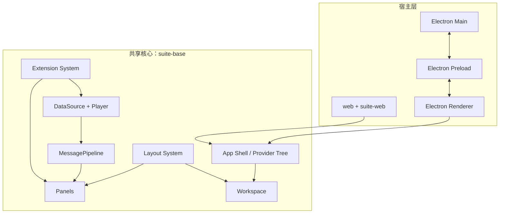
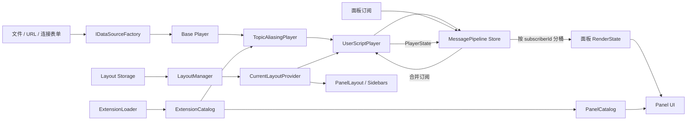
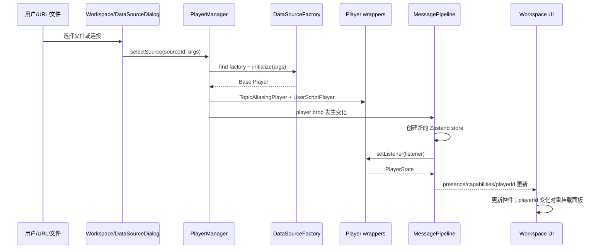
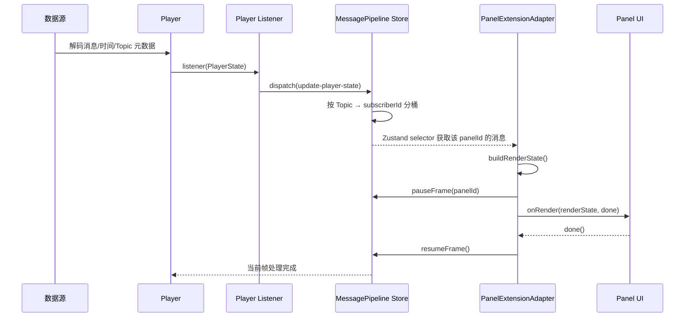
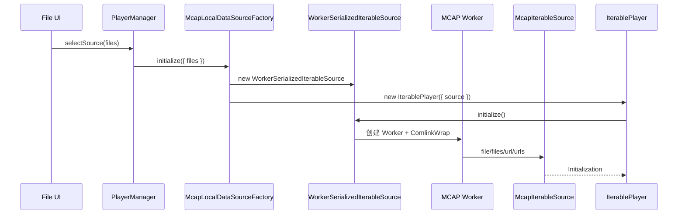
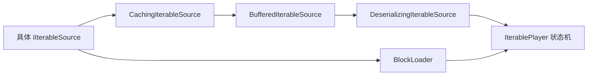
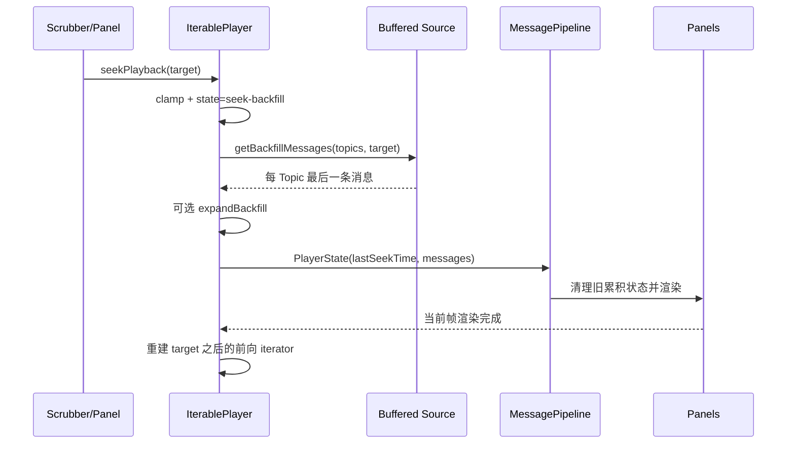
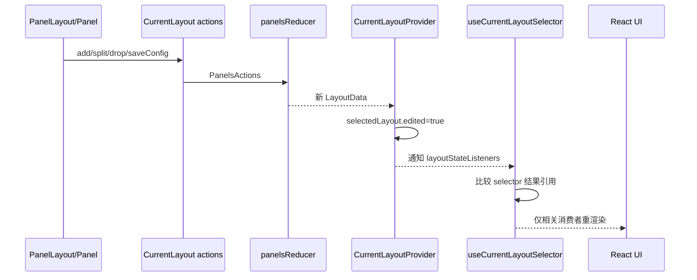

# Lichtblick 架构学习大纲与细则

> 状态：架构母版已完成。后续按第 16 章拆分生成专题学习文档。
>
> 后续原则：每一批只深入一个主题，不把本文件一次性扩写成完整教程。

## 1. 文档用途

本文不是模块清单，而是后续学习文档的结构化母版。阅读和扩写时，优先回答以下问题：

1. 一次变化从哪里产生？
2. 数据经过哪些接口、对象和状态容器？
3. 哪个引用或字段发生变化？
4. UI 通过什么订阅机制感知变化？
5. 哪些组件会更新、重挂载或保持不变？
6. 这条链路包含哪些异步边界、副作用和性能约束？
7. 应该用哪些源码和测试验证理解？

每条核心链路统一使用以下模板：

| 项目     | 要回答的问题                                            |
| -------- | ------------------------------------------------------- |
| 触发源   | 用户操作、URL、IPC、网络消息还是定时任务？              |
| 输入     | 输入值的类型和语义是什么？                              |
| 转换     | 哪些工厂、适配器、Reducer 或服务处理输入？              |
| 状态载体 | React state、Context、Zustand、普通对象还是持久化存储？ |
| UI 订阅  | selector、Context、事件监听器还是组件 props？           |
| 更新粒度 | 更新单个面板、工作区区域，还是重挂载整棵子树？          |
| 副作用   | 文件、网络、IndexedDB、IPC、日志等操作发生在哪里？      |
| 失效条件 | 切换 Player、Layout 或卸载扩展时，哪些状态必须清理？    |
| 验证入口 | 应阅读哪些源码、运行哪些测试、观察哪些 UI 现象？        |

## 2. 系统边界与运行形态

Lichtblick 是一个 Yarn Workspaces monorepo。核心业务能力位于
`packages/suite-base`，Web 和 Desktop 是两种宿主。



### 2.1 Web 宿主

启动链：

```text
web/src/entrypoint.tsx
  → @lichtblick/suite-web.main()
  → WebRoot
  → SharedRoot
  → StudioApp
  → Workspace
```

`WebRoot` 负责注入浏览器环境相关实现：

- `LocalStorageAppConfiguration`；
- IndexedDB 和远程扩展加载器；
- 浏览器支持的数据源工厂；
- URL 中的 workspace、layout 和 deep link 参数。

关键源码：

- `web/src/entrypoint.tsx`
- `packages/suite-web/src/index.tsx`
- `packages/suite-web/src/WebRoot.tsx`
- `packages/suite-base/src/SharedRoot.tsx`
- `packages/suite-base/src/StudioApp.tsx`

### 2.2 Desktop 宿主

Desktop 进程边界：

```text
Electron Main
  → 创建窗口、系统菜单、协议和文件打开处理
  ↕ IPC
Preload
  → 暴露 desktopBridge / storageBridge / menuBridge / ctxbridge
  ↕ contextBridge
Renderer
  → 将桥接能力适配成共享核心所需接口
```

Renderer 不直接获得 Node.js 能力。Main 和 Preload 负责系统级副作用，React
Renderer 通过桥接接口消费它们。

关键源码：

- `desktop/main/index.ts`
- `desktop/preload/index.ts`
- `desktop/renderer/index.ts`
- `packages/suite-desktop/src/main/StudioWindow.ts`
- `packages/suite-desktop/src/preload/index.ts`
- `packages/suite-desktop/src/renderer/Root.tsx`

### 2.3 应用组装差异

当前存在两条相似但不完全相同的 Provider 组装路径：

- Web 使用 `SharedRoot + StudioApp`；
- Desktop Renderer 使用 `App`。

学习时不能假设两个宿主一定经过同一个顶层组件。分析跨端行为时，应先确认能力
是在宿主 Root 中注入，还是在共享 Provider 中实现。

## 3. 核心运行时总图



核心运行时包含三条相互交叉的主线：

1. **消息主线**：数据源产生消息，MessagePipeline 分发给面板；
2. **布局主线**：布局状态决定显示哪些面板以及面板配置；
3. **扩展主线**：扩展向消息转换和 UI 目录注入新能力。

## 4. 数据源选择如何驱动 UI

### 4.1 正向链路



### 4.2 触发源

数据源选择不只有连接对话框一种入口：

- `DataSourceDialog` 中选择示例数据或连接；
- 打开或拖入本地文件；
- URL/deep link 中的 `ds` 与 `dsParams`；
- Desktop Main 进程转发的待打开文件；
- 最近使用的数据源。

这些入口最终收敛到 `PlayerSelectionContext.selectSource()`。

### 4.3 Player 构建

`PlayerManager.selectSource()` 根据 `sourceId` 查找 `IDataSourceFactory`，再按
`sample`、`connection` 或 `file` 参数调用 `factory.initialize()`。

工厂返回的 Base Player 不直接进入 UI，而是依次包装：

```text
Base Player
  → TopicAliasingPlayer
  → UserScriptPlayer
  → MessagePipelineProvider
```

包装层的职责：

- `TopicAliasingPlayer` 应用扩展注册的 Topic alias；
- `UserScriptPlayer` 执行布局中的 User Scripts，并读取全局变量；
- `MessagePipelineProvider` 将 Player 的命令式监听接口转换为可选择订阅的 UI 状态。

关键源码：

- `packages/suite-base/src/context/PlayerSelectionContext.ts`
- `packages/suite-base/src/components/PlayerManager.tsx`
- `packages/suite-base/src/players/TopicAliasingPlayer/TopicAliasingPlayer.ts`
- `packages/suite-base/src/players/UserScriptPlayer/index.ts`

### 4.4 状态如何驱动 UI

数据源变化对 UI 有四类影响：

1. `PlayerSelectionContext.selectedSource` 更新数据源选择相关 UI；
2. `MessagePipeline.playerState.presence` 驱动加载、已连接和未连接状态；
3. `PlayerState.capabilities` 决定播放、Seek、发布、服务调用等控制项是否存在；
4. `playerId` 变化触发 `RemountOnValueChange`，卸载并重新挂载全部面板。

第四点是重要的失效策略。切换 Player 后，旧面板不能继续持有旧订阅、Publisher
或缓存。`Workspace` 因此以 `playerId` 为边界重挂载 `PanelLayout` 子树，而不是仅靠
普通 props 更新。

相关源码：

- `packages/suite-base/src/Workspace.tsx`
- `packages/suite-base/src/components/RemountOnValueChange.tsx`
- `packages/suite-base/src/components/MessagePipeline/index.tsx`

### 4.5 UI 更新粒度

| 变化             | 状态来源                      | UI 结果                             |
| ---------------- | ----------------------------- | ----------------------------------- |
| `selectedSource` | PlayerSelection Context       | 数据源选择和最近连接信息更新        |
| `presence`       | MessagePipeline Zustand store | 对话框、空状态、状态提示更新        |
| `capabilities`   | PlayerState                   | 播放、Seek、发布等入口显示或禁用    |
| `activeData`     | PlayerState                   | Topic、服务、时间和消息相关 UI 更新 |
| `playerId`       | PlayerState                   | 整个 PanelLayout 子树重挂载         |

### 4.6 验证建议

后续学习文档应设计以下观察实验：

1. 打开一个文件，记录 `selectSource`、`initialize` 和 `setListener` 的调用顺序；
2. 切换两个数据源，确认旧 Player 被 `close()`；
3. 观察 `presence` 从 `INITIALIZING` 到 `PRESENT` 时 UI 的变化；
4. 观察 `playerId` 变化后面板局部状态是否被清空；
5. 比较 Web 与 Desktop 默认注册的数据源列表。

## 5. 消息帧如何驱动面板 UI

这条链路是项目最重要的学习主线。它同时包含反向订阅流和正向消息流。

### 5.1 反向订阅流

```text
Panel 声明订阅 Topic
  → PanelExtensionAdapter.setSubscriptions()
  → MessagePipeline.setSubscriptions(panelId, payloads)
  → subscriptionsById
  → 合并、去重和采样规则处理
  → MessagePipelineProvider debounce
  → Player.setSubscriptions()
  → 数据源只读取或转发所需 Topic
```

`panelId` 是订阅隔离的关键。MessagePipeline 不只保存全局 Topic 列表，还保存：

- `subscriptionsById`：每个订阅者需要什么；
- `subscriberIdsByTopic`：每个 Topic 应分发给谁；
- `lastMessageEventByTopic`：新订阅者需要的最后一条消息；
- 合并后的 `public.subscriptions`：最终下发给 Player 的订阅。

订阅更新通过零延迟 debounce 合批，避免同一轮多个面板注册时反复调用
`Player.setSubscriptions()`。

关键源码：

- `packages/suite-base/src/components/MessagePipeline/subscriptions.ts`
- `packages/suite-base/src/components/MessagePipeline/store.ts`
- `packages/suite-base/src/components/MessagePipeline/index.tsx`
- `packages/suite-base/src/components/PanelExtensionAdapter/PanelExtensionAdapter.tsx`

### 5.2 正向消息流



### 5.3 Store 如何产生可观察变化

Player 调用 listener 后，MessagePipeline 将新的 `PlayerState` dispatch 到 Zustand store。
Reducer 会：

1. 读取 `activeData.messages`；
2. 依据 `subscriberIdsByTopic` 将消息分桶；
3. 为每个订阅者创建新的消息数组；
4. 更新 `messageEventsBySubscriberId`；
5. 更新 `sortedTopics`、`sortedServices` 和 `datatypes`；
6. 根据 capabilities 绑定或清除播放控制函数。

为每个订阅者创建新的数组引用很重要。下游 selector 依靠引用变化判断该面板是否收到
新消息，从而避免所有面板都处理同一帧。

### 5.4 面板如何感知变化

主要有两种消费方式：

1. 内部 React 组件通过 `useMessagePipeline(selector)` 或 PanelAPI hooks 选择状态；
2. 扩展式面板通过 `PanelExtensionAdapter` 获得稳定的 `PanelExtensionContext`。

`useMessagePipeline(selector)` 基于 Zustand `useStore`。只有 selector 的结果变化时，
对应组件才需要更新。阅读代码时应特别检查 selector 返回的是稳定引用、原始值还是
每次新建的对象。

`PanelExtensionAdapter` 则从以下输入构造 `RenderState`：

- 当前帧消息；
- PlayerState；
- Topic、服务和 Schema；
- 全局变量；
- 应用设置和颜色主题；
- hover 值；
- 面板配置与共享面板状态；
- 扩展注册的消息转换器。

只有面板通过 `watch()` 声明需要的字段才应进入最终 RenderState，这是一层额外的
更新粒度控制。

### 5.5 为什么 UI 渲染会反向约束数据生产

MessagePipeline 不是单向“收到消息就 setState”。它实现了帧级背压：

1. Player listener 提交一帧状态；
2. React 完成对应提交后，Provider 的 layout effect 调用 `renderDone`；
3. 面板调用 `pauseFrame(panelId)` 注册需要等待的 Promise；
4. 扩展面板执行 `onRender(renderState, done)`；
5. 面板调用 `done()` 后释放 Promise；
6. listener 完成，Player 才能安全推进下一帧。

这保证 UI 不会无限落后于播放数据，同时也意味着面板忘记调用 `done()` 会阻塞帧推进。
`PanelExtensionAdapter` 还会检测面板是否在上一轮尚未完成时收到新渲染请求，并标记
slow render。

### 5.6 播放控制如何反向驱动 Player

```text
PlaybackControls
  → useMessagePipeline selector
  → startPlayback / pausePlayback / seekPlayback
  → 绑定后的 Player 方法
  → Player 改变时间与播放状态
  → 新 PlayerState
  → MessagePipeline
  → PlaybackControls 与 Panels 更新
```

这些函数是否存在由 `PlayerState.capabilities` 决定。因此 UI 不是只根据数据源类型
硬编码显示控制项，而是根据 Player 当前公开的能力构建交互入口。

### 5.7 验证建议

1. 用两个只订阅不同 Topic 的面板验证消息是否按 subscriberId 隔离；
2. 修改订阅，验证新 Topic 是否立即获得缓存的最后一条消息；
3. Seek 后验证旧消息和订阅状态的清理行为；
4. 人为延迟扩展面板的 `done()`，观察 slow render 和播放推进；
5. 使用 MessagePipeline 现有单元测试理解引用相等和重置语义。

## 6. 布局状态如何驱动工作区 UI

### 6.1 布局包含什么

布局不仅是面板位置，还包括：

- Mosaic 面板树；
- `configById` 面板配置；
- 全局变量；
- User Scripts；
- Playback 配置；
- 布局版本和其他持久化状态。

因此布局变化既可能改变 UI 结构，也可能改变 Player 包装层的行为。

### 6.2 加载链路

```text
URL / UserProfile / 默认布局
  → CurrentLayoutProvider.setSelectedLayoutId()
  → LayoutManager.getLayout()
  → working data 或 baseline data
  → CurrentLayoutProvider.setLayoutState()
  → 通知 layoutStateListeners
  → useCurrentLayoutSelector(selector)
  → PanelLayout、面板配置、全局变量等消费者更新
```

`CurrentLayoutContext` 没有直接把整个 `layoutState` 作为 Context value 传播。它维护
显式 listener，并由 `useCurrentLayoutSelector` 比较 selector 结果。这样可以避免
任何布局细节变化都让所有 Context 消费者重渲染。

### 6.3 UI 操作链路

```text
拖放/分割/关闭面板，或保存面板配置
  → CurrentLayout actions
  → performAction(PanelsActions)
  → panelsReducer(oldLayoutData, action)
  → 新 LayoutData
  → setLayoutState(edited: true)
  → layoutStateListeners
  → 相关 selector 更新
  → PanelLayout 或具体 Panel 更新
```

结构操作与配置操作共享同一个 Reducer 入口，但 UI 更新范围不同：

- Mosaic 树变化主要驱动 `PanelLayout`；
- 单个 `configById` 项变化主要驱动对应面板；
- 全局变量变化会进一步传给 MessagePipeline 和 UserScriptPlayer；
- User Scripts 变化会让 UserScriptPlayer 更新注册内容；
- Playback 配置变化会影响播放相关 UI 和行为。

### 6.4 持久化与同步边界

`LayoutManager` 位于当前 React 布局状态和存储实现之间：

- 本地使用 IndexedDB；
- 可选远程工作区布局 API；
- 写操作通过本地缓存和互斥控制；
- 在线且页面可见时周期同步；
- 同步失败使用带随机抖动的指数退避。

本节目前只标记边界。布局 working/baseline、冲突解决和远程同步算法留到后续批次。

关键源码：

- `packages/suite-base/src/context/CurrentLayoutContext/`
- `packages/suite-base/src/providers/CurrentLayoutProvider/`
- `packages/suite-base/src/components/PanelLayout.tsx`
- `packages/suite-base/src/services/LayoutManager/`
- `packages/suite-base/src/IdbLayoutStorage.ts`

## 7. 扩展贡献如何进入 UI

```text
ExtensionLoader
  → 读取扩展清单和源码
  → buildContributionPoints()
  → ExtensionCatalog Zustand store
  ├→ installedPanels
  ├→ installedMessageConverters
  ├→ installedTopicAliasFunctions
  ├→ installedCameraModels
  └→ panelSettings
```

对 UI 的驱动路径：

```text
installedPanels 变化
  → PanelCatalogProvider selector 更新
  → 合并内置面板与扩展面板
  → Panel Catalog UI 更新
  → 实例化 PanelExtensionAdapter
  → 扩展获得 PanelExtensionContext
```

对数据流的驱动路径：

- Topic alias 函数进入 `TopicAliasingPlayer`；
- 消息转换器进入 `PanelExtensionAdapter` 的 RenderState 构造过程；
- Camera model 供图像或 3D 相关能力使用；
- Panel settings 进入面板设置 UI。

扩展系统说明了一个重要架构特征：扩展并不是只添加 React 组件，它可以同时改变数据
解释、Topic 命名和面板渲染。

关键源码：

- `packages/suite-base/src/services/extension/`
- `packages/suite-base/src/providers/ExtensionCatalogProvider/`
- `packages/suite-base/src/providers/helpers/buildContributionPoints.ts`
- `packages/suite-base/src/providers/PanelCatalogProvider.tsx`
- `packages/suite-base/src/components/PanelExtensionAdapter/`
- `packages/suite/src/`

## 8. 状态机制对照表

| 状态类别         | 主要载体                            | 订阅方式                        | 典型 UI                    | 更新特点                         |
| ---------------- | ----------------------------------- | ------------------------------- | -------------------------- | -------------------------------- |
| Player 和消息帧  | Zustand MessagePipeline store       | `useMessagePipeline(selector)`  | 面板、播放控件、Topic 列表 | 高频，强调 selector 和引用稳定性 |
| 数据源选择       | React Context + PlayerManager state | `usePlayerSelection()`          | 数据源对话框、最近连接     | 中低频，切换时重建 Player        |
| 当前布局         | 自定义 Context + listeners          | `useCurrentLayoutSelector()`    | PanelLayout、面板配置      | 中频，Reducer 驱动               |
| 扩展目录         | Zustand ExtensionCatalog store      | `useExtensionCatalog(selector)` | 面板目录、扩展设置         | 低频，动态贡献能力               |
| Workspace UI     | Zustand Workspace store             | `useWorkspaceStore(selector)`   | 对话框、左右侧栏           | 交互频繁但局部                   |
| 应用配置         | 配置服务 + change listener          | 配置 hooks/listeners            | 主题、语言、调试项         | 跨宿主持久化                     |
| 临时面板协同状态 | CurrentLayout sharedPanelState      | Panel adapter/hooks             | hover、联动状态            | 不一定持久化                     |
| Desktop 系统状态 | IPC bridge + React state            | IPC event listener              | 最大化、全屏、菜单         | 只存在于 Desktop                 |

## 9. 分批完成记录

以下主题已经按独立批次完成，记录在此用于确认母版覆盖范围：

### 已完成：Player 与文件解码

内容位于第 10 章，包括 `IDataSourceFactory`、`IIterableSource`、
`IterablePlayer` 状态机、Worker、缓存、预加载、Seek 和 UI 状态映射。

### 已完成：布局状态机

布局数据、Reducer、working/baseline、本地持久化与远程同步已补充到第 11 章。

### 已完成：面板开发模型

面板目录、公共包装器、PanelExtensionContext 生命周期、RenderState 和配置流已补充到
第 12 章。

### 已完成：Electron 边界

Main、Preload、Renderer、IPC、文件打开和系统状态驱动 UI 已补充到第 13 章。

### 已完成：实时数据源

Foxglove WebSocket、Rosbridge、原生 ROS 1 连接、重连和动态能力已补充到第 14 章。

### 已完成：性能与可靠性

Selector、帧背压、Worker、缓存、清理、错误边界和学习文档规范已补充到第 15、16 章。

## 10. Player 与文件解码细则

本章聚焦静态文件和远程文件，不展开 Foxglove WebSocket、Rosbridge、ROS 1 Socket
等实时连接 Player。实时连接与重连机制应作为独立批次处理。

### 10.1 分层目标

文件格式、播放控制和 UI 更新被拆成三个接口层：

```text
IDataSourceFactory
  负责：声明数据源入口，并将输入参数组装成 Player

IIterableSource
  负责：理解具体文件格式，按时间和 Topic 读取消息

Player
  负责：订阅、播放、暂停、Seek，并持续发出 PlayerState
```

这三个接口隔离了不同变化：

- 新增文件格式主要实现 DataSourceFactory 和 IIterableSource；
- 改变播放调度主要修改 IterablePlayer；
- UI 只依赖统一的 PlayerState，不需要知道底层是 MCAP、Bag 还是 ULog。

### 10.2 DataSourceFactory 输入契约

`IDataSourceFactory` 同时承担 UI 元数据和运行时构造职责。

UI 元数据包括：

- `id`、`legacyIds` 和 `displayName`；
- `type`：`file`、`connection` 或 `sample`；
- 图标、说明、文档链接和警告；
- `supportedFileTypes` 与 `supportsMultiFile`；
- 连接表单的 `formConfig`。

运行时入口是：

```ts
initialize(args: DataSourceFactoryInitializeArgs): Player | undefined
```

`args` 可以包含：

- 单文件 `file`；
- 多文件 `files`；
- URL 或连接参数 `params`；
- 远程源元数据 `sourceMetadata`；
- 统一的性能指标收集器 `metricsCollector`。

工厂返回 `undefined` 表示缺少必要参数，成功时返回符合统一接口的 Player。

关键源码：

- `packages/suite-base/src/context/PlayerSelectionContext.ts`
- `packages/suite-base/src/dataSources/`

### 10.3 文件数据源实现矩阵

| 数据源        | Source 类型                      | Worker 内消息形态 | 多文件       | Read-ahead | 特殊处理                              |
| ------------- | -------------------------------- | ----------------- | ------------ | ---------- | ------------------------------------- |
| MCAP 本地文件 | `WorkerSerializedIterableSource` | `Uint8Array`      | 是           | 120 秒     | Indexed/Unindexed；视频 Seek backfill |
| ROS 1 Bag     | `WorkerSerializedIterableSource` | `Uint8Array`      | 否           | 120 秒     | BZ2/LZ4 解压；ROS1 Schema             |
| ROS 2 DB3     | `WorkerSerializedIterableSource` | `Uint8Array`      | 是           | 120 秒     | SQLite/ROS2 Schema                    |
| 远程 MCAP/Bag | `WorkerSerializedIterableSource` | `Uint8Array`      | 同格式多 URL | 10 秒      | URL 校验；HTTP 读取和缓存             |
| PX4 ULog      | `WorkerIterableSource`           | 已反序列化对象    | 否           | 默认 10 秒 | Worker 内完成 ULog 解码               |

矩阵中的 Read-ahead 指播放前向缓冲，不等于完整消息预加载。

### 10.4 从文件输入到 Worker

以本地 MCAP 为例：



Worker 通过 Comlink 暴露远程 Source。主线程侧保留与 `IIterableSource` 相同的接口，
因此 IterablePlayer 不需要知道调用发生在 Worker。

Worker 的释放边界：

1. `initialize()` 创建 Worker 和远程代理；
2. Cursor 结束时调用 `end()` 并释放 Comlink proxy；
3. Source `terminate()` 释放远程对象；
4. Player `close()` 最终终止缓冲、预加载和底层 Source。

### 10.5 IIterableSource 契约

`IIterableSource` 是文件格式实现与播放状态机之间的核心接口。

#### 初始化

```text
initialize()
  → start/end
  → topics + topicStats
  → datatypes
  → profile
  → metadata
  → publishersByTopic
  → alerts
```

初始化结果既用于后续解码，也会进入 PlayerState，驱动 Topic 列表、播放时间范围、
Schema 选择和错误提示。

#### 顺序读取

`messageIterator(args)` 接收：

- Topic 选择；
- 可选起止时间；
- `full` 或 `partial` 消费方式。

它按日志时间返回三类结果：

| 结果            | 语义                                         |
| --------------- | -------------------------------------------- |
| `message-event` | 一条带 Topic、时间、Schema 和消息体的消息    |
| `alert`         | 某个连接或 Channel 的可展示错误              |
| `stamp`         | 即使没有消息，也表明 Source 已读取到某个时间 |

`stamp` 使播放游标能跨过没有任何消息的时间段，否则 Player 无法区分“还没读到”
与“这个时间段没有消息”。

#### Seek backfill

`getBackfillMessages({ topics, time })` 返回目标时间之前或等于目标时间的每个 Topic
最后一条消息。它用于 Seek 后立即恢复状态型可视化，而不是等目标时间之后出现新消息。

#### 批量 Cursor

Worker 场景下逐条 RPC 会产生明显开销，因此 Source 可实现 `IMessageCursor`：

- `next()`：读取单条；
- `nextBatch(durationMs)`：批量读取一段时间；
- `readUntil(end)`：读取到指定时间；
- `end()`：释放资源。

Worker 适配层通常以 17ms 为批次读取，接近 60 FPS 的单帧时间，平衡 RPC 次数和
首帧延迟。

关键源码：

- `packages/suite-base/src/players/IterablePlayer/IIterableSource.ts`
- `packages/suite-base/src/players/IterablePlayer/WorkerIterableSource.ts`
- `packages/suite-base/src/players/IterablePlayer/WorkerSerializedIterableSource.ts`
- `packages/suite-base/src/players/IterablePlayer/WorkerSerializedIterableSourceWorker.ts`

### 10.6 序列化与反序列化边界

Source 有两种消息形态：

```text
ISerializedIterableSource
  message = Uint8Array

IDeserializedIterableSource
  message = JavaScript object
```

MCAP、ROS 1 Bag 和 ROS 2 DB3 使用序列化路径：

```text
Worker 读取文件、解压并返回 Uint8Array
  → WorkerSerializedIterableSource
  → BufferedIterableSource<Uint8Array>
  → DeserializingIterableSource
  → MessageEvent<object>
```

保留字节数组跨 Worker 边界的原因是：

- ArrayBuffer 更适合 transferable/structured clone；
- 避免 Worker 传回大型复杂对象；
- 主线程可以按实际订阅字段和采样策略决定如何反序列化；
- Schema 解析统一收敛到 `@lichtblick/mcap-support` 的 `parseChannel()`。

ULog 使用已反序列化路径：

```text
Worker 内解码 ULog
  → WorkerIterableSource
  → BufferedIterableSource<object>
  → DeserializedSourceWrapper
```

这条路径减少了主线程解码工作，但不支持只在反序列化阶段实现的
`latest-per-render-tick` 采样。

### 10.7 MCAP 和 ROS Bag 格式边界

#### MCAP

`McapIterableSource` 初始化时：

1. 预加载 WASM 解压处理器；
2. 本地文件使用 `BlobReadable`，远程文件使用 `RemoteFileReadable`；
3. 尝试创建 `McapIndexedReader`；
4. 存在有效 Chunk Index 时使用 Indexed Source；
5. 否则退回 Unindexed 流式 Source。

Indexed MCAP 可以按 Topic 和时间范围读取，并可反向读取每个 Topic 的最后一条消息，
因此 Seek backfill 成本更可控。

多文件或多 URL 通过 `MultiIterableSource` 合并，在统一时间线上暴露一个 Source。

#### ROS 1 Bag

`BagIterableSource`：

- 本地文件使用 `BlobReader`；
- 远程文件使用 `BrowserHttpReader + CachedFilelike`；
- 加载 BZ2 和 LZ4 WASM 解压器；
- 初始化时解析 connection、Topic、ROS message definition 和统计信息；
- 读取时先返回原始字节，后续由 DeserializingIterableSource 解码；
- 反向读取实现每 Topic 的 backfill。

格式层发现的问题不会直接操作 React UI，而是转换为 `Initialization.alerts` 或
迭代过程中的 `alert` 结果，再由 PlayerAlertManager 汇总。

关键源码：

- `packages/suite-base/src/players/IterablePlayer/Mcap/`
- `packages/suite-base/src/players/IterablePlayer/BagIterableSource.ts`
- `packages/suite-base/src/players/IterablePlayer/rosdb3/`
- `packages/mcap-support/`

### 10.8 IterablePlayer 内部组合

IterablePlayer 在构造阶段组合以下层次：



实际顺序会根据 Source 是否已经反序列化而略有不同，但职责保持不变：

| 层                            | 职责                                   |
| ----------------------------- | -------------------------------------- |
| 具体 Source                   | 理解文件格式和时间索引                 |
| `CachingIterableSource`       | 缓存已读取结果并跟踪已加载范围         |
| `BufferedIterableSource`      | Producer/Consumer 前向读取缓冲         |
| `DeserializingIterableSource` | Schema 驱动的解码、字段裁剪和采样      |
| `BlockLoader`                 | 为 full/preload 订阅后台加载完整时间块 |
| `IterablePlayer`              | 播放状态机和 PlayerState 输出          |

这里存在两类独立缓存，不应混淆：

1. **前向缓冲**：围绕当前播放头预读，用于平滑播放；
2. **块预加载**：按整个时间范围分块，为 Plot 等需要历史数据的面板提供消息缓存。

### 10.9 前向缓冲

`BufferedIterableSource` 使用 Producer/Consumer 模型：

```text
Producer
  → 从底层 Source 读取
  → 最多领先 readAheadDuration
  → 写入队列

Consumer
  → IterablePlayer 按当前播放 Tick 读取
  → 推进 read head
  → 唤醒 Producer 继续预读
```

关键控制量：

- 默认 read-ahead 为 10 秒；
- 本地 MCAP/Bag/DB3 工厂配置为 120 秒；
- 至少缓冲到最小提前量后才唤醒消费者；
- 底层缓存达到大小限制时暂停 Producer；
- 已加载区间通过 `loadedRangesChange` 事件上报。

UI 可通过 `PlayerState.progress.fullyLoadedFractionRanges` 在时间轴上显示哪些区域已经
缓冲完成。

### 10.10 BlockLoader 与完整历史预加载

只有订阅声明 `preloadType: "full"` 时，Topic 才进入 BlockLoader。

BlockLoader：

- 将完整数据时间范围切成固定时间块；
- 最多使用 100 个块；
- 默认总消息缓存目标约 1GB；
- 按 Topic 记录每块缺少的数据；
- Topic 订阅变化时中止当前加载并重新计算缺失内容；
- 逐块读取并更新 `messageCache`、加载比例和内存统计。

这条数据不主要通过当前帧 `activeData.messages` 消费，而是通过：

```text
PlayerState.progress.messageCache
  → MessagePipeline
  → PanelAPI.useBlocksSubscriptions()
  → Plot / StateTransitions 等历史型面板
```

因此一个面板可能同时消费：

- 当前播放帧；
- 已预加载的全局历史块。

### 10.11 IterablePlayer 状态机

状态集合：

```text
preinit
  → initialize
  → start-play
  → idle ↔ play
  → seek-backfill
  → reset-playback-iterator
  → close
```

| 状态                      | 核心行为                                  | 典型下一状态           |
| ------------------------- | ----------------------------------------- | ---------------------- |
| `preinit`                 | 等待注册 listener                         | `initialize`           |
| `initialize`              | 初始化 Source、Schema、缓存和 BlockLoader | `start-play`           |
| `start-play`              | 从开头读取少量消息，避免初始面板为空      | `idle`                 |
| `idle`                    | 暂停播放，但继续报告缓存进度              | `play`/`seek-backfill` |
| `play`                    | 按墙钟时间、速度和渲染节奏读取 Tick       | `idle`                 |
| `seek-backfill`           | 获取目标时间前的最后消息并重建迭代器      | `idle`/`play`          |
| `reset-playback-iterator` | Topic 订阅变化后重建前向迭代器            | `idle`/`play`          |
| `close`                   | 停止预加载、缓冲、Cursor 和 Worker        | 终态                   |

状态切换采用协作式取消：

- `#setState()` 写入 `#nextState`；
- 当前状态在异步读取后检查是否有待处理状态；
- 可取消操作使用 AbortController；
- Close 请求不能被后续状态覆盖；
- `#runState()` 保证同一时刻只有一个状态循环。

### 10.12 初始化如何驱动 UI

初始化过程：

```text
setListener()
  → state=initialize
  → emit INITIALIZING
  → source.initialize()
  → 建立 topics/datatypes/start/end/profile
  → 建立 BlockLoader
  → presence=PRESENT
  → emit PlayerState
  → 等待面板注册订阅
  → start-play 读取初始少量数据
```

初始读取会从开始时间向后推进约 99ms。即使用户尚未点击播放，面板也能获得少量消息，
避免刚打开文件时布局完全空白。

UI 映射：

| PlayerState 字段                | UI/消费者                      |
| ------------------------------- | ------------------------------ |
| `presence`                      | 数据源状态、加载指示和错误状态 |
| `startTime/endTime/currentTime` | 播放时间轴和时间显示           |
| `topics/datatypes`              | Topic 列表、消息路径和面板设置 |
| `topicStats`                    | Topic 统计信息                 |
| `profile`                       | ROS/ULog 等语义适配            |
| `alerts`                        | AlertsContext 和错误提示       |
| `urlState`                      | URL/deep link 同步             |

### 10.13 播放 Tick 如何驱动 UI

播放状态根据两次 Tick 的墙钟间隔和播放速度计算读取范围：

```text
rangeMillis = elapsedWallTime × playbackSpeed
```

为防止慢帧导致下一次读取范围失控：

- 单次最多读取 300ms 数据；
- 使用前一轮范围做平滑；
- 每轮至少给 UI 约 16ms 的调度机会；
- 发出新状态前等待上一轮 listener/渲染 Promise。

Tick 读取到目标时间后：

1. 更新 `currentTime`；
2. 将本轮消息写入 `PlayerState.activeData.messages`；
3. 更新缓冲范围和内存统计；
4. 通过 listener 进入 MessagePipeline；
5. 等待 UI 完成这一帧；
6. 再读取下一 Tick。

空时间段仍通过 `stamp` 推进 `currentTime`，因此播放游标不会停在最后一条消息上。

### 10.14 Seek 如何驱动 UI



Seek 的关键语义：

- 目标时间被限制在文件起止范围内；
- 初始化期间收到 Seek 会先保存 target，初始化后执行；
- 超过 100ms 未完成时先发出 `BUFFERING`；
- backfill 完成后更新 `lastSeekTime`，通知面板这是时间不连续点；
- MCAP 视频源可扩展 backfill 到前一个 GOP，使 P/B 帧可解码；
- 播放中 Seek 会等待 Seek 帧真正渲染完成，再恢复前向播放。

订阅变化也可能触发类似 Seek backfill。当暂停状态下新增 Topic 时，Player 需要立即
补齐该 Topic 在当前时间的最后状态。

### 10.15 错误、缓冲和 UI 状态

Player 不把所有慢操作都视为错误：

| 情况                       | PlayerPresence | UI 行为                |
| -------------------------- | -------------- | ---------------------- |
| Source 正在初始化          | `INITIALIZING` | 显示加载状态           |
| 初始读取超过约 100ms       | `BUFFERING`    | 时间轴显示加载         |
| Seek backfill 超过约 100ms | `BUFFERING`    | 先确认 Seek 已被接受   |
| 播放 Tick 读取超过约 500ms | `BUFFERING`    | 表示等待更多数据       |
| 读取恢复                   | `PRESENT`      | 恢复正常显示           |
| 初始化、解码或状态机异常   | `ERROR`        | 禁用播放控制并显示错误 |

错误流：

```text
Source/Deserializer/State error
  → PlayerAlertManager
  → PlayerState.alerts
  → MessagePipeline
  → AlertsContext / DataSourceSidebar / AppBar
```

局部格式问题可以作为 `alert` 与其他消息一起继续迭代；全局初始化失败则进入
`ERROR`，并且 `activeData` 为空。

### 10.16 关闭和资源清理

切换数据源时 MessagePipelineProvider 会关闭旧 Player。IterablePlayer 的 Close 状态：

1. 停止播放；
2. 停止 BlockLoader；
3. 等待后台预加载结束；
4. 终止 BufferedIterableSource；
5. 结束 playback iterator；
6. 终止底层 Source 和 Worker；
7. 释放测试和生命周期等待者。

这解释了为什么 Player 切换必须以新 store 和面板重挂载为边界：旧 Worker、Cursor、
订阅和消息引用都不能泄漏到新数据源。

### 10.17 本批验证入口

建议后续学习文档按以下顺序执行源码实验：

1. 从 `McapLocalDataSourceFactory.initialize()` 追踪到 Worker 初始化；
2. 在 `IIterableSource.initialize()` 结果处检查 Topic、Schema 和起止时间；
3. 观察 `INITIALIZING → PRESENT → BUFFERING → PRESENT` 的 UI 映射；
4. 为一个 Topic 注册 partial 订阅，检查前向 iterator；
5. 改为 full 订阅，检查 BlockLoader 和 `messageCache`；
6. 执行 Seek，比较 `currentTime`、`lastSeekTime` 和 backfill 消息；
7. 播放中增加 Topic，验证 iterator 重建；
8. 切换数据源，确认旧 Worker 和 Player 完成 Close。

重点测试：

- `packages/suite-base/src/players/IterablePlayer/IterablePlayer.test.ts`
- `packages/suite-base/src/players/IterablePlayer/BlockLoader.test.ts`
- `packages/suite-base/src/players/IterablePlayer/BufferedIterableSource.test.ts`
- `packages/suite-base/src/players/IterablePlayer/CachingIterableSource.test.ts`
- `packages/suite-base/src/players/IterablePlayer/Mcap/*.test.ts`
- `packages/suite-base/src/dataSources/*.test.ts`
- `packages/suite-base/src/components/PlaybackControls/*.test.tsx`

## 11. 布局状态机与同步细则

### 11.1 三层状态不能混为一谈

```text
React 当前状态
  selectedLayout.data + edited
       ↓ SyncAdapter
本地 Layout 记录
  baseline + working + syncInfo
       ↓ LayoutManager
远程 Layout
  data + savedAt + permission
```

- React 层追求立即反馈，面板操作后立刻驱动 UI；
- 本地层保存明确保存版本 `baseline` 和尚未提交版本 `working`；
- 远程层只在共享布局和在线同步场景参与。

### 11.2 LayoutData

`LayoutData` 是一个工作区快照：

| 字段              | 作用                            | 主要消费者             |
| ----------------- | ------------------------------- | ---------------------- |
| `layout`          | `react-mosaic-component` 面板树 | `PanelLayout`          |
| `configById`      | panelId 到配置的映射            | 各面板、Tab 面板       |
| `globalVariables` | 全局变量                        | 面板、UserScriptPlayer |
| `playbackConfig`  | 播放速度等布局级偏好            | Playback UI            |
| `userNodes`       | 用户脚本                        | UserScriptPlayer       |
| `version`         | 布局兼容上限                    | CurrentLayoutProvider  |

面板 ID 同时携带面板类型和实例身份。`layout` 决定实例是否出现，`configById` 决定
实例如何渲染；二者必须同步维护。

### 11.3 用户操作到 UI



Reducer 覆盖：

- 保存单个或同类型面板配置；
- 修改 Mosaic 根布局；
- 创建、移动和重排 Tab；
- 添加、关闭、分割、替换和拖放面板；
- 更新全局变量、User Scripts 和 Playback 配置。

Reducer 会清理已经不在根布局或 Tab 嵌套布局中的 `configById`，避免被删除面板的配置
长期残留。若配置内容没有变化，则尽量保留旧引用，使 selector 不产生无意义更新。

### 11.4 CurrentLayoutSelector 为什么不是普通 Context

`CurrentLayoutContext` 暴露 actions、getter 和 listener 注册接口，而不是把完整
`layoutState` 直接作为 Context value。

`useCurrentLayoutSelector()`：

1. 用 selector 从当前快照取值；
2. 注册 layoutState listener；
3. 每次布局变化重新执行 selector；
4. 只有结果引用变化才强制组件更新；
5. 对频繁变化的 selector 函数发出警告。

这使面板树变化不必自动重渲染所有只读取全局变量或某个配置的组件。

### 11.5 布局加载优先级

启动选择布局时依次考虑：

1. URL 中显式指定的 layoutId；
2. URL/app parameter 中按名称指定的默认布局；
3. UserProfile 保存的 `currentLayoutId`；
4. 已有组织布局或本地布局；
5. 自动创建 `Default` 布局。

`setSelectedLayoutId()` 先写入 `{ loading: true }`，异步读取完成后才设置 data。布局版本
高于当前支持上限时拒绝加载，避免旧应用覆盖新格式数据。

### 11.6 即时状态到本地 working copy

默认 `SyncAdapters` 包含 URL 同步和 `CurrentLayoutLocalStorageSyncAdapter`：

```text
selectedLayout.data 变化
  → 250ms debounce（最大等待 500ms）
  → 写浏览器 localStorage 快照
  → LayoutManager.updateLayout({ id, data })
  → 比较 baseline.data
  → 不同：写 working
  → 相同：working=undefined
```

第一次加载布局会跳过 updateLayout，避免面板初始化时产生“布局已编辑”的假状态。

另一个 `CurrentLayoutSyncAdapter` 以 `edited` 为入口，按布局 ID 暂存修改并以 1 秒
debounce 写 LayoutManager。具体宿主可以通过 AppContext 的 `syncAdapters` 替换默认实现，
因此分析保存行为时必须确认实际注入了哪个 Adapter。

### 11.7 baseline、working 与显式保存

```text
baseline
  最后一次明确保存或远程确认的版本

working
  相对 baseline 的本地编辑版本

overwriteLayout()
  working → baseline，随后清空 working

revertLayout()
  丢弃 working，恢复 baseline
```

UI 显示布局时优先使用 `working.data ?? baseline.data`。`revertLayout()` 发出专门的
`revert` 事件，CurrentLayoutProvider 收到后替换当前 React 状态，从而立即驱动面板树
和配置恢复。

### 11.8 本地存储包装层

```text
IdbLayoutStorage
  → WriteThroughLayoutCache
  → NamespacedLayoutStorage
  → MutexLocked
  → LayoutManager
```

- 写穿缓存避免重复扫描 IndexedDB；
- Namespace 隔离本地与不同远程 workspace；
- 登录远程 workspace 时可迁移和导入旧布局；
- Mutex 防止“读后写”等多步操作互相穿插。

### 11.9 远程同步状态

`syncInfo.status`：

| 状态               | 含义                               |
| ------------------ | ---------------------------------- |
| `new`              | 等待上传的新布局                   |
| `updated`          | 本地基线等待更新到远程             |
| `tracked`          | 本地基线与已知远程版本一致         |
| `locally-deleted`  | 等待删除远程版本                   |
| `remotely-deleted` | 远端已删除，但可能保留本地 working |

同步流程：

```text
本地列表 + 远程列表
  → computeLayoutSyncOperations()
  → 本地操作：add/update baseline/delete/mark deleted
  → 远程操作：upload new/update/delete
  → 本地 cleanup
  → LayoutManager change event
  → LayoutBrowser 等 UI 更新
```

`savedAt` 和 `lastRemoteSavedAt` 用于判断远端 baseline 是否变化。远端更新 baseline 时会
保留本地 working，使用户未保存的编辑不会被后台同步直接覆盖。

### 11.10 同步调度与错误

只有满足以下条件才周期同步：

- 存在 RemoteLayoutStorage；
- 浏览器在线；
- 页面可见。

同步失败采用带随机抖动的指数退避，基础间隔 30 秒、上限 3 分钟。LayoutManager 将
错误和 busy 状态通过事件暴露给布局 UI。共享布局在离线状态下不能执行需要远端确认的
保存、重命名或删除。

### 11.11 布局变化的跨域影响

布局不只驱动面板排版：

- `globalVariables` 更新会传入 Player 和 UserScriptPlayer；
- `userNodes` 更新会重建用户脚本注册；
- `playbackConfig` 更新播放 UI；
- `configById` 更新面板 RenderState；
- `layout` 更新 Mosaic 组件结构；
- `version` 控制兼容性门禁。

因此学习布局系统时应同时观察 UI 树和 Player 包装层，不能只看 LayoutBrowser。

### 11.12 验证入口

关键源码与测试：

- `packages/suite-base/src/context/CurrentLayoutContext/`
- `packages/suite-base/src/providers/CurrentLayoutProvider/`
- `packages/suite-base/src/components/CurrentLayoutSyncAdapter.tsx`
- `packages/suite-base/src/components/CurrentLayoutLocalStorageSyncAdapter.tsx`
- `packages/suite-base/src/services/LayoutManager/`
- `packages/suite-base/src/services/ILayoutStorage.ts`
- `packages/suite-base/src/providers/CurrentLayoutProvider/reducers.test.tsx`
- `packages/suite-base/src/services/LayoutManager/**/*.test.ts`

建议实验：修改面板配置后分别观察 React `edited`、本地 `working`、显式保存后的
`baseline`，再执行 revert 验证 UI 是否恢复。

## 12. 面板开发模型细则

### 12.1 面板的三个身份

```text
PanelInfo
  面板类型在目录中的注册信息

Panel instance
  Mosaic 中带唯一 panelId 的实例

Panel implementation
  React 内置面板或使用 PanelExtensionContext 的扩展实现
```

同一种 panel type 可以有多个实例；实例配置必须以 panelId 为键保存，不能存到模块级
全局状态。

### 12.2 从目录到实例 UI

`PanelCatalogProvider` 合并：

- `panels.getBuiltin()` 返回的内置面板；
- `ExtensionCatalog.installedPanels` 返回的扩展面板。

`PanelLayout` 将目录转换成 `React.lazy(panelInfo.module)`，再遍历 Mosaic 叶子：

```text
layout leaf panelId
  → getPanelTypeFromId(panelId)
  → PanelCatalog.getPanelByType(type)
  → lazy load module
  → <PanelComponent childId=panelId>
```

目录尚未初始化时显示扩展加载状态；类型不存在时显示 `UnknownPanel`，以便安装扩展后
恢复原布局，而不是删除未知 panelId。

### 12.3 Panel() HOC

内置和扩展面板最终都经过 `Panel()` 公共包装器。它提供：

- 从 `configById` 读取并保存实例配置；
- 合并 default、saved 和 override config；
- 面板选择、多选、全屏、拖放、分割、替换和关闭；
- `PanelContext`；
- Toolbar、Overlay、日志和 ErrorBoundary；
- 打开或更新相邻面板；
- React Profiler 和面板级错误隔离。

首次挂载时，若配置为空或 default config 新增字段，HOC 会把完整默认值补入布局。该
写入最终进入 CurrentLayout Reducer，因此“渲染一个新面板”本身可能产生布局编辑。

### 12.4 配置如何驱动 UI

```text
面板设置/内部交互
  → saveConfig(partial)
  → CurrentLayout.savePanelConfigs
  → panelsReducer
  → configById[panelId] 新引用
  → useConfigById(panelId)
  → Panel HOC 合并配置
  → 面板或 Adapter 更新
  → SyncAdapter 写 working copy
```

配置版本高于面板声明的 `highestSupportedConfigVersion` 时，
`PanelExtensionAdapter` 显示版本错误而不初始化实现，避免旧代码破坏新配置。

### 12.5 PanelExtensionContext 生命周期

扩展式面板不是由 React 直接渲染实现，而是获得一个真实 DOM 容器：

```text
Adapter mount
  → 创建 panelElement
  → initPanel({ panelElement, context methods })
  → 扩展向 panelElement 渲染
  → 设置 context.onRender
  → 每帧接收 RenderState
  → unmount callback
  → 清空 subscription/publisher 并移除 DOM
```

Player 为 `INITIALIZING` 时不调用 `initPanel()`，防止短暂初始化上下文导致扩展先初始化
又立即销毁。Player、能力或关键上下文变化可能重新初始化面板，因此扩展必须把资源释放
逻辑放进 `initPanel` 返回的清理函数。

### 12.6 RenderState 是增量契约

扩展调用 `watch(field)` 声明需要的字段。`initRenderStateBuilder()` 只在被 watch 的
字段引用或语义变化时构建新 RenderState：

- `currentFrame`：本轮新消息；
- `allFrames`：full/preload 订阅的历史消息；
- `didSeek`：时间不连续；
- Topic、服务和参数；
- 当前、开始和结束时间；
- 全局变量和共享面板状态；
- preview/hover time；
- 主题和订阅的应用设置。

若没有 watched 字段变化，Adapter 不调用 `onRender`。这比让每个消息帧直接触发整个
React 面板树更新更细粒度。

### 12.7 转换和订阅

扩展订阅可声明：

- `topic`；
- `convertTo` 目标 Schema；
- `preload`；
- `latest-per-render-tick` sampling。

Adapter 将公开 Subscription 转成内部 SubscribePayload，检查转换器是否允许采样，再
以 panelId 注册到 MessagePipeline。RenderStateBuilder 对当前帧和历史块执行消息转换，
并保留 `originalMessageEvent`。

变量或转换器变化时，即使没有新消息，也会用每个 Topic 的最后消息重新运行转换，
从而驱动面板 UI 更新。

### 12.8 onRender 与帧屏障

```text
RenderState 变化
  → pauseFrame(panelId)
  → extension onRender(state, done)
  → 扩展更新自己的 UI
  → done()
  → resumeFrame
```

扩展必须且只能调用一次 `done()`。未完成时再次收到渲染请求会标记 slow render，并以
橙色内边框提示。抛出的错误进入面板 ErrorBoundary，不应拖垮其他面板。

### 12.9 面板可调用的反向能力

PanelExtensionContext 将 UI 操作适配回应用核心：

| 扩展操作                    | 内部路径                      |
| --------------------------- | ----------------------------- |
| `saveState`                 | CurrentLayout panel config    |
| `subscribe`                 | MessagePipeline subscriptions |
| `advertise/publish`         | Player publisher/publish      |
| `callService`               | Player service API            |
| `setParameter`              | Player parameter API          |
| `seekPlayback`              | MessagePipeline → Player      |
| `setVariable`               | CurrentLayout globalVariables |
| `setSharedPanelState`       | 当前布局临时共享状态          |
| `layout.addPanel`           | PanelContext → CurrentLayout  |
| `updatePanelSettingsEditor` | PanelStateContext             |

Publish、Service 和 Parameter 等方法只有 Player capabilities 支持时才暴露，面板 UI
应根据方法是否存在决定功能是否可用。

### 12.10 PanelAPI 与直接 React 面板

内置 React 面板可以通过 `PanelAPI` hooks 消费核心状态：

- `useDataSourceInfo()`；
- `useMessagesByTopic()`；
- `useMessageReducer()`；
- `useBlocksSubscriptions()`；
- `useConfigById()`。

选择原则：

- 少量当前消息使用 current-frame hooks；
- 需要累积但数据量小，使用 message reducer；
- 全历史 Plot 类能力使用 block subscriptions；
- 配置必须通过 `useConfigById`/`saveConfig` 进入布局状态。

### 12.11 面板间联动

面板联动有三条路径：

1. `globalVariables`：持久化到布局，可被脚本和所有面板读取；
2. `sharedPanelState`：按 panel type 保存的临时状态，不代表面板配置；
3. Timeline hover/preview context：Plot、Image、3D 等围绕时间的临时交互。

选择错误会造成持久化语义混乱。例如 hover time 不应写入 layout config，高频交互也
不应触发布局持久化。

### 12.12 建议源码导读

先以 Gauge 或 Indicator 理解小型当前帧面板，再以 Plot 理解完整历史和 BlockLoader，
最后阅读 3D 面板理解资源、转换与复杂生命周期。

关键源码：

- `packages/suite-base/src/components/PanelLayout.tsx`
- `packages/suite-base/src/components/Panel.tsx`
- `packages/suite-base/src/components/PanelContext.ts`
- `packages/suite-base/src/components/PanelExtensionAdapter/`
- `packages/suite-base/src/PanelAPI/`
- `packages/suite-base/src/providers/PanelStateContextProvider.tsx`
- `packages/suite-base/src/panels/`
- `packages/suite/src/index.ts`

## 13. Electron 边界细则

### 13.1 三进程职责

| 边界     | 可以做什么                                | 不应做什么                  |
| -------- | ----------------------------------------- | --------------------------- |
| Main     | BrowserWindow、菜单、协议、系统文件、更新 | 承载 React 业务状态         |
| Preload  | Node 文件能力、IPC、contextBridge         | 暴露任意 Electron/Node 对象 |
| Renderer | React UI、共享核心、宿主适配器            | 直接访问 Node.js            |

窗口配置启用 `contextIsolation`、关闭 `nodeIntegration`。Preload 因需要 Node 内置模块
没有启用 sandbox，所以 contextBridge 的 API 面积是安全边界。

### 13.2 Bridge 契约

Preload 暴露四个对象：

```text
ctxbridge
  平台、PID、环境、主机和网络信息

desktopBridge
  窗口、CLI、deep link、扩展和默认布局

storageBridge
  userData 下的键值文件存储

menuBridge
  原生菜单事件
```

只暴露普通数据和函数，因为 class prototype 无法安全穿过 contextBridge。事件注册返回
unregister 函数，避免桥接包装 handler 后 `.off(event, originalHandler)` 引用不一致。

### 13.3 系统事件如何驱动 UI

```text
BrowserWindow maximize/fullscreen event
  → webContents.send()
  → preload ipcRenderer.on()
  → desktopBridge.addIpcEventListener()
  → Root React state
  → AppBar window controls/inset 更新
```

Preload 自己缓存 `isMaximized`，因为 Main 的初始事件可能早于 Renderer 挂载。主题和语言
则走反向链路：应用配置 change listener → desktopBridge → ipcMain handler → nativeTheme
或 Electron Main i18n。

### 13.4 Desktop 服务适配

Renderer 将 bridge 再包装成共享接口：

- `NativeStorageAppConfiguration` 实现 `IAppConfiguration`；
- `DesktopExtensionLoader` 实现文件系统 `IExtensionLoader`；
- `DesktopLayoutLoader` 实现默认布局加载；
- `NativeAppMenu` 和 `NativeWindow` 实现共享 Context 接口。

这样 suite-base 依赖接口而不是 Electron。配置写入使用 Mutex，避免多个设置的
read-modify-write 互相覆盖。

### 13.5 文件打开链路

```text
OS open-file / 第二实例 CLI
  → Main 收集路径
  → preload DOMContentLoaded
  → 创建隐藏 file input
  → ipcRenderer.invoke("load-pending-files")
  → Main 通过 debugger 注入 File
  → input change/files
  → useElectronFilesToOpen
  → Workspace.handleFiles
  → selectSource
```

这条链路绕过了普通 IPC 不能把系统文件路径直接变成浏览器 `File` 对象的问题。运行中
再次打开文件时，Main 将文件注入当前聚焦窗口；没有窗口时新建 StudioWindow。

### 13.6 Deep link 和 CLI

- Main 解析 `lichtblick://`、文件路径和 CLI flags；
- deep links 编码进 BrowserWindow `additionalArguments`；
- Preload 从 `window.process.argv` 解码；
- Renderer 优先使用当前 `window.location` 中已有的活动状态；
- Workspace 解析数据源、布局、事件和时间参数；
- URL 状态最终反向同步当前 Player 和 Layout。

单实例锁把第二次启动参数转发到已有实例。`--force-multiple-windows` 改为在同一 Main
进程中创建新窗口。

### 13.7 安全与错误边界

- 新窗口和跨 host 导航交给系统浏览器；
- Main 为应用响应设置 CSP；
- 生产环境启用 webSecurity，开发环境因本地 XML-RPC/远程数据关闭；
- Renderer 只能调用白名单 IPC channel；
- 扩展文件操作位于 Preload，而扩展代码注册仍回到 Renderer 的 ExtensionCatalog。

关键源码：

- `packages/suite-desktop/src/main/index.ts`
- `packages/suite-desktop/src/main/StudioWindow.ts`
- `packages/suite-desktop/src/main/injectFilesToOpen.ts`
- `packages/suite-desktop/src/preload/index.ts`
- `packages/suite-desktop/src/common/types.ts`
- `packages/suite-desktop/src/renderer/Root.tsx`
- `packages/suite-desktop/src/renderer/services/`

## 14. 实时数据源细则

### 14.1 与文件 Player 的差异

| 文件 Player                   | 实时 Player                   |
| ----------------------------- | ----------------------------- |
| 已知 start/end                | 时间范围随消息推进            |
| 支持 Seek 和预加载            | 通常不支持历史 Seek           |
| Topic/Schema 初始化时大体确定 | Channel、参数、服务可动态变化 |
| 读取速度由播放 Tick 控制      | 输入速度由网络发布者控制      |
| BUFFERING 表示文件读取等待    | RECONNECTING 表示连接中断     |

### 14.2 实现矩阵

| 工厂               | Player                    | 传输                      | Desktop/Web  |
| ------------------ | ------------------------- | ------------------------- | ------------ |
| Foxglove WebSocket | `FoxgloveWebSocketPlayer` | Foxglove WS protocol      | 两者         |
| Rosbridge          | `RosbridgePlayer`         | Rosbridge WebSocket       | 两者         |
| ROS 1 Socket       | `Ros1Player`              | ROS Master/XML-RPC/TCPROS | 主要 Desktop |

原生 ROS 1 依赖主机名、网络接口和 Node 能力，因此 Desktop Root 比 Web 多注册该工厂。

### 14.3 连接到 UI

```text
连接表单
  → DataSourceFactory.initialize(url)
  → Player 构造并立即 open
  → INITIALIZING
  → WebSocket/ROS open
  → PRESENT
  → Channel/Schema/参数/服务事件
  → PlayerState
  → MessagePipeline selectors
  → Topic、DataSource、Playback 和面板 UI
```

实时 Player 将收到的消息暂存在 `parsedMessages`，再通过 debounce/timer 合成
PlayerState，而不是每条网络消息都触发 React 更新。Rosbridge 和 ROS1 通常以约 100ms
节奏发出批次；Foxglove Player 还限制当前帧累计字节，防止高频输入压垮 UI。

### 14.4 动态订阅

```text
Panel subscriptions
  → MessagePipeline 合并
  → Player.setSubscriptions()
  → Topic 对应 Channel 已知？
       是：立即建立协议订阅
       否：保存 unresolved subscription
  → Channel advertisement 到达
  → 解析 Schema 并建立订阅
```

重连后协议级 subscription ID 已失效，但 UI 请求仍保留。Player 会把已请求 Topic
重新放回 unresolved 集合，在新会话 Channel 信息到达后重建底层订阅。

### 14.5 Schema 与消息

Foxglove Player 从 Channel advertisement 获得 message encoding、Schema 和 Channel
ID，使用 `parseChannel()` 构造反序列化器。二进制消息：

```text
channelId + bytes
  → ResolvedChannel
  → deserialize
  → MessageEvent
  → parsedMessages queue
  → PlayerState.activeData.messages
```

Rosbridge 和 ROS1 同样把协议消息规范化为 MessageEvent，因此 MessagePipeline 和面板
不依赖具体连接协议。

### 14.6 时间语义

实时 Player 的 `currentTime` 可以来自：

- 服务器 time capability；
- ROS `/clock`；
- 消息接收时间或本地墙钟。

`startTime` 是本会话观察到的最早时间，`endTime/currentTime` 随输入更新。新 session ID
会改变 `playerId` 或重置会话状态，从而触发 MessagePipeline 清理和 Workspace 面板
重挂载，避免把两个服务端会话的数据拼接在一起。

### 14.7 能力协商驱动 UI

Foxglove serverInfo 决定 Player capabilities：

- client publish → advertise/publish；
- services → callService；
- parameters → 参数读取和修改；
- assets → 资源获取。

Rosbridge 暴露 publish 和 service，原生 ROS1 还支持参数操作。PanelExtensionContext
只在能力存在时暴露对应方法，因此同一面板连接不同协议时会自动改变可用 UI。

### 14.8 重连状态机

```text
open
  → PRESENT
  → close/error
  → RECONNECTING + alert
  → 等待约 3 秒
  → 新 open
  → 清理协议会话状态
  → 重建 subscriptions/publications
  → PRESENT
```

连接尝试长期无响应时 Foxglove Player 会主动关闭并进入重连。断线期间保留部分 Topic
和时间状态，使 UI 不必完全清空；新连接成功后再清理旧 Channel、Service、Parameter
和协议 ID。

`close()` 与临时断线不同：它设置 closed 标志、清除重连 timer 并关闭 Client，后续
不得再次 open。这是切换数据源时防止后台连接复活的关键。

### 14.9 双向操作

实时连接不仅消费消息：

- `setPublishers` 将面板 advertise 合并为协议 publication；
- `publish` 使用 Schema 对消息编码；
- `callService` 维护 callId 与响应 Promise；
- `setParameter` 写远端参数；
- `fetchAsset` 维护请求 ID、响应和 URI Promise 缓存。

所有异步响应和协议错误最终转为 PlayerState 或 PlayerAlert，继续沿 MessagePipeline
驱动 UI。

### 14.10 验证入口

- `packages/suite-base/src/players/FoxgloveWebSocketPlayer/`
- `packages/suite-base/src/players/RosbridgePlayer.ts`
- `packages/suite-base/src/players/Ros1Player.ts`
- `packages/suite-base/src/dataSources/*Socket*`
- `packages/suite-base/src/dataSources/RosbridgeDataSourceFactory.ts`

实验重点：断开并恢复服务器，检查 `PRESENT → RECONNECTING → PRESENT`、订阅重建、
playerId/session 变化、面板重挂载及 capabilities 对按钮的影响。

## 15. 性能与可靠性细则

### 15.1 高频路径的核心原则

项目不依赖“React 自动足够快”，而是显式控制更新粒度：

1. MessagePipeline 使用 Zustand selector；
2. CurrentLayout 使用自定义 selector/listener；
3. Workspace UI 使用独立 Zustand store；
4. 扩展面板只 watch 所需 RenderState 字段；
5. 消息按 subscriberId 分桶；
6. 高频数据保持稳定引用，无变化时不创建新对象。

阅读 selector 时应检查三个问题：

- selector 是否每次创建对象或数组？
- Reducer 在语义未变化时是否保留旧引用？
- 订阅组件是否选择了比实际需要更大的状态片段？

### 15.2 帧背压

```text
Player emit
  → MessagePipeline store
  → React commit/layout effect
  → Panel pauseFrame
  → Panel render done
  → listener Promise resolve
  → Player next tick
```

这个屏障同时限制文件播放和实时消息消费速度。IterablePlayer 明确等待上一轮 emit；
实时 Player 对消息先批量排队。扩展忘记调用 `done()`、同步执行大计算或在主线程解码
大数据都会表现为 slow render。

### 15.3 Worker 和 RPC

Worker 用于文件解析、解压、网络 Socket 适配和用户脚本。使用 Worker 不代表没有成本：

- 大型对象 structured clone 昂贵；
- 逐消息 RPC 调用开销高；
- AbortSignal 需要自定义 transfer handler；
- Cursor 和 Comlink proxy 必须显式释放；
- Worker 错误必须转换成可见 Alert。

因此文件 Source 优先传输 Uint8Array，并使用批量 Cursor。

### 15.4 内存的三类持有者

| 持有者   | 典型数据                              | 释放条件                               |
| -------- | ------------------------------------- | -------------------------------------- |
| 当前帧   | MessagePipeline per-subscriber arrays | 下一 PlayerState                       |
| 前向缓冲 | Buffered/CachingIterableSource        | read head 推进、容量淘汰、Player close |
| 全历史块 | BlockLoader messageCache              | Topic 取消、容量回收、Player close     |

此外，Plot、3D 和用户脚本可能保留自己的派生状态。分析内存问题时必须区分数据管线缓存
和面板内部缓存。

### 15.5 生命周期清理清单

切换 Player：

- 关闭旧 Player；
- 创建新 MessagePipeline store；
- 清空 alerts；
- 重挂载 PanelLayout；
- 终止 Worker、Cursor、Socket 和 BlockLoader。

卸载面板：

- 调用扩展 cleanup；
- 清除 subscription 和 publisher；
- 移除 DOM 容器；
- 清理 hover/shared 临时状态；
- 取消异步范围订阅。

卸载 Provider：

- 取消 IPC、配置和 LayoutManager listeners；
- abort 网络同步；
- flush/cancel debounce；
- 停止 timer 和 reconnect。

### 15.6 错误局部化

```text
格式/连接问题
  → PlayerAlert
  → AlertsContext/UI

单面板渲染异常
  → PanelErrorBoundary

工作区 React 异常
  → ErrorBoundary

异步保存/同步异常
  → toast + logger + manager error state

Main/Preload 异常
  → Electron log / window error
```

可恢复问题优先 Alert 或 toast；破坏当前 Player 的错误进入 `PlayerPresence.ERROR`；单面板
错误不应卸载整个工作区。

### 15.7 测试分层

| 层              | 工具                 | 验证重点                      |
| --------------- | -------------------- | ----------------------------- |
| 纯函数/Reducer  | Jest                 | 引用稳定性、迁移、订阅合并    |
| Hooks/Providers | Jest + React testing | selector、listener、生命周期  |
| 面板            | Jest/Storybook       | RenderState、配置和视觉状态   |
| Web/Desktop     | Playwright           | 文件、连接、布局和 IPC 用户流 |
| 性能            | benchmark/Profiler   | 帧率、内存、预加载和慢面板    |

高风险改动至少应覆盖：数据源切换、Seek、布局切换、扩展卸载和断线重连。

## 16. 后续学习文档生成规范

本大纲的目的不是继续无限扩写，而是作为多篇学习文档的可靠索引。每篇文档只处理一个
闭环，并使用统一模板。

### 16.1 单篇文档模板

```text
1. 学习目标与前置知识
2. 本文系统边界
3. 关键类型和不变量
4. 启动/触发入口
5. 正向数据流
6. 反向控制流
7. 状态所有权与生命周期
8. 状态如何驱动 UI
9. 错误、取消和清理
10. 性能约束
11. 源码阅读顺序
12. 可执行观察实验
13. 对应测试
14. 自测问题
```

### 16.2 每条数据流的最低要求

生成详尽文档时，每条链必须写出：

- 具体入口函数；
- 输入和输出类型；
- 同步/异步边界；
- 状态保存位置；
- 引用发生变化的位置；
- UI 的 selector 或 listener；
- 重渲染还是重挂载；
- 清理和取消路径；
- 至少一个成功场景和一个失败场景。

禁止只写“组件 A 调用组件 B”而不说明状态如何变化。

### 16.3 推荐文档拆分

1. 应用启动与 Provider 树；
2. 文件数据源和 IterablePlayer；
3. 实时连接 Player；
4. MessagePipeline 与帧背压；
5. Layout 状态机与同步；
6. Panel/PanelExtensionContext 生命周期；
7. 扩展加载和 Contribution Points；
8. Electron 进程与 IPC；
9. UserScriptPlayer 与变量；
10. 性能、内存和调试。

每篇完成后再开始下一篇，避免把源码索引、教程和 API 参考混成一篇。

### 16.4 源码引用规范

- 引用具体文件和符号，不只引用目录；
- 记录当前 commit，避免行号漂移后失去上下文；
- 对历史兼容代码明确标注 Web/Desktop 差异；
- 结论必须能由源码或测试验证；
- 不把 README 描述当成运行时事实的唯一来源；
- 遇到 `App` 与 `SharedRoot + StudioApp` 等双路径时分别追踪。

### 16.5 自测问题基线

完成任一主题后，应能回答：

1. 谁拥有这份状态？
2. 谁可以修改它？
3. UI 如何订阅它？
4. 哪个引用变化触发 UI？
5. 何时仅重渲染，何时整棵子树重挂载？
6. 异步任务如何取消？
7. 切换 Player/Layout/Extension 后旧资源如何释放？
8. 哪个测试能证明上述结论？

## 17. 总结

理解 Lichtblick 的最短路径不是从某个具体面板开始，而是先掌握两个闭环：

```text
数据闭环：
Panel subscription
  → MessagePipeline
  → Player
  → PlayerState
  → MessagePipeline
  → Panel render

界面闭环：
User action
  → Context/Zustand action
  → Reducer/store update
  → selector result changes
  → React render or subtree remount
  → 新的用户操作
```

后续每份详尽学习文档都应明确自己位于哪个闭环、改变哪个状态载体，以及最终通过什么
机制驱动 UI。
