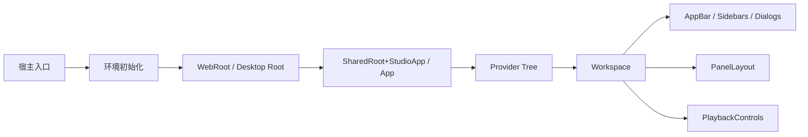
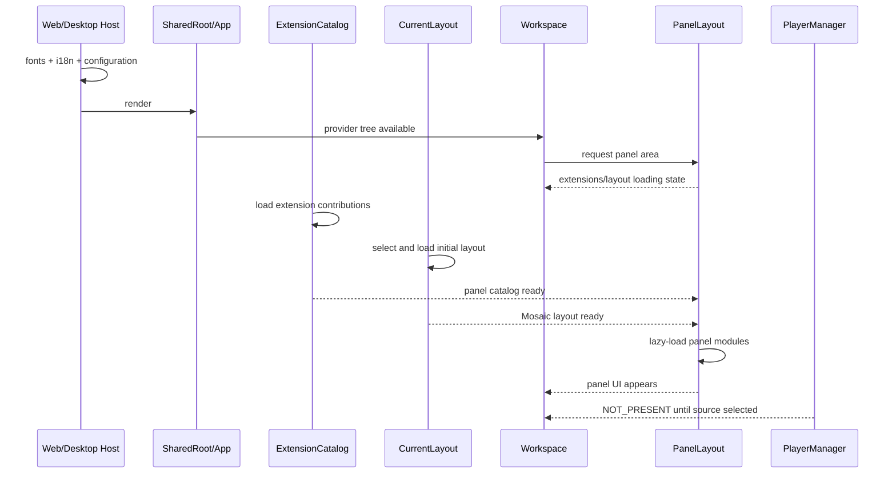

# Lichtblick 学习文档 01：应用启动与 Provider 树

> 对应母版：`docs/architecture-learning-outline.md`
>
> 本文范围：从 Web 或 Electron 进程启动，到 React Workspace 和首批面板进入 UI。
>
> 不在本文展开：MessagePipeline 内部 Reducer、Player 播放状态机、布局同步算法和面板实现。

## 1. 学习目标

读完本文后，应能够回答：

1. Web 与 Desktop 分别从哪个文件启动？
2. 字体、国际化、配置和 Electron bridge 在何时初始化？
3. `SharedRoot + StudioApp` 与 `App` 为什么是两条不同路径？
4. `MultiProvider` 数组的真实嵌套顺序是什么？
5. 每个 Provider 拥有什么状态，又依赖哪些外层 Provider？
6. 启动状态如何逐步形成 AppBar、Sidebars、PanelLayout 和 PlaybackControls？
7. 首屏加载、错误和宿主差异应该从哪里调试？

## 2. 前置知识

建议先了解：

- React Context、Provider 和 Hook；
- React `Suspense` 与 `React.lazy`；
- Zustand store 的基本概念；
- Electron Main、Preload、Renderer；
- 浏览器 URL、localStorage 和 IndexedDB；
- `IDataSourceFactory`、`IExtensionLoader`、`LayoutLoader` 只需知道接口用途。

## 3. 系统边界

本文处理的调用范围：



本文到 `Workspace` 和 `PanelLayout` 的边界为止。数据消息如何进入面板由后续
MessagePipeline 专题解释。

## 4. 两条启动总线

### 4.1 Web

```text
web/src/entrypoint.tsx
  → @lichtblick/suite-web.main()
  → 兼容性检查
  → 动态加载 suite-base
  → 初始化工具、字体和 i18n
  → WebRoot
  → SharedRoot
  → StudioApp
  → Workspace
```

### 4.2 Desktop

Desktop 不是一条调用栈，而是三个并行边界：

```text
Main
  → Electron app ready
  → StudioWindow
  → BrowserWindow.loadURL()

Preload
  → 建立 electron-socket
  → 注册文件 input
  → 暴露 contextBridge

Renderer
  → 初始化 NativeStorageAppConfiguration
  → 建立 renderer socket
  → 字体和 i18n
  → Desktop Root
  → App
  → Workspace
```

Main 与 Preload 为 Renderer 准备系统能力，Renderer 才负责共享 React UI。

## 5. Web 启动逐步解析

### 5.1 Webpack 入口

文件：

- `web/src/entrypoint.tsx`
- `packages/suite-web/src/index.tsx`

`web/src/entrypoint.tsx` 本身只调用：

```ts
import { main } from "@lichtblick/suite-web";

void main();
```

真正的启动逻辑在 `packages/suite-web/src/index.tsx`。这种拆分使顶层 `web` workspace
只承担产品入口和 Webpack 配置，宿主实现集中在 `suite-web`。

### 5.2 安装全局错误入口

`main()` 首先把 `window.onerror` 转发到 `console.error`，然后查找 `#root`。

这里的失败发生在 React ErrorBoundary 之外：

- HTML 没有 `#root` 时直接抛错；
- 动态 import 失败时 React 树尚未创建；
- 字体或 i18n 初始化失败时 Workspace 尚未挂载。

调试黑屏时，应先检查浏览器控制台，而不是直接从面板 ErrorBoundary 开始。

### 5.3 兼容性门禁

Web 在加载大部分 `suite-base` 代码之前调用 `canRenderApp()`，检查：

- BigInt typed arrays；
- class static initialization block；
- `OffscreenCanvas`。

结果有两条路径：

```text
不兼容
  → 只渲染 CompatibilityBanner
  → main() 返回

兼容
  → 动态 import suite-base
  → 继续完整启动
```

这里使用动态 import 的意义不只是分包：不支持必需语法或 API 的浏览器仍有机会看到
兼容性提示，而不会在解析完整应用 bundle 时直接失败。

### 5.4 React 之前的共享初始化

兼容路径依次执行：

1. `installDevtoolsFormatters()`；
2. `overwriteFetch()`；
3. `waitForFonts()`；
4. `initI18n()`；
5. 动态加载 `WebRoot`；
6. 获取可选启动参数；
7. 创建 React root。

`waitForFonts()` 发生在 `root.render()` 之前，因此字体慢会推迟整个首屏，而不是先显示
Workspace 骨架。源码注释也指出未来可以把它移入 App 以显示加载界面。

### 5.5 `getParams()` 扩展点

`main(getParams)` 允许宿主调用者覆盖：

- `dataSources`；
- `extraProviders`；
- 完整 `rootElement`。

这是测试、产品定制或嵌入场景的入口。若传入 `rootElement`，默认
`WebRoot + StudioApp` 会被整体替换。

### 5.6 “App rendered” 的真实含义

`LogAfterRender` 在 effect 中输出 `App rendered`，供集成测试判断 React 至少完成过
一次提交。

它不代表：

- 扩展已经全部加载；
- 当前布局已经读取；
- Player 已连接；
- 面板收到第一帧消息。

因此 E2E 测试不能只看到这条日志就假定业务数据已经准备完成。

## 6. WebRoot：把浏览器环境翻译成共享输入

`WebRoot` 不负责画 Workspace。它构造 `SharedRoot` 所需的宿主依赖。

### 6.1 AppConfiguration

Web 使用 `LocalStorageAppConfiguration`，开发环境默认开启 debug panels。

后续 `ColorSchemeThemeProvider` 会订阅 `AppSetting.COLOR_SCHEME`。配置变化路径：

```text
设置 UI
  → LocalStorageAppConfiguration.set()
  → change listener
  → useAppConfigurationValue()
  → ColorSchemeThemeProvider
  → MUI theme 更新
  → UI 重渲染
```

### 6.2 ExtensionLoaders

Web 默认创建：

- `IdbExtensionLoader("org")`；
- `IdbExtensionLoader("local")`。

URL 同时存在 `workspace` 且配置了 API URL 时，再增加
`RemoteExtensionLoader("org", workspace)`。

Loader 数组使用 `useState` 固定实例，避免 WebRoot 每次渲染都重建 Loader，导致扩展
目录重复刷新。

### 6.3 AppParameters

URL 查询参数 `layout` 被转为：

```ts
{
  defaultLayout: layoutName;
}
```

这个值不直接改变 UI，而是经过：

```text
WebRoot.appParameters
  → SharedRoot
  → AppParametersProvider
  → CurrentLayoutProvider
  → 按名称选择初始布局
  → PanelLayout
```

### 6.4 DataSourceFactories

Web 默认注入本地 Bag/DB3/MCAP/ULog、远程文件、Foxglove WebSocket、Rosbridge 和示例
数据。

这里注入的是工厂，不会立即创建 Player。只有用户、文件或 URL 选择数据源后，
`PlayerManager.selectSource()` 才调用工厂。

### 6.5 Deep link

Web 把当前 `globalThis.location.href` 作为 deep link 传入。Workspace 后续解析：

- 数据源；
- 数据源参数；
- layoutId 或 layout URL；
- session；
- 时间和事件。

## 7. SharedRoot：稳定的外壳层

`SharedRoot` 的职责是提供所有页面都需要、且与具体 Workspace 业务相对独立的环境。

实际嵌套：

```text
AppConfigurationContext
└─ AppParametersProvider
   └─ ColorSchemeThemeProvider
      ├─ GlobalCss（可选）
      └─ CssBaseline
         └─ ErrorBoundary
            └─ SharedRootContext
               └─ StudioApp
```

### 7.1 为什么 AppConfiguration 必须在 Theme 外面

`ColorSchemeThemeProvider` 调用 `useAppConfigurationValue()` 读取颜色设置，所以
AppConfiguration 必须位于它外层。

Theme 又必须位于使用 MUI/tss-react 样式的所有 UI 外层。

### 7.2 SharedRootContext 存什么

它保存宿主组装参数，而不是高频业务状态：

- data source factories；
- extension loaders；
- deep links；
- app configuration 和 parameters；
- 原生窗口和菜单抽象；
- AppBar 自定义项；
- extra providers；
- 启动偏好页开关。

这些值主要在启动或宿主切换时变化。消息帧不经过 SharedRootContext。

### 7.3 ErrorBoundary 的覆盖范围

该 ErrorBoundary 包住 `StudioApp`，能捕获 Provider 构造和 Workspace React 渲染错误，
但不能捕获：

- React 树创建之前的异步初始化错误；
- 事件回调中的异步 Promise rejection；
- Electron Main/Preload 错误。

## 8. StudioApp：业务 Provider 组合器

### 8.1 MultiProvider 的关键语义

实现：

```ts
providers.reduceRight(
  (children, provider) => React.cloneElement(provider, undefined, children),
  children,
);
```

所以数组：

```ts
[A, B, C];
```

实际变成：

```tsx
<A>
  <B>
    <C>{children}</C>
  </B>
</A>
```

结论：**数组第一个 Provider 最外层，最后一个最内层。**

阅读 `unshift()` 和 `push()` 时必须先还原最终数组，不能把最后一次 unshift 误认为最
内层。

### 8.2 Web 最终 Provider 顺序

未注入 extra/native provider 时，外到内为：

```text
RemoteLayoutStorageContext（可选）
└─ LayoutStorageContext
   └─ LayoutManagerProvider
      └─ UserProfileLocalStorageProvider
         └─ CurrentLayoutProvider
            └─ AlertsContextProvider
               └─ StudioLogsSettingsProvider
                  └─ StudioToastProvider
                     └─ TimelineInteractionStateProvider
                        └─ ExtensionMarketplaceProvider
                           └─ ExtensionCatalogProvider
                              └─ UserScriptStateProvider
                                 └─ PlayerManager
                                    └─ EventsProvider
                                       └─ UI subtree
```

`extraProviders` 位于 StudioToast 与 Timeline provider 之间。NativeMenu/NativeWindow
如果存在，会追加在 EventsProvider 内侧。

### 8.3 为什么顺序重要

| Provider                 | 依赖外层                                            | 给内层提供                        |
| ------------------------ | --------------------------------------------------- | --------------------------------- |
| LayoutStorageContext     | 宿主创建的 storage                                  | 本地布局持久化接口                |
| LayoutManagerProvider    | local/remote storage                                | 布局 CRUD 和同步                  |
| UserProfileProvider      | 浏览器存储                                          | 当前布局 ID 等用户偏好            |
| CurrentLayoutProvider    | LayoutManager、UserProfile、AppParameters           | 当前 Layout actions/selectors     |
| AlertsProvider           | 无                                                  | session alerts store              |
| ExtensionCatalogProvider | extension loaders                                   | 面板、转换器、alias 等贡献        |
| UserScriptStateProvider  | 无                                                  | 脚本诊断、日志和类型库            |
| PlayerManager            | CurrentLayout、ExtensionCatalog、UserScript、Alerts | PlayerSelection + MessagePipeline |
| EventsProvider           | 无                                                  | 时间线事件 store                  |

最关键的依赖链是：

```text
LayoutStorage
  → LayoutManager
  → CurrentLayout
  → PlayerManager
  → MessagePipeline
  → Workspace/Panels
```

### 8.4 RemoteLayoutStorage 为什么最外层

`LayoutManagerProvider` 在构造 `LayoutManager` 时读取 local 和 remote storage。
Remote provider 必须在它外层，否则 LayoutManager 只能看到 `undefined`，后续也不会
自动变成远程同步模式。

### 8.5 PlayerManager 为什么靠近内层

PlayerManager 需要读取：

- CurrentLayout 中的 User Scripts 与全局变量；
- ExtensionCatalog 的 Topic alias；
- UserScriptState actions；
- Alerts 和性能/分析上下文。

它向内提供：

- `PlayerSelectionContext`；
- `MessagePipelineProvider`。

因此 Workspace、Events 适配器和面板必须位于 PlayerManager 内部才能消费 PlayerState。

## 9. Provider 之外的 UI 包装层

`MultiProvider` 的 children 不是直接的 Workspace：

```text
DocumentTitleAdapter
SendNotificationToastAdapter
DndProvider
└─ Suspense
   └─ PanelCatalogProvider
      └─ Workspace
```

### 9.1 DocumentTitleAdapter

它观察当前数据源或布局相关状态，更新浏览器窗口标题。它是“状态 → 宿主副作用”的
Adapter，不拥有业务状态。

### 9.2 SendNotificationToastAdapter

它把共享通知函数转接到 notistack toast UI，使非 React 或深层逻辑可以请求通知，而
不直接依赖具体 Snackbar 实现。

### 9.3 DndProvider

面板目录、Mosaic 和 Tab 面板使用 React DnD。若 DndProvider 缺失，布局能渲染，但面板
拖放链路无法工作。

### 9.4 Suspense

Panel module 使用 `React.lazy()` 动态加载。StudioApp 的最外层 Suspense fallback 是
空节点，PanelLayout 内部还为单个 panel module 提供进度 UI。

### 9.5 PanelCatalogProvider

它必须位于 Workspace 外层，因为：

- Add Panel 侧栏需要列出面板；
- PanelLayout 需要由 panel type 查找 module；
- Panel HOC 需要标题、默认配置等元数据。

## 10. 首屏 UI 是如何形成的

### 10.1 React 第一次提交

Provider 创建后，Workspace 可以先渲染应用框架：

- AppBar；
- Sidebars；
- Dialog 容器；
- PanelStateContext；
- 文件拖放和快捷键监听；
- PanelLayout 区域；
- 满足能力条件时的 PlaybackControls。

但此时异步状态可能仍未准备完成。

### 10.2 扩展目录门禁

`PanelLayout` 检查：

```ts
installedExtensions === undefined;
```

未完成时显示 “Loading extensions…”。原因是当前布局可能包含扩展 panel type；在扩展
目录完成前将其判断为 UnknownPanel 会产生错误的中间 UI。

扩展加载完成后：

```text
ExtensionCatalog store 更新
  → PanelCatalogProvider selector 更新
  → panelComponents Map 更新
  → PanelLayout 创建 lazy panel components
  → 面板 UI 出现
```

### 10.3 当前布局门禁

`CurrentLayoutProvider` 异步选择布局：

```text
selectedLayout = { id, loading: true, data: undefined }
  → LayoutManager.getLayout()
  → selectedLayout.data
  → useCurrentLayoutSelector()
  → PanelLayout 获取 Mosaic tree
```

在 `selectedLayout.data` 存在前，PanelLayout 不创建面板实例。

### 10.4 数据源不是首屏前提

没有 Player 时，MessagePipeline 提供 `NOT_PRESENT` 默认状态。Workspace 仍可以显示：

- 布局；
- 面板框架；
- 数据源入口；
- 面板设置。

依赖消息的面板显示空状态。选择数据源后，PlayerManager 创建 Player 并沿
MessagePipeline 驱动它们。

### 10.5 PlaybackControls 的条件

Workspace 只有在 `play`、`pause`、`seek` 都存在时才渲染 PlaybackControls。

这些函数来自：

```text
Player capabilities
  → MessagePipeline 绑定 Player 方法
  → Workspace selectors
  → 条件渲染 PlaybackControls
```

因此播放条不是静态首屏组成，它由当前 Player 能力驱动。

## 11. LaunchPreference 的门禁作用

Web 默认设置 `enableLaunchPreferenceScreen`。`StudioApp` 根据开关选择：

```text
LaunchPreference
  或
Fragment
```

它包在整个业务 Provider/UI 组合外层，用于决定当前浏览器是否继续 Web 应用、尝试
Desktop 或显示启动偏好。

调试“Provider 已创建但 Workspace 没显示”时，需要先确认是否停留在该门禁。

## 12. Desktop 启动逐步解析

### 12.1 Main 进程

入口：

- `desktop/main/index.ts`
- `packages/suite-desktop/src/main/index.ts`

Main 在 `app.ready` 前完成：

- i18n 和语言；
- userData/home override；
- 单实例锁；
- open-file/open-url 监听；
- IPC handlers；
- 自定义协议注册；
- CLI flags 解析。

`app.ready` 后：

1. 创建 `StudioWindow`；
2. 注册协议处理器；
3. 启动更新器；
4. 安装开发扩展；
5. 设置 CSP；
6. 注册窗口焦点和 macOS activate；
7. 调用 `initialWindow.load()`。

Main 只负责创建可承载 Renderer 的窗口，还没有 React Provider。

### 12.2 BrowserWindow

`StudioWindow` 配置：

- `contextIsolation: true`；
- `nodeIntegration: false`；
- preload script；
- deep links 作为 additional arguments；
- 隐藏原生 title bar；
- 窗口尺寸、主题背景和系统菜单。

Main 将 maximize、fullscreen 等事件发送给 Renderer，并拦截外部导航交给系统浏览器。

### 12.3 Preload

入口：

- `desktop/preload/index.ts`
- `packages/suite-desktop/src/preload/index.ts`

Preload 在 Renderer 应用之前：

1. 读取 additional arguments 中的 deep links；
2. 建立 preloader socket；
3. 注册隐藏 file input；
4. 构造 OS context；
5. 建立 Desktop、Storage 和 Menu bridge；
6. 使用 `contextBridge.exposeInMainWorld()` 暴露白名单 API。

Renderer 不直接 import Node/Electron 系统能力，而是读取这些 bridge。

### 12.4 Renderer 顶层入口

`desktop/renderer/index.ts` 首先使用 `storageBridge` 初始化
`NativeStorageAppConfiguration`，然后调用 suite-desktop renderer main。

后者执行：

1. DevTools formatter 和 fetch patch；
2. 确认 `#root`；
3. 建立 electron-socket Renderer RPC；
4. 等待字体；
5. 初始化 Renderer i18n；
6. 通过 desktopBridge 获取 CLI flags；
7. 渲染 Desktop `Root`。

注意顺序：bridge 必须先由 Preload 暴露，Renderer 才能初始化配置和 RPC。

## 13. Desktop Root：把系统能力适配成 AppProps

### 13.1 Desktop 独有实现

Root 创建：

- `DesktopExtensionLoader`；
- `DesktopLayoutLoader`；
- `NativeAppMenu`；
- `NativeWindow`；
- 额外的 ROS 1 Socket 与 Velodyne data source。

这些实现都满足 suite-base 接口，`App` 不需要直接依赖 Electron。

### 13.2 Deep link 优先级

Root 先检查当前 `window.location`：

- 存在 `ds` 或 `layoutId`：使用当前 URL；
- 否则使用 Preload 传来的启动 deep links。

这样用户主动刷新窗口时，当前会话 URL 不会被最初启动参数覆盖。

### 13.3 原生窗口状态驱动 UI

```text
Main BrowserWindow event
  → Preload bridge event
  → Root useEffect
  → isFullScreen/isMaximized React state
  → App props
  → AppBar custom controls
```

macOS 非全屏时还会设置 `appBarLeftInset=72`，为 traffic lights 留出空间。

### 13.4 配置反向驱动 Main

Root 监听：

- `AppSetting.COLOR_SCHEME`；
- `AppSetting.LANGUAGE`。

变化后调用 desktopBridge，让 Main 更新 nativeTheme 和原生菜单语言。这是：

```text
Renderer 配置状态
  → bridge 副作用
  → Main 系统状态
  → BrowserWindow/menu UI
```

## 14. `App` 与 `SharedRoot + StudioApp` 的差异

### 14.1 为什么不能视为同一入口

Web：

```text
SharedRoot
  → StudioApp
```

Desktop：

```text
App
```

`App` 把外壳 Provider 和业务 Provider 放在同一个组件中，还支持 Desktop
`layoutLoaders`、native window 和 native menu。

`StudioApp` 从 SharedRootContext 读取宿主依赖，并可创建 RemoteLayoutStorage。

### 14.2 Desktop `App` 的主要 Provider 顺序

外到内大致为：

```text
AppConfiguration
└─ AppParameters
   └─ Theme
      └─ CssBaseline
         └─ ErrorBoundary
            └─ LaunchPreference/Fragment
               └─ StudioLogs
                  └─ StudioToast
                     └─ LayoutStorage
                        └─ LayoutManager
                           └─ UserProfile
                              └─ CurrentLayout(layoutLoaders)
                                 └─ Alerts
                                    └─ extra providers
                                       └─ Timeline
                                          └─ UserScript
                                             └─ ExtensionMarketplace
                                                └─ ExtensionCatalog
                                                   └─ PlayerManager
                                                      └─ Events
```

Native menu/window providers追加在内侧。

### 14.3 需要特别记录的差异

| 主题            | Web 新路径                    | Desktop `App`                 |
| --------------- | ----------------------------- | ----------------------------- |
| 宿主参数        | SharedRootContext             | App props                     |
| 远程布局        | StudioApp 根据 workspace 创建 | App 本身不创建                |
| 默认布局 Loader | CurrentLayoutProvider 默认空  | Root 注入 DesktopLayoutLoader |
| 扩展本地存储    | IndexedDB                     | Desktop filesystem            |
| 原生窗口        | 通常无                        | NativeWindow/NativeMenu       |
| 额外数据源      | 浏览器可用集合                | ROS1 socket、Velodyne 等      |

修改共享启动逻辑时必须同时检查两条路径，否则 Web 与 Desktop 会出现不一致。

## 15. 首屏状态时间线



该时间线说明“React 已渲染”“Workspace 已渲染”“面板已出现”“数据已出现”是四个不同
里程碑。

## 16. 状态所有权表

| 状态                     | 创建位置                    | 更新方式              | 首批 UI 消费者               |
| ------------------------ | --------------------------- | --------------------- | ---------------------------- |
| App settings             | WebRoot/Desktop config init | configuration service | Theme、设置 UI               |
| Host parameters          | Web/Desktop Root            | URL/CLI               | CurrentLayout、Workspace     |
| Layout storage           | StudioApp/App               | storage methods       | LayoutManager                |
| Current layout           | CurrentLayoutProvider       | actions/listeners     | PanelLayout、Panels          |
| Extension catalog        | ExtensionCatalogProvider    | Zustand actions       | PanelCatalog                 |
| User scripts diagnostics | UserScriptStateProvider     | Zustand actions       | Script editor、PlayerManager |
| Player selection         | PlayerManager               | React state/context   | DataSource UI                |
| Player state             | MessagePipelineProvider     | Zustand dispatch      | Workspace、Panels            |
| Timeline interaction     | Timeline provider           | Context actions       | Plot、3D、Image              |
| Workspace chrome         | Workspace provider/store    | Zustand actions       | Sidebars、Dialogs            |
| Native window            | Desktop Root                | IPC → React state     | AppBar                       |

## 17. 错误与加载边界

### 17.1 React 之前

- 缺少 root；
- 动态 import 失败；
- 字体/i18n 初始化失败；
- bridge 缺失；
- electron-socket 初始化失败。

观察位置：浏览器或 Renderer console、Electron logs。

### 17.2 外壳 React 树

SharedRoot/App 的 ErrorBoundary 捕获 Provider 和 Workspace 渲染异常。

### 17.3 局部 UI

- PanelLayout 有自己的 ErrorBoundary；
- 单个 Panel 有 PanelErrorBoundary；
- 异步布局/扩展错误进入 toast、alerts 或 logger；
- Player 错误进入 PlayerPresence/alerts。

错误边界的目标是让一个面板错误不影响 AppBar、其他面板和布局操作。

## 18. 性能注意点

### 18.1 稳定实例

以下对象应通过 `useState` 或 `useMemo` 保持稳定：

- data source factory 数组；
- extension loader 数组；
- layout storage；
- native service adapters；
- SharedRoot context value。

若每次 Root 渲染都重建它们，可能触发：

- PlayerManager 重新选择；
- ExtensionCatalog 重载；
- LayoutManager 重建和同步中断；
- Context 消费者无意义重渲染。

### 18.2 Provider 不承载所有高频状态

Provider 树层级很深，但消息帧并不让整棵树更新：

- MessagePipeline 使用独立 Zustand store；
- CurrentLayout 使用 selector/listener；
- ExtensionCatalog 使用 selector；
- Workspace 有独立 store。

Provider 负责所有权和可访问边界，selector 决定更新粒度。

### 18.3 动态加载

Web 延迟加载 suite-base，PanelCatalog 延迟加载每个 panel module。首屏性能分析应分别
测量：

- 兼容性检查前；
- 根应用 bundle；
- 扩展加载；
- 当前布局中的 panel chunks；
- 数据源初始化。

## 19. 源码阅读顺序

### Web

1. `web/src/entrypoint.tsx`
2. `packages/suite-web/src/index.tsx`
3. `packages/suite-web/src/canRenderApp.ts`
4. `packages/suite-web/src/WebRoot.tsx`
5. `packages/suite-base/src/SharedRoot.tsx`
6. `packages/suite-base/src/StudioApp.tsx`
7. `packages/suite-base/src/components/MultiProvider.tsx`
8. `packages/suite-base/src/Workspace.tsx`
9. `packages/suite-base/src/components/PanelLayout.tsx`

### Desktop

1. `desktop/main/index.ts`
2. `packages/suite-desktop/src/main/index.ts`
3. `packages/suite-desktop/src/main/StudioWindow.ts`
4. `desktop/preload/index.ts`
5. `packages/suite-desktop/src/preload/index.ts`
6. `desktop/renderer/index.ts`
7. `packages/suite-desktop/src/renderer/index.tsx`
8. `packages/suite-desktop/src/renderer/Root.tsx`
9. `packages/suite-base/src/App.tsx`

## 20. 可执行观察实验

### 实验一：区分四个首屏里程碑

观察：

1. `App rendered` 日志；
2. Workspace AppBar 出现；
3. “Loading extensions…” 消失；
4. 面板出现；
5. 选择数据源后消息出现。

预期：这些事件不是同时发生。

### 实验二：展开 Provider 顺序

在 `MultiProvider` 中临时记录 provider type，或在 React DevTools 中查看树。

预期：providers 数组第一个元素是最外层。

### 实验三：延迟扩展加载

在 ExtensionLoader 中增加临时延迟。

预期：

- Workspace chrome 可存在；
- PanelLayout 显示扩展加载状态；
- 扩展完成后面板目录和 PanelLayout 更新。

### 实验四：移除当前布局

使用空 UserProfile/IndexedDB 启动。

预期：CurrentLayoutProvider 创建并选择 `Default`，然后 PanelLayout 出现。

### 实验五：Desktop 最大化事件

最大化和恢复窗口，观察：

```text
BrowserWindow event
  → desktopBridge listener
  → Root isMaximized
  → AppBar controls
```

### 实验六：比较默认数据源

分别打印 WebRoot 和 Desktop Root 注入的 `dataSources.map(source => source.id)`。

预期：Desktop 包含依赖系统网络能力的数据源。

## 21. 对应测试

优先阅读或执行：

- `packages/suite-web/src/WebRoot.test.tsx`
- `web/integration-test/startup.test.ts`
- `packages/suite-base/src/App.test.tsx`
- `packages/suite-base/src/SharedRoot.test.tsx`
- `packages/suite-base/src/StudioApp.test.tsx`
- `packages/suite-base/src/Workspace.test.tsx`
- `packages/suite-base/src/components/PanelLayout.test.tsx`
- `packages/suite-desktop/src/renderer/services/NativeStorageAppConfiguration.test.ts`
- `packages/suite-desktop/src/main/createNewWindow.test.ts`
- `e2e/tests/web/`
- `e2e/tests/desktop/`

专题学习阶段优先使用目标测试，不必每次运行完整 E2E。

## 22. 常见误区

### 误区一：`App rendered` 等于应用准备完成

它只说明 React 提交过一次。

### 误区二：Provider 数组最后一个是最外层

`reduceRight()` 使第一个最外层。

### 误区三：Web 与 Desktop 都走 StudioApp

当前 Desktop Root 直接使用 `App`。

### 误区四：注册 DataSourceFactory 会立即建立连接

连接发生在 `selectSource()` 调用工厂以后。

### 误区五：没有 Player 就没有 Workspace

Workspace 与布局可以在 `NOT_PRESENT` 状态下渲染。

### 误区六：Context 更新一定让所有子组件重渲染

高频领域状态使用 Zustand 或自定义 selector；React 的父组件渲染与 store subscriber
更新需要分别分析。

## 23. 自测问题

1. 为什么 Web 在动态 import suite-base 之前执行兼容性检查？
2. `WebRoot` 创建的是 Player 还是 DataSourceFactory？
3. `SharedRoot` 为什么必须把 AppConfiguration 放在 Theme 外面？
4. `[A, B, C]` 传给 MultiProvider 后，真实 JSX 是什么？
5. LayoutManagerProvider 为什么必须位于 CurrentLayoutProvider 外面？
6. PlayerManager 依赖哪些外层状态？
7. 为什么扩展未加载完成时不能立即渲染 UnknownPanel？
8. 没有 Player 时 Workspace 的哪些部分仍能显示？
9. PlaybackControls 为什么是能力驱动的条件 UI？
10. Desktop Renderer 从哪里获得 filesystem extension loader？
11. Main 的 maximize 事件如何到达 AppBar？
12. 修改启动 Provider 时为什么必须同时检查 `App` 和 `StudioApp`？

## 24. 本文结论

Lichtblick 的启动不是“入口文件渲染 App”这一条简单调用链，而是：

```text
宿主准备能力
  → Root 把能力适配成接口
  → 外壳 Provider 建立主题、配置和错误边界
  → 业务 Provider 按依赖顺序建立状态所有权
  → Workspace 先形成 UI 框架
  → 扩展和布局异步完成
  → PanelLayout 创建面板
  → Player 能力进一步驱动消息 UI 和播放控件
```

后续阅读任何功能时，先定位它由哪个 Root 注入、由哪个 Provider 持有、通过哪个 selector
驱动 UI，可以显著减少在深层组件中迷失的概率。
