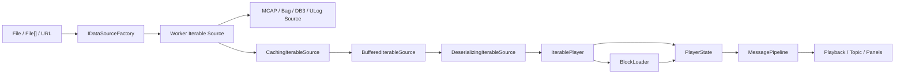
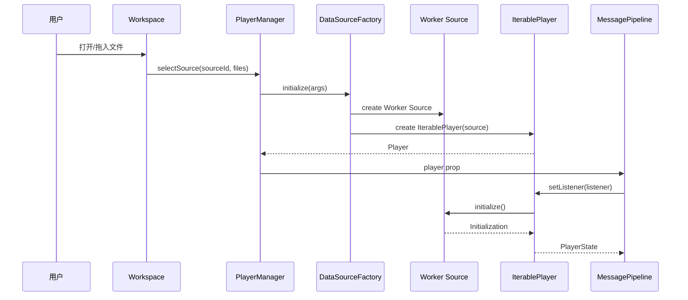
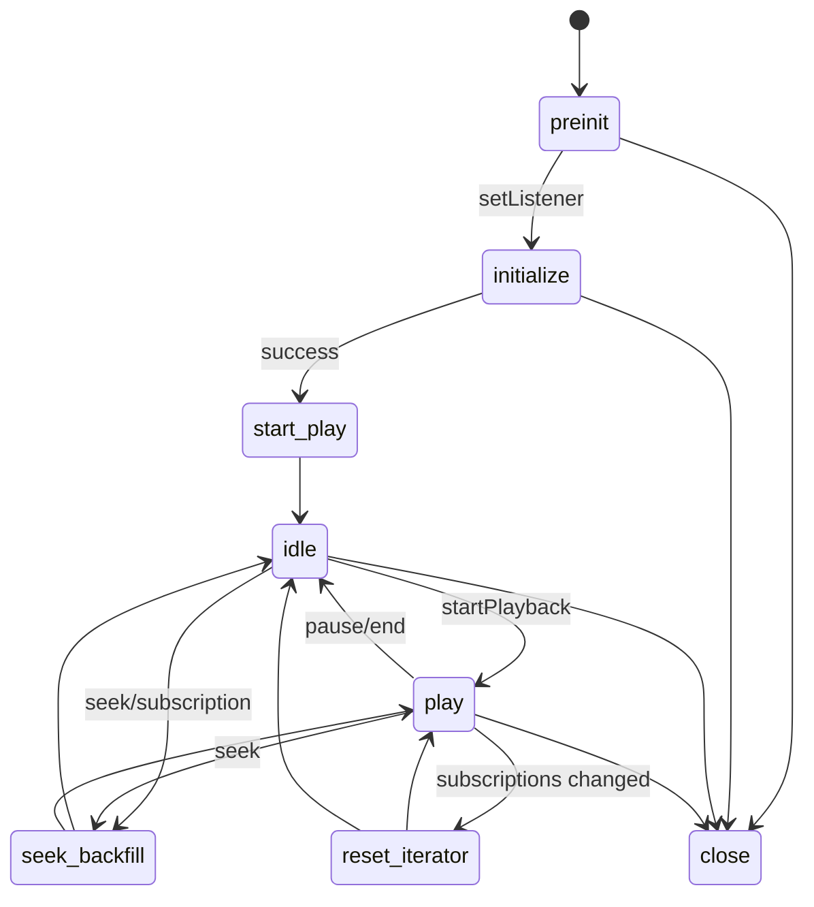
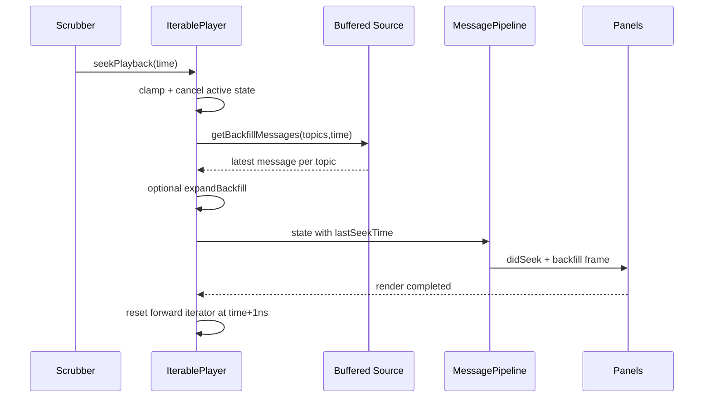

# Lichtblick 学习文档 02：文件数据源与 IterablePlayer

> 对应母版：`docs/architecture-learning-outline.md`
>
> 本文范围：本地/远程文件从选择、解析、缓存、播放、Seek 到 PlayerState 驱动 UI。
>
> 不在本文展开：实时连接协议、MessagePipeline 内部 Reducer、具体面板绘制算法。

## 1. 学习目标

读完本文后，应能够解释：

1. `IDataSourceFactory`、`IIterableSource` 和 `Player` 的职责边界；
2. MCAP、ROS 1 Bag、ROS 2 DB3、ULog 如何收敛为 IterablePlayer；
3. Worker 中为什么优先传递序列化字节；
4. `CachingIterableSource`、`BufferedIterableSource`、`BlockLoader` 的差异；
5. IterablePlayer 状态机如何播放、暂停、Seek 和关闭；
6. 订阅如何反向决定文件读取量；
7. `PlayerState` 的时间、进度、Presence 和 Alert 如何驱动 UI；
8. 切换数据源时哪些 Worker、Cursor 和缓存必须释放。

## 2. 总体架构



注意：图中 Decode 对已反序列化 Source 可能只是包装，不一定执行字节解码。

## 3. 三个核心接口

### 3.1 IDataSourceFactory

工厂同时服务 UI 和运行时。

UI 读取：

- `id`、`displayName`、图标；
- `type`：file、connection、sample；
- 支持的扩展名；
- 是否支持多文件；
- 表单、说明、警告和文档链接。

运行时调用：

```ts
initialize(args: DataSourceFactoryInitializeArgs): Player | undefined
```

工厂负责验证输入、创建 Worker Source 和 IterablePlayer，但不负责文件格式的具体迭代。

### 3.2 IIterableSource

Source 把任意文件格式统一为时间有序读取接口：

```text
initialize()
messageIterator(args)
getBackfillMessages(args)
getMessageCursor?(args)
terminate?()
```

它不负责播放速度和 React UI。

### 3.3 Player

Player 面向上层提供：

- listener；
- subscriptions；
- 播放、暂停、速度、Seek；
- 当前 PlayerState；
- 关闭和资源清理。

IterablePlayer 不需要理解 MCAP record 或 SQLite row，只消费 IIterableSource。

## 4. 文件工厂矩阵

| 格式            | 工厂 ID              | Worker Source    | 消息跨 Worker 形态 | 多文件       | Read-ahead |
| --------------- | -------------------- | ---------------- | ------------------ | ------------ | ---------- |
| MCAP            | `mcap-local-file`    | WorkerSerialized | Uint8Array         | 是           | 120s       |
| ROS 1 Bag       | `ros1-local-bagfile` | WorkerSerialized | Uint8Array         | 否           | 120s       |
| ROS 2 DB3       | `ros2-local-bagfile` | WorkerSerialized | Uint8Array         | 是           | 120s       |
| Remote MCAP/Bag | `remote-file`        | WorkerSerialized | Uint8Array         | 同格式多 URL | 10s        |
| PX4 ULog        | `ulog-local-file`    | WorkerIterable   | object             | 否           | 默认 10s   |

工厂源码：

- `packages/suite-base/src/dataSources/McapLocalDataSourceFactory.ts`
- `packages/suite-base/src/dataSources/Ros1LocalBagDataSourceFactory.ts`
- `packages/suite-base/src/dataSources/Ros2LocalBagDataSourceFactory.ts`
- `packages/suite-base/src/dataSources/RemoteDataSourceFactory.tsx`
- `packages/suite-base/src/dataSources/UlogLocalDataSourceFactory.ts`

## 5. 从 UI 到 Player



`setListener()` 是真正启动 IterablePlayer 初始化的入口。构造 Player 本身不会立即执行
完整 Source 初始化。

## 6. IIterableSource 初始化结果

`Initialization` 包含：

| 字段                | 意义              | UI/上层用途            |
| ------------------- | ----------------- | ---------------------- |
| `start/end`         | 文件时间范围      | Scrubber 和 Seek 边界  |
| `topics`            | Topic 与解码信息  | TopicList、订阅 UI     |
| `topicStats`        | 消息计数等        | Topic 统计             |
| `datatypes`         | ROS-like 类型图   | 消息路径、面板设置     |
| `profile`           | ros1/ros2/ulog 等 | 语义适配               |
| `publishersByTopic` | 发布者信息        | Topic 图和 Source 信息 |
| `metadata`          | 文件元数据        | DataSourceInfo         |
| `alerts`            | 可恢复格式问题    | Alerts UI              |

初始化返回的 Topic 可能携带：

- message encoding；
- schema encoding；
- schema bytes；
- schema name。

这些信息让主线程在实际订阅发生时建立反序列化器。

## 7. 迭代结果为何有三种

`messageIterator()` 返回：

```ts
(message - event) | alert | stamp;
```

### 7.1 message-event

包含 Topic、receiveTime、可选 publishTime、Schema、消息体和大小。

### 7.2 alert

局部 Channel/Connection 解码错误不会必然终止整个文件。Source 可以产出 Alert，
IterablePlayer 把它交给 PlayerAlertManager，然后继续其他 Topic。

### 7.3 stamp

Stamp 表示“Source 已读取到这个时间”，即使区间内没有消息。

没有 Stamp 时，Player 无法区分：

- 文件还没有读取完成；
- 该时间区间本来就没有消息。

因此空白时间段的播放游标依然能推进。

## 8. Worker 与 Comlink

### 8.1 Worker 创建

工厂传入：

```ts
new WorkerSerializedIterableSource({
  initWorker: () => new Worker(new URL("...worker", import.meta.url)),
  initArgs: { files },
});
```

`initialize()` 时才：

1. 创建 Worker；
2. 用 `ComlinkWrap` 得到远程 initialize；
3. 传递 file/files/url/urls；
4. 得到远程 Source；
5. 调用远程 `initialize()`。

### 8.2 为什么使用 Cursor

逐消息 Comlink RPC 会造成大量 Promise 和序列化开销。Worker Source 优先调用：

```ts
cursor.nextBatch(17);
```

17ms 接近 60 FPS 一帧，既减少 RPC 次数，又避免一次批量过大导致首帧等待。

### 8.3 AbortSignal

AbortSignal 不能直接按普通对象 clone。项目注册自定义 Comlink transfer handler，把
Seek 或 Cursor 取消传入 Worker。

### 8.4 释放

Cursor `end()` 后释放 proxy；Source `terminate()` 释放远程对象；Player Close 负责触发
整条清理链。

## 9. 序列化与反序列化路径

### 9.1 Serialized Source

MCAP、Bag、DB3：

```text
Worker 文件解析/解压
  → MessageEvent<Uint8Array>
  → 主线程 BufferedIterableSource
  → DeserializingIterableSource
  → MessageEvent<object>
```

优势：

- ArrayBuffer 跨线程成本可控；
- 只解码已订阅 Topic；
- 支持字段裁剪；
- 可实施 latest-per-render-tick 采样；
- 解码错误统一变为 Iterator alert。

### 9.2 Deserialized Source

ULog：

```text
Worker 内完整解码
  → MessageEvent<object>
  → WorkerIterableSource
  → BufferedIterableSource
  → DeserializedSourceWrapper
```

已解码对象跨线程更重，并且无法利用 DeserializingIterableSource 中的采样优化。

## 10. 具体格式边界

### 10.1 MCAP

`McapIterableSource.initialize()`：

1. 等待解压 WASM handlers；
2. 本地使用 BlobReadable，远程使用 RemoteFileReadable；
3. 尝试建立 McapIndexedReader；
4. 有 Chunk Index 和 Channel 时选 Indexed Source；
5. 否则使用 Unindexed 流读取。

Indexed Source 可以：

- 按时间和 Topic 读取；
- 反向查找每个 Topic 的最后消息；
- 读取 metadata 和 statistics。

多文件/多 URL 使用 `MultiIterableSource` 合并时间线。

### 10.2 ROS 1 Bag

Bag Source：

- 本地使用 BlobReader；
- 远程使用 BrowserHttpReader + CachedFilelike；
- 加载 BZ2/LZ4 WASM；
- 解析 connection 和 message definition；
- 复制 chunk 中的字节 view，避免缓存一条消息却持有整个 chunk；
- 反向迭代实现 backfill。

### 10.3 ROS 2 DB3

DB3 Worker 创建 RosDb3IterableSource，将多个 SQLite 文件视为一个 ROS2 数据源，并
输出序列化消息和 ROS2 Schema。

### 10.4 Remote file

RemoteDataSourceFactory：

- 校验 URL 扩展名；
- 多 URL 必须是同一类型；
- `.bag` 和 `.mcap` 选择不同 Worker；
- read-ahead 为 10 秒，避免远程读取过度；
- 将 URLs 写入 Player URL state，支持页面恢复。

## 11. IterablePlayer 的内部层次

```text
具体 Source
  → CachingIterableSource
  → BufferedIterableSource
  → Deserializing/Wrapper
  → IterablePlayer

具体 Source
  → 独立 Deserializing Source
  → BlockLoader
  → PlayerState.progress.messageCache
```

### 11.1 CachingIterableSource

缓存已经读取的数据，跟踪 loaded ranges，并按容量决定是否还能预读。

### 11.2 BufferedIterableSource

围绕当前 read head 运行 Producer/Consumer：

- Producer 提前从底层 Source 读取；
- Consumer 是 IterablePlayer playback iterator；
- read head 推进后唤醒 Producer；
- 达到 read-ahead 或缓存上限时 Producer 等待。

### 11.3 BlockLoader

为 `preloadType: full` 的 Topic 加载完整历史：

- 最多 100 个时间块；
- 默认目标缓存约 1GB；
- 记录每块缺少的 Topic；
- 订阅变化时中止并重算；
- 通过 progress 暴露 blocks、loaded fraction 和 memory info。

## 12. 两类缓存不能混淆

| 缓存        | 目的     | 范围         | 主要消费者            |
| ----------- | -------- | ------------ | --------------------- |
| 前向缓冲    | 平滑播放 | 当前时间附近 | playback iterator     |
| Block cache | 完整历史 | 整个文件     | Plot/StateTransitions |

前向缓冲已加载，不代表 Plot 拥有完整历史；BlockLoader 完成也不代表播放头附近的
Consumer 不需要自己的读取队列。

## 13. 订阅如何反向驱动文件读取

```text
Panels
  → MessagePipeline merged subscriptions
  → IterablePlayer.setSubscriptions()
  → allTopics + preloadTopics
  ├→ playback iterator TopicSelection
  └→ BlockLoader.setTopics(preloadTopics)
```

订阅未变化时保留现有 Iterator。变化时：

- 播放中：play loop 检测引用变化并进入 reset-playback-iterator；
- 暂停或 Seek 中：触发 seek-backfill，补齐新 Topic 当前状态；
- full Topic 变化：BlockLoader 重新计算缺失块。

## 14. IterablePlayer 状态机



源码状态名中的连字符分别是 `start-play`、`seek-backfill` 和
`reset-playback-iterator`。

## 15. 初始化状态

`setListener()`：

```text
state=initialize
  → emit INITIALIZING
  → bufferedSource.initialize()
  → 保存 start/end/topics/datatypes/profile
  → 去重 Topic、收集告警
  → 建立反序列化器
  → 建立 BlockLoader
  → presence=PRESENT
  → emit state
  → 等待 100ms 让面板订阅
  → start-play
```

初始化期间收到 Seek 不会丢失，而是保存为 `seekTarget`，初始化后执行。

## 16. Start-play 为什么存在

刚打开文件时用户通常还没有按播放。如果停在文件开头且不读任何消息，面板会全部为空。

`start-play` 从起点向后读取约 99ms：

- 产出初始状态消息；
- 建立 currentTime；
- 之后进入 idle；
- 不把 UI 置为持续播放。

## 17. Playback Tick

每个 Tick 的时间跨度：

```text
elapsed wall time × speed
```

约束：

- 最大 300ms；
- 与上一 Tick 做平滑；
- 循环至少让出约 16ms；
- 先等待上一轮 emit/render Promise；
- 按目标 end time 读取；
- 超过目标的第一条消息保留给下一 Tick。

Tick 完成：

```text
messages + currentTime + progress
  → PlayerState
  → listener
  → MessagePipeline
  → UI render
  → listener Promise resolve
  → next Tick
```

UI 速度会反向限制 Player 推进，避免无限堆积消息帧。

## 18. BUFFERING

不同阶段有不同门限：

| 阶段          | 门限     | 行为                     |
| ------------- | -------- | ------------------------ |
| start-play    | 约 100ms | presence=BUFFERING       |
| seek backfill | 约 100ms | 先确认目标时间并清空消息 |
| normal tick   | 约 500ms | presence=BUFFERING       |

读取恢复后回到 PRESENT。Scrubber 根据 INITIALIZING/BUFFERING 显示加载状态。

## 19. Seek 完整链路



### 19.1 Clamp

目标被限制在 start/end 内。重复 Seek 到同一 target 或 currentTime 会被忽略。

### 19.2 Backfill

每个已订阅 Topic 获取目标时间前最后消息，使状态型面板立即恢复。

### 19.3 视频扩展

MCAP 可提供 `expandVideoSeekBackfill`，把视频 backfill 扩展到前一个 GOP，保证目标 P/B
帧之前有可解码关键帧。

### 19.4 Iterator 重建

Seek 后结束旧 iterator，停止 Producer，并从目标时间之后创建新 forward iterator。
若目标正好是文件开始，不加 1ns，避免跳过起始消息。

## 20. PlayerState 如何驱动 UI

| 字段                                 | UI                                      |
| ------------------------------------ | --------------------------------------- |
| `presence`                           | Source 状态、Scrubber loading、错误状态 |
| `start/end/currentTime`              | 时间轴                                  |
| `isPlaying`                          | Play/Pause 图标                         |
| `speed`                              | 速度控件                                |
| `topics/datatypes`                   | TopicList、消息路径、面板设置           |
| `lastSeekTime`                       | 面板清空累积状态                        |
| `progress.fullyLoadedFractionRanges` | 时间轴已缓存区间                        |
| `progress.messageCache`              | 全历史面板                              |
| `progress.memoryInfo`                | 性能/内存 UI                            |
| `alerts`                             | Alerts 列表                             |
| `urlState`                           | URL 状态同步                            |

PlayerState 先进入 MessagePipeline；具体 UI 通常通过 selector 只订阅所需字段。

## 21. 错误模型

### 局部错误

Schema、Channel 或单条消息问题：

```text
Iterator alert
  → PlayerAlertManager
  → PlayerState.alerts
  → Alerts UI
```

其他 Topic 可继续播放。

### 全局错误

初始化或状态机异常：

```text
setError()
  → hasError=true
  → isPlaying=false
  → presence=ERROR
  → activeData=undefined
```

PlaybackControls 禁用，数据源 UI 显示错误。

## 22. Close 与资源释放

`close()` 请求终态，且任何后续状态不能覆盖 Close：

1. 停止播放；
2. 停止 BlockLoader；
3. 等待后台 block process；
4. 终止 BufferedIterableSource；
5. 结束 playback iterator；
6. 终止底层 Source/Worker；
7. 释放关闭 Promise。

MessagePipeline 切换 Player 时调用旧 Player.close，并创建新 store；Workspace 同时按
playerId 重挂载面板，形成完整失效边界。

## 23. 性能不变量

- 同一 BufferedIterableSource 只允许一个 playback iterator；
- Source 结果必须按 log time 排序；
- 每轮 emit 前等待上一轮完成；
- 无新消息时复用稳定空数组；
- 订阅无语义变化时不重建 iterator；
- 缓存必须计入 message size；
- BlockLoader Topic 变化必须中止旧加载；
- Worker Cursor 必须 end/release；
- Player Close 后不得继续产出状态。

## 24. 源码阅读顺序

1. `packages/suite-base/src/context/PlayerSelectionContext.ts`
2. `packages/suite-base/src/dataSources/McapLocalDataSourceFactory.ts`
3. `packages/suite-base/src/players/IterablePlayer/IIterableSource.ts`
4. `packages/suite-base/src/players/IterablePlayer/WorkerSerializedIterableSource.ts`
5. `packages/suite-base/src/players/IterablePlayer/Mcap/McapIterableSource.ts`
6. `packages/suite-base/src/players/IterablePlayer/DeserializingIterableSource.ts`
7. `packages/suite-base/src/players/IterablePlayer/CachingIterableSource.ts`
8. `packages/suite-base/src/players/IterablePlayer/BufferedIterableSource.ts`
9. `packages/suite-base/src/players/IterablePlayer/BlockLoader.ts`
10. `packages/suite-base/src/players/IterablePlayer/IterablePlayer.ts`
11. `packages/suite-base/src/components/PlaybackControls/Scrubber.tsx`

## 25. 观察实验

### 实验一：初始化

打开 MCAP，记录 Factory、Worker Source、Source initialize、PlayerState 的先后顺序。

### 实验二：Partial 与 Full

让一个面板订阅 partial、另一个订阅 preload/full，观察 playback iterator 和
BlockLoader 的不同读取。

### 实验三：Seek

记录 Seek 前后：

- currentTime；
- lastSeekTime；
- backfill messages；
- iterator start；
- Panel didSeek。

### 实验四：新增 Topic

暂停时新增订阅，确认触发 backfill；播放时新增订阅，确认重建 iterator。

### 实验五：慢读取

人为延迟 Source，观察 BUFFERING 和恢复 PRESENT。

### 实验六：切换文件

确认旧 Player close、Worker terminate、面板重挂载和旧消息清空。

## 26. 对应测试

- `packages/suite-base/src/players/IterablePlayer/IterablePlayer.test.ts`
- `packages/suite-base/src/players/IterablePlayer/BufferedIterableSource.test.ts`
- `packages/suite-base/src/players/IterablePlayer/CachingIterableSource.test.ts`
- `packages/suite-base/src/players/IterablePlayer/BlockLoader.test.ts`
- `packages/suite-base/src/players/IterablePlayer/DeserializingIterableSource.test.ts`
- `packages/suite-base/src/players/IterablePlayer/Mcap/McapIndexedIterableSource.test.ts`
- `packages/suite-base/src/players/IterablePlayer/Mcap/McapUnindexedIterableSource.test.ts`
- `packages/suite-base/src/dataSources/McapLocalDataSourceFactory.test.ts`
- `packages/suite-base/src/dataSources/RemoteDataSourceFactory.test.tsx`

## 27. 自测问题

1. 为什么 Factory 不直接返回 IIterableSource？
2. Stamp 解决了什么时间推进问题？
3. Serialized 与 Deserialized Source 的成本差异是什么？
4. Worker 为什么使用 17ms batch Cursor？
5. 前向缓冲与 BlockLoader 有何不同？
6. 新增 partial Topic 为什么可能触发 backfill？
7. `start-play` 为什么不是 `play`？
8. Tick 为什么等待上一轮 listener Promise？
9. Seek 为什么需要每 Topic 最后消息？
10. MCAP 视频 Seek 为什么扩展到 GOP？
11. 哪些 PlayerState 字段直接影响 Scrubber？
12. 切换文件时有哪些资源必须释放？

## 28. 结论

文件数据链不是“读取文件后把所有消息交给 UI”，而是一个需求驱动的闭环：

```text
Panel subscription
  → 合并后的 TopicSelection
  → Source 按时间读取
  → Worker 批量传输
  → 缓冲与按需反序列化
  → IterablePlayer 调度
  → PlayerState
  → UI 完成一帧
  → Player 推进下一帧
```

理解该闭环后，再阅读任一文件格式只需确认它如何实现 Initialization、Iterator、
Backfill 和 Terminate，而不必重新理解整个 UI。
