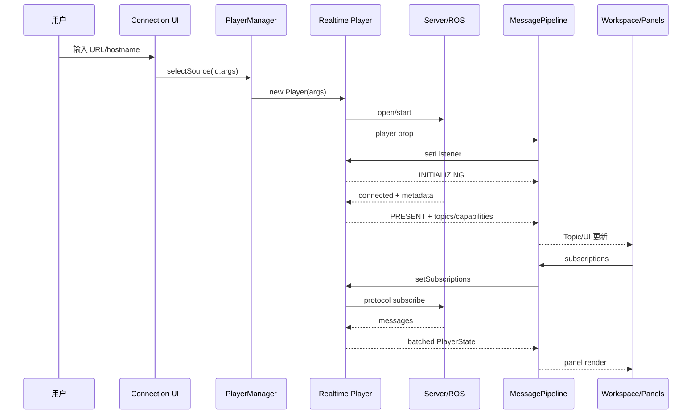
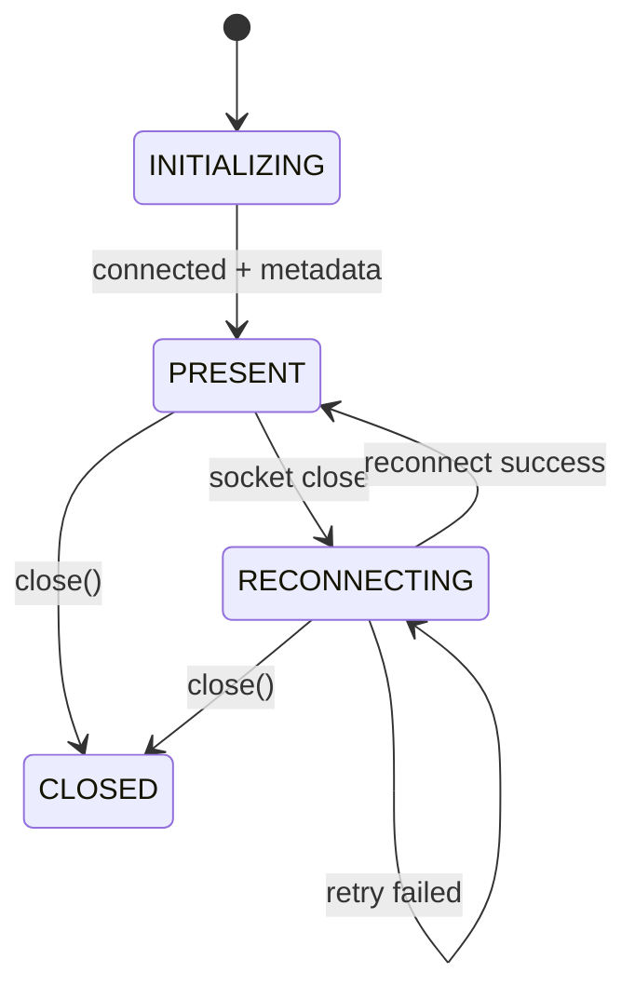

# Lichtblick 学习文档 03：实时连接 Player

> 对应母版：`docs/architecture-learning-outline.md`
>
> 本文范围：Foxglove WebSocket、Rosbridge 和原生 ROS 1 Socket 从连接到 UI。
>
> 不在本文展开：静态文件 Seek/缓存、MessagePipeline Reducer、具体协议库内部实现。

## 1. 学习目标

读完本文后，应能够解释：

1. 三种实时 DataSourceFactory 为什么返回不同 Player；
2. 实时 Player 与 IterablePlayer 的时间和状态差异；
3. Channel/Topic/Schema 如何动态进入 PlayerState；
4. UI 订阅如何变成协议级订阅；
5. Server capabilities 如何决定发布、参数、服务和资源 UI；
6. 消息为何先批量进入 parsedMessages，而不是逐条刷新 React；
7. 断线重连时保留什么、清理什么、重建什么；
8. `close()` 为什么必须阻止重连 timer 复活旧连接。

## 2. 实现矩阵

| 数据源             | Factory ID            | Player                  | 传输                 | 宿主        |
| ------------------ | --------------------- | ----------------------- | -------------------- | ----------- |
| Foxglove WebSocket | `foxglove-websocket`  | FoxgloveWebSocketPlayer | Foxglove WS protocol | Web/Desktop |
| Rosbridge          | `rosbridge-websocket` | RosbridgePlayer         | Rosbridge WS         | Web/Desktop |
| 原生 ROS 1         | `ros1-socket`         | Ros1Player              | XML-RPC + TCPROS     | Desktop     |

源码入口：

- `packages/suite-base/src/dataSources/FoxgloveWebSocketDataSourceFactory.ts`
- `packages/suite-base/src/dataSources/RosbridgeDataSourceFactory.ts`
- `packages/suite-base/src/dataSources/Ros1SocketDataSourceFactory.ts`
- `packages/suite-base/src/players/FoxgloveWebSocketPlayer/index.ts`
- `packages/suite-base/src/players/RosbridgePlayer.ts`
- `packages/suite-base/src/players/Ros1Player.ts`

## 3. 与文件 Player 的根本差异

| 静态文件                | 实时连接                         |
| ----------------------- | -------------------------------- |
| start/end 初始化时已知  | end/currentTime 持续推进         |
| 支持 Seek               | 通常不可 Seek                    |
| Topic 大体固定          | Topic/Channel 可动态增删         |
| Schema 来自文件索引     | Schema 来自协议 advertisement    |
| Player 控制数据读取速度 | 网络发布者决定输入速度           |
| BUFFERING               | INITIALIZING/RECONNECTING        |
| 完整历史 BlockLoader    | 通常只保留当前批次和面板派生状态 |

实时 Player 的主要状态机围绕“连接会话”，不是“播放位置”。

## 4. 统一连接主线



## 5. Factory 层

### 5.1 URL 验证

Foxglove 和 Rosbridge 工厂只接受 `ws:`/`wss:`，并提供不同默认端口：

- Foxglove：`ws://localhost:8765`；
- Rosbridge：`ws://localhost:9090`。

### 5.2 ROS 1 系统输入

Ros1SocketDataSourceFactory 需要：

- ROS_MASTER_URI；
- ROS_HOSTNAME。

默认值来自 OsContext。浏览器没有直接 TCP/HTTP server 能力，因此 Desktop Root 才注册
该工厂。

### 5.3 Factory 不处理重连

工厂只构造一个长生命周期 Player。连接、timer、重连和协议状态都由 Player 管理。

## 6. Foxglove WebSocket Player

### 6.1 建立连接

构造函数保存 URL、sourceId 和 metrics，然后立即 `open()`。

浏览器支持 Worker 时使用 `WorkerSocketAdapter`，否则使用 WebSocket。连接协议包含：

- 标准 Foxglove subprotocol；
- 兼容 SDK subprotocol。

连接尝试超过约 10 秒会主动关闭 Client，让 close 流程进入重连。

### 6.2 Open 事件

连接成功：

1. presence=PRESENT；
2. 清理连接失败 Alert；
3. 清空旧 Channel、Service、Publication 等协议状态；
4. 把原 resolved subscriptions 重新标记为 unresolved；
5. 重置 Profile、Topic graph、Datatype、Parameter；
6. 等待 serverInfo 和 advertisements 重建会话。

请求意图被保留，协议 ID 被清理。这是重连设计的核心。

### 6.3 serverInfo

serverInfo 提供：

- server name；
- sessionId；
- capabilities；
- supported encodings；
- metadata，例如 ROS_DISTRO；
- 是否发布 time。

Session ID 用作 playerId。若服务端会话变化，MessagePipeline 和 Workspace 可以把它视为
新的 Player 会话，清理旧面板状态。

### 6.4 动态能力

ServerCapability 映射为 Player capabilities：

| Server capability | Player/UI 能力      |
| ----------------- | ------------------- |
| clientPublish     | advertise + publish |
| services          | callService         |
| parameters        | parameter read/set  |
| assets            | fetchAsset          |
| time              | 使用服务端时间      |

PanelExtensionContext 只在 capability 存在时暴露对应函数，因此 UI 由协商结果驱动。

## 7. Channel、Schema 和消息

### 7.1 Channel advertisement

Channel 到达后 Player：

1. 读取 channel ID、Topic、encoding 和 Schema；
2. 用 `parseChannel()` 建立 deserializer；
3. 更新 Channel maps；
4. 更新 topics/datatypes；
5. 尝试处理 unresolved subscriptions；
6. emit PlayerState。

### 7.2 消息热路径

```text
binary frame
  → subscriptionId/channelId
  → ResolvedChannel
  → deserialize bytes
  → MessageEvent
  → parsedMessages queue
  → emitState
```

Player 同时更新：

- 累计接收字节；
- Topic message count；
- first/last message time；
- start/end/current time；
- 高频 Topic 告警。

### 7.3 帧大小保护

Foxglove Player 追踪 parsed message bytes。高频或大消息不能无限堆在当前 UI 批次中；
待刷新消息超过 400 MB 时会添加错误 Alert，并从队首淘汰旧消息，直到容量下降到阈值的
约 80%。这通常发生在浏览器标签页长期不活跃时。

## 8. 动态订阅

### 8.1 两级状态

Foxglove Player 保存：

```text
unresolvedSubscriptions
resolvedSubscriptionsByTopic
resolvedSubscriptionsById
```

### 8.2 Topic 尚未出现

UI 可以先请求一个服务端尚未 advertise 的 Topic：

```text
setSubscriptions(topic)
  → channelsByTopic 无记录
  → unresolved
  → 后续 channel advertisement
  → client.subscribe(channelId)
  → resolved
```

### 8.3 取消订阅

取消时：

- 协议 unsubscribe；
- 删除 Topic/ID 双向映射；
- 清除该 Topic stats；
- 短暂记录 recentlyCanceled subscription ID，抑制网络竞态产生的误警告。

### 8.4 重连

重连成功后旧 subscription ID 不可复用，但 requested Topic 仍有效。Player 把它们恢复为
unresolved，并等待新 Channel。

## 9. 实时 PlayerState

Foxglove emitState 在 Topic 尚未建立时返回：

```text
presence/capabilities/playerId/alerts
activeData=undefined
```

Topic 可用后 activeData 包含：

- 当前批次 messages；
- 累计 bytes；
- 动态 start/end/currentTime；
- 固定 isPlaying=true、speed=1；
- topics、stats、datatypes；
- parameters；
- published/subscribed graph；
- services。

`parsedMessages` 被取出后立即替换为空数组，保证同一批消息不重复发出。

## 10. 实时 UI 时间

时间来源按协议可能是：

- Foxglove time capability；
- ROS `/clock`；
- 消息/系统接收时间；
- 本地 Date.now。

即使没有新消息，Rosbridge/ROS1 也以约 100ms timer 发状态，使 currentTime 继续推进。

实时 Player 不提供用户 Seek。Rosbridge 和原生 ROS1 的 `lastSeekTime` 固定为 1；
Foxglove 则在服务端时间回退时递增该值，通知下游清理依赖时间连续性的状态。面板不应把
时间轴操作误当成离线播放。

## 11. Rosbridge Player

### 11.1 连接

使用 roslib `workersocket`。连接成功：

- presence=PRESENT；
- setup publishers；
- 请求 Topic 和 raw types。

关闭：

- presence=RECONNECTING；
- 取消 Topic subscriptions；
- 关闭 roslib/worker；
- 添加 connection-failed Alert；
- 约 3 秒后重连。

### 11.2 Topic 轮询

Rosbridge 没有与 Foxglove 完全相同的 Channel advertisement 流，因此周期请求：

- Topic；
- raw message types；
- services/graph。

请求可能静默卡住，源码设置超时 Alert，让 UI 能看见“连接存在但 Topic 元数据未返回”。

### 11.3 Schema

Player 根据 ROS1/ROS2 raw definitions 创建 message readers。订阅使用 `cbor-raw`，
回调拿到 bytes 后反序列化。

### 11.4 `/clock`

内部订阅可读取 `/clock`。首次有效 clock 设置 start，后续消息 receiveTime 使用
clockTime。这使仿真时间而非浏览器墙钟驱动面板。

### 11.5 能力

Rosbridge capabilities 固定包含 advertise 与 callServices；参数编辑明确不支持，
调用会抛错。

## 12. 原生 ROS 1 Player

### 12.1 为什么需要 Desktop

原生 ROS1 Player 需要：

- 创建 TCP client/server；
- 创建 HTTP server；
- 查询网络接口和 hostname；
- 连接 ROS Master XML-RPC；
- 直接建立 TCPROS subscriptions。

这些能力通过 electron-socket 和 OsContext 提供。

### 12.2 启动 RosNode

```text
Sockets.Create()
  → HTTP server + TCP server/client factory
  → RosNode(name,hostname,masterUri)
  → rosNode.start()
  →恢复 requested publishers
  → requestTopics()
  → presence=PRESENT
```

ROS node 名包含当前进程 PID，减少多个窗口或实例冲突。

### 12.3 Topic 和参数轮询

`requestTopics()` 周期执行：

- getPublishedTopics；
- 更新 Topic 列表；
- 重试 requested subscriptions；
- subscribeAllParams；
- 更新完整 ROS graph；
- presence=PRESENT 或连接 Alert。

失败时 presence 回到 INITIALIZING，并约 3 秒后重试。它不像 WebSocket Player 明确使用
RECONNECTING，但 UI 仍可通过 presence 和 Alert 感知连接问题。

### 12.4 TCPROS 订阅

订阅 Header 到达时解析 msgdef，并创建新的 datatypes Map 引用，使下游浅比较能发现
Schema 更新。

消息到达：

```text
TCPROS decoded message
  → MessageEvent
  → parsedMessages
  → topic stats
  → emitState
```

### 12.5 参数和发布

原生 ROS1 支持：

- setParameter；
- advertise/unadvertise；
- publish；
- 完整 publisher/subscriber/service graph。

发布前需要 message definition；缺失时产生 Alert，并提示先订阅相同 Topic 以获取类型。

## 13. 三种 Player 的能力对比

| 能力            | Foxglove   | Rosbridge | Native ROS1  |
| --------------- | ---------- | --------- | ------------ |
| Subscribe       | 是         | 是        | 是           |
| Publish         | 协商       | 是        | 是           |
| Service         | 协商       | 是        | 否           |
| Parameter read  | 协商       | 否        | 是           |
| Parameter write | 协商       | 否        | 是           |
| Asset fetch     | 协商       | 否        | 否           |
| Graph topology  | 服务端提供 | 是        | 是           |
| Server clock    | capability | `/clock`  | 内部时间处理 |
| Web             | 是         | 是        | 否           |

UI 不应按 Player class name 硬编码功能，而应读取 capabilities 或具体方法是否存在。

## 14. 发布链路

```text
Panel advertise(topic,schema)
  → MessagePipeline setPublishers
  → Player.setPublishers
  →协议 advertise
  → PlayerState publishedTopics 更新

Panel publish(message)
  → Player.publish
  → JSON/ROS1/ROS2 writer
  →协议 message
```

Foxglove 根据 negotiated encoding 选择 JSON、ROS1 或 ROS2 writer。Rosbridge 使用
roslib Topic。Native ROS1 使用 RosNode publication。

## 15. Service 链路

Foxglove：

```text
callService(name,request)
  → resolved service/schema
  → request writer
  → callId
  → send request
  → response callback Map
  → deserialize response
  → Promise resolve
```

断线或协议错误必须清理/拒绝悬挂请求，否则面板会永久等待。

Rosbridge 通过 roslib service proxy 执行类似 Promise 适配。

## 16. Parameter 链路

Foxglove：

- 周期或事件获取参数；
- 保留 parameter type；
- set 时处理 Uint8Array/byte_array；
- 先乐观更新本地 Map 并 emit；
- 服务端后续状态可校正结果。

Native ROS1 订阅参数更新并替换 Map。Rosbridge 当前不支持 setParameter。

## 17. 重连状态机



Ros1Player 失败时可能回到 INITIALIZING，而不是 RECONNECTING。

### 17.1 断线时保留

- 用户请求的 subscriptions；
- 用户请求的 publishers；
- URL state；
- 部分 Topic/时间信息，避免 UI 瞬间完全空白。

### 17.2 新会话时清理

- 协议 ID；
- Channel/Service maps；
- resolved subscriptions；
- publications；
- parameters 和 datatypes；
- 旧响应 callbacks；
- session-specific graph。

### 17.3 恢复

- 重新发现 Topic/Channel；
- 把 requested subscriptions 重新 resolve；
- 重新 advertise publishers；
- 重新加载 parameters/services；
- emit 新 PlayerState。

## 18. Close 不是 Disconnect

临时 Disconnect 会启动 retry；`close()` 表示 Player 永久失效：

- `closed=true`；
- 关闭 Client/Node；
- 清除 emit/reconnect/parameter timers；
- 后续 `open()` 立即返回；
- 不再向 listener 发状态。

切换数据源时如果只关闭 Socket 而不设置 closed，旧 timer 可能在新 Player 已出现后重新
连接并继续占用网络资源。

## 19. 消息批处理与 UI 背压

实时发布者可能远快于 React。Player 使用：

- parsedMessages queue；
- debouncePromise；
- 约 100ms 周期状态；
- 字节阈值；
- listener Promise。

```text
many network messages
  → one PlayerState batch
  → MessagePipeline subscriber buckets
  → panel render barrier
  → listener resolves
```

这既降低 React commit 次数，也使慢面板对上游形成可观察背压。

## 20. PlayerState 如何驱动 UI

| 变化                | UI                                |
| ------------------- | --------------------------------- |
| INITIALIZING        | 连接加载状态                      |
| RECONNECTING        | DataSourceSidebar/AppBar 重连提示 |
| PRESENT             | Topic 和面板正常更新              |
| capabilities        | 发布、服务、参数和 Asset UI       |
| topics/datatypes    | TopicList、MessagePath、面板设置  |
| parameters/services | 参数/服务面板                     |
| graph maps          | TopicGraph                        |
| currentTime         | 实时播放时间                      |
| playerId/sessionId  | MessagePipeline reset、面板重挂载 |
| alerts              | 连接、Schema、订阅错误提示        |

## 21. 错误分类

### 连接错误

进入 RECONNECTING/INITIALIZING，添加带 URL/ROS master 提示的 Alert，并自动重试。

### 元数据错误

Topic/Schema 请求失败时可以保持连接，但面板无法订阅；应显示 Alert 而非静默空白。

### 单消息错误

按 Topic/Channel 添加解析 Alert，其他消息继续。

### 操作错误

Publish/Service/Parameter 缺少 capability、Schema 或连接时抛错或添加操作级 Alert。

## 22. 状态引用与 UI 更新

热路径中需要注意：

- messages 每批使用新数组；
- emit 后 queue 换成空数组；
- datatypes 更新创建新 Map；
- topic stats 因内部可变，emit 时常复制 Map；
- Topic 列表排序后比较，未变化时保留引用；
- parameters/graph 变化需要新引用才能被 selector 观察。

## 23. 源码阅读顺序

### Foxglove

1. `packages/suite-base/src/dataSources/FoxgloveWebSocketDataSourceFactory.ts`
2. `packages/suite-base/src/players/FoxgloveWebSocketPlayer/index.ts`
3. `packages/suite-base/src/players/FoxgloveWebSocketPlayer/WorkerSocketAdapter.ts`
4. `packages/suite-base/src/players/FoxgloveWebSocketPlayer/helpers.ts`
5. `packages/suite-base/src/players/FoxgloveWebSocketPlayer/JsonMessageWriter.ts`

### Rosbridge

1. `packages/suite-base/src/dataSources/RosbridgeDataSourceFactory.ts`
2. `packages/suite-base/src/players/RosbridgePlayer.ts`

### Native ROS1

1. `packages/suite-base/src/dataSources/Ros1SocketDataSourceFactory.ts`
2. `packages/suite-base/src/OsContext.ts`
3. `packages/suite-base/src/players/Ros1Player.ts`
4. `packages/suite-desktop/src/renderer/index.tsx`

## 24. 观察实验

### 实验一：能力协商

连接不同 Foxglove server capabilities，观察 Panel context 方法和 UI 按钮。

### 实验二：先订阅后 Advertisement

先请求未出现 Topic，再让服务端 advertise，确认 unresolved → resolved。

### 实验三：重连

停止服务器后恢复，记录：

- presence；
- alerts；
- playerId；
- subscriptions；
- publications；
- Topic/UI。

### 实验四：Session 变化

服务端使用新 sessionId，确认旧面板状态被清理。

### 实验五：高频消息

发布高频大消息，观察批处理、帧大小、Alert 和 UI 响应。

### 实验六：Clock

Rosbridge 发布 `/clock`，比较 currentTime 与浏览器墙钟。

### 实验七：Close

关闭 Player 后等待超过重连间隔，确认没有新连接。

## 25. 对应测试

- `packages/suite-base/src/players/FoxgloveWebSocketPlayer/worker.test.ts`
- `packages/suite-base/src/players/FoxgloveWebSocketPlayer/WorkerSocketAdapter.test.ts`
- `packages/suite-base/src/players/FoxgloveWebSocketPlayer/helpers.test.ts`
- `packages/suite-base/src/players/FoxgloveWebSocketPlayer/JsonMessageWriter.test.ts`
- `packages/suite-base/src/players/RosbridgePlayer.test.ts`
- `packages/suite-base/src/dataSources/RemoteDataSourceFactory.test.tsx`
- `packages/suite-base/src/components/DataSourceSidebar/`

Ros1Player 的系统网络行为还需要 Desktop E2E 或可控 ROS 环境验证。

## 26. 自测问题

1. 为什么实时 Player 通常没有 Seek？
2. Foxglove requested subscription 与 resolved subscription 有何区别？
3. Session ID 为什么适合作为 playerId？
4. 为什么断线时保留请求意图、清理协议 ID？
5. Server capabilities 如何改变 UI？
6. Rosbridge 为什么需要周期请求 Topic？
7. `/clock` 如何改变 receiveTime？
8. 原生 ROS1 为什么只在 Desktop 注册？
9. parsedMessages queue 如何保护 React？
10. 哪些 Map 更新时必须替换引用？
11. Disconnect 与 close 的语义差异是什么？
12. 如何证明 close 后不会重连？

## 27. 结论

实时数据流是一个持续能力协商和会话恢复闭环：

```text
连接建立
  →发现动态能力和 Schema
  →根据 UI 请求建立协议订阅
  →批量规范化 MessageEvent
  → PlayerState 驱动 UI
  →断线保留请求意图
  →新会话重建协议状态
```

理解实时 Player 时，重点不是逐个协议事件，而是区分“用户意图状态”和“当前连接会话
状态”。前者跨重连保留，后者必须在新会话中重新建立。
