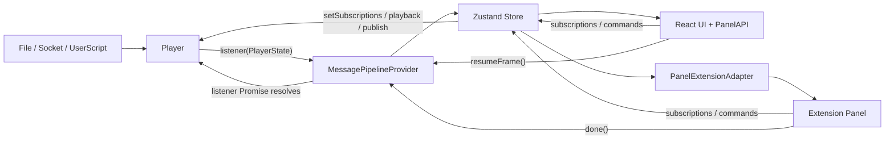
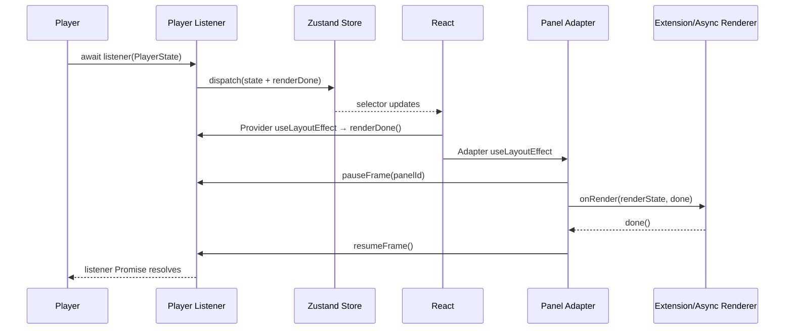

# Lichtblick 学习文档 04：MessagePipeline 与帧背压

> 对应母版：`docs/architecture-learning-outline.md`
>
> 本文范围：PlayerState 如何进入 Zustand store、订阅如何反向汇总到 Player、消息如何按
> subscriber 分发，以及 React 和扩展面板如何通过帧完成回执约束 Player。
>
> 不在本文展开：各文件格式的解析与缓存、实时协议重连、Layout 持久化和具体面板绘制算法。

## 1. 学习目标

读完本文后，应能够解释：

1. 为什么 Player listener 返回 `Promise<void>`；
2. MessagePipeline 的内部状态与公开状态为何分离；
3. 多个面板的订阅如何合并为 Player 订阅；
4. 一帧消息如何只进入真正订阅它的面板；
5. 新订阅者为什么能立即获得 Topic 的最后一条消息；
6. Zustand selector 如何控制 React 更新粒度；
7. React commit、`pauseFrame()`、扩展 `done()` 如何组成帧屏障；
8. `lastSeekTime`、`playerId` 和 Player 实例变化分别清理什么；
9. 慢面板、错误面板和不遵守 listener 契约的 Player 会造成什么后果；
10. 应使用哪些测试和观察实验验证上述结论。

## 2. 系统边界

MessagePipeline 位于 Player 与 UI 之间：



它不是消息解析器，也不是长期消息数据库。它承担四项职责：

- 把命令式 Player listener 转为可选择订阅的 UI store；
- 汇总 UI 的反向订阅和控制命令；
- 把当前帧按 subscriber 隔离；
- 等待 UI 完成本帧工作后再允许 Player 推进。

## 3. 关键源码

核心实现：

- `packages/suite-base/src/players/types.ts`
- `packages/suite-base/src/components/MessagePipeline/index.tsx`
- `packages/suite-base/src/components/MessagePipeline/store.ts`
- `packages/suite-base/src/components/MessagePipeline/types.ts`
- `packages/suite-base/src/components/MessagePipeline/subscriptions.ts`
- `packages/suite-base/src/components/MessagePipeline/pauseFrameForPromise.ts`
- `packages/suite-base/src/components/MessagePipeline/MessageOrderTracker.ts`

主要消费者：

- `packages/suite-base/src/PanelAPI/useMessageReducer.ts`
- `packages/suite-base/src/PanelAPI/useBlocksSubscriptions.ts`
- `packages/suite-base/src/PanelAPI/useDataSourceInfo.ts`
- `packages/suite-base/src/components/PanelExtensionAdapter/PanelExtensionAdapter.tsx`
- `packages/suite-base/src/components/PanelExtensionAdapter/renderState.ts`
- `packages/suite-base/src/components/TimeBasedChart/index.tsx`

## 4. Player listener 是背压契约

`Player.setListener()` 接收：

```ts
(playerState: PlayerState) => Promise<void>;
```

语义不是“状态已写入 store”，而是“UI 已完成本帧必须等待的工作”。Player 应等待 Promise
结束，再产生下一帧。

```text
Player 产生 PlayerState N
  → await listener(PlayerState N)
  → UI 提交并完成受保护的异步绘制
  → listener Promise resolve
  → Player 才产生 PlayerState N+1
```

这是合作式协议：

- MessagePipeline 提供 Promise；
- UI 注册需要等待的任务；
- Player 负责 `await`；
- 任一方不遵守协议，背压就不完整。

MessagePipeline 会直接拒绝同一 listener 尚未完成时的新 PlayerState：

```text
resolveFn 已存在
  + Player 再次 emit
  → throw "New playerState was emitted before last playerState was rendered."
```

这个错误通常说明 Player 没有等待 listener Promise，而不是 Zustand 更新太慢。

## 5. Store 的两层状态

`MessagePipelineInternalState` 同时保存内部协调状态和 `public` 状态。

### 5.1 内部状态

| 字段                      | 作用                                             |
| ------------------------- | ------------------------------------------------ |
| `player`                  | 当前命令代理目标                                 |
| `subscriptionsById`       | 每个 subscriber 的原始订阅                       |
| `subscriberIdsByTopic`    | Topic 到 subscriber ID 的反向索引                |
| `lastMessageEventByTopic` | 新订阅者即时补发用的最后消息                     |
| `publishersById`          | 每个面板注册的 Publisher                         |
| `allPublishers`           | 下发给 Player 的扁平 Publisher 列表              |
| `subscriptionMemoizer`    | 预留的深度相等订阅 memoizer，当前 reducer 未使用 |
| `lastCapabilities`        | 判断是否需要重新绑定 Player 控制方法             |
| `renderDone`              | React commit 后启动帧完成阶段的回调              |
| `dispatch` / `reset`      | Reducer 入口和会话内重置入口                     |

### 5.2 公开状态

`MessagePipelineContext` 暴露：

- `playerState`；
- 排序后的 Topic 和 Service；
- datatypes；
- 合并后的 subscriptions；
- `messageEventsBySubscriberId`；
- 播放、发布、参数、服务和资源命令；
- `pauseFrame()`；
- batch iterator。

消费者不应直接访问内部 maps。UI 通过
`useMessagePipeline(selector)` 或 `useMessagePipelineGetter()` 使用公开层。

## 6. Provider 生命周期

### 6.1 Player 实例变化

`MessagePipelineProvider` 以 `player` 为 `useMemo` 依赖创建 store：

```text
player 引用变化
  → 创建全新 Zustand store
  → 旧 Provider effect cleanup
  → cleanupListener()
  → oldPlayer.close()
  → 新 Player setListener()
```

它不尝试把旧订阅迁移到新 store。Workspace 会在 Player 切换时重挂载面板，面板随后重新
注册 subscription 和 publisher。

这样可避免旧 Player 的：

- 消息数组；
- Topic/Schema；
- Publisher；
- 控制函数绑定；
- 帧等待 Promise；
- 闭包引用

泄漏到新会话。

### 6.2 同一 Player 内的 playerId 变化

实时协议可能保留 Player 对象，但改变 `PlayerState.playerId`。listener 检测到变化后：

1. 清除 session alerts；
2. 调用 store `reset()`；
3. 再 dispatch 新 PlayerState。

`reset()` 清空订阅、publisher、最后消息、Topic、Service、datatype 和控制函数。它是
协议会话变化的失效边界。

### 6.3 没有 Player

Provider dispatch `defaultPlayerState()`：

- `presence=NOT_PRESENT`；
- capabilities 为空；
- `activeData=undefined`；
- 播放控制函数不可用。

若存在尚在构造中的 Player，初始 presence 则为 `INITIALIZING`，避免 UI 在
NOT_PRESENT 与初始化状态间闪烁。

## 7. 反向订阅流

完整链路：

```text
Panel / Hook 声明 Topic
  → setSubscriptions(subscriberId, payloads)
  → update-subscriber action
  → subscriptionsById
  → subscriberIdsByTopic
  → mergeSubscriptions()
  → public.subscriptions
  → 0ms debounce
  → Player.setSubscriptions()
  → Source 调整读取、解码或网络订阅
```

### 7.1 subscriberId 的意义

订阅不是只有全局 Topic Set。每个消费者使用独立 ID：

- 扩展面板使用生成的 `panelId`；
- PanelAPI hook 创建自己的 ID；
- Plot 等特殊消费者可使用专用 ID。

这使 `/camera` 的消息只进入订阅 `/camera` 的面板数组，而不是迫使全部面板过滤全局消息。

### 7.2 订阅卸载

空 payload 表示删除该 ID：

```ts
setSubscriptions(id, []);
```

面板和 hook 的 cleanup 必须调用它。否则 Player 会继续读取无人使用的 Topic，并可能保留
最后消息。

### 7.3 同一面板重复订阅

`subscriberIdsByTopic` 的值是数组，但添加 ID 前执行 `includes()`。同一 ID 即使对同一
Topic 提交多个 payload，一条输入消息也只会进入该 subscriber 一次。

使用数组而非 Set 是热路径权衡：建立反向索引不频繁，而逐消息遍历 subscriber ID 很频繁。

## 8. 订阅合并规则

`mergeSubscriptions()` 按 Topic 和 `preloadType` 合并。

### 8.1 partial 与 full

- `partial`：只需要当前播放流；
- `full`：需要完整历史块；
- 一个 full 订阅还会派生一个 partial 订阅，确保面板同时收到当前帧。

### 8.2 字段切片

同一 Topic 的多个字段订阅取并集：

```text
Panel A: fields=["pose.position"]
Panel B: fields=["pose.orientation"]
  → Player: fields=["pose.position", "pose.orientation"]
```

任一消费者请求全部字段时，合并结果的 `fields` 为 `undefined`，表示不能只读取切片。

全是空字段数组的订阅组会被过滤，避免产生没有实际字段的读取。

### 8.3 采样

`latest-per-render-tick` 不是任意面板都能开启：

- full preload 永不采样；
- 原生消息路径默认不授权采样；
- 转换器必须声明支持该模式；
- 合并的订阅必须使用相同 sampling mode；
- 至少一个内部订阅必须带有授权标志；
- 不兼容的采样请求会退化为不采样。

规则倾向完整性：只要无法证明丢弃中间消息安全，就向 Player 请求全部消息。

### 8.4 引用与合批

store 会创建 `makeSubscriptionMemoizer()`，但当前 `updateSubscriberAction()` 直接调用
`mergeSubscriptions()`，没有使用该 memoizer。阅读时不能仅根据字段注释推断订阅结果一定
保持引用。

实际代码依靠面板侧 memo 减少无意义注册，并由 Provider 使用零延迟 debounce 将同一事件
循环内的多个更新合批。

零延迟不是限速器，而是“一轮注册只通知 Player 一次”的批处理边界。

## 9. 新订阅者的最后消息

Pipeline 保存每个仍被订阅 Topic 的 `lastMessageEventByTopic`。

若 subscriber 新增 Topic：

```text
新增 /pose
  → 查询 lastMessageEventByTopic["/pose"]
  → 若存在，只为该 subscriber 创建消息数组
  → 该面板立即获得最近状态
```

这对暂停状态和低频 Topic 很重要。面板不必等待下一条网络消息才能显示当前值。

当某 Topic 已无任何 subscriber 时，最后消息会被删除。否则下面的序列会产生陈旧状态：

```text
取消订阅
  → Player 时间继续推进
  → 再订阅
  → 错误地注入取消订阅前的旧消息
```

Player 自身的 Seek backfill 仍是权威补帧来源；Pipeline 缓存只是会话内的快速路径。

## 10. PlayerState 正向流

listener 的处理顺序：

```text
PlayerState
  → 检查上一帧是否完成
  → MessageOrderTracker
  → 合并顺序 Alert
  → 建立本帧 Promise 与 renderDone
  → 必要时按 playerId reset
  → dispatch(update-player-state)
  → 等待 Promise
```

Reducer 负责：

1. 保存完整 `playerState`；
2. 将 `activeData.messages` 按 subscriber 分桶；
3. 更新最后消息；
4. 按需重建 sortedTopics；
5. 按需重建 sortedServices；
6. 按需替换 datatypes；
7. 根据 capabilities 绑定控制函数；
8. 保存本帧 `renderDone`。

## 11. 消息按 subscriber 分桶

输入：

```text
messages = [/pose#1, /camera#1, /pose#2]
subscriberIdsByTopic:
  /pose   → [PanelA, PanelB]
  /camera → [PanelB]
```

输出：

```text
messageEventsBySubscriberId:
  PanelA → [/pose#1, /pose#2]
  PanelB → [/pose#1, /camera#1, /pose#2]
```

每个 PlayerState 都创建新的 Map，并为收到消息的 subscriber 创建新数组。下游通过引用
变化判断是否有新帧。

如果消息数组与上一 PlayerState 的 `activeData.messages` 是同一引用，Reducer 不重复处理。
这是 Player 只更新时间或 presence 时的重要快速路径。

当前帧 Map 不承担历史累计。下一 PlayerState 会替换它，长期历史由 BlockLoader 或面板
自己的 reducer 管理。

## 12. Topic、Service 与 datatype 的引用策略

Reducer 只有在源引用变化时才重建派生值：

| PlayerState 字段 | 派生状态         | 更新条件          |
| ---------------- | ---------------- | ----------------- |
| `topics`         | `sortedTopics`   | topics 引用变化   |
| `services`       | `sortedServices` | services 引用变化 |
| `datatypes`      | `datatypes`      | Map 引用变化      |

因此 Player 修改 Topic、Service 或 Schema 时必须提供新容器引用。原地修改旧 Map/数组会让
Pipeline 和 selector 无法可靠感知变化。

## 13. capability 如何驱动命令 UI

capabilities 变化时，Reducer绑定或清除：

- `startPlayback`；
- `pausePlayback`；
- `playUntil`；
- `seekPlayback`；
- `setPlaybackSpeed`。

例如：

```text
capabilities 包含 playbackControl
  → public.seekPlayback = player.seekPlayback.bind(player)
  → Playback UI 可获得 seek 函数

capability 消失
  → public.seekPlayback = undefined
  → UI 隐藏或禁用相应入口
```

发布、服务和参数命令也从 context 代理到当前 Player；扩展适配器会再根据 capability 决定
是否向面板暴露 `advertise`、`publish` 或 `callService`。

## 14. Zustand selector 如何驱动 React

`useMessagePipeline(selector)` 最终调用 Zustand `useStore`。组件只订阅 selector 的结果。

典型粒度：

```text
PlaybackTimeDisplay → currentTime / startTime / endTime / isPlaying
Scrubber            → currentTime / ranges / presence
DataSourceInfo      → topics / times / playerName
Parameters          → capabilities / parameters / setParameter
TopicGraph          → graph maps / services
```

选择原始值或稳定引用时，无关字段变化不会使组件更新。

### 14.1 稳定组合对象

`useDataSourceInfo()` 分别选择低频字段，再用 `useMemo` 组合结果。不要写一个每次返回新对象
的 selector：

```ts
// 容易造成每次 store 更新都得到新引用
useMessagePipeline((state) => ({
  topics: state.sortedTopics,
  services: state.sortedServices,
}));
```

### 14.2 getter 与 subscribe

- `useMessagePipelineGetter()` 返回读取最新 context 的稳定函数，适合事件回调；
- `useMessagePipelineSubscribe()` 提供命令式订阅；
- 两者都不替代 React selector，使用者必须自行处理生命周期。

## 15. 内建 React 面板如何消费消息

`useMessageReducer()` 同时处理订阅和增量归约：

```text
topics
  → setSubscriptions(hookId, payloads)
  → 按 hookId 获取 messageEvents
  → addMessage / addMessages
  → 返回 reducedValue
```

它在下列情况调用 `restore()`：

- 第一次运行；
- `lastSeekTime` 变化；
- restore/addMessage/addMessages 函数引用变化。

如果本帧没有新消息，返回旧 `reducedValue` 引用，避免无意义 React render。

这说明 `lastSeekTime` 不是普通时间显示字段，而是面板累计状态的失效令牌。

## 16. 扩展面板的 RenderState

`PanelExtensionAdapter` 把内部 React/Zustand 数据翻译成扩展 API：

```text
MessagePipeline + Contexts
  → buildRenderState()
  → PanelExtensionContext.onRender(renderState, done)
```

输入包含：

- 当前 subscriber 的消息；
- PlayerState；
- Topic、Service 和 datatype；
- 全局变量；
- app settings 与 color scheme；
- hover/preview time；
- shared panel state；
- message converters；
- 本地订阅和面板配置。

### 16.1 watch 控制更新面

扩展调用：

```ts
context.watch("currentFrame");
context.watch("currentTime");
```

`buildRenderState()` 只比较 watched fields。没有字段变化时返回 `undefined`，适配器不会调用
`onRender`。

这比把完整 PlayerState 推给每个扩展更细：

- 只看 Topic 的面板不必跟随 currentTime 刷新；
- 只看当前时间的面板不必处理消息数组；
- 不使用 allFrames 的面板不必遍历 BlockLoader 缓存。

### 16.2 currentFrame

新消息数组到达时，builder：

1. 保留面板订阅的未转换消息；
2. 按 Schema 查找 converters；
3. 执行需要的转换；
4. 保存每 Topic 最后消息；
5. 产生本面板的 `currentFrame`。

converter 或全局变量变化时，即使没有新消息，也可对最后消息重新转换。

### 16.3 allFrames

扩展 watch `allFrames` 且订阅 `preload=true` 时，builder 读取
`playerState.progress.messageCache.blocks`：

- 只选本面板需要 preload 的 Topic；
- 跨 Topic 按 receiveTime 合并；
- 应用消息转换；
- 生成完整历史数组。

`allFrames` 的成本远高于 currentFrame，不应作为默认订阅方式。

## 17. 帧背压时间线

一帧的严格顺序如下：



### 17.1 React commit 回执

Provider 订阅 store 中的 `renderDone`。React commit 后，`useLayoutEffect` 调用它。

`renderDone()` 不立即 resolve listener。它计算当前消息频率对应的一帧预算，并用 timer
等待剩余时间，让子面板的 layout effect 有机会调用 `pauseFrame()`。

### 17.2 message rate

应用设置 `AppSetting.MESSAGE_RATE` 支持 1、3、5、10、15、20、30、60 Hz。Provider 计算：

```text
msPerFrame = 1000 / messageRate
remaining = max(0, msPerFrame - React 提交已耗时)
```

它限制 Pipeline 向 UI 提交状态的目标频率，不改变日志时间，也不是 Player playback speed。

### 17.3 pauseFrame

`pauseFrame(name)`：

1. 创建 Condvar；
2. 把 `{name, promise}` 放入本帧等待数组；
3. 返回 `resumeFrame()`；
4. resume 时通知 Condvar。

timer 到期后，listener 取走当前等待数组并清空引用，然后 `Promise.all()` 等待全部任务。

多个面板暂停同一帧时，必须全部 resume。

### 17.4 5 秒保险

`pauseFrameForPromises()` 的最长等待时间为 5000ms。超时后 listener 继续，避免一个坏面板
永久冻结播放。

这个机制只保证活性：

- 不保证超时面板已完成；
- 不回滚面板绘制；
- 后续 UI 可能短暂显示不同帧数据；
- 超时不是正常流控手段。

## 18. 扩展面板的 done 契约

适配器调用：

```ts
onRender(renderState, done);
```

在调用前：

- `pauseFrame(panelId)`；
- `renderingRef.current=true`；
- 清除旧错误和 slow 状态。

面板调用 `done()` 后：

- 重复调用会被忽略并记录 warning；
- resume 本帧；
- `renderingRef.current=false`。

扩展必须保证所有路径最终调用 done，包括：

- 正常绘制；
- 没有数据；
- WebGL/Canvas 异步完成；
- 内部错误的 finally；
- 组件准备卸载。

同步抛错会进入 React 错误处理，但已注册的 pause 只能依靠超时释放，因此扩展应优先在
自身 `try/finally` 中完成回执。

## 19. slow render 的真实含义

若适配器仍处于 `renderingRef.current=true`，又出现需要调用 `onRender` 的输入变化：

```text
上一轮 onRender 未 done
  + 新 render-relevant state
  → slowRender=true
  → 不启动重叠 onRender
  → 面板容器显示橙色内描边
```

新输入不一定是下一 PlayerState，也可能是：

- theme；
- hover；
- global variables；
- shared state；
- subscription/converter 变化。

如果 Player 正确等待 listener Promise，单纯的 Player 消息帧不会无限越过未完成屏障。

## 20. TimeBasedChart 的异步绘制

TimeBasedChart 在 Worker/OffscreenCanvas 绘制开始时调用 `pauseFrame("TimeBasedChart")`，
绘制结束后再通过 `requestAnimationFrame` resume。

这多等一个浏览器绘制机会，使“Worker 已计算完成”和“Canvas 已呈现在屏幕”尽量对齐。

cleanup 会释放：

- 当前 resume；
- 等待 requestAnimationFrame 的 resume；
- animation frame request。

异步渲染组件如果只在成功回调 resume，而卸载时不处理，会让整个布局最多停顿 5 秒。

## 21. 消息顺序监控

listener 在 dispatch 前调用 `MessageOrderTracker.update()`。

它检查：

- 消息 receiveTime 是否倒退；
- 消息时间与 currentTime 是否漂移超过 1 秒；
- `lastSeekTime` 变化后是否应重置顺序基线。

消息倒退会添加 Player Alert。显著时间漂移会延迟约 1 秒记录 warning，给 Player 更新
`lastSeekTime` 的机会。

为避免 DevTools console 长期持有大消息对象，生产路径默认不保存或打印错误消息内容。

## 22. 全局变量为何绕过 Provider render

Provider 直接监听 CurrentLayoutContext 的布局状态：

```text
Layout globalVariables 引用变化
  → player.setGlobalVariables()
```

它不把全局变量先放进 MessagePipeline 的 React state，避免 Provider 和全部 children
因布局变量变化而重渲染。

扩展面板仍通过自己的 GlobalVariables hook 和 watched RenderState 感知变量；UserScriptPlayer
则从 Player 命令路径收到变量并重新计算脚本。

## 23. Alert 与错误边界

| 情况                           | 处理方式                                |
| ------------------------------ | --------------------------------------- |
| 消息 receiveTime 倒退          | 添加 Player warning Alert               |
| Player 在上一帧完成前再次 emit | listener 抛错                           |
| 扩展 onRender 同步抛错         | Adapter 设置 error，交给 React 错误边界 |
| pauseFrame 超过 5 秒           | 解除等待，继续 Pipeline                 |
| converter 报错                 | 转为带 converter 标识的 session Alert   |
| Player 或 playerId 变化        | 清除 session alerts                     |
| 没有 Player 时 callService     | 抛出明确错误                            |
| 没有 Player 时 publish         | 安全 no-op                              |

错误不能只停留在 console。与数据质量相关且用户可处理的问题应进入 Alert；违反内部异步契约的
问题则应尽早抛错。

## 24. 内存与引用不变量

### 24.1 当前帧

`messageEventsBySubscriberId` 只保存当前 PlayerState 的分桶数组。新状态替换旧 Map 后，只要
面板没有额外持有，旧数组即可回收。

### 24.2 最后消息

消息热路径会为 Player 实际发出的每个 Topic 保存一条最后消息。正常情况下 Player 只发送
已请求 Topic；最后 subscriber 离开时，订阅更新逻辑会删除对应记录。

### 24.3 store 更换

Player 引用变化时创建新 store，避免旧 store 的函数继续绑定旧 Player。

### 24.4 listener 闭包

`createPlayerListener()` 被提取为模块级函数。原因是 V8 可能让同一外层作用域的闭包共享
context，进而意外保留旧 PlayerState 和预加载 blocks。

这不是代码风格偏好，而是针对切换数据源后历史缓存无法回收的内存边界。

## 25. 常见误解

### 25.1 “Zustand 保存所有消息”

不正确。Pipeline store 保存当前帧分桶、每 Topic 最后一条消息和 Player 提供的 progress
引用。全历史主要属于 Player BlockLoader 或面板自身状态。

### 25.2 “订阅只是 UI 过滤”

不正确。合并订阅会下发 Player，直接决定文件读取、网络订阅、字段解码和预加载。

### 25.3 “React render 完成就能播放下一帧”

不完整。React commit 后还要等待在该帧注册的 pauseFrame 任务，例如扩展 Canvas 或
TimeBasedChart Worker。

### 25.4 “5 秒超时说明绘制成功”

不正确。它只避免永久死锁。

### 25.5 “playerId 变化等于 Player 对象变化”

不正确。Player 对象变化会创建新 store 并关闭旧 Player；同一 Player 内 playerId 变化
调用 store reset，用于协议会话重建。

### 25.6 “message rate 就是播放倍速”

不正确。message rate 控制 UI 帧节奏；playback speed 控制日志时间推进速度。

## 26. 推荐源码阅读顺序

第一轮：理解接口。

1. `packages/suite-base/src/players/types.ts`
2. `packages/suite-base/src/components/MessagePipeline/types.ts`
3. `packages/suite-base/src/components/MessagePipeline/store.ts`

第二轮：理解 Provider 和帧屏障。

1. `packages/suite-base/src/components/MessagePipeline/index.tsx`
2. `packages/suite-base/src/components/MessagePipeline/pauseFrameForPromise.ts`
3. `packages/suite-base/src/components/MessagePipeline/MessageOrderTracker.ts`

第三轮：理解反向订阅。

1. `packages/suite-base/src/components/MessagePipeline/subscriptions.ts`
2. `packages/suite-base/src/PanelAPI/useMessageReducer.ts`
3. `packages/suite-base/src/PanelAPI/useBlocksSubscriptions.ts`

第四轮：理解扩展 UI。

1. `packages/suite-base/src/components/PanelExtensionAdapter/PanelExtensionAdapter.tsx`
2. `packages/suite-base/src/components/PanelExtensionAdapter/renderState.ts`
3. `packages/suite-base/src/components/PanelExtensionAdapter/messageProcessing.ts`
4. `packages/suite-base/src/components/TimeBasedChart/index.tsx`

## 27. 可执行观察实验

### 实验一：subscriber 隔离

1. 打开包含两个 Topic 的数据源；
2. 建立两个只订阅不同 Topic 的面板；
3. 在 `updatePlayerStateAction()` 检查 `messagesBySubscriberId`；
4. 验证每个 ID 只获得自己的 Topic。

预期：全局 PlayerState 可包含两个 Topic，但面板数组彼此隔离。

### 实验二：订阅合批

1. 在同一 React commit 中挂载多个面板；
2. 观察 `setSubscriptions()` 调用；
3. 在 Provider debounce 回调和 Player 入口打断点。

预期：store 可收到多次更新，Player 在下一 timer cycle 获得一次合并结果。

### 实验三：最后消息补发

1. 播放到 `/pose` 已产生消息；
2. 暂停；
3. 新增订阅 `/pose` 的面板；
4. 检查该 subscriber 的消息数组。

预期：无需继续播放即可获得最后消息。

### 实验四：帧屏障

1. 在扩展 `onRender` 中延迟 500ms 调用 done；
2. 记录 listener 开始和结束；
3. 观察 Player 下一次 emit。

预期：listener 和遵守契约的 Player 等待约 500ms。

### 实验五：忘记 done

1. 构造不调用 done 的测试扩展；
2. 观察 Pipeline；
3. 等待超过 `MAX_PROMISE_TIMEOUT_TIME_MS`。

预期：本帧等待约 5 秒后解除；这只是故障保护。

### 实验六：Seek 失效

1. 使用 `useMessageReducer()` 累计消息；
2. 执行 Seek；
3. 比较 `lastSeekTime`；
4. 检查 restore 是否重新执行。

预期：Seek 后旧累计状态被重建，不能与新时间段混合。

### 实验七：selector 粒度

1. 给只选择 `presence` 的组件增加 render 计数；
2. 连续推进 currentTime；
3. 保持 presence 不变。

预期：稳定 selector 不因 currentTime 单独变化而刷新。

## 28. 对应测试

MessagePipeline：

- `packages/suite-base/src/components/MessagePipeline/index.test.tsx`
- `packages/suite-base/src/components/MessagePipeline/subscriptions.test.ts`
- `packages/suite-base/src/components/MessagePipeline/selectors.test.ts`
- `packages/suite-base/src/components/MessagePipeline/MessageOrderTracker.test.ts`

重点用例：

- PlayerState 更新与排序后的 Topic；
- 上一帧未完成时拒绝下一帧；
- 新订阅者获得最后消息；
- 取消后重订阅不注入陈旧消息；
- Player/playerId 变化后清理状态和 Alert；
- capability 控制代理方法；
- 多个 pauseFrame 必须全部完成；
- 5 秒超时后继续；
- 新旧 Player 的 resume 不互相释放。

PanelExtensionAdapter：

- `packages/suite-base/src/components/PanelExtensionAdapter/PanelExtensionAdapter.test.tsx`
- `packages/suite-base/src/components/PanelExtensionAdapter/renderState.test.ts`
- `packages/suite-base/src/components/PanelExtensionAdapter/messageProcessing.test.ts`

PanelAPI：

- `packages/suite-base/src/PanelAPI/useMessageReducer.test.tsx`
- `packages/suite-base/src/PanelAPI/useBlocksSubscriptions.test.tsx`
- `packages/suite-base/src/PanelAPI/useMessagesByTopic.test.tsx`

建议运行：

```sh
yarn test packages/suite-base/src/components/MessagePipeline/index.test.tsx
yarn test packages/suite-base/src/components/MessagePipeline/subscriptions.test.ts
yarn test packages/suite-base/src/components/PanelExtensionAdapter/PanelExtensionAdapter.test.tsx
yarn test packages/suite-base/src/components/PanelExtensionAdapter/renderState.test.ts
```

## 29. 自测问题

1. 为什么 Player listener 必须返回 Promise？
2. 哪一方负责真正等待 listener？
3. `subscriptionsById` 与 `subscriberIdsByTopic` 分别优化什么方向？
4. full 订阅为什么还要派生 partial 订阅？
5. 任一面板请求全部字段时，字段合并结果是什么？
6. 采样为什么需要内部授权？
7. 新订阅者如何获得最后消息？
8. Topic 无 subscriber 后为何删除最后消息？
9. 为什么每帧创建新的 subscriber 消息数组？
10. Topic Map 原地修改会产生什么问题？
11. React commit 与扩展 done 分别确认了什么？
12. 多个 pauseFrame 中只有一个 resume 会发生什么？
13. 5 秒超时能保证什么，不能保证什么？
14. slow render 是否一定表示 Player 连续发了两帧？
15. `lastSeekTime` 如何驱动面板 reducer 重置？
16. Player 引用变化和 playerId 变化的清理范围有何差异？
17. 为什么 createPlayerListener 放在模块级？
18. message rate 与 playback speed 有何区别？

## 30. 本篇结论

MessagePipeline 是一个带反向控制和完成回执的帧交换层：

```text
Panel 声明需求
  → 按 subscriber 聚合订阅
  → Player/Source 只生产所需数据
  → PlayerState 按 subscriber 分桶
  → selector/watch 只更新相关 UI
  → React commit 与异步面板完成回执
  → listener Promise resolve
  → Player 推进下一帧
```

理解它的关键不是记住某个 hook，而是保持三个不变量：

1. 数据生产量由 UI 订阅反向决定；
2. UI 更新量由 subscriber 分桶、selector 和 watch 共同决定；
3. 下一帧何时到来由 Player 是否遵守 listener Promise，以及本帧 pauseFrame 是否全部释放
   共同决定。
