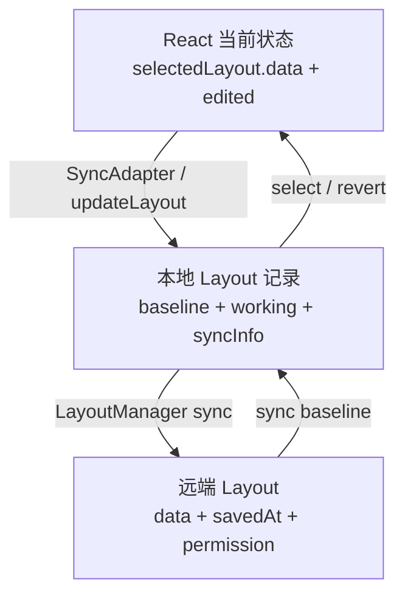
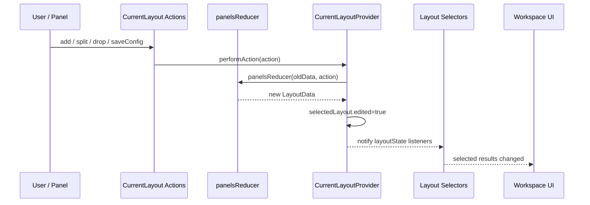

# Lichtblick 学习文档 05：Layout 状态机与同步

> 对应母版：`docs/architecture-learning-outline.md`
>
> 本文范围：布局选择、编辑、即时 UI 更新、本地 baseline/working 保存、远端同步，以及布局
> 数据如何驱动面板树、配置、变量、脚本和播放偏好。
>
> 不在本文展开：PanelExtensionContext 的完整生命周期、扩展注册机制和 Electron IPC。

## 1. 学习目标

读完本文后，应能够解释：

1. `LayoutData`、`LayoutState` 和持久化 `Layout` 的区别；
2. 为什么 CurrentLayoutContext 不直接传播整个 React state；
3. 一次 add/split/drop/saveConfig 如何经过 reducer 驱动 UI；
4. `layout` 与 `configById` 为什么必须一起维护；
5. 布局加载时 URL、App Parameter、UserProfile 和默认布局的优先级；
6. `edited`、`working`、`baseline` 和 `syncInfo` 分别表示什么；
7. 默认 SyncAdapter 与可注入 SyncAdapter 的差异；
8. 显式保存和 revert 如何更新当前 UI；
9. 远端同步如何保留本地未提交修改；
10. 布局变化如何跨域影响 Player、UserScript 和 Playback UI。

## 2. 三层状态模型

布局系统不能简化成一个 JSON 对象：



三层目标不同：

| 层级     | 目标               | 允许的状态                         |
| -------- | ------------------ | ---------------------------------- |
| React    | 立即响应用户操作   | loading、edited、临时 shared state |
| 本地存储 | 离线可用和修改追踪 | baseline、working、syncInfo        |
| 远端存储 | 跨设备和组织共享   | 已确认 data、权限、保存时间        |

不能用 `edited=false` 推断远端已同步，也不能用 `working=undefined` 推断当前 React 没有加载中。

## 3. 关键源码

当前状态：

- `packages/suite-base/src/context/CurrentLayoutContext/index.ts`
- `packages/suite-base/src/context/CurrentLayoutContext/actions.ts`
- `packages/suite-base/src/providers/CurrentLayoutProvider/index.tsx`
- `packages/suite-base/src/providers/CurrentLayoutProvider/reducers.ts`
- `packages/suite-base/src/providers/CurrentLayoutProvider/constants.ts`

UI 与保存：

- `packages/suite-base/src/components/PanelLayout.tsx`
- `packages/suite-base/src/components/SyncAdapters.tsx`
- `packages/suite-base/src/components/CurrentLayoutLocalStorageSyncAdapter.tsx`
- `packages/suite-base/src/components/CurrentLayoutSyncAdapter.tsx`
- `packages/suite-base/src/components/LayoutBrowser/`

持久化与远端：

- `packages/suite-base/src/services/ILayoutManager.ts`
- `packages/suite-base/src/services/ILayoutStorage.ts`
- `packages/suite-base/src/services/IRemoteLayoutStorage.ts`
- `packages/suite-base/src/services/LayoutManager/LayoutManager.ts`
- `packages/suite-base/src/services/LayoutManager/WriteThroughLayoutCache.ts`
- `packages/suite-base/src/services/LayoutManager/NamespacedLayoutStorage.ts`
- `packages/suite-base/src/providers/LayoutManagerProvider.tsx`
- `packages/suite-base/src/IdbLayoutStorage.ts`

## 4. LayoutData 是工作区快照

`LayoutData` 包含：

| 字段              | 含义               | 主要消费者               |
| ----------------- | ------------------ | ------------------------ |
| `layout`          | Mosaic 面板树      | `PanelLayout`            |
| `configById`      | panelId 到面板配置 | Panel/Tab 配置 hooks     |
| `globalVariables` | 布局级全局变量     | 面板、Player、UserScript |
| `playbackConfig`  | 当前保存播放速度   | Playback UI              |
| `userNodes`       | User Script 定义   | `UserScriptPlayer`       |
| `version`         | 兼容性上限         | CurrentLayoutProvider    |

### 4.1 layout

`layout` 是 `react-mosaic-component` 的树：

```text
"Plot!abc"

或

{
  direction: "row",
  first: "Plot!abc",
  second: "RawMessages!def",
  splitPercentage: 50
}
```

叶子是 panelId。树决定“有哪些实例”和“实例在哪里”。

### 4.2 configById

```text
configById["Plot!abc"] = { ...Plot 配置 }
```

panelId 同时表达：

- 面板类型；
- 面板实例身份；
- 配置查找键；
- React/Mosaic 稳定叶子身份。

若树删除叶子但不删除配置，陈旧配置会长期占用存储；若新增叶子却没有合理默认配置，面板
只能在初始化阶段补齐。

## 5. LayoutState 是 React 运行态

`LayoutState` 主要包含：

```ts
{
  selectedLayout?: {
    id;
    loading?;
    data;
    name?;
    edited?;
  };
  sharedPanelState?;
}
```

`selectedLayout` 有三个重要阶段：

```text
undefined
  → { id, loading: true, data: undefined }
  → { id, loading: false, data, name }
```

`sharedPanelState` 是按 panel type 保存的临时协同状态，不属于 `LayoutData`，默认不持久化。

面板选择集合也不在 LayoutState 内。Provider 另用 ref 和 listeners 保存
`selectedPanelIds`，因为选择框、多选和批量操作是编辑器瞬时状态。

## 6. 持久化 Layout 记录

`ILayoutStorage.Layout` 包含：

```text
id / name / permission / externalId
baseline
working?
syncInfo?
```

### 6.1 baseline

`baseline` 是最后一次显式保存或远端确认的版本：

```ts
{
  data: LayoutData;
  savedAt?: ISO8601Timestamp;
}
```

### 6.2 working

`working` 是相对 baseline 的本地编辑副本。LayoutBrowser 使用
`working != undefined` 判断布局存在未提交修改。

UI 加载布局时选择：

```text
working.data ?? baseline.data
```

### 6.3 permission

支持：

- `CREATOR_WRITE`；
- `ORG_READ`；
- `ORG_WRITE`。

组织布局需要 RemoteLayoutStorage。没有远端能力时不能创建共享布局。

## 7. CurrentLayoutContext 为何不传播完整 state

Context value 提供：

- 稳定 actions；
- `getCurrentLayoutState()`；
- layout listener 注册/移除；
- selected panel listener 注册/移除；
- `mosaicId`。

它不把整个 `layoutState` 放入 value。否则任何面板配置变化都会让所有 Context consumer
重新渲染。

`useCurrentLayoutSelector(selector)` 的工作方式：

1. 从 getter 读取最新快照；
2. 保存 selector 与结果；
3. 在 layout effect 注册 listener；
4. 每次状态变化重新运行 selector；
5. 结果使用 `===` 比较；
6. 只有引用或原始值变化才强制 render。

这是一套在普通 Context 之上实现的 selector 订阅机制。

## 8. selector 的引用规则

安全 selector：

```ts
const selectLayout = (state: LayoutState) => state.selectedLayout?.data?.layout;
const selectVariables = (state: LayoutState) =>
  state.selectedLayout?.data?.globalVariables ?? EMPTY;
```

高风险 selector：

```ts
// 每次 listener 都创建新对象
(state) => ({ layout: state.selectedLayout?.data?.layout });
```

实现会对不稳定 selector 函数和不稳定结果发出开发期警告。

同时要避免在组件每次 render 时创建新的 selector 函数；否则 hook 必须重新建立选择状态和
listener。

## 9. Provider 的同步 getter 与 listener

`setLayoutState()` 不只调用 React `setState`，还同步：

1. 更新 `layoutStateRef.current`；
2. 遍历当前 listeners；
3. 把新快照直接传给订阅者。

因此事件回调在 React 下一次 render 前调用 `getCurrentLayoutState()`，也能读到新状态。

listener 遍历使用 Set 的快照，hook 还维护 mounted 标记，处理“通知过程中组件恰好卸载”
的边界。

## 10. 用户操作到 UI



`performAction()` 在以下情况直接返回：

- 没有已加载 LayoutData；
- 当前布局仍在 loading；
- reducer 结果与旧数据深度相等。

相同结果不会标记 edited，也不会触发保存。实现会记录 warning，帮助发现重复 action。

## 11. Reducer action 范围

`PanelsActions` 覆盖：

- `CHANGE_PANEL_LAYOUT`；
- `SAVE_PANEL_CONFIGS`；
- `SAVE_FULL_PANEL_CONFIG`；
- `CREATE_TAB_PANEL`；
- `ADD_PANEL` / `DROP_PANEL`；
- `CLOSE_PANEL` / `SPLIT_PANEL` / `SWAP_PANEL`；
- `MOVE_TAB`；
- `START_DRAG` / `END_DRAG`；
- 全局变量；
- User Scripts；
- Playback 配置。

Reducer 是纯转换层。Analytics、选中面板维护、Snackbar 和持久化不应放进 reducer。

## 12. 配置保存与引用稳定

`SAVE_PANEL_CONFIGS` 合并顺序：

```text
defaultConfig
  → old config
  → new partial config
```

`override=true` 时直接替换完整配置。

如果新旧配置深度相等：

- 保留旧 `configById`；
- 保留旧 LayoutData；
- 上层 performAction 不更新 React 状态。

同类型批量更新使用 `SAVE_FULL_PANEL_CONFIG`，遍历全部 panelId，只对匹配 panel type 的配置
执行 updater。

## 13. 配置垃圾回收

`changePanelLayout()` 收集：

- 根 Mosaic 所有叶子；
- Tab 面板内部嵌套 Mosaic 的叶子。

默认以这些 ID `pick(configById)`，清理已不存在实例的配置。

拖拽和某些复合操作会暂时设置 `trimConfigById=false`。原因是 START_DRAG 可能先把面板从
树中隐藏，END_DRAG 再放入目标；若中间就删除配置，拖拽完成后状态会丢失。

## 14. 面板结构操作

### 14.1 add 与 drop

新面板 ID 由 `getPanelIdForType()` 生成。Action 同时更新 Mosaic 树和新实例配置。

### 14.2 close

- 根布局只有一个面板时，将 layout 清空；
- 普通 Mosaic 中使用 remove update；
- Tab 内部关闭时修改 Tab 自己的配置和嵌套布局；
- Provider 同时从 selectedPanelIds 删除已关闭 ID。

### 14.3 split

split 复制面板类型，生成新 ID，并根据 row/column 把叶子替换为二叉 Mosaic 节点。Tab 内
split 修改的是 active tab 的嵌套 layout。

### 14.4 swap

swap 生成新类型的 ID并替换原叶子。若原面板处于选中状态，Provider 比较操作前后的
configById ID，将选择转移到新实例。

### 14.5 drag

START_DRAG 先隐藏或移除源叶子，但保留恢复所需配置。END_DRAG 根据：

- main → main；
- Tab → main；
- main → Tab；
- Tab → Tab；
- 取消拖拽

选择不同转换，并在取消时恢复 original layout/config。

## 15. sharedPanelState

`updateSharedPanelState(panelType, data)` 更新按面板类型共享的临时状态。

每次持久布局 action 后，Provider 统计新 `configById` 中仍存在的 panel types，只保留这些
类型的 shared state。

因此：

- 同类型面板可以临时协同；
- 删除最后一个该类型面板后临时状态被清理；
- shared state 不应承担需要跨会话保存的配置。

## 16. PanelLayout 如何被驱动

`PanelLayout` 只选择：

- 当前布局 data 是否存在；
- `selectedLayout.data.layout`。

然后：

1. 从 PanelCatalog 建立 type → lazy component map；
2. 遍历 Mosaic 叶子；
3. 从 panelId 解析 type；
4. 渲染 `PanelRemounter` 与面板；
5. 未知 type 渲染 `UnknownPanel`；
6. 空树渲染 `EmptyPanelLayout`。

Mosaic `onChange` 调用 `changePanelLayout()`，形成 UI → reducer → UI 闭环。

split percentage 变化时叶子 panelId 不变，因此测试要求面板不能仅因调整比例而重挂载。

## 17. 布局加载优先级

启动路径分支：

1. URL 已包含 `layoutId`：初始恢复逻辑让 URL adapter 负责选择；
2. 加载宿主提供的 default layouts；
3. 等待 LayoutManager 当前异步任务，最长约 5 秒；
4. App Parameter 按布局名称指定默认布局；
5. UserProfile 的 `currentLayoutId`；
6. 已有组织布局或个人布局；
7. 创建名为 `Default` 的新布局。

名称匹配多个布局时优先组织布局。

没有历史选择时：

- 若存在组织布局，从组织布局按名称排序选择第一个；
- 否则从全部布局按名称排序选择第一个。

App Parameter 选择只对当前会话生效，不写入 UserProfile，避免一次性 URL 覆盖变成永久选择。

## 18. setSelectedLayoutId 状态机

```text
setSelectedLayoutId(id)
  → selectedLayout={id,loading:true,data:undefined}
  → LayoutManager.getLayout(id)
  → layout missing / error / incompatible?
  → selectedLayout=undefined

或

  → data=working.data ?? baseline.data
  → selectedLayout={id,loading:false,data,name}
  → 可选写 UserProfile.currentLayoutId
```

写 UserProfile 失败不会撤销已显示布局，只显示错误 Snackbar。

布局读取失败会清空选择并显示错误，而不是继续展示可能属于另一个 ID 的旧数据。

## 19. 版本兼容门禁

当前 `MAX_SUPPORTED_LAYOUT_VERSION=1`。

Provider 在两个位置检查版本：

- 从 LayoutManager 取出 baseline 后；
- 任意新 LayoutState 写入前。

版本过高时：

- 不加载 data；
- selectedLayout 清空；
- 显示 `IncompatibleLayoutVersionAlert`。

这是写保护：旧应用不能打开新格式后又把降级/缺字段结果保存回存储。

## 20. SyncAdapters 的实际装配

`Workspace` 渲染 `<SyncAdapters />`。

默认装配：

```text
URLStateSyncAdapter
CurrentLayoutLocalStorageSyncAdapter
```

若 AppContext 提供 `syncAdapters`，默认列表被完整替换，不是追加。

`CurrentLayoutSyncAdapter` 是另一种可注入保存实现；当前默认组件不会同时渲染它。排查重复
保存或保存节奏时，必须先确认宿主实际传入的 adapters。

## 21. 默认本地同步 Adapter

`CurrentLayoutLocalStorageSyncAdapter` 选择当前 layout data 和 ID。

```text
LayoutData 变化
  → debounce 250ms，maxWait 500ms
  → JSON.stringify
  → localStorage 快照
  → LayoutManager.updateLayout({id,data})
```

它有两个输出：

1. 写 `LOCAL_STORAGE_STUDIO_LAYOUT_KEY`，兼容需要读取最近快照的路径；
2. 写 LayoutManager 的 working copy。

布局 ID 变化时 `isInitialLayoutLoad=true`。每个新布局的第一次 data 到达只写 localStorage，
跳过 updateLayout，避免面板初始化造成“刚打开就已修改”的假 working。

后续更新失败只记录日志；当前 React UI 不回滚。

## 22. 可注入的 edited 同步 Adapter

`CurrentLayoutSyncAdapter` 只收集 `selectedLayout.edited===true` 的布局，并按 ID 暂存在
`unsavedLayouts`。

```text
edited LayoutState
  → 按 layoutId 覆盖待保存快照
  → debounce 1000ms
  → LayoutManager.updateLayout(params)
```

按 ID 暂存意味着用户快速切换布局时，可以保留多个布局的待写修改。

卸载时 flush 后 cancel。保存失败显示固定 key 的 Snackbar，避免重复错误提示无限堆积。

该 Adapter 和默认 LocalStorage Adapter 是不同宿主策略，不应无意同时注入。

## 23. updateLayout 如何产生 working

LayoutManager 读取本地 Layout 后比较新 data 与 `baseline.data`：

```text
data == baseline.data
  → working=undefined

data != baseline.data
  → working={data,savedAt:now}
```

因此“把所有修改手动改回原样”也会自动消除 working 标记。

普通编辑不会覆盖 baseline。显式保存和 revert 仍有明确语义。

## 24. 显式保存与撤销

### 24.1 overwriteLayout

个人布局：

```text
working.data ?? baseline.data
  → 新 baseline
  → working=undefined
```

共享布局需要在线、remote 和 externalId。远端确认后使用服务端返回的数据与 savedAt 更新
baseline。

### 24.2 revertLayout

```text
working=undefined
  → emit change(type="revert")
  → CurrentLayoutProvider 替换当前 data
  → selectors 通知 UI
```

Provider 有意只对 `revert` 自动替换当前 React 状态。普通 LayoutManager change 不直接覆盖
当前编辑中的 React state，避免 resize 等连续操作出现来回跳动。

### 24.3 makePersonalCopy

从共享或其他布局的 `working.data ?? baseline.data` 创建新 ID 的个人副本，并清理原布局的
working。随后 UI 可选择新布局继续编辑。

## 25. 删除当前布局

LayoutManager 发出：

```text
{ type: "delete", layoutId }
```

若被删除 ID 正是当前布局，Provider：

1. 重新读取可见布局列表；
2. 选择列表第一个布局；
3. 若没有布局，selectedLayout 最终为空。

共享布局删除需要在线远端确认。某些同步场景先标记 `locally-deleted`，待远端同步完成后再
从本地缓存删除。

## 26. 本地存储包装层

```text
IdbLayoutStorage
  → WriteThroughLayoutCache
  → NamespacedLayoutStorage
  → MutexLocked
  → LayoutManager
```

### 26.1 WriteThroughLayoutCache

- 每个 namespace 首次 list 时加载；
- 后续 list/get 从内存 Map；
- put/delete 先写底层，再更新内存；
- 假设没有其他对象绕过它修改同一 storage。

### 26.2 NamespacedLayoutStorage

- 将所有操作绑定到一个 namespace；
- 操作前等待 migration/import；
- migration/import 失败记录错误，但不永久阻止后续布局访问。

本地未登录使用 `local` namespace。存在远端时使用 `remote-<workspace>`，并可把旧本地布局
导入该 workspace。

### 26.3 MutexLocked

LayoutManager 的本地访问通过 mutex 串行化，防止：

```text
读取布局
  → 计算 working
  → 写回
```

被另一个多步操作插入，造成 lost update。

## 27. 远端同步状态

`syncInfo.status`：

| 状态               | 含义                             |
| ------------------ | -------------------------------- |
| `new`              | 本地创建，等待上传               |
| `updated`          | 本地 baseline 有更新，等待上传   |
| `tracked`          | 本地已知 baseline 与远端同步     |
| `locally-deleted`  | 本地请求删除，等待删除远端       |
| `remotely-deleted` | 远端已删除，本地可能仍有 working |

`lastRemoteSavedAt` 记录本地最后确认的远端版本时间。

## 28. 远端同步算法

```text
local layouts + remote layouts
  → computeLayoutSyncOperations()
  → partition(local ops, remote ops)
  → 并行执行两组
  → remote ops 完成后执行 local cleanup
  → emit change
```

本地操作包括：

- add-to-cache；
- update-baseline；
- mark-deleted；
- delete-local。

远端操作包括：

- upload-new；
- upload-updated；
- delete-remote。

更新远端 baseline 时保留 `localLayout.working`。这保证后台同步不会抹掉用户尚未显式保存的
当前修改。

## 29. 同步并发、调度和取消

LayoutManager 用 `currentSync` 保证最多一个同步任务。后来的调用等待已有 Promise，而不是
启动第二套远端操作。

LayoutManagerProvider 只在以下条件周期同步：

- 存在 RemoteLayoutStorage；
- 网络 online；
- 页面 visibility 为 visible。

调度循环：

```text
sync
  → success: failures=0
  → failure: failures++
  → random(0, min(3min, 30s * 2^failures))
  → next sync
```

这是带 full jitter 的指数退避。effect cleanup 触发 AbortController，切到离线、隐藏页面或
替换 LayoutManager 时停止循环。

已完成的远端写操作仍需要执行必要的本地 cleanup，避免服务端已成功而本地一直显示待同步。

## 30. busy、online、error 如何驱动 UI

LayoutManager 暴露事件：

- `busychange`；
- `onlinechange`；
- `errorchange`；
- `change`。

异步公共操作由 busy decorator 计数，因此多个重叠操作不会因为其中一个结束就错误显示
idle。

同步失败：

- `error` 保存最近错误；
- emit `errorchange`；
- 调度器继续退避重试。

下一次成功同步会清除 error。LayoutBrowser 可据此显示忙碌、离线或同步失败状态。

## 31. 布局如何驱动其他子系统

### 31.1 面板树

```text
LayoutData.layout
  → PanelLayout selector
  → Mosaic leaves
  → lazy Panel components
```

### 31.2 面板配置

```text
LayoutData.configById[panelId]
  → useConfigById / Panel wrapper
  → props / RenderState
```

保存配置再反向进入 reducer 和 SyncAdapter。

### 31.3 全局变量

```text
LayoutData.globalVariables
  → Panel hooks
  → MessagePipeline layout listener
  → Player.setGlobalVariables()
  → UserScriptPlayer / converters
```

### 31.4 User Scripts

PlayerManager 选择 `userNodes` 并调用 `UserScriptPlayer.setUserScripts()`。

切换布局时 data 会短暂变成 undefined。PlayerManager 检查 `isLayoutLoading`，不会把这一
瞬间的空脚本集合传入 Player，避免销毁脚本注册和 batch iterator。

### 31.5 Playback 配置

`playbackConfig` 驱动布局级播放偏好。改变它会标记布局 edited，并走相同保存路径。

## 32. Player 切换与 Layout 切换不同

Player `playerId` 变化时 Workspace 使用 `RemountOnValueChange` 重挂载 PanelLayout 子树，
清理消息订阅和面板运行态。

Layout ID 变化主要通过：

- loading 状态；
- 新 Mosaic 树；
- 新 configById；
- selector 更新

驱动 UI。它不等价于 Player 切换。

布局切换可能复用相同 panelId 字符串，但当前加载阶段会先移除旧 data。分析组件生命周期时
要分别观察：

- selected layout ID；
- Mosaic leaf key；
- Player playerId。

## 33. 错误和异常路径

| 情况                        | 处理                                 |
| --------------------------- | ------------------------------------ |
| 布局读取失败                | Snackbar，selectedLayout 清空        |
| UserProfile 写入失败        | 保留当前 UI，显示 Snackbar           |
| 版本过高                    | 拒绝 data，显示兼容性 Alert          |
| 初始化 busy 超过 5 秒       | warning 后继续选择布局               |
| 默认布局名称不存在          | warning Snackbar                     |
| 默认 Local Adapter 保存失败 | 记录日志，不回滚 React               |
| edited Adapter 保存失败     | 错误 Snackbar                        |
| 共享操作离线                | LayoutManager 抛出明确错误           |
| 远端同步失败                | 保存 error，指数退避重试             |
| migration/import 失败       | 记录错误，继续尝试访问当前 namespace |
| 当前布局被删除              | 自动选择另一个布局                   |

即时 UI 与持久化是最终一致关系。保存失败时用户看到的当前布局可能尚未可靠落盘，因此 UI 必须
暴露错误，而不能假装已保存。

## 34. 性能与不变量

### 34.1 稳定 action

Provider 用 `useMemo` 创建 actions，测试要求修改布局时 action 函数身份保持稳定。

### 34.2 精细 selector

只选择所需字段。读取整个 selectedLayout 会让 config、Mosaic、变量和 edited 任一变化都
触发更新。

### 34.3 无变化不更新

Reducer 对配置深度相等时保留引用；Provider 对整个 LayoutData 深度相等时放弃 action。

### 34.4 防抖不替代显式保存

250ms/500ms 或 1000ms 防抖只负责写 working。baseline 仍由 overwrite 等用户动作决定。

### 34.5 叶子 ID 是实例身份

改变 splitPercentage 不应改变 panelId；删除、swap 或新建才产生实例级变化。

### 34.6 configById 必须可达

正常稳定态下，所有保留配置都应从根布局或 Tab 嵌套布局可达。拖拽中间态是明确例外。

## 35. 常见误解

### 35.1 “edited 就是未保存标记的唯一来源”

不正确。React `edited` 是 SyncAdapter 触发信号；LayoutBrowser 的实际修改状态来自持久化
Layout 的 `working`。

### 35.2 “每次编辑直接覆盖 baseline”

不正确。`updateLayout(data)` 写 working，显式 overwrite 才推进 baseline。

### 35.3 “默认同时运行两个 CurrentLayout SyncAdapter”

不正确。默认是 URL + LocalStorage Adapter；AppContext 注入会替换默认 adapters。

### 35.4 “远端更新会覆盖本地正在编辑的数据”

同步更新 baseline 时保留 working。UI 仍优先显示 working。

### 35.5 “布局只决定面板位置”

布局还保存配置、全局变量、User Scripts 和 Playback 配置。

### 35.6 “调整面板大小会重建面板”

Mosaic 树对象会变化，但叶子 ID 不变，PanelLayout 测试要求面板不因此重挂载。

## 36. 推荐源码阅读顺序

第一轮：数据类型与 Context。

1. `packages/suite-base/src/context/CurrentLayoutContext/actions.ts`
2. `packages/suite-base/src/context/CurrentLayoutContext/index.ts`
3. `packages/suite-base/src/services/ILayoutStorage.ts`
4. `packages/suite-base/src/services/ILayoutManager.ts`

第二轮：即时状态机。

1. `packages/suite-base/src/providers/CurrentLayoutProvider/index.tsx`
2. `packages/suite-base/src/providers/CurrentLayoutProvider/reducers.ts`
3. `packages/suite-base/src/components/PanelLayout.tsx`

第三轮：保存路径。

1. `packages/suite-base/src/components/SyncAdapters.tsx`
2. `packages/suite-base/src/components/CurrentLayoutLocalStorageSyncAdapter.tsx`
3. `packages/suite-base/src/components/CurrentLayoutSyncAdapter.tsx`

第四轮：持久化和同步。

1. `packages/suite-base/src/services/LayoutManager/LayoutManager.ts`
2. `packages/suite-base/src/services/LayoutManager/utils/computeLayoutSyncOperations.ts`
3. `packages/suite-base/src/services/LayoutManager/WriteThroughLayoutCache.ts`
4. `packages/suite-base/src/services/LayoutManager/NamespacedLayoutStorage.ts`
5. `packages/suite-base/src/providers/LayoutManagerProvider.tsx`

## 37. 可执行观察实验

### 实验一：一次面板配置修改

1. 打开一个布局；
2. 修改某面板配置；
3. 在 `performAction()`、`panelsReducer()`、SyncAdapter 和 `updateLayout()` 打断点；
4. 观察 React `edited` 和持久化 `working`。

预期：UI 立即变化，防抖后 working 出现，baseline 不变。

### 实验二：改回 baseline

1. 记录 baseline 配置；
2. 修改配置；
3. 再改回完全相同的数据；
4. 检查 LayoutManager 记录。

预期：`isLayoutEqual()` 成立，working 变回 undefined。

### 实验三：显式保存与 revert

1. 产生 working；
2. 执行 overwrite，检查 baseline 和 working；
3. 再修改并执行 revert；
4. 观察 CurrentLayoutProvider 的 revert listener。

预期：overwrite 推进 baseline；revert 清除 working 并立即恢复面板 UI。

### 实验四：selector 粒度

1. 给只选择 `globalVariables` 的组件增加 render 计数；
2. 只调整 Mosaic splitPercentage；
3. 保持 globalVariables 引用不变。

预期：该组件不因面板尺寸变化更新。

### 实验五：拖拽配置保留

1. 拖动带复杂配置的面板；
2. 在 START_DRAG 后检查树和 configById；
3. 取消拖拽；
4. 再执行跨 Tab 拖拽。

预期：中间树可暂时隐藏面板，但配置被保留并在结束或取消时恢复。

### 实验六：布局加载优先级

分别设置：

- UserProfile currentLayoutId；
- App Parameter default layout name；
- URL layoutId。

预期：URL 路径优先交给 URL adapter；名称参数优先于 UserProfile，且不写成永久选择。

### 实验七：远端同步保留 working

1. 为共享布局创建本地 working；
2. 模拟远端 baseline 更新；
3. 执行 sync；
4. 检查本地 Layout。

预期：baseline 更新，working 保留，UI 继续显示 working。

## 38. 对应测试

CurrentLayout：

- `packages/suite-base/src/providers/CurrentLayoutProvider/index.test.tsx`
- `packages/suite-base/src/providers/CurrentLayoutProvider/reducers.test.tsx`
- `packages/suite-base/src/context/CurrentLayoutContext/useCurrentLayoutSelector.test.tsx`
- `packages/suite-base/src/providers/CurrentLayoutProvider/hooks/useUpdateSharedPanelState.test.ts`

UI 与 Adapter：

- `packages/suite-base/src/components/PanelLayout.test.tsx`
- `packages/suite-base/src/components/CurrentLayoutLocalStorageSyncAdapter.test.tsx`
- `packages/suite-base/src/components/LayoutBrowser/index.test.tsx`
- `packages/suite-base/src/components/LayoutBrowser/LayoutRow.test.tsx`

LayoutManager：

- `packages/suite-base/src/services/LayoutManager/LayoutManager.test.ts`
- `packages/suite-base/src/services/LayoutManager/WriteThroughLayoutCache.test.ts`
- `packages/suite-base/src/services/LayoutManager/NamespacedLayoutStorage.test.ts`
- `packages/suite-base/src/services/LayoutManager/utils/computeLayoutSyncOperations.test.ts`
- `packages/suite-base/src/services/LayoutManager/utils/isLayoutEqual.test.ts`
- `packages/suite-base/src/providers/LayoutManagerProvider.test.tsx`

建议运行：

```sh
yarn test packages/suite-base/src/providers/CurrentLayoutProvider/reducers.test.tsx
yarn test packages/suite-base/src/providers/CurrentLayoutProvider/index.test.tsx
yarn test packages/suite-base/src/components/CurrentLayoutLocalStorageSyncAdapter.test.tsx
yarn test packages/suite-base/src/services/LayoutManager/LayoutManager.test.ts
```

## 39. 自测问题

1. LayoutData、LayoutState 和 Layout 分别属于哪一层？
2. 为什么 sharedPanelState 不放入 LayoutData？
3. `layout` 与 `configById` 不一致会产生什么问题？
4. useCurrentLayoutSelector 如何避免全 Context 更新？
5. selector 每次返回新对象会发生什么？
6. performAction 在什么情况下不标记 edited？
7. START_DRAG 为什么不能立即清理 configById？
8. 新布局加载时为什么先写 loading 状态？
9. 布局选择的优先级是什么？
10. 版本门禁保护的主要风险是什么？
11. 默认 SyncAdapters 包含哪些组件？
12. AppContext 注入 adapters 是追加还是替换？
13. 第一次布局 data 为什么跳过 updateLayout？
14. working 与 baseline 相同时会发生什么？
15. overwrite 和 revert 分别改变什么？
16. 为什么普通 LayoutManager change 不直接覆盖当前 React state？
17. 远端更新 baseline 时如何保护本地编辑？
18. namespace、cache 和 mutex 分别解决什么问题？
19. 远端同步何时启用，失败后如何重试？
20. 布局切换为什么会影响 UserScriptPlayer？
21. Player 切换与 Layout 切换的重挂载边界有何不同？

## 40. 本篇结论

Layout 是一个由即时状态、工作副本和同步状态组成的状态机：

```text
用户编辑
  → panelsReducer
  → React LayoutData 立即更新
  → selectors 精确驱动 UI
  → SyncAdapter 防抖写 working
  → 显式 overwrite/revert 管理 baseline
  → LayoutManager 在本地缓存与远端间同步
```

理解这套系统要保持四个不变量：

1. Mosaic 树决定实例存在，configById 决定实例配置，二者必须一致；
2. React 状态追求即时反馈，working 追踪本地修改，baseline 表示明确保存点；
3. selector、稳定引用和防抖分别解决 UI 更新量、对象身份和写入频率，不能互相替代；
4. 远端同步更新 baseline 时必须保留 working，用户本地编辑不能被后台任务静默覆盖。
