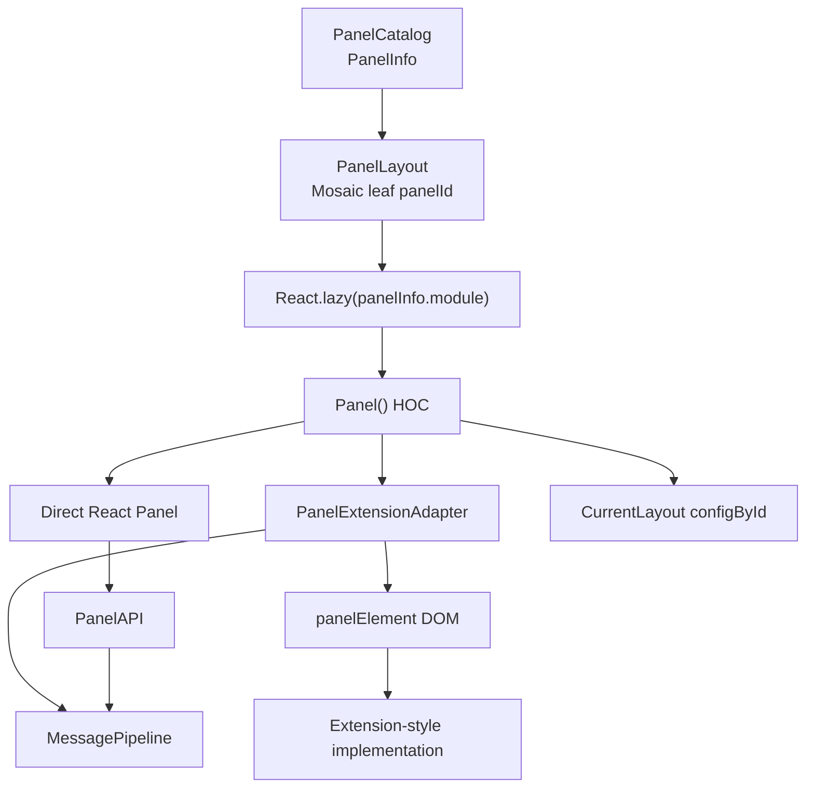
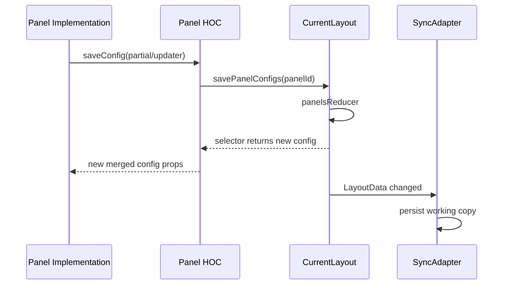
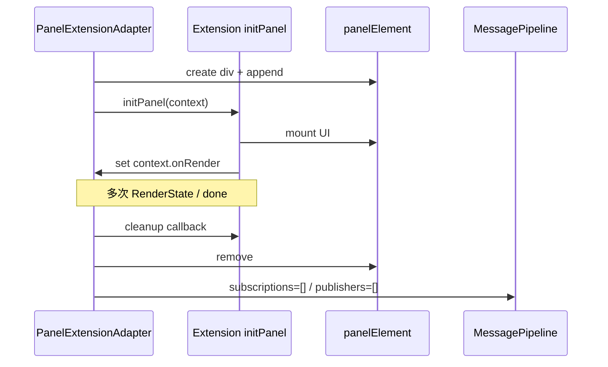

# Lichtblick 学习文档 06：Panel 与 PanelExtensionContext 生命周期

> 对应母版：`docs/architecture-learning-outline.md`
>
> 本文范围：面板从目录条目变成布局实例，公共 Panel HOC 如何提供配置和交互能力，
> PanelExtensionAdapter 如何初始化、驱动和清理扩展式面板，以及内建 PanelAPI 的消费模型。
>
> 不在本文展开：扩展包如何安装和注册 Contribution Points、Layout 远端同步、具体面板绘制
> 算法。

## 1. 学习目标

读完本文后，应能够解释：

1. PanelInfo、布局 panelId 和面板实现分别是什么；
2. 内建 React 面板与扩展面板在哪一层收敛；
3. `Panel()` HOC 提供哪些实例级能力；
4. default、saved、override config 如何合并并驱动 UI；
5. PanelRemounter 在什么情况下强制重建实例；
6. PanelExtensionAdapter 为什么创建独立 DOM 容器和内部 ID；
7. `initPanel`、`onRender`、`done` 和 cleanup 的完整顺序；
8. watch、subscribe、converter 和 RenderState 如何协作；
9. 持久配置、共享状态、全局变量和 preview time 应如何选择；
10. PanelAPI hooks 与 PanelExtensionContext 分别适合什么面板。

## 2. 面板的四层身份

```text
PanelInfo
  面板类型在 PanelCatalog 中的注册信息

layout panelId
  Mosaic 叶子的实例身份，例如 Gauge!abc

Panel() HOC instance
  配置、工具栏、错误边界、拖放、全屏等公共外壳

panel implementation
  直接 React 组件，或通过 PanelExtensionContext 驱动的实现
```

同一 panel type 可以创建多个 layout panelId。实例状态必须以 panelId 为键，不能放在模块级
单例中。

扩展式面板还有第五个身份：PanelExtensionAdapter 为消息订阅和 publisher 生成的内部 UUID。
它不等于 layout panelId。

## 3. 总体装配



公共 HOC 是实例边界；Adapter 是 React 世界与命令式扩展 API 的边界。

## 4. 关键源码

目录与实例：

- `packages/suite-base/src/providers/PanelCatalogProvider.tsx`
- `packages/suite-base/src/components/PanelLayout.tsx`
- `packages/suite-base/src/components/Panel.tsx`
- `packages/suite-base/src/components/PanelContext.ts`
- `packages/suite-base/src/components/PanelRemounter.tsx`
- `packages/suite-base/src/components/types.ts`

扩展适配：

- `packages/suite-base/src/components/PanelExtensionAdapter/PanelExtensionAdapter.tsx`
- `packages/suite-base/src/components/PanelExtensionAdapter/renderState.ts`
- `packages/suite-base/src/components/PanelExtensionAdapter/messageProcessing.ts`
- `packages/suite-base/src/components/PanelExtensionAdapter/useSharedPanelState.ts`
- `packages/suite-base/src/components/PanelExtensionAdapter/useSubscribeMessageRange.ts`
- `packages/suite/src/index.ts`

内建 API 与临时 UI 状态：

- `packages/suite-base/src/PanelAPI/`
- `packages/suite-base/src/context/PanelStateContext.ts`
- `packages/suite-base/src/providers/PanelStateContextProvider.tsx`
- `packages/suite-base/src/components/PanelErrorBoundary.tsx`

## 5. PanelCatalog 到布局实例

PanelCatalog 合并内建和扩展面板的 `PanelInfo`：

```ts
{
  type;
  title;
  category;
  module: () => Promise<{ default: PanelComponent }>;
}
```

`PanelLayout` 遍历 Mosaic 叶子：

```text
panelId
  → getPanelTypeFromId(panelId)
  → panelCatalog.getPanelByType(type)
  → React.lazy(panelInfo.module)
  → <PanelComponent childId=panelId tabId=...>
```

目录未就绪时显示扩展加载状态。找不到 type 时显示 `UnknownPanel`，但保留 panelId 和布局
位置；安装缺失扩展后仍有机会恢复实例。

## 6. 扩展面板也经过 Panel HOC

PanelCatalogProvider 把每个扩展 registration 包装成：

```text
PanelWrapper
  → PanelExtensionAdapter(initPanel)

Panel(PanelWrapper)
  → PanelInfo.module
```

扩展 panel type 为：

```text
<extensionName>.<registration.name>
```

因此扩展面板同样获得：

- layout config；
- PanelContext；
- 工具栏和 Overlay；
- 选择、拖放、分割、替换；
- 全屏；
- ErrorBoundary；
- settings UI 集成。

PanelExtensionAdapter 只替换面板内容的渲染协议，不绕过公共实例外壳。

## 7. Panel() HOC 的静态契约

传入组件必须提供：

```ts
panelType: string;
defaultConfig: Config;
```

HOC 返回 `React.memo(ConnectedPanel)`，并复制：

- `panelType`；
- `defaultConfig`；
- displayName。

运行时传给实现：

```ts
{
  config;
  saveConfig;
  ...otherProps;
}
```

HOC 自己消费 `childId`、`tabId` 和 `overrideConfig`。

## 8. 配置的三层合并

最终面板配置：

```text
defaultConfig
  ← savedConfig
  ← overrideConfig
```

后者覆盖前者：

```ts
{ ...defaultConfig, ...savedConfig, ...overrideConfig }
```

语义：

- defaultConfig：代码当前默认值；
- savedConfig：`LayoutData.configById[panelId]`；
- overrideConfig：测试、UnknownPanel 或特殊包装的临时覆盖。

overrideConfig 不自动写入布局。

## 9. 首次挂载为何可能修改布局

HOC 在 layout effect 检查：

- 没有 savedConfig；
- savedConfig 是空对象；
- defaultConfig 新增了 savedConfig 不含的非 undefined 顶层字段。

满足时调用 `saveConfig()`，把完整默认值补入布局。

```text
Panel mount
  → detect incomplete saved config
  → CurrentLayout.savePanelConfigs
  → configById 新值
  → SyncAdapter 写 working
```

所以“只渲染一个新面板”也可能产生布局修改。`savedDefaultConfig` ref 防止同一实例重复补写。

## 10. useConfigById

`useConfigById(panelId)` 返回：

```text
[config, saveConfig, extensionSettings]
```

读取链路：

```text
CurrentLayout selector
  → configById[panelId]
  → 按 Topic/Schema 合并扩展默认设置
  → 保持无变化时的旧引用
```

函数式保存使用 `getCurrentLayoutState()` 读取最新配置，而不是闭包里的旧 config：

```ts
saveConfig((current) => ({ ...current, enabled: true }));
```

这使 `saveConfig` 在配置变化时保持稳定，并减少异步回调覆盖新值的风险。

panelId 为 undefined 时读写均安全退化。

## 11. 配置如何驱动 UI



直接 React 面板通常把 config 当普通 props。扩展式实现则从 `context.initialState` 初始化
自己的内部状态，并主动调用 `context.saveState()`。

## 12. PanelContext 提供什么

每个 HOC 实例提供：

- type、id、title、tabId；
- 合并后的 config 与 saveConfig；
- 更新同类型所有面板配置；
- 打开/更新相邻面板；
- 替换当前面板；
- 进入/退出全屏；
- 拖拽 handle；
- 消息路径 drop config；
- 日志、日志数量和显示控制。

只能在 Panel HOC 子树内调用 `usePanelContext()`；上下文缺失时明确抛错。

## 13. 相邻面板操作

`openSiblingPanel()`：

1. 从 PanelCatalog 异步加载目标模块；
2. 读取目标 defaultConfig；
3. 若 `updateIfExists=true`，检查当前 Mosaic 的相邻分支；
4. 类型匹配则用 `siblingConfigCreator` 更新现有配置；
5. 否则 split 当前 MosaicWindow；
6. 获取新 panelId 并保存新配置。

异步加载模块后先检查当前 Panel 是否仍 mounted，防止已卸载实例继续修改布局。

## 14. 选择、批量操作和快捷操作

Panel HOC 连接 selectedPanelIds：

- 普通点击可在设置面板打开时单选；
- Meta/Shift 或已选面板可切换多选；
- 全选快捷键选择 Mosaic 叶子；
- 多选 Overlay 支持组合进 Tab 或创建多个 Tabs；
- 快捷 Overlay 支持 split 和 remove。

这些选择是临时编辑器状态，不写入 panel config。

## 15. 全屏与嵌套 Tab

面板全屏时记录源 DOMRect 并通过 Transition 改变 PanelRoot。

若面板位于 Tab 内，子 PanelContext 把 `hasFullscreenDescendant` 向父级传播，使祖先 Tab
提高正确的 z-index。退出动画结束后才清除该标记。

全屏是实例 UI 状态，不写入 LayoutData。

## 16. 拖放与消息路径

Panel HOC 同时连接：

- Mosaic panel drag source/preview；
- message path drop target。

顶层唯一根面板禁止普通 Mosaic 拖拽，因为没有可接受其移动的父布局。

`setMessagePathDropConfig()` 由具体面板声明：

- 是否接受当前拖入路径；
- cursor/effect；
- 提示文案；
- drop 后如何修改配置。

扩展 API 的 `unstable_setMessagePathDropConfig()` 最终写入这个实例级能力。

## 17. PanelRemounter

PanelRemounter key：

```text
panelId + tabId + sequenceNumber
```

重挂载条件：

- panelId 改变；
- 面板移动到不同 tabId；
- PanelState store 的 sequenceNumber 增加。

sequenceNumber 用于强制面板重新读取配置。原因是面板可以把初始 config 复制到内部 state，
之后忽略普通 config props 更新；某些外部设置操作需要彻底重建实例。

调整 Mosaic splitPercentage 不改变这些值，因此不应重挂载面板。

## 18. PanelStateContext

独立 Zustand store 保存：

| 字段              | 作用                   |
| ----------------- | ---------------------- |
| `sequenceNumbers` | 强制某实例重挂载       |
| `settingsTrees`   | 每个面板的设置编辑器树 |
| `defaultTitles`   | 每个面板动态默认标题   |

它们属于工作区 UI 协调状态，不是持久化 panel config。

settings tree 的 actionHandler 可能闭包捕获整个面板。`usePanelSettingsTreeUpdate()` 在卸载时
把对应条目设为 undefined，使闭包和面板资源可以被垃圾回收。

## 19. 面板错误边界与日志

Panel HOC 用 `PanelErrorBoundary` 隔离实现错误。

捕获后：

- 调用全局 reportError；
- 写入该面板日志；
- 显示错误详情；
- 提供 Dismiss；
- 提供 Reset Panel；
- 提供 Remove Panel。

Reset 保存 defaultConfig，并清除当前错误。Remove 走 CurrentLayout closePanel。

一个面板 render 崩溃不应卸载整个 Workspace。

## 20. PanelExtensionAdapter 的职责

Adapter 把 React 应用能力翻译成稳定的 `PanelExtensionContext`：

```text
React Contexts / Zustand
  → imperative context methods
  → initPanel(context)
  → panel-owned DOM renderer
```

它负责：

- 创建 panelElement；
- 管理 init/unmount；
- 构建 RenderState；
- 订阅 MessagePipeline；
- 转换消息；
- 接入帧背压；
- 代理布局、播放、发布、服务和设置能力；
- 清理 subscription/publisher。

扩展实现可以使用 React、Canvas、WebGL 或其他 UI 技术；应用只要求它操作给定 panelElement。

## 21. 两个 panel ID

### 21.1 layout panelId

来自 Mosaic 叶子，例如：

```text
my.extension.MyPanel!abc
```

用于：

- configById；
- PanelContext；
- settings tree；
- 标题；
- 布局操作。

### 21.2 Adapter UUID

Adapter 首次 mount 时生成内部 UUID，用于：

- MessagePipeline subscriberId；
- publisher owner ID；
- hover componentId；
- pauseFrame 名称。

这避免扩展内部协议状态与可持久化 layout ID 耦合。Adapter 重建后，即使外层 layout
panelId 不变，也会拥有新的协议身份。

## 22. initPanel 生命周期



Adapter 使用 layout effect 初始化，避免旧实例的 RenderState builder 污染新面板。

## 23. 哪些情况不初始化

### 23.1 Player INITIALIZING

初始化状态通常短暂。Adapter 不调用 initPanel，避免：

```text
initPanel
  → Player 很快完成初始化
  → context 变化
  → cleanup
  → 再 initPanel
```

### 23.2 配置版本过高

若 config 包含：

```text
foxgloveConfigVersion > highestSupportedConfigVersion
```

Adapter 显示 `PanelConfigVersionError`，不调用旧实现。这样旧代码不会读取并回写它不理解的
新配置。

## 24. 哪些变化可能重新初始化

init effect 依赖：

- initPanel 函数；
- 内部 panelId；
- 构造出的 context；
- player initializing 状态；
- config version gate。

partial context 会因关键能力变化而重建，例如：

- seek 是否可用；
- dataSourceProfile；
- capabilities；
- layout/addPanel 代理；
- saveConfig；-设置与范围订阅代理。

扩展不能假设 initPanel 在 layout panelId 生命周期内只调用一次。所有资源必须归属于单次
init 调用。

## 25. 配置在扩展中的语义

`context.initialState` 是初始化快照。Adapter 不采用“每次 config props 变化就重建扩展”的
普通 React 数据流。

推荐模式：

```text
initPanel
  → 从 initialState 创建扩展内部 state
  → 用户操作更新内部 state
  → context.saveState(state)
```

外部强制配置刷新应通过 PanelRemounter 重建实例，而不是期待旧扩展自动读取新的
`initialState`。

保存值必须可 JSON 序列化，因为最终进入 LayoutData。

## 26. context.onRender

扩展通过 setter 注册：

```ts
context.onRender = (renderState, done) => {
  // 更新 UI
  done();
};
```

Adapter 只有在：

- 已完成 init；
- onRender 存在；
- watched RenderState 有变化

时调用。

扩展卸载时应把自身回调清理，并由 initPanel 返回的 cleanup 释放 renderer、timer、
ResizeObserver、Worker 或 WebGL 资源。

## 27. watch 是更新声明

扩展必须显式：

```ts
context.watch("currentFrame");
context.watch("currentTime");
```

可 watch：

- currentFrame / allFrames；
- didSeek；
- parameters；
- sharedPanelState；
- variables；
- topics / services；
- current/start/end/preview time；
- colorScheme；
- appSettings。

重复 watch 同一字段返回旧 Set，避免 React 18 下的重复更新循环。

没有 watched 字段发生变化时，RenderState builder 返回 undefined，onRender 不执行。

## 28. RenderState 是增量接口

RenderState builder 在闭包中保存前值，只更新被 watch 且发生变化的字段。

重要语义：

- currentFrame 是本轮新消息，不是长期历史；
- didSeek 通知清理累计状态；
- allFrames 来自 preload blocks；
- variables 转为 Map；
- topics 会附加 converter 可到达的 schema；
- previewTime 来自共享 hover 状态；
- appSettings 只包含显式订阅的 key。

builder 复用内部 RenderState 对象并更新字段。扩展应按回调语义消费内容，不应依赖每次
onRender 都得到全新对象身份。

## 29. subscribe 的两个入口

### 29.1 字符串数组

```ts
context.subscribe(["/pose"]);
```

Adapter 把字符串转换为：

```ts
{ topic: "/pose", preload: true }
```

这是兼容路径，默认请求完整历史，成本可能较高。

### 29.2 Subscription 对象

```ts
context.subscribe([
  {
    topic: "/pose",
    preload: false,
    convertTo: "schema.Target",
    sampling: { mode: "latest-per-render-tick" },
  },
]);
```

对象形式可以明确控制实时帧、历史、转换和采样。

每次 subscribe 替换该 Adapter ID 的完整订阅集合，不是追加。空数组等价于
`unsubscribeAll()`。

## 30. 采样授权

latest-per-render-tick 只在以下条件保留：

- preload 不是 true；
- 请求经过实际 message converter；
- converter 声明支持该采样；
- 不是原生 schema 直通路径。

Adapter 写入内部 `samplingAuthorized`，MessagePipeline 合并多个消费者时会再次检查。

无法证明采样安全时退化为全消息，优先保证语义正确。

## 31. 消息转换

订阅 `convertTo` 时：

```text
topic + source schema
  → 查找目标 schema converter
  → converter(message, event, variables, context)
  → converted MessageEvent
```

输出保留：

- topic；
- receiveTime；
- sizeInBytes；
- topicConfig；
- `originalMessageEvent`；
- 新 schemaName。

converter 返回 null/undefined 时跳过该消息。抛错时生成带 extensionId 和消息时间的 Alert，
不会让整个 Panel render 崩溃。

同一 source/target 有多个 converter 时，当前实现按 extensionNamespace 选择优先项。

## 32. currentFrame 与 allFrames

### 32.1 currentFrame

对本轮 subscriber 消息：

- 未转换订阅保留原消息；
- 转换订阅运行 converter；
- 每 Topic 记录最后消息；
- converter 或变量变化时可重跑最后消息。

### 32.2 allFrames

仅 `preload=true` Topic 进入：

- 读取 `playerState.progress.messageCache.blocks`；
- 过滤本面板 Topic；
- 跨 Topic 按 receiveTime 合并；
- 运行 converter；
- 产生完整历史数组。

allFrames 是 best effort，且不是所有 Player 都提供 blocks。

## 33. 设置编辑器与强制转换

扩展调用 `updatePanelSettingsEditor(settingsTree)`，Adapter 把树存入 PanelStateContext。

包装后的 actionHandler：

1. 调用面板原始 handler；
2. 对 Topic/Schema 的 extension settings 执行附加 handler；
3. 保存配置；
4. 把 Topic 放入 `forceConversion`；
5. 用最后消息重新运行 converter。

因此只修改某 Topic 的转换配置，即使没有新消息，也能立即更新面板。

卸载时 settings tree 置 undefined，释放 actionHandler 捕获的闭包。

## 34. onRender 与 done

```text
RenderState ready
  → pauseFrame(adapterId)
  → renderingRef=true
  → onRender(state, done)
  → extension commit/canvas draw
  → done()
  → resumeFrame()
  → renderingRef=false
```

done 重复调用会被忽略并记录 warning。

扩展应在 DOM 真正提交后调用 done。Gauge 示例把 done 保存到 React state，再在 effect 中
执行，保证 React 已完成对应更新。

同步抛错会进入 PanelErrorBoundary，但已注册 pause 可能只能等待 Pipeline 的超时保护，
因此实现应在自己的错误路径或 finally 中完成回执。

## 35. slow render

若上一轮 `renderingRef=true` 时又出现需要 RenderState 的变化：

- 不启动重叠 onRender；
- `slowRender=true`；
- Panel 容器显示橙色 inset box-shadow。

使用 inset 而不是 border，是为了不改变 content box，避免 ResizeObserver 和布局产生额外
循环。

新变化可能来自消息，也可能来自 theme、variables、hover、settings 或 shared state。

## 36. 反向能力

| Context API                         | 内部路径                                 |
| ----------------------------------- | ---------------------------------------- |
| `saveState`                         | Panel HOC → CurrentLayout config         |
| `layout.addPanel`                   | openSiblingPanel → Mosaic/Layout reducer |
| `seekPlayback`                      | MessagePipeline → Player                 |
| `setParameter`                      | MessagePipeline → Player                 |
| `setVariable`                       | CurrentLayout globalVariables            |
| `setSharedPanelState`               | CurrentLayout transient shared state     |
| `setPreviewTime`                    | Timeline interaction state               |
| `advertise/unadvertise`             | MessagePipeline publishers               |
| `publish`                           | Player publish                           |
| `callService`                       | Player service API                       |
| `updatePanelSettingsEditor`         | PanelState settings tree                 |
| `setDefaultPanelTitle`              | PanelState title                         |
| `unstable_fetchAsset`               | Player asset 或 builtin fetch            |
| `unstable_setMessagePathDropConfig` | Panel HOC drop target                    |

seek、publish、advertise 和 service 等可选方法依据 Player capability 暴露。`setParameter`
在公开 Context 中是固定方法，底层 Player 是否支持及其错误由数据源实现决定。

## 37. 发布资源的生命周期

Adapter 用 Map 保存当前 advertisements：

```text
advertise(topic)
  → advertisementsRef
  → setPublishers(adapterId, all)

unadvertise(topic)
  → delete
  → setPublishers(adapterId, remaining)
```

cleanup 无论扩展是否逐个 unadvertise，都会：

```text
setPublishers(adapterId, [])
```

订阅也同样清空。这是防止已卸载面板继续占用网络和 Player 资源的最后保障。

## 38. init cleanup 的严格顺序

Adapter cleanup：

1. 调用扩展返回的 onUnmount；
2. 标记面板未初始化；
3. 移除 panelElement；
4. 清空 MessagePipeline subscriptions；
5. 清空 MessagePipeline publishers。

扩展 cleanup 应自行释放：

- React root；
- event listener；
- timer；
- Worker；
- ResizeObserver；
- WebGL/Canvas；
- 自己创建的 AbortController；
- message range cancel function。

Adapter 只知道通过其集中代理注册的 subscription 和 publisher。

## 39. unstable message range

`unstable_subscribeMessageRange()`：

```text
getBatchIterator(topic)
  → createMessageRangeIterator
  → 可选 converter
  → 约 16ms 批量输出
  → onNewRangeIterator(async iterable)
```

实时 Player 通常没有 batch iterator，此时返回空 cleanup 且不调用 callback。

调用返回一个 cancel 函数。调用者必须保存并在：

- 订阅参数变化；
- 新 iterator 替代旧 iterator；
- 面板卸载

时执行。Adapter 不集中跟踪这些返回值。

callback Promise reject 会记录错误；iterator/converter 的可见错误还会进入相应 Alert 路径。

## 40. app settings 订阅

扩展调用：

```ts
context.subscribeAppSettings(["messageRate"]);
context.watch("appSettings");
```

Adapter：

1. 为每个 key 注册 change listener；
2. 读取初始值；
3. 构造新 Map；
4. 在 key 列表变化或卸载时移除 listener。

只 subscribe 不 watch，RenderState 不会因 appSettings 变化调用 onRender。

## 41. 持久状态与临时联动

### 41.1 saveState

保存到 `configById[layoutPanelId]`，随 Layout 持久化。适合：

- 用户配置；
- 选中的 Topic/path；
- 图表样式；
- 可恢复的面板选项。

### 41.2 sharedPanelState

按 panel type 保存于 CurrentLayoutProvider 运行态，不持久化。适合同类型面板临时协同。

### 41.3 globalVariables

持久化到布局，并同时驱动脚本、converter 和其他面板。适合有布局级业务语义的值。

### 41.4 preview time

属于 Timeline interaction state。适合 hover 等高频、短生命周期交互。

把 hover 写进 saveState 会产生频繁布局写入；把用户配置放进 shared state 则会在重载后丢失。

## 42. 内建 PanelAPI

直接 React 面板不需要绕过 React 再使用命令式 onRender。常用 hooks：

- `useDataSourceInfo()`；
- `useMessagesByTopic()`；
- `useMessageReducer()`；
- `useBlocksSubscriptions()`；
- `useConfigById()`；
- `useSubscribeMessageRange()`。

### 42.1 useDataSourceInfo

组合低频 topics、services、datatypes、capabilities、startTime 和 playerId，并保持返回对象引用
稳定；消息帧变化不应使它更新。

### 42.2 useMessageReducer

为 hook 生成 subscriber ID，增量处理当前帧。Seek 时以 lastSeekTime 调用 restore。

必须提供 addMessage 或 addMessages 中恰好一个。

### 42.3 useMessagesByTopic

在 useMessageReducer 之上按 Topic 保存限定 historySize 的数组。Topic 集合变化时尽量保留
仍被请求 Topic 的尾部历史。

### 42.4 useBlocksSubscriptions

注册 preload/full 订阅，选择 Player messageCache blocks，并按 Topic 过滤。缺失 Topic
表示尚未缓存，不等于已知该时间块没有消息。

## 43. 应选择哪种消费模型

| 需求                       | 建议入口                          |
| -------------------------- | --------------------------------- |
| 直接 React 当前帧          | useMessageReducer/MessagesByTopic |
| React 增量累计             | useMessageReducer                 |
| React 读取缓存 blocks      | useBlocksSubscriptions            |
| 扩展/Canvas/WebGL 增量渲染 | PanelExtensionContext onRender    |
| 离线大范围流式处理         | unstable message range            |
| 低频数据源元信息           | useDataSourceInfo                 |

不要为了统一 API 把所有内建 React 面板改成命令式 Context；也不要让第三方扩展直接依赖内部
Zustand store。

## 44. Player 与 Layout 变化的失效边界

### 44.1 Player playerId 变化

Workspace 外层重挂载整个 PanelLayout，所有面板实例和 Adapter UUID 被重建。

### 44.2 Layout leaf 删除/替换

React key 消失或变化，单个 Panel HOC 卸载，触发 Adapter cleanup。

### 44.3 PanelRemounter sequence

只重建指定 panelId 的实现，用于强制配置刷新。

### 44.4 capability/context 变化

外层 HOC 可保留，但 Adapter init effect cleanup 后重新 initPanel。

### 44.5 splitPercentage 变化

panelId、tabId 和 sequence 不变，实例应保留。

## 45. 生命周期清理清单

卸载一个直接 React 面板：

- hook effect cleanup；
- setSubscriptions(id, [])；
- 取消 timer/Worker/range；
- settings tree 置 undefined；
- DOM 和 local state 由 React 释放。

卸载一个扩展面板：

- initPanel cleanup；
- renderer root unmount；
- range cancel；
- app settings listeners 移除；
- subscriptions/publishers 清空；
- panelElement 移除；
- settings tree 置 undefined；
- hover/shared 临时资源按实现清理。

切换 Player 时上述清理会对整棵面板树发生。

## 46. 常见误解

### 46.1 “扩展面板不经过 Panel HOC”

不正确。PanelCatalogProvider 把 Adapter wrapper 再交给 `Panel()`。

### 46.2 “layout panelId 就是 MessagePipeline subscriberId”

不正确。Adapter 使用自己的 UUID。

### 46.3 “config props 变化会自动重建扩展”

不正确。扩展以 initialState 初始化并自管状态；强制刷新使用 remount 边界。

### 46.4 “subscribe 字符串默认只订阅当前帧”

不正确。兼容字符串路径被转为 `preload:true`。

### 46.5 “调用 subscribe 会追加 Topic”

不正确。它替换该 Adapter 的完整订阅集合。

### 46.6 “Adapter 会自动取消所有 range iterator”

不正确。调用者负责执行返回的 cancel。

### 46.7 “每个 RenderState 都是全量新对象”

不正确。它是 watched fields 的增量接口，builder 还会复用内部对象。

### 46.8 “done 只表示业务处理结束”

不完整。done 是 UI 已完成本帧必要绘制的背压回执。

## 47. 推荐源码阅读顺序

第一轮：实例外壳。

1. `packages/suite-base/src/providers/PanelCatalogProvider.tsx`
2. `packages/suite-base/src/components/PanelLayout.tsx`
3. `packages/suite-base/src/components/Panel.tsx`
4. `packages/suite-base/src/components/PanelContext.ts`
5. `packages/suite-base/src/components/PanelRemounter.tsx`

第二轮：配置与临时状态。

1. `packages/suite-base/src/PanelAPI/useConfigById.ts`
2. `packages/suite-base/src/context/PanelStateContext.ts`
3. `packages/suite-base/src/providers/PanelStateContextProvider.tsx`

第三轮：扩展适配。

1. `packages/suite/src/index.ts`
2. `packages/suite-base/src/components/PanelExtensionAdapter/PanelExtensionAdapter.tsx`
3. `packages/suite-base/src/components/PanelExtensionAdapter/renderState.ts`
4. `packages/suite-base/src/components/PanelExtensionAdapter/messageProcessing.ts`

第四轮：消费模型。

1. `packages/suite-base/src/PanelAPI/useMessageReducer.ts`
2. `packages/suite-base/src/PanelAPI/useMessagesByTopic.ts`
3. `packages/suite-base/src/PanelAPI/useBlocksSubscriptions.ts`
4. `packages/suite-base/src/components/PanelExtensionAdapter/useSubscribeMessageRange.ts`
5. `packages/suite-base/src/panels/Gauge/index.tsx`
6. `packages/suite-base/src/panels/Gauge/Gauge.tsx`

## 48. 可执行观察实验

### 实验一：默认配置补写

1. 新建一个无 configById 条目的面板；
2. 在 Panel HOC layout effect 和 CurrentLayout reducer 打断点；
3. 检查最终 config 和 Layout working。

预期：defaultConfig 被补入布局，只执行一次有效写入。

### 实验二：调整 Mosaic 比例

1. 在面板 mount/unmount effect 记录日志；
2. 连续拖动分隔条；
3. 检查 panelId、tabId 和 sequence。

预期：组件 render/尺寸可变化，但实例不 remount。

### 实验三：强制 remount

1. 保存一份外部配置；
2. 调用 PanelState store `incrementSequenceNumber(panelId)`；
3. 观察 PanelRemounter key。

预期：只有目标面板卸载并重新初始化。

### 实验四：扩展初始化

1. 在 initPanel 和返回 cleanup 中记录次数；
2. 切换 INITIALIZING/PRESENT；
3. 改变 Player capability；
4. 删除面板。

预期：INITIALIZING 不 init；关键 Context 变化先 cleanup 再 init；删除执行最终 cleanup。

### 实验五：watch 粒度

1. 只 watch currentTime；
2. 改变 Topic 列表但保持 currentTime；
3. 再 watch topics；
4. 重复实验。

预期：只有 watched 字段变化进入 onRender。

### 实验六：订阅替换

1. subscribe `/a`；
2. 再 subscribe `/b`；
3. 查看 MessagePipeline subscriptionsById；
4. 调用 unsubscribeAll。

预期：第二次只保留 `/b`，最后为空。

### 实验七：转换重算

1. 订阅带 convertTo 的 Topic；
2. 接收一条消息；
3. 不推进 Player，修改该 Topic 的转换设置；
4. 检查 forceConversion。

预期：使用最后消息重新转换并触发 UI。

### 实验八：清理审计

1. 扩展注册 subscription、publisher、app setting listener 和 range iterator；
2. 删除面板；
3. 分别检查四类资源。

预期：集中 subscription/publisher/listener 被清理；range 需要扩展 cleanup 主动 cancel。

## 49. 对应测试

Panel 外壳：

- `packages/suite-base/src/components/PanelLayout.test.tsx`
- `packages/suite-base/src/PanelAPI/useConfigById.test.ts`
- `packages/suite-base/src/providers/CurrentLayoutProvider/reducers.test.tsx`

PanelExtensionAdapter：

- `packages/suite-base/src/components/PanelExtensionAdapter/PanelExtensionAdapter.test.tsx`
- `packages/suite-base/src/components/PanelExtensionAdapter/renderState.test.ts`
- `packages/suite-base/src/components/PanelExtensionAdapter/messageProcessing.test.ts`
- `packages/suite-base/src/components/PanelExtensionAdapter/messageRangeIterator.test.ts`
- `packages/suite-base/src/components/PanelExtensionAdapter/useSubscribeMessageRange.test.ts`

PanelAPI：

- `packages/suite-base/src/PanelAPI/useDataSourceInfo.test.tsx`
- `packages/suite-base/src/PanelAPI/useMessageReducer.test.tsx`
- `packages/suite-base/src/PanelAPI/useMessagesByTopic.test.tsx`
- `packages/suite-base/src/PanelAPI/useBlocksSubscriptions.test.tsx`

建议运行：

```sh
yarn test packages/suite-base/src/components/PanelExtensionAdapter/PanelExtensionAdapter.test.tsx
yarn test packages/suite-base/src/components/PanelExtensionAdapter/renderState.test.ts
yarn test packages/suite-base/src/PanelAPI/useMessageReducer.test.tsx
yarn test packages/suite-base/src/components/PanelLayout.test.tsx
```

## 50. 自测问题

1. PanelInfo、layout panelId 和实现模块分别解决什么问题？
2. 扩展面板在哪一层进入 Panel HOC？
3. default、saved 和 override config 的覆盖顺序是什么？
4. 为什么首次 mount 可能写 Layout？
5. 函数式 saveConfig 为什么读取同步 getter？
6. PanelContext 中哪些状态持久化，哪些只是 UI 临时状态？
7. PanelRemounter key 由什么组成？
8. splitPercentage 变化为什么不应 remount？
9. layout panelId 与 Adapter UUID 有何区别？
10. INITIALIZING 时为什么跳过 initPanel？
11. 配置版本门禁保护什么？
12. initPanel 可能在什么情况下重新调用？
13. context.initialState 是持续响应式 props 吗？
14. watch 如何限制 onRender？
15. RenderState 是否保证每次全新对象？
16. 字符串 subscribe 的 preload 默认值是什么？
17. subscribe 是追加还是替换？
18. sampling 为什么需要 converter 授权？
19. converter 错误如何影响 Panel？
20. currentFrame 与 allFrames 的来源有何不同？
21. done 如何参与 MessagePipeline 背压？
22. slow render 可能由哪些非消息输入触发？
23. Adapter cleanup 自动释放哪些资源？
24. range iterator 应由谁取消？
25. saveState、shared state、global variable 和 preview time 分别适合什么数据？
26. 直接 React 面板何时应使用 useMessageReducer？

## 51. 本篇结论

面板生命周期是三层资源边界的组合：

```text
Layout panel instance
  → Panel HOC 管理配置和实例交互
  → React Panel 或 PanelExtensionAdapter
  → Message/Render/DOM resources
```

理解这套模型要保持五个不变量：

1. layout panelId 是可持久化实例身份，Adapter UUID 是运行期协议身份；
2. 配置只能经 saveConfig 回到 CurrentLayout，临时交互不能滥用持久配置；
3. 扩展只会收到 watched RenderState，subscribe 决定上游生产，done 决定下一帧何时推进；
4. 每次 initPanel 都必须有对称 cleanup，range iterator 等调用者资源不能依赖 Adapter 猜测；
5. remount 是明确的失效工具，普通尺寸和无关状态变化应尽量保留面板实例。
