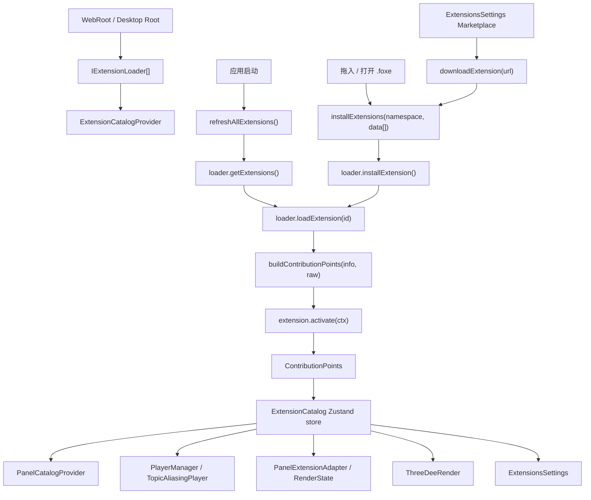

# Lichtblick 学习文档 07：扩展加载与 Contribution Points

> 对应母版：`docs/architecture-learning-outline.md`
>
> 本文范围：扩展从 `.foxe`、桌面文件系统、IndexedDB 或远端工作区进入应用，如何执行
> `activate()` 注册 Contribution Points，以及这些贡献点如何继续驱动面板目录、消息转换、
> Topic alias、3D 相机模型和扩展设置页。
>
> 不在本文展开：PanelExtensionContext 的逐字段生命周期、第 3D 面板内部渲染算法、
> UserScriptPlayer 的脚本执行模型。

## 1. 学习目标

读完本文后，应能够解释：

1. Extension loader 在 Web、Desktop 和远端工作区中的差异；
2. `.foxe` 文件如何被解包、校验、持久化和重新加载；
3. `buildContributionPoints()` 为什么是扩展运行时代码的入口；
4. `ExtensionContext` 暴露了哪些注册能力；
5. ExtensionCatalog Zustand store 中每个字段的用途；
6. 安装扩展如何立刻改变当前 UI；
7. 启动刷新如何重建扩展贡献；
8. 卸载扩展时哪些贡献点被清理，哪些可能保留；
9. 扩展面板如何进入 PanelCatalog；
10. message converter 如何影响 `topics.convertibleTo` 和消息渲染；
11. topic alias 如何包裹 Player 并改写 topic 视图；
12. camera model 如何进入 3D 面板；
13. 扩展设置页本身如何由 Catalog 和 Marketplace 驱动；
14. 读源码时应关注哪些异步边界、引用变化和错误处理。

## 2. 核心结论

扩展系统的主轴不是“动态 import 一个插件组件”，而是：

```text
loader 取得扩展元信息和源码
  → buildContributionPoints 执行扩展 activate()
  → ExtensionCatalog 合并贡献点
  → 下游 React/Zustand 消费者按 selector 更新
  → PanelCatalog / PlayerManager / PanelExtensionAdapter / ThreeDeeRender 改变 UI 和数据流
```

也就是说，扩展不是直接操作应用 UI。扩展只向 `ExtensionContext` 注册能力，核心应用将这些能力
存入 Catalog，再由固定的消费者把它们接入各自的数据流。

## 3. 关键源码索引

扩展 API：

- `packages/suite/src/index.ts`
- `packages/suite/src/cameraModels.ts`

Catalog 与 Contribution Points：

- `packages/suite-base/src/context/ExtensionCatalogContext.ts`
- `packages/suite-base/src/providers/ExtensionCatalogProvider/ExtensionCatalogProvider.tsx`
- `packages/suite-base/src/providers/ExtensionCatalogProvider/utils.ts`
- `packages/suite-base/src/providers/ExtensionCatalogProvider/types.ts`
- `packages/suite-base/src/providers/helpers/buildContributionPoints.ts`

Loader：

- `packages/suite-base/src/services/extension/IExtensionLoader.ts`
- `packages/suite-base/src/services/extension/IdbExtensionLoader.ts`
- `packages/suite-base/src/services/extension/RemoteExtensionLoader.ts`
- `packages/suite-desktop/src/renderer/services/DesktopExtensionLoader.ts`
- `packages/suite-desktop/src/preload/ExtensionHandler.ts`

宿主注入：

- `packages/suite-web/src/WebRoot.tsx`
- `packages/suite-desktop/src/renderer/Root.tsx`
- `packages/suite-base/src/StudioApp.tsx`
- `packages/suite-base/src/App.tsx`

运行时消费者：

- `packages/suite-base/src/providers/PanelCatalogProvider.tsx`
- `packages/suite-base/src/components/PlayerManager.tsx`
- `packages/suite-base/src/components/PanelExtensionAdapter/PanelExtensionAdapter.tsx`
- `packages/suite-base/src/components/PanelExtensionAdapter/renderState.ts`
- `packages/suite-base/src/components/PanelExtensionAdapter/messageProcessing.ts`
- `packages/suite-base/src/components/PanelExtensionAdapter/useSubscribeMessageRange.ts`
- `packages/suite-base/src/players/TopicAliasingPlayer/TopicAliasingPlayer.ts`
- `packages/suite-base/src/players/TopicAliasingPlayer/StateProcessorFactory.ts`
- `packages/suite-base/src/players/TopicAliasingPlayer/AliasingStateProcessor.ts`
- `packages/suite-base/src/panels/ThreeDeeRender/index.tsx`
- `packages/suite-base/src/panels/ThreeDeeRender/ThreeDeeRender.tsx`
- `packages/suite-base/src/panels/ThreeDeeRender/Renderer.ts`

扩展管理 UI：

- `packages/suite-base/src/components/ExtensionsSettings/index.tsx`
- `packages/suite-base/src/components/ExtensionsSettings/hooks/useExtensionSettings.ts`
- `packages/suite-base/src/components/ExtensionsSettings/hooks/useExtensionOperations.ts`
- `packages/suite-base/src/components/ExtensionsSettings/components/ExtensionList/ExtensionList.tsx`
- `packages/suite-base/src/components/ExtensionDetails.tsx`
- `packages/suite-base/src/hooks/useHandleFiles.tsx`
- `packages/suite-base/src/hooks/useInstallingExtensionsState.tsx`

## 4. 总体数据流



最重要的边界是 `ExtensionCatalogProvider`。它既处理安装和刷新，也持有运行时贡献点。下游 UI
不直接访问 loader，也不直接执行扩展源码。

## 5. Extension API 暴露的注册面

扩展入口模块必须导出 `activate`：

```ts
export interface ExtensionModule {
  activate: ExtensionActivate;
}
```

`activate()` 接收 `ExtensionContext`。当前源码中可注册的能力包括：

```text
registerPanel()
registerMessageConverter()
registerTopicAliases()
registerCameraModel()
```

其中 message converter 还可以携带 `panelSettings`。这些设置不是一个单独的注册函数，而是
挂在 converter 参数上，之后被合并到 Catalog 的 `panelSettings`。

## 6. Contribution Points 的结构

`ContributionPoints` 是扩展执行结果的汇总对象：

```text
panels
messageConverters
topicAliasFunctions
panelSettings
cameraModels
```

它的语义是“这个扩展对核心应用贡献了什么能力”。它不是持久化格式，而是运行时格式；启动时会
从已安装扩展重新构建。

## 7. Loader 抽象

所有 loader 都实现 `IExtensionLoader`：

```text
namespace: local | org 等范围
type: browser | server | filesystem

getExtension(id)
getExtensions()
loadExtension(id)
installExtension(data)
uninstallExtension(id)
```

这个接口把扩展来源统一起来。Catalog Provider 不关心扩展是存在 IndexedDB、服务器还是桌面
用户目录；它只调用 loader 的标准方法。

## 8. namespace 与 type 的组合

源码中常见组合：

| 宿主            | namespace | type         | 作用                       |
| --------------- | --------- | ------------ | -------------------------- |
| Web             | `org`     | `browser`    | IndexedDB 中的组织扩展缓存 |
| Web             | `local`   | `browser`    | 浏览器本地安装扩展         |
| Web + workspace | `org`     | `server`     | 远端工作区组织扩展         |
| Desktop         | `org`     | `browser`    | IndexedDB 中的组织扩展缓存 |
| Desktop         | `local`   | `filesystem` | 桌面用户扩展目录           |

`namespace` 表示扩展归属范围，`type` 表示存储和加载机制。安装、卸载、刷新都会同时考虑这两个
字段。

## 9. Web 中的 loader 注入

`WebRoot` 创建默认 extension loaders：

```text
new IdbExtensionLoader("org")
new IdbExtensionLoader("local")
```

如果 URL 中有 `workspace` 且存在 API 地址，还会加入：

```text
new RemoteExtensionLoader("org", workspace)
```

然后通过 `SharedRoot` 注入共享核心。到 `StudioApp` 时，这些 loader 被传给
`ExtensionCatalogProvider`。

## 10. Desktop 中的 loader 注入

Desktop Renderer 创建：

```text
new IdbExtensionLoader("org")
new DesktopExtensionLoader(desktopBridge)
```

`DesktopExtensionLoader` 的 `namespace` 固定为 `local`，`type` 为 `filesystem`。它不直接访问
Node.js 文件系统，而是通过 `desktopBridge` 调用 preload 暴露的能力。

## 11. Desktop 文件系统边界

桌面扩展真正的文件操作在 preload 侧：

```text
ExtensionsHandler
  → 读取用户扩展目录
  → 解析 package.json
  → 读取 README / CHANGELOG
  → 根据 package main 加载源码
  → 安装时解压 .foxe 到扩展目录
  → 卸载时删除扩展目录
```

Renderer 只看到 `DesktopExtensionLoader`。这保持了 Electron 的安全边界：React 层不直接拥有
文件系统能力。

## 12. `.foxe` 包结构

Web/Remote loader 对 `.foxe` 关注固定文件：

```text
package.json
dist/extension.js
README.md
CHANGELOG.md
```

其中 `package.json` 通过 `validatePackageInfo()` 校验并转成 `ExtensionInfo`；
`dist/extension.js` 是 `buildContributionPoints()` 后续执行的源码。

Desktop preload 侧读取 `package.json.main` 指向的入口文件。这与 Web/Remote loader 使用
固定 `dist/extension.js` 的方式不同，学习时不要把两者混为一谈。

## 13. ExtensionInfo 的作用

`ExtensionInfo` 是扩展元信息：

```text
id
name
displayName
publisher
qualifiedName
namespace
version
readme
changelog
externalId
size
...
```

UI 列表、安装状态、Contribution Points 的归属、卸载清理都依赖这些字段。

`id` 用于识别扩展；`namespace` 用于区分 local/org；`qualifiedName` 用于生成面板 type，
因此会影响布局中保存的面板类型。

## 14. Catalog Provider 的位置

共享 App 组装中，扩展相关 Provider 的大致顺序是：

```text
ExtensionMarketplaceProvider
ExtensionCatalogProvider
UserScriptStateProvider
PlayerManager
...
PanelCatalogProvider
Workspace
```

这个顺序很关键：

- `PlayerManager` 可以订阅 `ExtensionCatalogContext`，把 topic alias 注入 Player；
- `PanelCatalogProvider` 在更内层消费 `installedPanels`，把扩展面板加入目录；
- Workspace 内的设置页和面板也都能使用 Catalog。

## 15. Catalog store 的字段

`ExtensionCatalog` 是一个 Zustand store，主要字段可分三类。

操作函数：

```text
downloadExtension
installExtensions
uninstallExtension
refreshAllExtensions
mergeState
isExtensionInstalled
markExtensionAsInstalled
unMarkExtensionAsInstalled
```

安装状态：

```text
loadedExtensions
installedExtensions
```

运行时贡献：

```text
installedPanels
installedMessageConverters
installedTopicAliasFunctions
installedCameraModels
panelSettings
```

下游 UI 基本都通过 `useExtensionCatalog(selector)` 订阅其中一个子集。

## 16. 启动刷新链路

`ExtensionCatalogProvider` 首次挂载时调用：

```text
refreshAllExtensions()
```

刷新过程：

```text
loaders
  → 过滤 local 或 server loader
  → loader.getExtensions()
  → 对每个 ExtensionInfo 调用 loadSingleExtension()
  → buildContributionPoints()
  → 汇总 contributionPoints
  → set({ installedExtensions, installedPanels, ... })
```

注意：刷新是重建运行时状态，而不是在已有状态上追加。最终 `set()` 会替换已安装扩展列表和
贡献点集合。

## 17. 启动刷新为什么跳过部分 loader

刷新时只处理：

```text
loader.namespace === "local" || loader.type === "server"
```

这意味着：

- local 扩展需要从本地来源恢复；
- server 扩展需要从远端工作区恢复；
- org/browser loader 主要作为远端扩展的本地缓存参与 `loadSingleExtension()`，不作为独立刷新源。

这能避免同一个 org 扩展既从 server 又从 browser cache 被重复当成安装来源。

## 18. 远端 org 扩展的缓存策略

`loadSingleExtension()` 对 `namespace === "org"` 且 `type === "server"` 的 loader 有特殊逻辑：

```text
先查 org/browser cache
  → 缓存版本与远端版本一致：使用缓存 raw
  → 缓存缺失或版本不同：从 server 下载
  → 下载后尝试写入 org/browser cache
```

这条链路把 server 作为权威来源，同时用 IndexedDB 缓存提升后续加载速度。

## 19. 拖入 `.foxe` 的安装链路

文件处理入口在 `useHandleFiles()`：

```text
用户拖入文件
  → 按扩展名分类
  → .foxe 读取 arrayBuffer
  → 组装 ExtensionData
  → pause 播放
  → installFoxeExtensions(extensionsData)
```

`installFoxeExtensions()` 再按 namespace 分组、批量调用 Catalog 的 `installExtensions()`。

UI 层可见的效果：

- 安装进度 snackbar；
- 成功、失败或部分失败提示；
- 当前 Catalog 状态更新后，下游目录和面板能力立即刷新。

## 20. 设置页安装链路

扩展设置页的 marketplace 安装路径：

```text
ExtensionsSettings
  → ExtensionList / ExtensionDetails
  → useExtensionOperations.handleInstall()
  → downloadExtension(extension.foxe)
  → installExtensions("local", [{ buffer }])
  → snackbar + analytics
```

当前源码中，marketplace 安装在非 Desktop 环境会直接提示用户下载桌面应用。这和拖入 `.foxe`
不同：拖入文件路径可以在 Web 中通过 browser loader 安装。

## 21. installExtensions 的核心逻辑

`installExtensions(namespace, extensions)` 先选择同 namespace 的 loaders，然后每个扩展依次经过
这些 loader：

```text
namespaceLoaders
  → 按 serverLoaderFirst 排序
  → tryInstallSingleLoader(loader, extension, externalId)
  → loader.installExtension()
  → loader.loadExtension()
  → buildContributionPoints()
```

如果某个 loader 成功，第一次成功会立即：

```text
mergeState(info, contributionPoints)
markExtensionAsInstalled(info.id)
```

后续 loader 成功主要用于同步或缓存，不会再次 merge 贡献点。

## 22. serverLoaderFirst 的意义

安装时 server loader 被排在前面。原因是 server 安装可能产生 `externalId`，后续 browser cache
loader 可以把这个 `externalId` 存入本地元信息。

这个设计服务于“远端工作区扩展 + 本地缓存”的组合：远端是组织扩展的来源，本地缓存保存同一份
扩展内容，便于后续加载。

## 23. 部分成功的安装结果

`installExtensionWithLoaders()` 的结果区分三种情况：

```text
所有 loader 成功
部分 loader 成功
所有 loader 失败
```

只要至少一个 loader 成功，整体 `success` 为 true。但如果部分 loader 失败，会带上 error 和
loaderResults。`useInstallingExtensionsState()` 会把这些转换为用户可理解的 warning，例如：

- 没有保存到本地缓存；
- 没有同步到 server；
- 某些扩展完全失败。

## 24. buildContributionPoints 的执行模型

`buildContributionPoints(extension, raw)` 会创建一个受控的 CommonJS 包装环境：

```text
const module = { exports: {} }
const require = (name) => ({ react: React, "react-dom": ReactDOM }[name])
new Function("module", "require", raw)(module, require, {})
module.exports.activate(ctx)
```

扩展源码不是通过普通 bundler import 进入应用，而是在运行时通过 `new Function` 执行。扩展能
`require` 的依赖被显式限制在当前包装函数提供的对象中。

## 25. ExtensionContext.mode

`ExtensionContext` 中的 `mode` 来自 `process.env.NODE_ENV`：

```text
production
test
development
```

扩展可以据此调整行为。对核心应用来说，它只是上下文信息，不参与 Catalog 合并。

## 26. registerPanel 的数据流

注册面板时：

```text
ctx.registerPanel(registration)
  → panelId = `${extension.qualifiedName}.${registration.name}`
  → panels[panelId] = RegisteredPanel
```

`RegisteredPanel` 保存：

```text
extensionId
extensionName
extensionNamespace
registration
```

其中 `registration.initPanel` 是后续由 `PanelExtensionAdapter` 执行的面板入口。

## 27. 扩展面板如何驱动 UI

PanelCatalogProvider 订阅：

```text
useExtensionCatalog((state) => state.installedPanels)
```

当 installedPanels 引用变化：

```text
Object.values(installedPanels)
  → 为每个扩展 panel 构造 PanelInfo
  → module: async () => ({ default: Panel(PanelWrapper) })
  → allPanels = builtin + wrappedExtensionPanels
  → PanelCatalogContext value 更新
```

UI 结果：

- 添加面板列表出现扩展面板；
- 已存在布局中的扩展面板 type 可以被解析；
- 如果扩展被卸载，目录中对应 type 消失，布局实例可能显示 UnknownPanel。

## 28. 扩展面板 type 的兼容性风险

扩展面板 type 由：

```text
extensionName.registration.name
```

生成，其中 `extensionName` 使用 `qualifiedName`。Desktop loader 为了兼容旧布局，将
`qualifiedName` 设为 `displayName`。

如果扩展改名、displayName 变化或 registration.name 变化，布局中保存的 panel type 可能不再
匹配。学习和排查布局恢复问题时，要先看布局中的 type 字符串和 installedPanels 生成的 type 是否
一致。

## 29. registerMessageConverter 的数据流

注册 converter 时：

```text
ctx.registerMessageConverter(args)
  → messageConverters.push({ ...args, extensionNamespace, extensionId })
  → 从 args.panelSettings 派生 panelSettings
```

converter 的核心字段：

```text
fromSchemaName
toSchemaName
supportsLatestPerRenderTick
converter(msg, event, variables, context)
panelSettings
```

它本身不订阅 topic。只有面板订阅某个 topic 并要求 `convertTo` 时，转换才真正发生。

## 30. converter 如何改变 topics UI

`PanelExtensionAdapter` 构建 RenderState 时，如果 watch 了 `topics`：

```text
sortedTopics
  → 遍历 installedMessageConverters
  → converter.fromSchemaName === topic.schemaName
  → topic.convertibleTo 添加 converter.toSchemaName
```

因此扩展安装后，即使还没有任何消息被转换，面板看到的 topic metadata 已经会变化。

UI 结果：

- 面板设置中可以展示可转换 schema；
- 3D、Plot 或扩展面板可以根据 `convertibleTo` 判断是否支持某个 topic；
- 某些按 schema 过滤的选择器会出现更多可选项。

## 31. converter 如何处理 currentFrame

当面板订阅带 `convertTo`：

```text
subscriptions
  → collateTopicSchemaConversions()
  → topic + schema 建立 converter map
  → currentFrame 到达
  → convertMessage()
  → converted message 进入 RenderState.currentFrame
```

`convertMessage()` 会保留原消息的：

```text
topic
receiveTime
sizeInBytes
topicConfig
originalMessageEvent
```

但把 `schemaName` 改成 converter 的 `toSchemaName`，`message` 改成转换结果。

## 32. converter 选择策略

如果多个 converter 都能从同一个 schema 转到目标 schema，源码使用：

```text
_.minBy(converters, (conv) => conv.extensionNamespace ?? "unknown")
```

注释说明意图是优先 local converter，而不是 org 提供的 converter。这里依赖 namespace 字符串
排序，排查优先级问题时应直接看 `extensionNamespace` 的实际值。

## 33. converter 错误如何驱动 UI

converter 抛错时，`convertMessage()` 捕获异常并调用：

```text
emitAlert({
  severity: "error",
  message: "... message converter ...",
  error,
})
```

`PanelExtensionAdapter` 将 alert tag 组装为：

```text
message-converter:<extensionId>:<fromSchemaName>-><toSchemaName>
```

UI 结果是 Alert 系统出现错误提示，而不是整个面板崩溃。

## 34. converter 的 undefined/null 语义

如果 converter 返回 `undefined` 或 `null`：

```text
convertedMessage == undefined
  → continue
```

这表示该输入消息被跳过，不向面板输出转换后消息。扩展可用它做条件过滤。

## 35. subscribeMessageRange 中的 converter

除了实时 `currentFrame`，历史范围订阅也会使用 converter：

```text
unstable_subscribeMessageRange
  → useSubscribeMessageRange()
  → createMessageRangeIterator()
  → messageConvertersRef.current
```

这里用 ref 保存最新 converters，避免 callback 引用频繁变化。扩展安装/卸载后，新的范围订阅会
看到最新 converter 集合。

## 36. panelSettings 的数据流

converter 可携带 `panelSettings`：

```text
panelSettings: {
  [panelType]: settings
}
```

`buildContributionPoints()` 将它转成：

```text
panelSettings[panelType][fromSchemaName] = settings
```

Catalog 合并后，`PanelExtensionAdapter` 通过 `getExtensionPanelSettings` 读取。配置动作发生时，
它根据 topic 的 schemaName 找到对应 handler，并把修改写入面板 config 的 `topics` 下。

## 37. panelSettings 如何驱动转换刷新

扩展设置 handler 执行后，Adapter 会：

```text
setForceConversion(new Set([topicName]))
```

这会让 RenderState builder 在没有新帧时也重新处理该 topic 最近的消息。目的很明确：

```text
用户改了扩展提供的 topic 设置
  → converter 依赖 topicConfig
  → 需要立即用新配置重新转换最近消息
  → UI 不必等待下一条数据
```

这是扩展设置驱动 UI 的关键细节。

## 38. registerTopicAliases 的数据流

注册 alias 时：

```text
ctx.registerTopicAliases(aliasFunction)
  → topicAliasFunctions.push({ aliasFunction, extensionId })
```

aliasFunction 输入：

```text
topics
globalVariables
```

输出：

```text
[{ name, sourceTopicName }]
```

其中 `name` 是别名 topic，`sourceTopicName` 是真实来源 topic。

## 39. topic alias 如何接入 Player

`PlayerManager` 创建 Player 包装链：

```text
Base Player
  → TopicAliasingPlayer
  → UserScriptPlayer
  → MessagePipelineProvider
```

然后订阅 `ExtensionCatalogContext`：

```text
installedTopicAliasFunctions 引用变化
  → topicAliasPlayer.setAliasFunctions(...)
```

这不是 React render 驱动的 props 更新，而是直接调用 Player wrapper 的命令式方法。

## 40. topic alias 如何改写 PlayerState

TopicAliasingPlayer 持有：

```text
aliasFunctions
topics
variables
subscriptions
lastPlayerState
```

当 PlayerState 到达或全局变量变化：

```text
StateProcessorFactory.buildStateProcessor()
  → 调用所有 aliasFunction
  → mergeAliases()
  → AliasingStateProcessor
```

AliasingStateProcessor 会改写：

- `activeData.topics`
- `activeData.messages`
- `publishedTopics`
- `subscribedTopics`
- `topicStats`
- `progress.messageCache.blocks`

UI 看到的是已经包含别名的 PlayerState。

## 41. topic alias 对订阅的反向映射

面板订阅的是别名 topic 时，底层 Player 仍然需要订阅真实 topic。

因此 AliasingStateProcessor 维护 inverse mapping：

```text
alias topic → source topic
```

`aliasSubscriptions()` 会把下游订阅改写为底层真实 topic 订阅。这样面板可以像订阅普通 topic
一样订阅别名，底层数据源不需要知道别名存在。

## 42. topic alias 冲突处理

`mergeAliases()` 会产生 PlayerAlert：

```text
alias 名称已经是数据源真实 topic
不同 sourceTopicName 竞争同一个 alias 名称
```

这些冲突不会直接 throw，而是作为 `playerState.alerts` 进入下游 UI。用户看到的是数据源/播放器
警告，应用仍可继续运行。

## 43. 全局变量如何影响 alias

aliasFunction 的输入包含 `globalVariables`。当全局变量变化时：

```text
TopicAliasingPlayer.setGlobalVariables()
  → 更新 inputs.variables
  → 重新 build state processor
  → 必要时 resetSubscriptions()
  → 非播放状态下重放 lastPlayerState
```

因此全局变量可以动态改变 topic alias 结果。对应 UI 现象是 topic 列表和订阅映射可能在不切换数据源
的情况下变化。

## 44. registerCameraModel 的数据流

注册相机模型时：

```text
ctx.registerCameraModel({ name, modelBuilder })
  → cameraModels.set(name, { extensionId, modelBuilder })
```

Catalog 合并到：

```text
installedCameraModels: CameraModelsMap
```

`ThreeDeeRenderAdapter` 订阅这个 Map，并把它作为 `customCameraModels` 传给
`ThreeDeeRender` 和内部 Renderer。

## 45. camera model 如何驱动 3D UI

3D 面板链路：

```text
installedCameraModels
  → ThreeDeeRenderAdapter useExtensionCatalog()
  → initPanel(args, context)
  → <ThreeDeeRender customCameraModels={...}>
  → renderer.setCustomCameraModels()
  → Images / Cameras renderables selectCameraModel()
```

UI 结果：

- Image、Camera 等渲染对象在解析 camera info 时可选择扩展注册的模型；
- 扩展安装后，3D 面板的相机投影能力可以变化；
- 卸载扩展后，对应模型从 Map 中移除，后续选择会回到可用模型集合。

## 46. ExtensionsSettings 如何由 Catalog 驱动

设置页读取两个来源：

```text
ExtensionMarketplaceContext
  → getAvailableExtensions()
  → marketplace entries

ExtensionCatalog
  → installedExtensions
  → installed entries
```

`useExtensionSettings()` 将 marketplace map 与 installed list 合并，生成：

```text
namespacedData
groupedMarketplaceData
```

UI 再按 namespace 分组展示 DataGrid。

## 47. ExtensionList 的安装状态判断

列表中每一行通过：

```text
installedExtensions.some(
  installed.id === row.id && installed.namespace === namespace
)
```

判断是否已安装。这个判断同时使用 id 和 namespace，因此同一个扩展在 local/org 中可以有不同
安装状态。

## 48. ExtensionDetails 的 README/CHANGELOG

详情页展示：

```text
extension.readme
extension.changelog
```

如果字段是 URL，则通过 marketplace 的 `getMarkdown(url)` 拉取；否则直接做 DOMPurify sanitize 后
渲染。安装和卸载按钮复用 `useExtensionOperations()`。

## 49. 卸载链路

卸载入口：

```text
ExtensionList / ExtensionDetails
  → uninstallExtension(namespace, id)
```

Catalog Provider 选择 loader：

```text
namespace === "local"
  → Desktop: filesystem
  → Web: browser
namespace !== "local"
  → server
```

然后：

```text
loader.uninstallExtension(...)
removeExtensionData(...)
unMarkExtensionAsInstalled(id) 条件执行
```

## 50. removeExtensionData 的保留策略

卸载时会先计算：

```text
stillInstalledElsewhere = remainingExtensions.some(ext.id === id)
```

如果同一个 `id` 仍安装在另一个 namespace，贡献点会保留。只有最后一份同 id 扩展被卸载时，才清理：

- panels；
- messageConverters；
- topicAliasFunctions；
- cameraModels。

这避免 local/org 同扩展并存时，一个 namespace 的卸载破坏另一个 namespace 的能力。

## 51. 当前清理策略的一个细节

`removeExtensionData()` 返回值不包含 `panelSettings`。也就是说，卸载扩展时当前源码显式清理了
panel、converter、alias、camera model，但没有在该函数中同步过滤 `panelSettings`。

学习时应把这当成源码事实，而不是推断它一定会被清理。排查卸载后设置项残留时，这是一个应优先
确认的点。

## 52. mergeState 的引用变化

安装成功时 `mergeState()` 会创建新引用：

```text
installedExtensions: uniqBy([...])
installedPanels: { ...old, ...new }
installedMessageConverters: [...old, ...new]
installedTopicAliasFunctions: [...old, ...new]
panelSettings: { ...old, ...new }
installedCameraModels: new Map([...old, ...new])
```

这些新引用就是 UI 更新的直接原因。依赖 selector 的组件会在选中字段引用变化时重新渲染或重新
执行 effect。

## 53. 运行时消费者总表

| Catalog 字段                   | 消费者                          | UI/数据流结果                    |
| ------------------------------ | ------------------------------- | -------------------------------- |
| `installedExtensions`          | ExtensionsSettings, PanelLayout | 安装列表、布局扩展加载状态       |
| `installedPanels`              | PanelCatalogProvider            | 添加面板目录、布局 type 解析     |
| `installedMessageConverters`   | PanelExtensionAdapter, range    | convertibleTo、实时/历史转换     |
| `installedTopicAliasFunctions` | PlayerManager                   | PlayerState topics/messages 改写 |
| `installedCameraModels`        | ThreeDeeRenderAdapter           | 3D 相机模型选择和投影能力        |
| `panelSettings`                | PanelExtensionAdapter           | topic 设置项、converter 配置     |
| `loadedExtensions`             | 安装状态工具函数                | 去重和已安装判断                 |

## 54. PanelLayout 与扩展加载状态

`PanelLayout` 也会读取 `installedExtensions`。其意义不是构造目录，而是在布局中遇到扩展面板时，
能根据扩展安装情况决定展示正常面板、加载状态或 UnknownPanel。

如果布局保存了某个扩展 panel type，但扩展尚未加载完成，过早显示 UnknownPanel 会造成误导。
因此布局渲染要考虑 Catalog 的加载状态。

## 55. Catalog 与 PanelCatalog 的分工

两者不要混淆：

```text
ExtensionCatalog
  保存扩展安装信息和所有贡献点

PanelCatalog
  保存当前可添加/可解析的面板目录
```

扩展面板必须先进入 ExtensionCatalog，再由 PanelCatalogProvider 包装成 PanelInfo。PanelLayout
只依赖 PanelCatalog 查找面板实现。

## 56. 错误处理边界

扩展系统的错误大致分四层：

1. loader 获取列表失败：刷新中记录日志，继续处理其他 loader；
2. 单个扩展加载/执行失败：记录扩展 id，继续加载其他扩展；
3. 安装失败：返回 `InstallExtensionsResult`，UI 展示 snackbar；
4. converter 执行失败：转成 Alert，不使面板整体崩溃。

这个策略偏向“局部失败、应用继续可用”。

## 57. 异步边界

需要特别注意的异步边界：

- marketplace JSON 和 markdown fetch；
- `.foxe` 下载；
- IndexedDB 读写；
- Remote API 上传、下载、删除；
- Desktop preload 文件系统读写；
- 扩展源码加载；
- `buildContributionPoints()` 执行扩展入口；
- PlayerState 到达时 alias 和 converter 的实时处理。

其中前六类通常发生在安装/刷新阶段；最后两类会影响运行中 UI 和消息处理。

## 58. 性能关注点

扩展系统对性能的主要防线：

- 启动刷新按 loader 并行、按扩展批量加载；
- TopicAliasingPlayer 在无 alias 时 `#skipAliasing`，直接透传；
- StateProcessorFactory 通过语义比较复用 processor；
- AliasingStateProcessor 使用 `memoizeWeak` 保持输出引用稳定；
- RenderState builder 缓存 conversions 和 lastMessageByTopic；
- useSubscribeMessageRange 用 ref 保持 callback 稳定；
- PanelCatalogProvider 用 `useMemo` 包装扩展面板目录。

学习时不要只看功能链路，也要观察这些引用稳定性设计。

## 59. 安全边界

扩展源码通过 `new Function` 执行，且 `require` 被限制为显式白名单。Desktop 文件系统能力位于
preload handler，不暴露给扩展运行时。

这不等于扩展是完全沙箱化的。它仍在应用前端运行时中执行，并能注册面板、converter 和 alias。
因此扩展系统更像“受控插件 API”，不是浏览器级隔离沙箱。

## 60. 学习时的源码阅读顺序

推荐按以下顺序读：

1. `packages/suite/src/index.ts`：理解扩展能注册什么；
2. `packages/suite-base/src/services/extension/IExtensionLoader.ts`：理解 loader 统一接口；
3. `packages/suite-web/src/WebRoot.tsx` 和 `packages/suite-desktop/src/renderer/Root.tsx`：理解宿主注入差异；
4. `packages/suite-base/src/providers/ExtensionCatalogProvider/ExtensionCatalogProvider.tsx`：理解刷新、安装、卸载；
5. `packages/suite-base/src/providers/helpers/buildContributionPoints.ts`：理解扩展源码如何变成贡献点；
6. `packages/suite-base/src/providers/PanelCatalogProvider.tsx`：理解扩展面板目录；
7. `packages/suite-base/src/components/PanelExtensionAdapter/renderState.ts`：理解 converter 如何改变 topics/currentFrame；
8. `packages/suite-base/src/components/PlayerManager.tsx` 和 `TopicAliasingPlayer`：理解 alias；
9. `packages/suite-base/src/panels/ThreeDeeRender/index.tsx`：理解 camera model；
10. `packages/suite-base/src/components/ExtensionsSettings/`：理解管理 UI。

## 61. 一条完整的安装后 UI 更新链路

```text
用户在 ExtensionsSettings 点击 Install
  → handleInstall(extension)
  → downloadExtension(extension.foxe)
  → installExtensions("local", [{ buffer }])
  → loader.installExtension()
  → loader.loadExtension()
  → buildContributionPoints()
  → mergeState()
  → installedPanels 引用变化
  → PanelCatalogProvider 重算 allPanels
  → 添加面板列表出现新面板
```

同一次 merge 还可能让：

- `installedMessageConverters` 改变，面板 topics 出现 `convertibleTo`；
- `installedTopicAliasFunctions` 改变，PlayerManager 更新 TopicAliasingPlayer；
- `installedCameraModels` 改变，3D 面板获得新模型；
- `panelSettings` 改变，扩展设置项进入面板设置树。

## 62. 一条完整的启动恢复链路

```text
应用启动
  → Root 创建 extensionLoaders
  → ExtensionCatalogProvider mount
  → refreshAllExtensions()
  → loader.getExtensions()
  → loadSingleExtension()
  → buildContributionPoints()
  → set Catalog 贡献点
  → Workspace 内消费者陆续更新
```

启动恢复与手动安装最大的差别：

- 手动安装是第一次成功就 `mergeState()`；
- 启动刷新是先汇总所有贡献点，最后一次性 `set()`。

## 63. 一条完整的 topic alias UI 链路

```text
扩展注册 aliasFunction
  → installedTopicAliasFunctions 更新
  → PlayerManager effect 观察到引用变化
  → topicAliasPlayer.setAliasFunctions()
  → 下一次 PlayerState 或变量变化
  → StateProcessorFactory 生成 alias map
  → AliasingStateProcessor 改写 topics/messages/subscriptions
  → MessagePipeline 收到带别名的 PlayerState
  → 面板 topic 列表和消息流出现 alias topic
```

这条链路说明：alias 是 Player 层能力，不是面板层能力。

## 64. 一条完整的 converter UI 链路

```text
扩展注册 fromSchemaName → toSchemaName converter
  → installedMessageConverters 更新
  → PanelExtensionAdapter selector 重渲染
  → RenderState topics 添加 convertibleTo
  → 面板订阅 topic + convertTo
  → collateTopicSchemaConversions()
  → currentFrame 到达
  → convertMessage()
  → converted MessageEvent 进入 RenderState.currentFrame
  → 面板 UI 用转换后的消息绘制
```

这条链路说明：converter 同时影响“元数据可见性”和“消息数据本身”。

## 65. 一条完整的 panelSettings UI 链路

```text
扩展在 converter 上提供 panelSettings
  → buildContributionPoints 合并到 panelSettings
  → PanelExtensionAdapter 读取 getExtensionPanelSettings
  → settings tree action 到达
  → 根据 topicName 找 schemaName
  → 调用扩展 settings handler
  → 修改 config.topics[topicName]
  → forceConversion 标记 topic
  → RenderState 使用新 topicConfig 重新转换最近消息
  → UI 立即反映设置变化
```

这里最容易漏掉的是 `forceConversion`。没有它，设置变化可能要等下一条消息才体现。

## 66. 一条完整的卸载后失效链路

```text
用户点击 Uninstall
  → uninstallExtension(namespace, id)
  → 找到对应 loader
  → loader.uninstallExtension()
  → removeExtensionData()
  → installedPanels / converters / aliases / cameraModels 引用变化
  → PanelCatalog、PlayerManager、Adapter、3D 面板分别更新
```

如果同 id 扩展仍存在于其他 namespace，贡献点不会被清理。排查“卸载后能力还在”时，先检查
`installedExtensions` 是否仍有同 id 的另一份。

## 67. 常见误区

误区一：扩展安装后一定重启才生效。

实际：安装成功后 `mergeState()` 会立即更新 Catalog，下游 UI 会立即响应。

误区二：扩展面板和内建面板完全不同。

实际：PanelCatalogProvider 把扩展面板包装成普通 `PanelInfo`，最终仍经过 `Panel()` HOC 和
PanelExtensionAdapter。

误区三：converter 会自动转换所有消息。

实际：只有订阅请求带 `convertTo`，且有匹配 schema 的 converter，才会转换。

误区四：topic alias 只是显示层改名。

实际：alias 会改写 PlayerState、消息、订阅和 message cache，是 Player wrapper 层的数据流改写。

误区五：namespace 只是展示分类。

实际：namespace 参与安装、卸载、去重、converter 优先级和列表安装状态判断。

## 68. 调试检查清单

扩展没有出现在列表：

1. marketplace 是否拉取成功；
2. `installedExtensions` 是否包含该 id；
3. namespace 是否与列表分组一致；
4. package 信息是否通过校验；
5. Desktop 是否正确读取用户扩展目录。

扩展面板没有出现：

1. `buildContributionPoints()` 是否执行到 `registerPanel()`；
2. `installedPanels` 是否含有对应 panelId；
3. PanelCatalogProvider 是否重算 wrappedExtensionPanels；
4. layout 中保存的 type 是否与 `${qualifiedName}.${registration.name}` 一致。

converter 没有效果：

1. `installedMessageConverters` 是否包含 converter；
2. topic 的 schemaName 是否等于 `fromSchemaName`；
3. 订阅是否带 `convertTo`；
4. 是否有 namespace 优先级导致另一个 converter 被选中；
5. Alert 中是否有 converter 抛错。

topic alias 没有效果：

1. `installedTopicAliasFunctions` 是否更新；
2. PlayerManager 是否已有 active `topicAliasPlayer`；
3. aliasFunction 输入 topics 是否符合预期；
4. alias 名称是否与真实 topic 冲突；
5. 全局变量是否影响 alias 结果。

## 69. 建议运行的测试入口

扩展贡献点：

- `packages/suite-base/src/providers/helpers/buildContributionPoints.test.ts`
- `packages/suite-base/src/providers/ExtensionCatalogProvider/ExtensionCatalogProvider.test.tsx`

Loader：

- `packages/suite-base/src/services/extension/IdbExtensionLoader.test.ts`
- `packages/suite-base/src/services/extension/RemoteExtensionLoader.test.ts`
- `packages/suite-desktop/src/renderer/services/DesktopExtensionLoader.test.ts`
- `packages/suite-desktop/src/preload/ExtensionHandler.test.ts`

运行时消费：

- `packages/suite-base/src/components/PanelExtensionAdapter/messageProcessing.test.ts`
- `packages/suite-base/src/components/PanelExtensionAdapter/renderState.test.ts`
- `packages/suite-base/src/players/TopicAliasingPlayer/TopicAliasingPlayer.test.ts`
- `packages/suite-base/src/players/TopicAliasingPlayer/StateProcessorFactory.test.ts`
- `packages/suite-base/src/players/TopicAliasingPlayer/AliasingStateProcessor.test.ts`

扩展 UI：

- `packages/suite-base/src/components/ExtensionsSettings/index.test.tsx`
- `packages/suite-base/src/components/ExtensionsSettings/hooks/useExtensionSettings.test.ts`
- `packages/suite-base/src/components/ExtensionsSettings/components/ExtensionList/ExtensionList.test.tsx`
- `packages/suite-base/src/components/ExtensionDetails.test.tsx`

端到端：

- `e2e/tests/desktop/extension/open-extension-panel.desktop.spec.ts`
- `e2e/tests/desktop/extension/uninstall-extension.desktop.spec.ts`
- `e2e/tests/desktop/extension/install-extension-on-source-folder.spec.ts`
- `e2e/tests/desktop/extension/custom-camera-model.desktop.spec.ts`

## 70. 复述题

学习后可以用这些问题自测：

1. Web 与 Desktop 的 local 扩展分别存在哪里？
2. 为什么 Remote org 扩展还需要 org/browser cache？
3. `installExtensions()` 为什么只在第一次成功时 mergeState？
4. 扩展 panel type 为什么可能因 displayName 变化而失效？
5. converter 如何先影响 topics，再影响 currentFrame？
6. `forceConversion` 解决了什么 UI 更新问题？
7. topic alias 为什么必须改写 subscriptions？
8. 卸载扩展时为什么同 id 仍在其他 namespace 会保留贡献点？
9. camera model 注册后为什么只有 3D 面板消费？
10. 如果扩展安装成功但 UI 没变化，应从哪个 Catalog 字段开始查？

## 71. 后续学习衔接

本文解释了扩展能力如何进入共享运行时。下一篇应继续看 Electron 进程与 IPC，因为 Desktop 的扩展
文件系统 loader、文件打开、窗口控制和 native bridge 都依赖 Electron Main/Preload/Renderer
边界。理解 IPC 后，再回看 `DesktopExtensionLoader` 与 `ExtensionsHandler`，桌面扩展安装链路会更完整。
