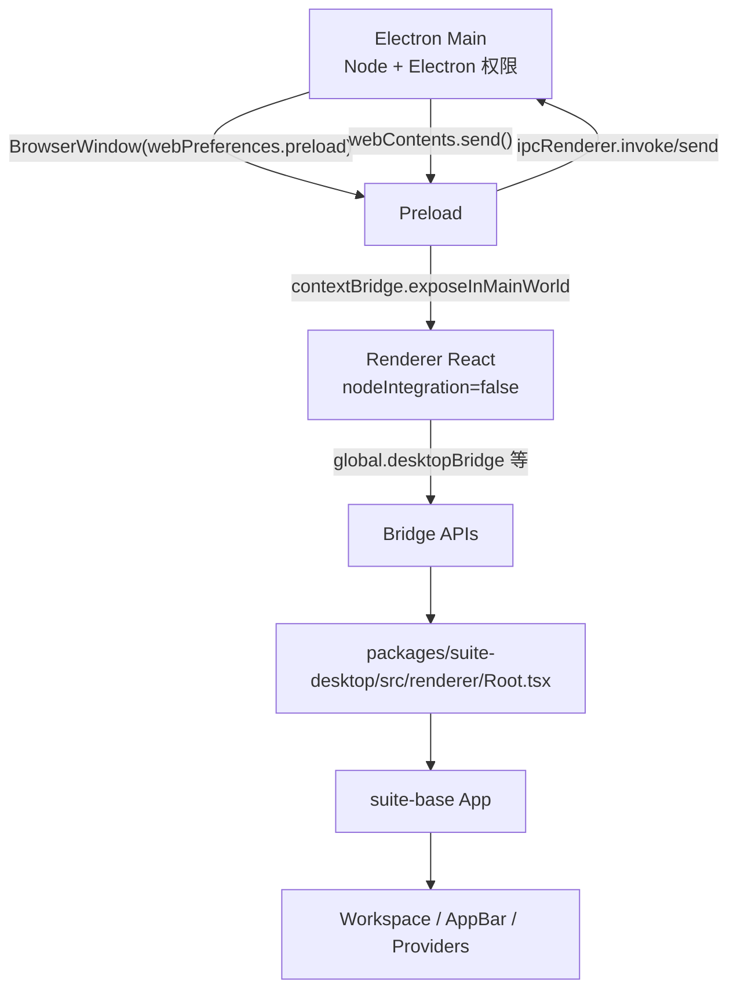

# Lichtblick 学习文档 08：Electron 进程与 IPC

> 对应母版：`docs/architecture-learning-outline.md`
>
> 本文范围：Desktop 版从 Electron Main 创建窗口，到 Preload 暴露 bridge，再到 Renderer
> 适配成 `suite-base` 能力的完整链路。重点说明 IPC 如何承载文件打开、窗口控制、设置持久化、
> 本地布局、扩展文件系统、协议处理，以及这些能力如何驱动 UI。
>
> 不在本文展开：Web 宿主、扩展 Contribution Points 细节、MessagePipeline 内部消息调度。

## 1. 学习目标

读完本文后，应能够解释：

1. Desktop 的 Main、Preload、Renderer 分别承担什么职责；
2. 为什么 Renderer 不能直接访问 Node.js，而要通过 bridge；
3. `desktop/main/index.ts`、`desktop/preload/index.ts`、`desktop/renderer/index.ts` 与
   `packages/suite-desktop` 的关系；
4. 单实例、deep link、打开文件和新窗口的启动链路；
5. Main 如何创建 `BrowserWindow` 并注入 renderer 参数；
6. Preload 如何暴露 `desktopBridge`、`storageBridge`、`menuBridge`、`ctxbridge`；
7. Renderer 如何把 bridge 包装成 suite-base 需要的接口；
8. 窗口最大化、全屏、关闭等 native 事件如何驱动 AppBar UI；
9. `.foxe` 和本地 layout 如何通过 Preload 文件系统能力进入核心运行时；
10. `package:` 与 `x-foxglove-converted-tiff:` 协议如何服务 3D 资源加载；
11. CSP、外部链接、更新检查和主题/语言同步在哪一层处理；
12. 调试 Electron 桌面问题时应从哪个边界开始查。

## 2. 核心结论

Desktop 版的架构核心是“Main 做系统副作用，Preload 做受控桥接，Renderer 复用 suite-base”。

```text
Electron Main
  创建窗口、菜单、协议、CSP、更新、文件打开、单实例
  ↕ ipcMain / webContents.send / debugger 注入
Preload
  拥有有限 Node 能力，构造 bridge
  ↕ contextBridge.exposeInMainWorld
Renderer
  只消费 bridge，把它们适配成 suite-base 的配置、窗口、菜单、layout、extension 能力
```

学习 Desktop 时，不要从 React 组件开始猜系统能力。先确定能力在哪个进程，之后再看它如何通过
bridge 进入 React。

## 3. 关键源码索引

入口包装：

- `desktop/main/index.ts`
- `desktop/preload/index.ts`
- `desktop/renderer/index.ts`

Main 进程：

- `packages/suite-desktop/src/main/index.ts`
- `packages/suite-desktop/src/main/StudioWindow.ts`
- `packages/suite-desktop/src/main/createNewWindow.ts`
- `packages/suite-desktop/src/main/getFilesToOpen.ts`
- `packages/suite-desktop/src/main/injectFilesToOpen.ts`
- `packages/suite-desktop/src/main/parseCLIFlags.ts`
- `packages/suite-desktop/src/main/fileUtils.ts`
- `packages/suite-desktop/src/main/resolveSourcePaths.ts`
- `packages/suite-desktop/src/main/rosPackageResources.ts`
- `packages/suite-desktop/src/main/settings.ts`
- `packages/suite-desktop/src/main/StudioAppUpdater.ts`

Preload：

- `packages/suite-desktop/src/preload/index.ts`
- `packages/suite-desktop/src/preload/LocalFileStorage.ts`
- `packages/suite-desktop/src/preload/layouts.ts`
- `packages/suite-desktop/src/preload/ExtensionHandler.ts`
- `packages/suite-desktop/src/preload/types.ts`

共享类型：

- `packages/suite-desktop/src/common/types.ts`
- `packages/suite-desktop/src/common/storage.ts`
- `packages/suite-desktop/src/common/rendererArgs.ts`

Renderer：

- `packages/suite-desktop/src/renderer/index.tsx`
- `packages/suite-desktop/src/renderer/Root.tsx`
- `packages/suite-desktop/src/renderer/services/NativeStorageAppConfiguration.ts`
- `packages/suite-desktop/src/renderer/services/DesktopLayoutLoader.ts`
- `packages/suite-desktop/src/renderer/services/DesktopExtensionLoader.ts`
- `packages/suite-desktop/src/renderer/services/NativeAppMenu.ts`
- `packages/suite-desktop/src/renderer/services/NativeWindow.ts`

suite-base 消费点：

- `packages/suite-base/src/App.tsx`
- `packages/suite-base/src/Workspace.tsx`
- `packages/suite-base/src/hooks/useElectronFilesToOpen.ts`
- `packages/suite-base/src/hooks/useHandleFiles.tsx`
- `packages/suite-base/src/context/Workspace/useOpenFile.tsx`
- `packages/suite-base/src/providers/CurrentLayoutProvider/index.tsx`
- `packages/suite-base/src/providers/CurrentLayoutProvider/loadDefaultLayouts.ts`
- `packages/suite-base/src/components/AppBar/index.tsx`
- `packages/suite-base/src/components/AppBar/CustomWindowControls.tsx`
- `packages/suite-base/src/context/NativeAppMenuContext.ts`
- `packages/suite-base/src/context/NativeWindowContext.ts`

构建：

- `packages/suite-desktop/src/webpackMainConfig.ts`
- `packages/suite-desktop/src/webpackPreloadConfig.ts`
- `packages/suite-desktop/src/webpackRendererConfig.ts`

## 4. 三进程边界总图



Main 和 Preload 都能使用部分 Node/Electron API；Renderer 的 webpack target 是 `web`，并且
BrowserWindow 设置 `nodeIntegration: false`。Renderer 看到的是普通浏览器环境加上 Preload 暴露的
全局 bridge。

## 5. 入口文件不是业务主体

`desktop/main/index.ts` 只是调用：

```ts
import { main } from "@lichtblick/suite-desktop/src/main";

void main();
```

`desktop/preload/index.ts` 也是包装：

```ts
import { main } from "@lichtblick/suite-desktop/src/preload";

main();
```

`desktop/renderer/index.ts` 创建 NativeStorageAppConfiguration，然后调用
`packages/suite-desktop/src/renderer/index.tsx` 的 `main()`。

所以 Desktop 业务主体在 `packages/suite-desktop/src/`，不是 `desktop/` 目录本身。

## 6. 构建产物如何连接三进程

webpack 配置将三类代码打到不同目标：

```text
main target: electron-main
preload target: electron-preload
renderer target: web
```

Main config 通过 DefinePlugin 注入 `MAIN_WINDOW_WEBPACK_ENTRY`：

```text
开发服务： http://localhost:8080/renderer/index.html
生产构建： file://.../renderer/index.html
```

Preload 输出为：

```text
main/preload.js
```

StudioWindow 创建 BrowserWindow 时，使用 `app.getAppPath()` 拼出 preload 路径。

## 7. Main 启动阶段

Main 的 `main()` 先做进程级初始化：

```text
initI18n({ context: "electron-main" })
updateLanguage()
处理 --home-dir
处理 --user-data-dir
设置 Electron commandLine switches
处理 electron-squirrel-startup
请求单实例锁
注册 open-file / open-url / ipcMain handlers
注册自定义协议 scheme
等待 app ready
```

这些都发生在 React 之前。任何与窗口创建、进程参数、文件系统、协议、菜单相关的问题，都应优先从
Main 进程入口查。

## 8. 设置目录覆盖

Main 支持两个启动参数：

```text
--home-dir=<path>
--user-data-dir=<path>
```

`--home-dir` 会在 app ready 前调用 `app.setPath("home", ...)`。`--user-data-dir` 会覆盖
`app.getPath("userData")`。测试、隔离运行和本地调试经常依赖这些参数。

## 9. 主题和语言在 Main 中的同步

Main 通过 `getAppSetting()` 从磁盘设置文件读取：

```text
COLOR_SCHEME
LANGUAGE
```

然后：

```text
COLOR_SCHEME → nativeTheme.themeSource
LANGUAGE → i18n.changeLanguage()
```

Renderer 中 `Root` 监听 `appConfiguration` 的设置变化，再调用：

```text
desktopBridge.updateNativeColorScheme()
desktopBridge.updateLanguage()
```

这是一条从 React 设置页到 Main native 状态的反向链路。

## 10. 单实例锁

Main 使用：

```text
app.requestSingleInstanceLock()
```

默认行为：

```text
第二个实例启动
  → 原实例收到 second-instance
  → 原窗口 restore/focus
  → argv 中的 deep links 转成 open-url
  → argv 中的文件转成 open-file
  → 无文件无链接则新建空窗口
  → 第二实例退出
```

如果带 `--force-multiple-windows`，第二实例的参数会交给 `createNewWindow(argv)`，在原进程中创建
新窗口。

## 11. deep link 的入口

Main 识别 `lichtblick://` 链接：

```text
argv 中的 lichtblick://...
app.on("open-url")
second-instance 中转发的 open-url
```

对 `lichtblick://signin-complete`，Main 只聚焦应用；其他 deep link 会打开新 StudioWindow，或在
app ready 前暂存到 `openUrls`。

注意：代码里注册默认协议客户端使用的是 `"foxglove"`，但实际 deep link 过滤是
`"lichtblick://"`。学习时以当前源码行为为准。

## 12. deep link 如何传给 Renderer

StudioWindow 创建 BrowserWindow 时，把 deep links 编码进 additionalArguments：

```text
encodeRendererArg("deepLinks", deepLinks)
```

Preload 再从：

```text
window.process.argv
```

解码：

```text
decodeRendererArg("deepLinks", window.process.argv)
```

最后 `desktopBridge.getDeepLinks()` 返回给 Renderer Root。

## 13. 为什么 deep link 要 base64

`rendererArgs.ts` 将值 JSON.stringify 后 base64：

```text
--deepLinks=<base64-json>
```

注释说明这是为了避免 Windows 上包含 `:` 等特殊字符时参数被破坏。也就是说，这不是业务格式，
而是跨平台命令行传参的防御性编码。

## 14. Renderer 如何应用 deep link

`Root` 初始化：

```text
window.location 中已有 ds 或 layoutId
  → 优先使用当前 URL
否则
  → 使用 desktopBridge.getDeepLinks()
```

传入 `App` 后，`Workspace` 解析 `props.deepLinks[0]`：

```text
parseAppURLState(new URL(deepLink))
```

再驱动：

- 选择数据源；
- 应用连接参数；
- 加载 layout URL；
- seek 到 URL 指定时间。

这说明 deep link 最终是通过 suite-base 的 Workspace URL 状态逻辑驱动 UI。

## 15. resetDeepLinks 的 cookie/reload 技巧

Preload 中 `desktopBridge.resetDeepLinks()` 会：

```text
document.cookie = "fox.ignoreDeepLinks=true;"
window.location.reload()
```

下次 Preload 启动时读取 cookie，忽略 deep links，然后清掉 cookie。

这是因为无法直接修改 `window.process.argv`，所以用一次性 cookie + reload 来清空启动参数效果。

## 16. 打开文件的来源

文件打开入口包括：

```text
启动 argv 中的文件路径
--source=... 参数
second-instance argv
macOS open-file 事件
Dock 拖入文件或双击文件
```

Main 先把路径收集为 `filesToOpen`。`getFilesToOpen()` 会：

- 过滤 flags；
- 转成绝对路径；
- 过滤真实文件；
- 展开 `--source`；
- 去重。

## 17. `--source` 参数

`resolveSourcePaths()` 支持：

```text
--source=/path/a.mcap,/path/b.mcap
--source=~/data/file.mcap
--source=/path/to/directory
```

如果 source 是单个目录，会读取目录中允许扩展名的文件。解析后仍会走打开文件链路。

## 18. Electron 无法直接传 File 的问题

Renderer 的数据源链路希望拿到浏览器 `File` 或 `FileSystemFileHandle`，而 Electron Main 没有直接
把本地路径变成 Renderer `File` 实例的标准通道。

当前实现使用 Chrome Debugger hack：

```text
Main 持有文件路径
  → Preload 在 DOM 创建隐藏 input[type=file]
  → Main attach webContents.debugger
  → DOM.setFileInputFiles 设置 input.files
  → input change
  → Renderer useElectronFilesToOpen() 读取 FileList
```

这避免通过 IPC 传输完整文件内容，保留浏览器 File API 的懒读能力。

## 19. 文件 input 的创建时机

Preload 在 `DOMContentLoaded` 时：

```text
创建 hidden input
id = electron-open-file-input
multiple = true
document.body.appendChild(input)
ipcRenderer.invoke("load-pending-files")
```

Main 的 `ipcMain.handle("load-pending-files")` 收到后，调用 `injectFilesToOpen()` 并将
`preloaderFileInputIsReady` 设为 true。

## 20. 运行中 open-file 事件

当应用已经运行并收到 `open-file`：

```text
filesToOpen.push(filePath)
if preloaderFileInputIsReady:
  focusedWindow 存在 → injectFilesToOpen(focusedWindow.webContents.debugger, filesToOpen)
  无 focusedWindow → new StudioWindow().load()
```

因此打开文件可能驱动当前窗口，也可能创建新窗口，取决于当前是否有聚焦窗口。

## 21. Renderer 如何消费注入的 FileList

`Workspace` 调用：

```text
const filesToOpen = useElectronFilesToOpen()
```

`useElectronFilesToOpen()` 找到隐藏 input，并监听 `change`。FileList 变化后：

```text
Workspace effect
  → handleFiles(Array.from(filesToOpen))
```

后续逻辑与普通拖放文件共用 `useHandleFiles()`。

## 22. 文件如何驱动 UI

`useHandleFiles()` 按扩展名分类：

```text
.foxe → installFoxeExtensions()
.json → parseAndInstallLayout()
其他 → 匹配 IDataSourceFactory.supportedFileTypes
```

UI 结果：

- `.foxe` 安装扩展，扩展面板和 converter 等能力刷新；
- `.json` 导入 layout；
- 数据文件触发 `selectSource(source.id, { type: "file", files })`；
- PlayerManager 创建 Player，Workspace 面板随 playerId 重挂载。

## 23. BrowserWindow 配置

StudioWindow 创建 BrowserWindow 的关键配置：

```text
contextIsolation: true
sandbox: false
nodeIntegration: false
preload: main/preload.js
additionalArguments: telemetry/crash/deepLinks
webSecurity: production 才启用
titleBarStyle: hidden
titleBarOverlay: 非 macOS 自定义
```

`sandbox: false` 是为了让 Preload 能访问 Node builtins；`nodeIntegration: false` 保证 Renderer
不能直接使用 Node。

## 24. 窗口背景和标题栏颜色

Main 根据 `nativeTheme.shouldUseDarkColors` 选择 theme palette：

```text
getWindowBackgroundColor()
getTitleBarOverlayOptions()
```

当 nativeTheme 更新：

```text
browserWindow.setTitleBarOverlay(...)
browserWindow.setBackgroundColor(...)
```

这属于 native 窗口层视觉更新，不依赖 React render。

## 25. 外部链接策略

StudioWindow 处理两类导航：

```text
setWindowOpenHandler
will-navigate
```

新窗口打开一律 `shell.openExternal(url)` 并 deny。导航到不同 host 时，也阻止并改为外部浏览器打开。

这减少了 Renderer 页面跳出应用壳的风险。

## 26. 窗口事件如何进入 Renderer

Main 监听 BrowserWindow：

```text
enter-full-screen
leave-full-screen
maximize
unmaximize
```

然后：

```text
browserWindow.webContents.send(eventName)
```

Preload 的 `desktopBridge.addIpcEventListener()` 用 `ipcRenderer.on()` 订阅这些事件，再把 unregister
函数返回给 Renderer。

## 27. 窗口状态如何驱动 AppBar UI

Renderer Root 持有：

```text
isFullScreen
isMaximized
```

订阅 bridge 事件后：

```text
maximize → setMaximized(true)
unmaximize → setMaximized(false)
enter-full-screen → setFullScreen(true)
leave-full-screen → setFullScreen(false)
```

这些 state 通过 `App` → `Workspace` → `AppBar` 传入。AppBar 根据 `isMaximized` 切换最大化按钮图标，
根据 `appBarLeftInset` 给 macOS 交通灯留空间。

## 28. 自定义窗口按钮链路

AppBar 中 `CustomWindowControls` 点击按钮：

```text
onMinimizeWindow
onMaximizeWindow
onUnmaximizeWindow
onCloseWindow
```

Root 将它们绑定到 NativeWindow：

```text
nativeWindow.minimize()
nativeWindow.maximize()
nativeWindow.unmaximize()
nativeWindow.close()
```

NativeWindow 再调用 `desktopBridge`，Preload 用 `ipcRenderer.send()` 发送：

```text
minimizeWindow
maximizeWindow
unmaximizeWindow
closeWindow
```

Main 在 StudioWindow 的 `ipc-message` handler 中执行对应 BrowserWindow 操作。

## 29. 双击标题栏链路

AppBarContainer 双击调用：

```text
nativeWindow.handleTitleBarDoubleClick()
```

之后：

```text
desktopBridge.handleTitleBarDoubleClick()
ipcRenderer.send("titleBarDoubleClicked")
Main 读取 macOS AppleActionOnDoubleClick
Minimize 或 Maximize/Unmaximize
```

这条链路体现了跨平台差异：macOS 用户偏好影响双击标题栏行为。

## 30. Preload 暴露的四个 bridge

Preload 最终调用：

```text
contextBridge.exposeInMainWorld("ctxbridge", ctx)
contextBridge.exposeInMainWorld("menuBridge", menuBridge)
contextBridge.exposeInMainWorld("storageBridge", storageBridge)
contextBridge.exposeInMainWorld("desktopBridge", desktopBridge)
```

四者职责：

| bridge          | 主要职责                                             |
| --------------- | ---------------------------------------------------- |
| `ctxbridge`     | OS 信息、环境变量、网络接口、版本                    |
| `menuBridge`    | 接收 Main 转发的 native menu 事件                    |
| `storageBridge` | 本地文件持久化读写                                   |
| `desktopBridge` | 窗口、deep link、layout、extension、CLI、主题/语言等 |

## 31. contextBridge 的限制

源码注释强调：contextBridge 不能透明暴露 class instance，原型不会跨边界保留。

因此 Preload 暴露的是纯函数对象：

```text
storageBridge.list = localFileStorage.list.bind(localFileStorage)
...
```

Renderer 再用这些函数构造自己的服务类。

## 32. `ctxbridge` 的数据

`ctxbridge` 实现 `OsContext`：

```text
platform
pid
getEnvVar()
getHostname()
getNetworkInterfaces()
getAppVersion()
```

Renderer Root 用 `ctxbridge.platform` 判断 macOS 交通灯 inset。其他 OS 信息可被 suite-base 中需要
环境能力的功能消费。

## 33. `storageBridge` 与本地设置

`storageBridge` 来自 `LocalFileStorage`：

```text
list(datastore)
all(datastore)
get(datastore, key)
put(datastore, key, value)
delete(datastore, key)
```

它实际写入：

```text
app.getPath("userData") / studio-datastores / <datastore> / <key>
```

Renderer 通过 `NativeStorageAppConfiguration` 读写 settings datastore 中的 `settings.json`。

## 34. NativeStorageAppConfiguration 如何驱动 UI

Renderer 启动时：

```text
NativeStorageAppConfiguration.Initialize(storageBridge, defaults)
  → storageBridge.get("settings", "settings.json")
  → 合并默认值
  → 作为 AppConfiguration 传给 App
```

React 中修改设置时：

```text
appConfiguration.set(key, value)
  → storageBridge.put(...)
  → 更新 currentValue
  → 通知 listeners
```

UI 结果：

- 订阅 app setting 的组件重新渲染；
- Root 监听颜色和语言设置，反向通知 Main 更新 nativeTheme 和 i18n。

## 35. 本地存储的路径校验

`LocalFileStorage` 对 datastore 和 key 做简单字符校验：

```text
if (!/[a-z-]/.test(key)) throw
if (!/[a-z-]/.test(datastore)) throw
```

它的目的是避免任意 key 直接变成危险路径。注意这里是当前源码事实；如果要加强安全性，应进一步
审查正则是否要求整串匹配。

## 36. `desktopBridge` 的主要能力

`Desktop` 接口包括：

```text
setRepresentedFilename()
addIpcEventListener()
updateNativeColorScheme()
updateLanguage()
getCLIFlags()
getDeepLinks()
resetDeepLinks()
fetchLayouts()
getExtensions()
loadExtension()
installExtension()
uninstallExtension()
handleTitleBarDoubleClick()
isMaximized()
minimizeWindow()
maximizeWindow()
unmaximizeWindow()
closeWindow()
reloadWindow()
```

它是 Desktop Renderer 最重要的系统能力入口。

## 37. `menuBridge` 的当前状态

Main 的菜单项会调用：

```text
browserWindow.webContents.send("open-file")
browserWindow.webContents.send("open-connection")
browserWindow.webContents.send("open-demo")
browserWindow.webContents.send("open-help-about")
...
```

Preload 暴露 `menuBridge.addIpcEventListener()`，Renderer Root 创建 `NativeAppMenu` 并注入
`NativeAppMenuContext`。

当前源码中，`suite-base` 直接消费 `NativeAppMenuContext` 的位置很少。文档理解上应区分：

- Main 和 Preload 已经提供 native menu event bridge；
- 实际 UI 是否响应某个 native menu event，还要看 suite-base 是否注册了对应 listener。

## 38. NativeWindowContext 的当前状态

`NativeWindowContext` 的接口只定义：

```text
setRepresentedFilename(filename)
on("enter-full-screen" | "leave-full-screen")
```

Renderer service `NativeWindow` 实际还实现了窗口按钮方法，但这些方法主要通过 Root props 传给
AppBar，不是通过 `NativeWindowContext` 类型消费。

排查窗口按钮时，应看 Root props 链路；排查 represented file 时，再看 NativeWindowContext。

## 39. 本地 layout 加载链路

Preload 中：

```text
desktopBridge.fetchLayouts()
  → ~/.lichtblick-suite/layouts
  → fetchLayouts(userLayoutsDir)
  → 读取 *.json
  → 返回 { from, layoutJson }
```

Renderer 中：

```text
DesktopLayoutLoader.fetchLayouts()
  → desktopBridge.fetchLayouts()
  → 转成 LayoutInfo { from, name, data }
```

`Root` 把 loader 传给 `App`，`App` 传给 `CurrentLayoutProvider`。

## 40. layout 如何进入 CurrentLayoutProvider

`CurrentLayoutProvider` 初始化时调用：

```text
loadDefaultLayouts(layoutManager, loaders)
```

它会：

```text
layoutManager.getLayouts()
loader.fetchLayouts()
过滤已经存在的 from
layoutManager.saveNewLayout({ permission: "CREATOR_WRITE" })
```

UI 结果是本地 layout 文件成为可选 layout。之后 CurrentLayoutProvider 再按用户 profile、
`defaultLayout` 参数或 fallback 选择当前布局。

## 41. 本地扩展文件系统链路

Preload 中：

```text
getExtensionHandler()
  → ipcRenderer.invoke("getHomePath")
  → ~/.lichtblick-suite/extensions
  → new ExtensionsHandler(userExtensionsDir)
```

`desktopBridge` 暴露：

```text
getExtensions()
loadExtension(id)
installExtension(foxeFileData)
uninstallExtension(id)
```

Renderer 中 `DesktopExtensionLoader` 把这些方法适配成 `IExtensionLoader`，供
`ExtensionCatalogProvider` 使用。

## 42. DesktopExtensionLoader 如何改变扩展元信息

DesktopExtensionLoader 会把 preload 返回的 DesktopExtension 转成 ExtensionInfo：

```text
id: extension.id
name: pkgInfo.displayName
namespace: "local"
qualifiedName: pkgInfo.displayName
readme
changelog
```

其中 `qualifiedName` 使用 displayName 是为了兼容旧布局。扩展面板 type 依赖 qualifiedName，因此
这对布局恢复很重要。

## 43. ExtensionsHandler 的文件系统职责

Preload 侧的 `ExtensionsHandler` 负责：

```text
list()
get(id)
load(id)
install(foxeFileData)
uninstall(id)
```

安装时：

```text
JSZip.loadAsync()
校验 package.json
读取 README / CHANGELOG
计算 packageId 和目录名
删除旧目录
解压所有文件到扩展目录
返回 DesktopExtension
```

这部分是 Preload 的 Node 文件系统能力，不在 Renderer 中执行。

## 44. Renderer 数据源注入

Desktop Root 默认数据源：

```text
FoxgloveWebSocketDataSourceFactory
RosbridgeDataSourceFactory
Ros1SocketDataSourceFactory
Ros1LocalBagDataSourceFactory
Ros2LocalBagDataSourceFactory
UlogLocalDataSourceFactory
VelodyneDataSourceFactory
SampleNuscenesDataSourceFactory
McapLocalDataSourceFactory
RemoteDataSourceFactory
```

相比 Web，Desktop 包含本地 bag、Velodyne 和 ROS1 socket 等桌面可用能力。Root 将这些传给
suite-base 的 `App`，后续与 Web 共享 PlayerSelection 和 PlayerManager 流程。

## 45. 打开文件对数据源 UI 的影响

无论是 native open-file、拖放，还是 AppBar 菜单打开文件，最终都会走：

```text
useOpenFile() 或 useHandleFiles()
  → selectSource(source.id, { type: "file", ... })
```

不同入口的差别只在“如何拿到 File 或 FileSystemFileHandle”：

- native open-file：Main debugger 注入隐藏 input；
- 拖放：DocumentDropListener 收集 File/handle；
- AppBar 打开：`window.showOpenFilePicker()` 返回 handle。

## 46. AppBar 菜单与 native 菜单的区别

AppBar 的 `AppMenu` 是 React UI 菜单，直接调用 Workspace actions：

```text
open → dialogActions.dataSource.open("start")
open-file → dialogActions.openFile.open()
open-connection → dialogActions.dataSource.open("connection")
```

Main 的 native menu 是系统菜单，事件通过 `webContents.send()` 进入 `menuBridge`。两者不是同一个
菜单实现。

## 47. 键盘快捷键路径

Workspace 注册全局 key handler：

```text
Meta/Ctrl + O → dialogActions.openFile.open()
Meta/Ctrl + Shift + O → dialogActions.dataSource.open("connection")
[ / ] → 左右 sidebar 展开/收起
```

因此桌面文件打开既可能来自 native menu，也可能来自 React AppBar 菜单或 Workspace 键盘处理。

## 48. 自定义协议 `package:`

Main 在 app ready 前调用：

```text
registerRosPackageProtocolSchemes()
```

ready 后调用：

```text
registerRosPackageProtocolHandlers()
```

`package:` protocol 根据 `ROS_PACKAGE_PATH` 查找 ROS package，再将资源路径转成 file URL，用
`net.fetch()` 返回。

## 49. `x-foxglove-converted-tiff:` 协议

Chrome 不原生支持某些 TIFF 图片。3D 面板资源加载会将特定 TIFF URL 改写为
`x-foxglove-converted-tiff:`，Main handler：

```text
读取 TIFF
UTIF.decode()
转 RGBA
PNG.sync.write()
返回 image/png Response
```

这条链路使 3D 模型资源能在 Renderer 的 `` 或纹理加载中使用 PNG。

## 50. ROS_PACKAGE_PATH 设置来源

协议处理优先读取：

```text
getAppSetting(AppSetting.ROS_PACKAGE_PATH)
```

如果没有，再读：

```text
process.env.ROS_PACKAGE_PATH
```

所以 UI 设置页写入的 ROS_PACKAGE_PATH 会影响 Main 协议解析，而不仅是 Renderer 内部状态。

## 51. CSP 设置

Main 在 app ready 后设置默认 session 的 headers：

```text
session.defaultSession.webRequest.onHeadersReceived(...)
```

构造的 Content Security Policy 包括：

- `script-src 'self' 'unsafe-inline' 'unsafe-eval'`；
- `worker-src 'self' blob:`；
- `connect-src` 允许 ws/wss/http/https/package/blob/data/file；
- `img-src` 允许 package、x-foxglove-converted-tiff 和 http；
- `media-src` 允许 data/https/http/blob/file。

内部 `chrome-extension:`、`devtools:`、`data:` 不设置 CSP。

## 52. 为什么 script-src 允许 unsafe-eval

当前应用需要运行扩展等动态代码路径，CSP 中保留了 `unsafe-eval`。这是一项明确的桌面运行时权衡：

```text
扩展能力/开发体验
  ↔ 更严格 CSP
```

不要把它误读为普通 Web 页面默认安全策略。

## 53. 自动更新

Main ready 后启动：

```text
StudioAppUpdater.Instance().start()
```

更新检查由 Main 完成，使用 `electron-updater` 和 native dialog。它读取：

```text
AppSetting.UPDATES_ENABLED
```

开发环境和 dev/nightly 版本会记录禁用信息。菜单中的“检查更新”也调用
`StudioAppUpdater.Instance().checkNow()`。

## 54. 窗口菜单与多窗口

每个 StudioWindow 构建自己的 Menu。Main 监听：

```text
app.on("browser-window-focus")
```

当窗口聚焦时：

```text
StudioWindow.fromWebContentsId(browserWindow.webContents.id)
Menu.setApplicationMenu(studioWindow.getMenu())
```

这保证 native menu 的事件发送到当前聚焦窗口。

## 55. StudioWindow 的窗口索引

StudioWindow 用：

```text
static #windowsByContentId = new Map<number, StudioWindow>()
```

以 webContents id 索引窗口。注释说明 webContents id 在 IPC 和 app handler 中比 BrowserWindow id
更可用。

窗口关闭时从 Map 删除。

## 56. reloadMainWindow 的实现

Renderer 调用：

```text
desktopBridge.reloadWindow()
```

Main 收到 `"reloadMainWindow"` 后执行 StudioWindow 内部 reload：

```text
记录是否 maximized
close + destroy 旧 BrowserWindow
重新 build BrowserWindow + Menu
load()
如果之前 maximized 则 maximize()
```

这不是普通网页 reload，而是重建 BrowserWindow。

## 57. Renderer 初始化顺序

Renderer main 做：

```text
installDevtoolsFormatters()
overwriteFetch()
找到 #root
Sockets.Create()
waitForFonts()
initI18n()
desktopBridge.getCLIFlags()
createRoot().render(<Root ... />)
```

`Sockets.Create()` 早于 window.onload，是为了 electron-socket RPC 的消息处理时序。

## 58. electron-socket

Preload 调用：

```text
PreloaderSockets.Create()
```

Renderer 调用：

```text
Sockets.Create()
```

这建立 `@lichtblick/electron-socket` 的 RPC 通道。它是 Electron 桌面环境中的辅助通信能力，独立于
本文重点的 contextBridge bridge。

## 59. App 组装差异

Desktop Renderer 最终使用 `packages/suite-base/src/App.tsx`，而 Web 常走 `SharedRoot + StudioApp`。

Desktop App 接收：

```text
appConfiguration
appParameters
dataSources
deepLinks
extensionLoaders
layoutLoaders
nativeAppMenu
nativeWindow
custom window controls props
```

这些就是 Desktop 宿主向共享核心注入的差异点。

## 60. UI 驱动总表

| 触发源               | 进程边界        | Renderer 状态/接口         | UI 结果                    |
| -------------------- | --------------- | -------------------------- | -------------------------- |
| `maximize`           | Main → Preload  | Root `isMaximized=true`    | AppBar 最大化按钮切图标    |
| `enter-full-screen`  | Main → Preload  | Root `isFullScreen=true`   | macOS appBar inset 取消    |
| native open-file     | Main debugger   | `useElectronFilesToOpen()` | 打开数据源/布局/扩展       |
| setting color scheme | Renderer → Main | `nativeTheme.themeSource`  | native 标题栏/背景同步     |
| setting language     | Renderer → Main | Main i18n language         | native menu 重建语言       |
| local layouts        | Preload FS      | `DesktopLayoutLoader`      | Layout 列表增加默认布局    |
| local extensions     | Preload FS      | `DesktopExtensionLoader`   | ExtensionCatalog 更新      |
| AppBar open file     | Renderer only   | `showOpenFilePicker()`     | selectSource(file handles) |
| `package:` resource  | Renderer fetch  | Main protocol handler      | 3D 资源可加载              |

## 61. 错误处理边界

典型错误处理方式：

- Main 文件注入失败：记录日志并弹 native error box；
- protocol handler 失败：返回 `Response.error()`；
- LocalFileStorage 读不到文件：对 ENOENT 返回 undefined；
- layout 读取失败：记录错误，跳过该文件；
- extension 读取失败：记录错误，继续处理其他扩展；
- NativeStorageAppConfiguration set：mutex 串行写入，之后通知 listener；
- Renderer 打开文件取消：`showOpenFilePicker()` 捕获 AbortError，返回空数组。

整体策略仍是局部失败，不让桌面壳直接崩溃。

## 62. 关键异步边界

需要重点记住：

- `app.on("ready")` 之前只能做部分 Electron 初始化；
- `load-pending-files` 必须在窗口打开前注册；
- Preload 创建 hidden input 后才通知 Main 注入文件；
- Renderer 等待字体和 i18n 后才 render；
- `CurrentLayoutProvider` 会等待 layoutManager busy 状态或超时；
- settings 写入通过 mutex 避免并发 read-modify-write 冲突；
- nativeTheme、language、window events 都是跨进程异步更新。

## 63. 安全边界

当前安全相关事实：

```text
contextIsolation: true
nodeIntegration: false
sandbox: false
Renderer webpack target: web
外部链接交给 shell.openExternal
自定义协议由 Main 显式处理
CSP 由 Main 注入
Preload 暴露有限 bridge
```

`sandbox: false` 是为了 Preload 能访问 Node builtins；这增加了 Preload 代码的责任。任何新增 bridge
都应保持接口窄、参数清晰、避免把通用文件系统能力直接给 Renderer。

## 64. 调试入口：窗口按钮不对

检查顺序：

1. Main 是否收到 `maximize/unmaximize` BrowserWindow event；
2. `webContents.send("maximize")` 是否发出；
3. Preload `desktopBridge.addIpcEventListener()` 是否注册；
4. Renderer Root 的 `setMaximized()` 是否执行；
5. AppBar 是否收到 `isMaximized` prop；
6. `CustomWindowControls` 是否渲染。

如果按钮点击无效，反向查：

```text
CustomWindowControls → Root callback → NativeWindow → desktopBridge → ipcRenderer.send → StudioWindow ipc-message
```

## 65. 调试入口：打开文件无效

检查顺序：

1. Main `filesToOpen` 是否包含文件绝对路径；
2. Preload 是否创建 `#electron-open-file-input`；
3. Main 是否收到 `load-pending-files`；
4. `injectFilesToOpen()` 是否成功 attach debugger；
5. hidden input 的 change 是否触发；
6. `useElectronFilesToOpen()` 是否更新 FileList；
7. `Workspace` 是否调用 `handleFiles()`；
8. `useHandleFiles()` 是否找到匹配 data source、layout 或 extension。

这条链路横跨 Main、Preload、DOM 和 React，排查时不要只看数据源工厂。

## 66. 调试入口：设置没有影响 native

颜色设置：

```text
AppConfiguration.set(COLOR_SCHEME)
  → NativeStorageAppConfiguration listener
  → Root handler
  → desktopBridge.updateNativeColorScheme()
  → ipcMain.handle("updateNativeColorScheme")
  → nativeTheme.themeSource
```

语言设置：

```text
AppConfiguration.set(LANGUAGE)
  → Root handler
  → desktopBridge.updateLanguage()
  → Main updateLanguage()
  → i18n.changeLanguage()
  → StudioWindow languageChanged 重建 Menu
```

先确认 settings 文件已写入，再查 Root listener 和 Main handler。

## 67. 调试入口：本地 layout 没加载

检查顺序：

1. Preload `fetchLayouts()` 使用的目录是否是 `~/.lichtblick-suite/layouts`；
2. 目录是否存在；
3. 文件是否是 `.json`；
4. JSON 是否可解析；
5. `DesktopLayoutLoader.fetchLayouts()` 是否返回 LayoutInfo；
6. `loadDefaultLayouts()` 是否因为 `from` 已存在而过滤；
7. `layoutManager.saveNewLayout()` 是否成功；
8. CurrentLayoutProvider 是否选择了该 layout。

## 68. 调试入口：本地扩展没加载

检查顺序：

1. Preload 扩展目录是否是 `~/.lichtblick-suite/extensions`；
2. 目录下 package.json 是否存在；
3. `ExtensionsHandler.getPackageId()` 是否通过；
4. `DesktopExtensionLoader.getExtensions()` 是否返回 ExtensionInfo；
5. `ExtensionCatalogProvider.refreshAllExtensions()` 是否调用 loader；
6. `loadExtension(id)` 是否能读到 package.json main 指向的源码；
7. `buildContributionPoints()` 是否执行成功。

本地扩展链路的文件系统部分在 Preload，不在 Main，也不在 Renderer。

## 69. 调试入口：`package:` 资源加载失败

检查顺序：

1. `registerRosPackageProtocolSchemes()` 是否在 app ready 前调用；
2. `registerRosPackageProtocolHandlers()` 是否在 ready 后调用；
3. AppSetting.ROS_PACKAGE_PATH 或环境变量是否存在；
4. 目标 package 的 `package.xml` 是否能递归找到；
5. URL host 是否等于 ROS package 名；
6. relPath 拼接后的文件是否存在；
7. CSP `img-src/connect-src` 是否允许相应 scheme。

## 70. 测试入口

Main：

- `packages/suite-desktop/src/main/createNewWindow.test.ts`
- `packages/suite-desktop/src/main/getFilesToOpen.test.ts`
- `packages/suite-desktop/src/main/parseCLIFlags.test.ts`
- `packages/suite-desktop/src/main/resolveSourcePaths.test.ts`
- `packages/suite-desktop/src/main/fileUtils.test.ts`
- `packages/suite-desktop/src/main/rosPackageResources.test.ts`
- `packages/suite-desktop/src/main/StudioAppUpdater.test.ts`

Preload：

- `packages/suite-desktop/src/preload/ExtensionHandler.test.ts`
- `packages/suite-desktop/src/preload/layouts.test.ts`

Renderer service：

- `packages/suite-desktop/src/renderer/services/NativeStorageAppConfiguration.test.ts`
- `packages/suite-desktop/src/renderer/services/DesktopLayoutLoader.test.ts`
- `packages/suite-desktop/src/renderer/services/DesktopExtensionLoader.test.ts`

suite-base 消费：

- `packages/suite-base/src/context/Workspace/useOpenFile.test.tsx`
- `packages/suite-base/src/hooks/useHandleFiles.test.tsx`
- `packages/suite-base/src/Workspace.test.tsx`
- `packages/suite-base/src/components/AppBar/AppMenu.test.tsx`

E2E：

- `e2e/tests/desktop/extension/open-extension-panel.desktop.spec.ts`
- `e2e/tests/desktop/extension/uninstall-extension.desktop.spec.ts`
- `e2e/tests/desktop/extension/install-extension-on-source-folder.spec.ts`

## 71. 复述题

学习后可以用这些问题自测：

1. 为什么 Renderer 不能直接访问文件系统？
2. `nodeIntegration: false` 和 `sandbox: false` 分别影响哪个进程？
3. deep link 为什么通过 additionalArguments，而不是直接通过 window URL？
4. native open-file 为什么要用 hidden input + debugger 注入？
5. AppBar 最大化按钮的图标变化由哪个 React state 驱动？
6. settings 写入后，nativeTheme 如何更新？
7. DesktopLayoutLoader 与 CurrentLayoutProvider 之间的数据格式如何转换？
8. DesktopExtensionLoader 的文件系统能力实际在哪个进程执行？
9. `package:` 协议为什么必须在 Main 处理？
10. native menu event bridge 已存在时，为什么还要确认 suite-base 是否实际消费？

## 72. 后续学习衔接

本文解释了 Desktop 宿主如何把系统能力安全地送进共享核心。下一篇应学习
UserScriptPlayer 与变量，因为它位于 Player 包装链中，既消费布局中的 user scripts 和全局变量，
又会改变 MessagePipeline 下游看到的 topics、消息和脚本输出。
