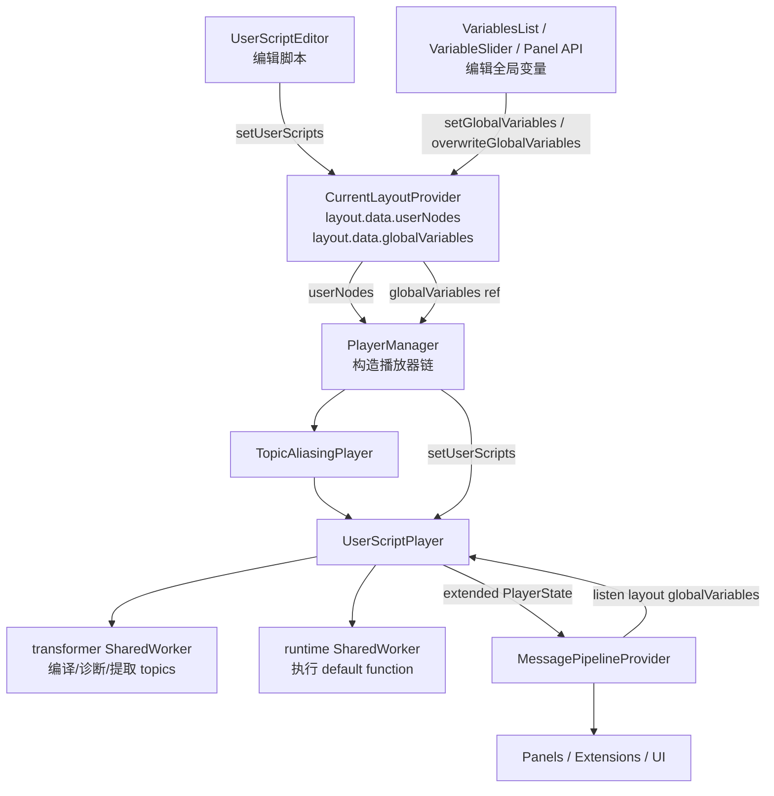

# 09. UserScriptPlayer 与变量

本文说明 Lichtblick 中用户脚本与全局变量的完整链路：脚本如何存入布局、如何被编译和注册、如何接入播放器消息流、如何产出虚拟 topic，以及全局变量如何同时驱动脚本、扩展面板、消息转换和 UI 更新。

阅读本文时建议同时打开以下源码：

- `packages/suite-base/src/components/PlayerManager.tsx`
- `packages/suite-base/src/players/UserScriptPlayer/index.ts`
- `packages/suite-base/src/players/UserScriptPlayer/subscriptions.ts`
- `packages/suite-base/src/players/UserScriptPlayer/runtimeWorker/index.ts`
- `packages/suite-base/src/players/UserScriptPlayer/runtimeWorker/registry.ts`
- `packages/suite-base/src/players/UserScriptPlayer/transformerWorker/index.ts`
- `packages/suite-base/src/players/UserScriptPlayer/transformerWorker/transform.ts`
- `packages/suite-base/src/context/UserScriptStateContext.tsx`
- `packages/suite-base/src/hooks/useGlobalVariables.ts`
- `packages/suite-base/src/components/MessagePipeline/index.tsx`
- `packages/suite-base/src/panels/UserScriptEditor/index.tsx`
- `packages/suite-base/src/components/VariablesList/index.tsx`
- `packages/suite-base/src/components/VariablesList/Variable.tsx`
- `packages/suite-base/src/panels/VariableSlider/index.tsx`
- `packages/suite-base/src/components/PanelExtensionAdapter/PanelExtensionAdapter.tsx`
- `packages/suite-base/src/components/PanelExtensionAdapter/renderState.ts`

## 1. 本篇定位

`UserScriptPlayer` 是播放器链路中的一个包装层。

它不直接读取 bag、MCAP、ROS bridge 或 WebSocket 数据，而是包在真实播放器之上，消费真实播放器已经产出的 `PlayerState`，再根据当前布局中的用户脚本生成新的虚拟消息。

这些虚拟消息看起来像普通 topic 消息，因此后续的 `MessagePipelineProvider`、面板订阅、图表、Raw Messages、Plot、扩展面板等 UI 可以用同一套机制消费它们。

全局变量则是布局数据的一部分。它们可以由 Variables UI、Variable Slider、扩展面板 API 等入口写入，并通过 `MessagePipeline`、`UserScriptPlayer`、`PanelExtensionAdapter` 继续向脚本、转换器和面板渲染状态传播。

## 2. 要解决的问题

用户脚本功能要同时解决四类问题：

- 在布局中持久保存脚本源代码、脚本名称和当前选择状态。
- 从脚本源代码中提取输入 topics、输出 topic、输出 schema 和类型诊断。
- 在实时播放和历史范围读取时，把真实输入消息转换为脚本输出消息。
- 当全局变量变化时，不重建整棵 React 树，但仍然让脚本、面板和消息转换得到最新变量。

这四件事分别落在布局状态、transform worker、runtime worker、播放器包装层和 MessagePipeline 监听逻辑中。

## 3. 总体数据流

核心链路如下：



注意两个方向：

- 脚本配置从布局进入 `PlayerManager`，再进入 `UserScriptPlayer`。
- 全局变量从布局进入多个消费者：`UserScriptPlayer`、`TopicAliasingPlayer`、`PanelExtensionAdapter` 和消息转换器。

## 4. 关键源码分工

`PlayerManager` 负责组装播放器链。

`UserScriptPlayer` 负责脚本注册、订阅重写、消息计算、虚拟 topic 暴露、历史批量迭代和错误 alert。

`transformerWorker` 负责静态处理脚本：TypeScript 编译、输入 topic 提取、输出 topic 提取、输出 datatype 提取、全局变量类型提取和诊断生成。

`runtimeWorker` 负责运行脚本函数。它拿到单条输入消息和当前全局变量后，调用用户脚本默认导出的函数，得到输出消息。

`UserScriptStateContext` 负责 UI 状态：诊断、日志、ROS 类型库和生成类型库。

`UserScriptEditor` 负责编辑布局中的 `userNodes`，并展示 `UserScriptStateContext` 中的诊断和日志。

`useGlobalVariables`、`VariablesList`、`VariableSlider` 和 `PanelExtensionAdapter` 负责全局变量的读写和 UI 暴露。

## 5. 用户脚本不是独立存储

脚本定义存储在当前布局的 `data.userNodes` 中。

这意味着脚本属于布局配置，而不是属于某个 data source、某个播放器实例或浏览器本地全局状态。

布局切换时，脚本集合会随布局一起切换。布局导入导出时，脚本也跟随布局数据移动。

对应的 layout action 是 `setUserScripts`，最终由 `CurrentLayoutProvider` 的 reducer 更新 `selectedLayout.data.userNodes`。

## 6. 全局变量也属于布局

全局变量存储在当前布局的 `data.globalVariables` 中。

`useGlobalVariables` 从 `CurrentLayoutContext` 读取该对象，并返回三个核心能力：

- `globalVariables`：当前布局变量。
- `setGlobalVariables`：增量合并变量。
- `overwriteGlobalVariables`：整体替换变量对象。

`setGlobalVariables` 有一个特殊约定：当某个 key 的值为 `undefined` 时，该变量会被删除。

这就是删除变量、重命名变量、扩展面板设置变量和滑块更新变量共同依赖的底层语义。

## 7. UserScriptStateContext 的边界

`UserScriptStateContext` 不保存脚本源代码。

它保存的是脚本运行和编辑辅助状态：

- 每个脚本的 diagnostics。
- 每个脚本的 logs。
- 当前 ROS 类型库声明。
- 当前 generated types 类型库声明。

这个设计把“可持久化布局数据”和“运行时 UI 辅助数据”分开了。

脚本源码属于布局；诊断和日志属于当前运行会话。

## 8. PlayerManager 如何插入 UserScriptPlayer

播放器链的核心顺序是：

```text
Base Player
  -> TopicAliasingPlayer
  -> UserScriptPlayer
  -> MessagePipelineProvider
  -> Panels
```

`TopicAliasingPlayer` 放在 `UserScriptPlayer` 前面，意味着用户脚本看到的是 alias 处理后的 topic 空间。

`UserScriptPlayer` 放在 `MessagePipelineProvider` 前面，意味着脚本输出会作为普通 `PlayerState.activeData.messages` 进入后续面板管线。

这个位置非常关键。如果脚本输出不在 `MessagePipeline` 之前生成，面板订阅、schema 转换、扩展 API 和可视化面板就无法自然复用现有消息处理机制。

## 9. PlayerManager 创建脚本播放器

`PlayerManager` 从当前布局中读取 `userScripts` 和 `globalVariables`。

创建播放器时，它先创建基础 player，再创建 `TopicAliasingPlayer`，最后创建 `UserScriptPlayer`。

创建 `UserScriptPlayer` 后，会立即调用：

```text
userScriptPlayer.setGlobalVariables(globalVariablesRef.current)
```

这保证播放器刚接入时已经有最新变量。

随后 `PlayerManager` 通过 layout effect 监听 `userScripts` 变化，并调用 `player.setUserScripts(userScripts)`。

## 10. 为什么有 isLayoutLoading 保护

`PlayerManager` 在布局加载期间不会立刻把 `userScripts` 写入 `UserScriptPlayer`。

原因是布局加载过程中可能短暂出现空对象。如果这时把 `{}` 传给 `UserScriptPlayer`，脚本注册会被清空，随后布局真正加载完成又重新注册。

这种中间态会造成不必要的 worker 重置、订阅重写、诊断清空和 UI 抖动。

所以代码用 `isLayoutLoading` 避免在布局尚未稳定时拆掉脚本注册。

## 11. setUserScripts 的职责

`UserScriptPlayer.setUserScripts` 是脚本定义进入播放器的入口。

它主要做这些事：

- 判断哪些脚本的 `sourceCode` 发生变化。
- 把变更脚本 id 放入 `#userScriptIdsNeedUpdate`。
- 更新受 mutex 保护的 `userScripts`。
- 裁剪 `scriptRegistrationCache`。
- 失效 batch iterator cache。
- 重新创建脚本 topic 对象引用。
- 重置 worker registration。
- 根据当前订阅重新映射底层订阅。
- 如果当前暂停，触发一次无上游消息的重算。

这里的重点是：编辑脚本不是简单更新字符串，而是会影响 topic 列表、datatype、历史读取缓存、订阅映射和 UI topic 引用。

## 12. 为什么编辑脚本要重建 topic 对象

脚本源代码变化时，`UserScriptPlayer` 会重新创建脚本 topic 对象。

原因是某些下游逻辑会用对象引用变化判断预加载数据是否失效。例如 Plot 相关逻辑如果看到 topic 引用变化，就能知道脚本输出已被重新定义，旧的预加载结果不能继续信任。

这不是渲染层细节，而是数据一致性机制。

## 13. 脚本注册缓存

`UserScriptPlayer` 维护 `scriptRegistrationCache`。

如果同一个 `scriptId` 对应的脚本内容没有变化，可以复用之前的注册结果，避免重复 transform 和 runtime worker 注册。

缓存长度会被控制在当前脚本数量加一附近。

这个“加一”适合处理常见编辑场景：当前脚本刚改完，旧注册和新注册短时间都可能参与状态转换或缓存替换。

## 14. transformer worker 的输入

创建脚本注册时，`UserScriptPlayer` 会构造 `TransformArgs`。

里面包含：

- 脚本名称。
- 脚本源代码。
- 当前播放器 active topics。
- 当前 ROS 类型库。
- 当前 generated types 类型库。
- 基础 datatypes 与播放器 datatypes 的合集。

这些数据足够 transformer 判断脚本能否成立：输入 topic 是否存在、输出 topic 是什么、返回值能否构造 schema、TypeScript 是否通过。

## 15. transformer pipeline

`transformerWorker/transform.ts` 中的处理顺序是：

```text
getOutputTopic
  -> compile
  -> getInputTopics
  -> validateInputTopics
  -> extractDatatypes
  -> extractGlobalVariables
```

每一步接收 `ScriptData` 并返回新的 `ScriptData`。

诊断信息会累积在 `diagnostics` 中。遇到编译错误时，一些后续提取步骤会跳过，避免在错误 AST 上继续推断。

## 16. 输出 topic 如何提取

输出 topic 通过源码中的常量声明提取：

```ts
export const output = "/studio_script/output_topic";
```

如果找不到输出 topic，transformer 会生成 `OutputTopicChecker` 来源的错误诊断。

输出 topic 是脚本对 UI 暴露的虚拟 topic 名称。它不会发布回真实数据源，只存在于 Lichtblick 内部播放器状态中。

## 17. 输入 topics 如何提取

输入 topics 通过 TypeScript AST 提取，要求脚本导出数组变量：

```ts
export const inputs = ["/input/topic"];
```

数组元素必须是字符串字面量。

如果没有导出、为空、不是数组或包含非字符串字面量，transformer 会生成 `InputTopicsChecker` 诊断。

这条规则让 `UserScriptPlayer` 能在运行前知道脚本需要订阅哪些真实 topic。

## 18. 输入 topic 可用性校验

`validateInputTopics` 会把脚本声明的输入 topics 与当前 active topics 比较。

如果脚本声明的输入 topic 当前不可用，会生成错误诊断。

这类错误会显示在 User Script Editor 的 Alerts 区域，并阻止该脚本成为有效运行注册。

## 19. TypeScript 编译如何工作

`compile` 使用 TypeScript compiler API 创建内存中的虚拟项目。

虚拟项目包含：

- 用户脚本文件。
- ROS 类型声明。
- generated types。
- 用户脚本工具文件。
- `@foxglove/schemas` 等声明文件。

编译输出的主文件是脚本 transpiled JavaScript。其他工具文件会写入 `projectCode`，供 runtime worker 的 `require` 实现使用。

## 20. 输出 datatype 如何生成

`extractDatatypes` 查找默认导出的脚本函数，并根据返回类型构造输出 datatype。

如果脚本返回类型无法构造成消息定义，会生成 `DatatypeExtraction` 来源的诊断。

这一步让脚本输出 topic 不只是有名称，还能拥有 schemaName 和 datatypes，从而被面板、Raw Messages、Plot 和扩展 API 当成普通 topic 使用。

## 21. GlobalVariables 类型提取的意义

`extractGlobalVariables` 会查找名为 `GlobalVariables` 的 interface 或 type alias。

它把其中的成员名记录进 `ScriptData.globalVariables`。

这一步主要用于脚本工程和类型辅助。运行时传入脚本的是实际变量对象，而不是这里提取的成员清单。

也就是说，类型提取帮助编辑体验；变量值传播靠 layout 的 `globalVariables` 对象。

## 22. transform worker 的隔离

transform worker 是 `SharedWorker`。

它通过 RPC 暴露 `transform`、`generateRosLib` 和 `close`。

worker 内还会阻断 `fetch`，避免用户脚本 transform 阶段进行网络访问。

这使脚本编译和类型提取既不阻塞 UI 主线程，也不会给脚本一个任意网络访问入口。

## 23. runtime worker 的隔离

runtime worker 也是 `SharedWorker`。

它暴露两个主要能力：

- `registerScript`：加载 transpiled script 和 projectCode。
- `processMessage`：处理单条输入消息并返回脚本输出。

worker 内同样阻断 `fetch`。

脚本运行出错时，不会直接破坏播放器主流程，而是返回 runtime diagnostic，并由 `UserScriptStateContext` 展示。

## 24. runtime 如何加载脚本

`runtimeWorker/registry.ts` 使用 `new Function("exports", "require", scriptCode)` 执行 transpiled JavaScript。

执行后读取默认导出函数，并保存为当前 worker 的 `nodeCallback`。

后续每次 `processMessage` 都调用：

```ts
nodeCallback(message, globalVariables);
```

这里的 `message` 是输入 `MessageEvent` 的简化对象，`globalVariables` 是当前布局变量对象。

## 25. runtime 日志

runtime 注册了 `self.log`。

用户脚本可以调用 `log(value)`，日志会进入 runtime 返回值，再由 `UserScriptPlayer` 写入 `UserScriptStateContext`。

`UserScriptEditor` 的 Logs tab 读取对应脚本 id 的 logs 并展示。

日志值如果是对象，会用 JSON tree 展示；基础值直接显示。

## 26. runtime 日志的限制

`log` 不接受函数参数。

如果传入函数，runtime 会抛出错误。

这个限制降低了无法序列化值进入 UI 展示层的风险。

## 27. 脚本注册对象

每个有效脚本会形成一个 `ScriptRegistration`。

它包含：

- `scriptId`
- `scriptData`
- `inputs`
- `output`
- `processMessage`
- `processBlockMessage`
- `buildMessageProcessor`
- `terminate`

实时播放使用 `processMessage`。

历史范围读取使用 `processBlockMessage` 和 batch iterator 相关能力。

## 28. resetWorkersUnlocked 的职责

`#resetWorkersUnlocked` 是脚本注册重建的核心方法。

它会：

- 终止旧 registration。
- 生成或更新类型库。
- 为每个脚本创建 registration。
- 校验输出 topic。
- 校验输出 topic 唯一性。
- 校验输出 topic 不与真实 topic 冲突。
- 建立 output topic 到 input topics 的映射。
- 原子替换 `#outputTopicRegistrations`。
- 更新 memoized script topics 和 datatypes。
- 清理有效脚本的 diagnostics。

这一步完成后，`UserScriptPlayer` 才具备把输入消息转换成输出消息的能力。

## 29. 输出 topic 冲突检查

脚本输出 topic 不能和真实播放器 topics 冲突。

多个脚本也不能输出同一个 topic。

否则下游订阅和 UI 都无法判断某个 topic 的来源和 schema。

这些错误不会让整个播放器崩溃，而是进入诊断或 alert 体系，让用户在编辑器中处理。

## 30. 禁止脚本串脚本的原因

源码中有一条保护：脚本输入不能是另一个脚本的输出。

换句话说，不支持：

```text
real topic -> script A output -> script B input
```

这避免了脚本之间形成依赖图、拓扑排序、循环检测和跨脚本重算问题。

当前模型更简单：所有脚本都只从真实播放器 topics 读取输入，然后各自产生虚拟输出。

## 31. topics 和 datatypes 如何进入 UI

`UserScriptPlayer` 在 emit `PlayerState` 时，会扩展 `activeData.topics` 和 `activeData.datatypes`。

真实播放器 topics 保留不变，脚本 topics 追加进去。

脚本 datatypes 与基础 datatypes 合并。

因此 UI 不需要专门知道某个 topic 来自脚本。只要它消费 `PlayerState.activeData.topics`，就会看到脚本虚拟 topic。

## 32. UI 如何被脚本 topic 驱动

脚本 topic 进入 `activeData.topics` 后，会影响多个 UI 入口：

- topic 选择器可以看到脚本输出。
- 面板订阅可以订阅脚本输出。
- Raw Messages 可以展示脚本输出。
- Plot 可以把脚本输出作为数据源。
- 扩展面板的 renderState topics 可以看到脚本输出。
- schema 转换可以处理脚本输出消息。

这就是 `UserScriptPlayer` 放在 `MessagePipelineProvider` 前面的直接收益。

## 33. 实时播放消息流

实时播放时，基础 player 先产生一帧 `PlayerState.activeData.messages`。

`UserScriptPlayer.#onPlayerState` 接收到这帧消息后，会：

- 保存最新 player state。
- 必要时重置 worker。
- 更新每个输入 topic 的最后一条消息。
- 找到对当前消息感兴趣的脚本 registration。
- 把输入消息和当前全局变量传给 runtime worker。
- 收集脚本输出消息。
- 把真实消息、重算消息和新脚本输出合并排序。
- emit 新的 `PlayerState`。

下游看到的是一帧已经带有脚本输出的状态。

## 34. processMessage 的输入

runtime worker 接收的输入包含：

- topic。
- receiveTime。
- message。
- datatype。
- 当前 globalVariables。

脚本函数拿到的 event 来自输入消息，第二个参数是全局变量对象。

如果脚本没有返回消息，`UserScriptPlayer` 会产生 warning alert，因为订阅方期待这个脚本能产出对应虚拟 topic 的消息。

## 35. 脚本输出 MessageEvent

脚本输出会被包装成 `MessageEvent`。

其关键字段来自两侧：

- `topic` 使用脚本声明的 `outputTopic`。
- `schemaName` 使用 transformer 推断出的 `outputDatatype`。
- `receiveTime` 沿用输入消息 receiveTime。
- `message` 使用脚本返回值。
- `sizeInBytes` 沿用输入消息 sizeInBytes。

沿用 receiveTime 的结果是：脚本输出在时间线上与触发它的输入消息对齐。

## 36. 为什么输出消息要排序

一帧中可能同时包含真实消息、多个脚本输出、以及脚本编辑后基于历史最后消息的重算结果。

`UserScriptPlayer` 会按 receiveTime 排序，保证下游按时间顺序消费。

这对 Plot、状态面板和扩展面板处理 currentFrame 很重要。

## 37. lastMessageByInputTopic

`UserScriptPlayer` 维护 `#lastMessageByInputTopic`。

它记录每个输入 topic 最近看到的一条消息。

这个结构用于脚本变更后的重算：如果脚本 A 修改了，但当前帧没有包含 A 的所有输入 topic，播放器仍然可以用最近的输入消息重新计算 A 的输出。

## 38. 脚本编辑后的暂停态重算

如果当前播放是暂停状态，用户编辑脚本后也需要看到脚本输出变化。

`setUserScripts` 在 paused activeData 下会重新 emit 一次状态，并把上游 `messages` 设为空数组，避免重复发出真实播放器消息。

随后 `#onPlayerState` 会根据 `lastMessageByInputTopic` 对变化脚本做重算。

这就是暂停时编辑脚本，UI 仍能更新脚本输出的原因。

## 39. seek 后为什么要重置

seek 会改变时间位置。

之前缓存的最后输入消息、脚本输出和 batch iterator 状态都可能不再对应当前时间。

因此 `#onPlayerState` 会在检测到 seek 或 topics/datatypes 引用变化时重置 worker 和相关缓存。

这保证脚本输出不会跨时间位置污染。

## 40. 订阅 remap 的目标

面板订阅的是脚本输出 topic。

但真实播放器并不知道脚本输出 topic。真实播放器只能读取脚本输入 topic。

所以 `UserScriptPlayer` 必须把虚拟订阅重写为真实订阅。

这个逻辑在 `subscriptions.ts` 中完成。

## 41. remapVirtualSubscriptions

当下游订阅脚本输出 topic 时，`remapVirtualSubscriptions` 会查找该输出 topic 对应的输入 topics。

然后它把这个订阅替换为对所有输入 topics 的订阅。

非脚本 topic 订阅保持不变。

最后通过 `mergeSubscriptions` 合并重复订阅。

结果是：UI 订阅虚拟 topic，底层播放器实际拉取真实输入 topic。

## 42. 字段订阅为什么会被放宽

虚拟 topic 订阅映射到输入 topic 时，会订阅所有字段。

原因是 `UserScriptPlayer` 无法静态知道用户脚本会访问输入消息的哪些字段。

如果只订阅 UI 请求的输出字段，可能导致脚本执行时缺少输入字段。

所以脚本输入订阅需要比普通面板字段订阅更保守。

## 43. preloadType 如何处理

`getPreloadTypes` 会按 topic 汇总订阅 preload 类型。

如果任意订阅需要 full preload，则该 topic 使用 full。

否则使用 partial。

这个结果用于脚本订阅和 batch iterator 判断，决定历史数据预加载的强度。

## 44. 历史范围读取入口

实时消息通过 `#onPlayerState` 计算脚本输出。

历史范围读取则通过 `getBatchIterator(topic, options)`。

当 topic 不是脚本输出时，`UserScriptPlayer` 直接委托给 child player。

当 topic 是脚本输出时，它创建虚拟 batch iterator，读取脚本输入 topic 的 batch iterator，再按时间合并输入消息并执行脚本处理器。

## 45. batch iterator 的共享缓存

如果调用 `getBatchIterator` 时没有 range options，`UserScriptPlayer` 会为同一个虚拟 topic 使用共享缓存。

这样多个消费者读取同一个脚本输出时，不必重复执行完整脚本历史计算。

如果有 range options，则创建独立 iterator，避免不同范围之间缓存语义混淆。

## 46. MAX_GLOBAL_BUFFER_SIZE

共享 batch 缓存有 `MAX_GLOBAL_BUFFER_SIZE = 100` 的限制。

如果缓存超过限制，`UserScriptPlayer` 会设置 `"batch-iterator-buffer-overflow"` warning alert，并清理所有消费者都已经越过的缓存项。

这个机制防止历史脚本计算在多个消费者速度不一致时无限占用内存。

## 47. 全局变量写入入口

全局变量主要从三个 UI/API 入口写入：

- Variables sidebar。
- Variable Slider panel。
- Extension panel context。

这些入口最终都调用 `setGlobalVariables` 或 `overwriteGlobalVariables`。

写入目标都是当前布局的 `globalVariables`。

## 48. VariablesList 如何新增变量

`VariablesList` 使用 `useGlobalVariables` 读取变量列表。

点击 Add variable 时，它调用：

```ts
setGlobalVariables({ "": '""' });
```

空字符串 key 用于让新建项立即进入可编辑状态。

如果当前已经存在空 key，按钮会禁用，避免同时创建多个未命名变量。

## 49. Variable 如何修改变量值

单个 `Variable` 组件用 `JsonInput` 编辑值。

值变化时调用：

```ts
setGlobalVariables({ [name]: newVal });
```

由于 reducer 是增量合并语义，所以只会更新当前变量，不会影响其他变量。

## 50. Variable 如何删除变量

删除变量时调用：

```ts
setGlobalVariables({ [name]: undefined });
```

`CurrentLayoutProvider` reducer 会把值为 `undefined` 的 key 从 `globalVariables` 中移除。

这解释了为什么删除不是 `delete` 原对象，而是通过 action payload 表达删除意图。

## 51. Variable 如何重命名变量

重命名变量使用 `overwriteGlobalVariables`。

原因是重命名不仅是删除旧 key 和新增新 key，还要保持变量顺序。

代码通过 `Object.keys(globalVariables)` 获取当前顺序，再用 `pick` 拼出一个新对象：

- 新 key 放在原位置。
- 新 key 的值沿用旧 key 的值。
- 原 key 被移除。

如果新 key 与已有变量冲突，UI 会显示错误，不执行重命名。

## 52. VariableSlider 如何驱动变量

`VariableSliderPanel` 读取配置中的 `globalVariableName`。

滑块拖动时，组件先更新本地 `sliderValue`，然后用 250ms debounce 写入全局变量：

```ts
setGlobalVariables({ [globalVariableName]: value });
```

这里本地状态用于保持滑动手感，debounce 写入用于降低 layout 更新频率。

写入后，所有依赖该全局变量的面板、脚本和转换器都会在自己的链路中收到变化。

## 53. Extension panel 如何读写变量

`PanelExtensionAdapter` 使用 `useGlobalVariables` 读取当前变量，并向扩展上下文提供 `setVariable`。

扩展调用 `context.setVariable(name, value)` 时，内部执行：

```ts
setGlobalVariables({ [name]: value });
```

扩展如果调用 `context.watch("variables")`，`renderState` 会把变量对象转换成 `Map`：

```ts
renderState.variables = new Map(Object.entries(globalVariables));
```

因此扩展面板可以用同一套 watch/renderState 机制响应变量变化。

## 54. MessagePipeline 为什么直接监听 layout

`MessagePipeline/index.tsx` 对全局变量有一段特殊处理。

它没有让整个 `MessagePipelineProvider` 因变量变化而重新渲染所有 children，而是直接在 `CurrentLayoutContext` 上注册 listener。

当检测到 `globalVariables` 对象引用变化时，它调用：

```text
player.setGlobalVariables(globalVariables)
```

这样变量变化能进入 player 链，同时避免高频变量更新触发大范围 React 重渲染。

## 55. setGlobalVariables 在 UserScriptPlayer 中的传播

`UserScriptPlayer.setGlobalVariables` 做两件事：

- 更新自己的 `#globalVariables`。
- 调用 child player 的 `setGlobalVariables`。

第二点很重要。

因为 `UserScriptPlayer` 的 child 是 `TopicAliasingPlayer`，再往下是真实 player。变量不仅脚本需要，topic alias 和其他播放器层也可能需要。

所以变量不是停在脚本层，而是继续向下游播放器包装链传播。

## 56. 变量变化如何触发脚本

变量变化本身不会凭空生成输入消息。

脚本实时输出通常在下一帧输入消息到来时使用最新变量计算。

但在一些 UI 链路里，变量变化会触发已有消息的重新转换。例如 `PanelExtensionAdapter/renderState.ts` 中，如果没有新 frame 但 variables changed，会用每个 topic 的 last message 重新执行 converters。

因此要区分两类响应：

- 脚本输出依赖输入消息触发。
- 面板转换器可以在变量变化时基于 last message 重跑转换。

## 57. 变量变化如何驱动扩展面板重渲染

`renderState` 会比较当前 `globalVariables` 与上一次引用。

如果扩展 watch 了 `"variables"` 且引用变化，就把 `renderState.variables` 更新为新的 `Map`，并把 `shouldRender` 标记为 true。

如果没有新 frame，但变量变化影响 message converter，renderState 也会用缓存的 last messages 重新生成 `currentFrame`。

这使扩展面板可以在变量变化时更新 UI，即使播放器没有推进一帧。

## 58. UserScriptEditor 如何新增脚本

`UserScriptEditor` 点击 New script 时会：

- 保存当前未保存脚本。
- 生成新的 uuid。
- 使用默认 skeleton 源码或模板源码。
- 调用 `setUserScripts({ [newScriptId]: { sourceCode, name } })`。
- 保存 panel config 中的 `selectedNodeId`。

因为 `setUserScripts` 是增量合并，所以新增脚本不会覆盖已有脚本。

## 59. UserScriptEditor 如何保存脚本

编辑器内部维护一个 `scriptBackStack`。

用户编辑 Monaco 内容时，先更新 back stack 顶部脚本对象。

点击 Save 或触发快捷键保存时，调用：

```ts
setUserScripts({ [selectedNodeId]: { ...selectedScript, sourceCode: script } });
```

保存后，布局中的 `userNodes` 更新，`PlayerManager` 观察到变化，再调用 `UserScriptPlayer.setUserScripts` 触发脚本注册重建。

## 60. UserScriptEditor 如何删除脚本

删除脚本时，编辑器调用：

```ts
setUserScripts({ ...userScripts, [scriptId]: undefined });
```

reducer 会删除值为 `undefined` 的脚本 key。

然后编辑器更新 panel config 中的 `selectedNodeId`，选择另一个脚本或回到欢迎页。

删除脚本会导致 `PlayerManager` 传入新的 `userScripts`，`UserScriptPlayer` 随后终止旧 registration、更新 topics 和 subscriptions。

## 61. UserScriptEditor 如何展示诊断

编辑器从 `UserScriptStateContext` 读取 `scriptStates[selectedNodeId].diagnostics`。

BottomBar 的 Alerts tab 展示这些 diagnostics。

诊断来源可能包括：

- TypeScript 编译。
- datatype 提取。
- input topics 检查。
- output topic 检查。
- runtime 执行错误。

因此 Alerts 既包含静态错误，也包含运行时错误。

## 62. UserScriptEditor 如何展示日志

编辑器从 `UserScriptStateContext` 读取 `scriptStates[selectedNodeId].logs`。

BottomBar 的 Logs tab 展示日志条目，并提供 Clear logs。

Clear logs 调用 `clearUserScriptLogs(scriptId)`，只清当前脚本日志，不影响脚本源码或 layout。

## 63. Monaco 编辑器的类型来源

`Editor.tsx` 会把 ROS 类型库和 generated types 加入 Monaco TypeScript 环境。

它还会加载用户脚本工程配置中的 utility files 和 declarations。

这使用户在编辑脚本时可以 import `./types`、使用 `Message<...>`、跳转到辅助类型，并获得与 transformer 编译阶段接近的类型检查体验。

## 64. read-only back stack 的作用

编辑器支持从用户脚本跳转到工具文件或类型文件。

这类文件会作为 read-only `Script` 放入 `scriptBackStack`。

返回按钮弹出 back stack，回到用户脚本。

这个机制只影响编辑器 UI，不改变布局中的 `userNodes`。

## 65. AlertStore 的作用

`UserScriptPlayer` 内部维护 alert store。

它会记录 worker error、player state update error、batch iterator buffer overflow 等播放器级问题。

每次 emit `PlayerState` 时，`#queueEmitState` 会把 alert store 中的 alerts 合并进 `playerState.alerts`。

这些 alert 与编辑器 diagnostics 不同：它们面向播放器和全局 UI，而不是某个脚本源码位置。

## 66. MutexLocked 的作用

`UserScriptPlayer` 中有一组受 mutex 保护的状态：

- script registration cache。
- script registrations。
- last active data。
- user scripts。
- inputs by output topic。

播放器状态、订阅变化、脚本编辑、batch iterator 读取可能交错发生。

mutex 保证这些关键结构在更新时保持一致，避免订阅映射使用旧 registration、batch iterator 读取半更新状态等问题。

## 67. close 如何释放资源

`UserScriptPlayer.close()` 会：

- 终止当前 script registrations。
- 关闭 child player。
- 注销性能指标。
- 关闭 transform worker。

runtime workers 由 registrations 和 reuse pool 管理，失效时会 terminate。

这避免切换数据源或销毁播放器时留下 worker 和性能 metric。

## 68. 性能指标

`UserScriptPlayer` 在处理 player state 时注册 `"User scripts (total)"` 性能指标。

它统计每帧脚本计算耗时。

这个指标能帮助判断 UI 卡顿是来自底层数据读取、MessagePipeline，还是来自用户脚本执行。

更完整的性能、内存和调试方法会放在下一篇统一展开。

## 69. 常见调试路径

如果脚本输出 topic 没出现，优先检查：

- `export const output` 是否存在。
- `export const inputs` 是否存在且非空。
- 输入 topic 当前是否可用。
- 输出 topic 是否与真实 topic 或其他脚本冲突。
- User Script Editor Alerts 是否有 TypeScript 或 datatype 错误。

如果输出 topic 出现但没有消息，继续检查：

- 面板是否订阅了该脚本输出 topic。
- 输入 topic 是否真的有新消息。
- runtime logs 是否有异常。
- 全局变量是否为脚本预期的结构。
- 暂停态下是否需要依赖最近输入消息重算。

## 70. 学习时的主线

建议按这个顺序读源码：

1. 先读 `packages/suite-base/src/panels/UserScriptEditor/index.tsx`，理解脚本如何写入 layout。
2. 再读 `packages/suite-base/src/components/PlayerManager.tsx`，理解脚本播放器如何插入 player chain。
3. 再读 `packages/suite-base/src/players/UserScriptPlayer/index.ts`，理解脚本注册、消息处理和订阅重写。
4. 再读 `packages/suite-base/src/players/UserScriptPlayer/transformerWorker/transform.ts`，理解静态提取和诊断。
5. 再读 `packages/suite-base/src/players/UserScriptPlayer/runtimeWorker/registry.ts`，理解脚本如何实际运行。
6. 最后读 `packages/suite-base/src/hooks/useGlobalVariables.ts`、`packages/suite-base/src/components/MessagePipeline/index.tsx` 和 `packages/suite-base/src/components/PanelExtensionAdapter/renderState.ts`，理解变量如何驱动 UI。

这个顺序能避免一开始陷入 worker、Monaco 或类型系统细节。

## 71. 本篇结论

`UserScriptPlayer` 的本质是一个“虚拟 topic 生产层”。

它把布局中的用户脚本编译为注册对象，再把真实输入 topic 消息转换为虚拟输出 topic 消息，并把这些输出混入普通 `PlayerState`。

全局变量的本质是“布局级共享输入”。

它通过 `useGlobalVariables` 被 UI 写入，通过 `MessagePipeline` 和 player chain 进入脚本，通过 `PanelExtensionAdapter` 进入扩展面板，通过 message converter 影响派生消息。

因此，理解用户脚本时不要把它看成一个独立插件系统，而要把它看成播放器、布局、变量、订阅和 UI 渲染状态共同协作的一层。
