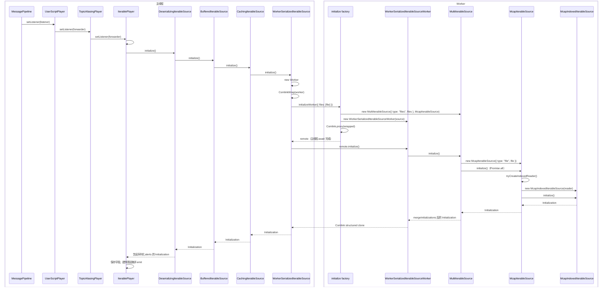
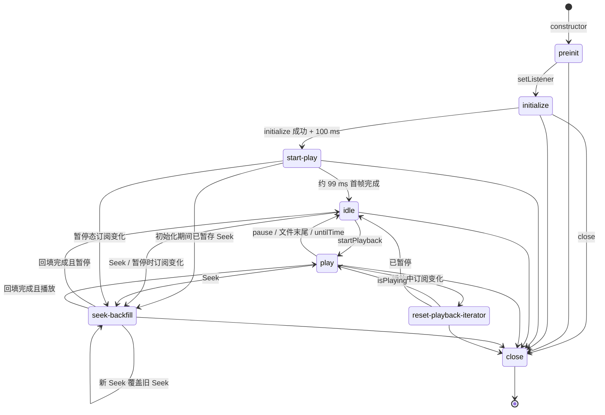
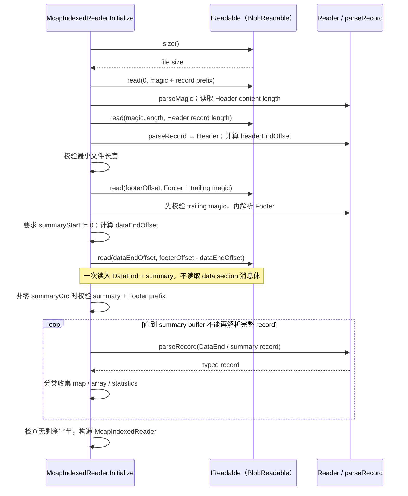

# IterablePlayer 与 Indexed MCAP Source 源码分析

## 1. 范围与核心接口

本文聚焦一条典型纵向链路：`Source → IterablePlayer → PlayerState`。具体场景限定为单个本地、有索引的 MCAP 文件，并包含项目锁定的 `@mcap/core@2.2.0` 实现。分析从 Source 的创建与初始化开始，沿消息迭代链路进入 `IterablePlayer`，最终止于其产出的 `PlayerState`。

即使输入只有一个文件，主路径仍然会经过 `MultiIterableSource`，因为本地 MCAP Factory 始终以 `{ files }` 传递输入。本文只分析它包装单个 Source 时的初始化合并、时间范围筛选与 iterator 委托，不展开真正的多文件合并。

`McapUnindexedIterableSource` 只作为 indexed 探测失败后的降级边界出现，不作为独立主题展开。

本文不展开以下内容：

- MessagePipeline reducer；
- 用户脚本执行；
- Panels 的具体渲染或交互；
- BlockLoader 的完整分块与预加载算法；
- 真正的多文件合并算法；
- ROS 1 Bag、ROS 2 DB3、ULog 等其他文件格式；
- 功能开发、重构方案或性能优化实现。

完成阅读后，读者应能回答：

1. 构造 `IterablePlayer` 与 Source wrapper 时发生了什么，真正的文件 I/O 又由什么触发？
2. 为什么单文件输入仍然使用 `MultiIterableSource`？
3. Indexed MCAP 初始化会读取文件的哪些区域，哪些内容不会在此时顺序扫描？
4. `IterablePlayer.#tick()` 中的 `.next()` 如何跨层、跨线程到达 `McapIndexedReader.readMessages()`？
5. `CachingIterableSource`、`BufferedIterableSource` 与 `DeserializingIterableSource` 各自解决什么问题？
6. Seek、订阅变化与 Close 对 iterator、producer、cursor 和 worker 的重建或释放有何不同？

### 1.1 Player：面向 UI 的播放边界

[`Player`](../../packages/suite-base/src/players/types.ts) 是播放能力的上层接口，而不是文件读取接口。对本文主路径而言，最重要的约定是：

- `setListener()` 在 `Player` 接口层只约定注册状态监听器；具体到 `IterablePlayer`，该方法只允许调用一次。Player 每次有新状态时向监听器传入 `PlayerState`；监听器返回的 Promise 也构成 Player 与 UI 之间的背压边界。
- `setSubscriptions()` 接收面板所需的 Topic 集合。订阅变化可能要求 Source 读取新 Topic，或为新订阅补齐目标时刻之前的最后一条消息。
- `startPlayback()`、`pausePlayback()`、`seekPlayback()` 和 `setPlaybackSpeed()` 是可选播放控制；是否可用由 `PlayerState.capabilities` 描述。
- `close()` 关闭 Player 持有的连接和资源。

`PlayerState` 是本文的下游边界。其必选属性是 `presence`、`progress`、`capabilities`、`profile` 和 `playerId`；其中 `profile` 属性本身必选，但值允许为 `undefined`。可选属性是 `name`、`alerts`、`activeData` 和 `urlState`。`PlayerStateActiveData` 的主要字段包括消息帧、当前时间、起止时间、播放状态与速度、Topic、datatype 和统计信息等；这只是职责概览，不是穷举。本文会追到 `IterablePlayer` 产出该对象为止，不继续展开 MessagePipeline reducer 或 Panel 消费过程。

### 1.2 IIterableSource：面向 Player 的数据访问边界

[`IIterableSource`](../../packages/suite-base/src/players/IterablePlayer/IIterableSource.ts) 把具体文件格式和存储方式收敛为一组统一能力：

- `initialize()` 返回 Source 的时间范围、Topic 与解码所需元数据；
- `messageIterator()` 按 Topic 与可选时间范围创建按日志时间排序的异步 iterator；
- `getBackfillMessages()` 返回目标时刻之前或当时、每个 Topic 可获得的最近消息；
- 可选的 `getMessageCursor()` 提供批量读取接口，主要用于降低跨 Worker RPC 的逐消息调用成本；
- 可选的 `terminate()` 释放 Source 持有的资源。

`messageIterator()` 返回的是 `AsyncIterableIterator`，但接口注释明确要求 `IterablePlayer` 使用显式 `.next()`：这样分段读取时不会像提前退出 `for await...of` 那样隐式调用 `return()`，同一个 iterator 可以跨多个播放 tick 延续。

### 1.3 Initialization：初始化结果的内容

[`Initialization`](../../packages/suite-base/src/players/IterablePlayer/IIterableSource.ts) 是 Source 初始化完成后交给 Player 的静态数据快照，包含：

- `start`、`end`：数据的日志时间边界；
- `topics`：Topic 名称、类型为 `string | undefined` 的 `schemaName`，以及可选的 `messageEncoding`、`schemaEncoding`、`schemaData`，供上层建立解码器；
- `topicStats`：按 Topic 提供的消息数量与可选首末消息时间；
- `datatypes`：解析后的 datatype 定义；
- `profile`：必选属性，类型为 `string | undefined`；
- `name`、`metadata`：两个可选属性；
- `publishersByTopic`：每个 Topic 对应的发布者集合；
- `alerts`：初始化期间发现、但可以作为结构化问题继续上报的异常。

这些字段如何由 Indexed MCAP 的 summary、index 与额外 metadata 读取组成，会留到后续初始化章节展开。

### 1.4 IteratorResult：消息、问题与时间进度

[`IteratorResult`](../../packages/suite-base/src/players/IterablePlayer/IIterableSource.ts) 是所有 Source 共用的三分联合类型：

- `message-event` 包含一个 `MessageEvent`，其 `receiveTime` 是播放排序与推进的主要时间依据；
- `alert` 包含 `connectionId` 与 `PlayerAlert`，使单个 channel 或连接的问题可以沿迭代链路上报，而不必立即终止整个 Source；
- `stamp` 是“Source 已经读到这个时间”的进度标记。当一段时间内没有消息时，它仍可让调用方确认时间已经推进。

在本文的 Indexed MCAP 主路径中，[`McapIndexedIterableSource.messageIterator()`](../../packages/suite-base/src/players/IterablePlayer/Mcap/McapIndexedIterableSource.ts) 正常产出 `message-event`，缺少 channel 信息或消息转换异常时也可能产出 `alert`；它自身不产出 `stamp`。`stamp` 属于通用 Source 契约，缓存、缓冲和 Player 逻辑仍会识别并处理它，反序列化层在 sampling 场景也可能用它表达窗口进度。因此不能把“Indexed MCAP 通常没有 stamp”误写成“整个迭代体系不支持 stamp”。

### 1.5 serialized 与 deserialized 的载荷边界

同一份接口通过 `sourceType` 判别载荷形态：

- `ISerializedIterableSource` 的判别值是 `"serialized"`，其 `message-event.msgEvent.message` 为 `Uint8Array`。MCAP Worker 侧及跨线程传输使用这一形态，便于转移底层 `ArrayBuffer`；
- `IDeserializedIterableSource` 的判别值是 `"deserialized"`，消息载荷为已解码对象。`DeserializingIterableSource` 在主线程建立 Topic 解码器，并把字节消息转换为 Player 和 UI 所需的对象消息。

`IterablePlayer` 根据这个判别值决定是否插入反序列化层。本文的本地 Indexed MCAP Source 是 serialized source，所以其主线程组装路径包含 `DeserializingIterableSource`。

## 2. 对象组装与初始化链路

### 2.1 主线程的持有与调用方向

下面的箭头表示上层对象**持有并调用**下一层，不表示消息返回方向：


组装入口位于 [`IterablePlayer` 构造函数](../../packages/suite-base/src/players/IterablePlayer/IterablePlayer.ts)。收到 `sourceType: "serialized"` 的 MCAP Source 时，它先创建 `BufferedIterableSource`，再用 `DeserializingIterableSource` 包住该缓冲接口。图中的 `CachingIterableSource` 不是由 `IterablePlayer` 直接构造：[`BufferedIterableSource` 构造函数](../../packages/suite-base/src/players/IterablePlayer/BufferedIterableSource.ts) 会在内部用 `new CachingIterableSource(source, ...)` 包住传入 Source。

若沿消息结果的返回方向观察，顺序与图中箭头相反：Worker 字节消息先经过缓存与缓冲，再由反序列化层转成对象，最后交给 `IterablePlayer`。这里只建立对象关系，不提前展开完整 iterator 数据路径。

### 2.2 Worker 侧的对象图

本地 Factory 将文件输入规范化为 `{ files }` 后，MCAP Worker 中的主要持有与调用关系是：


[`McapIterableSourceWorker.worker.ts`](../../packages/suite-base/src/players/IterablePlayer/Mcap/McapIterableSourceWorker.worker.ts) 为 `{ files }` 创建 `MultiIterableSource`，后者为每个文件创建 `McapIterableSource`。在 indexed 探测成功时，`McapIterableSource.initialize()` 再选择 `McapIndexedIterableSource`，由它持有 `McapIndexedReader`。单文件场景仍保留 `MultiIterableSource` 这一层，但此处不展开初始化合并或多文件迭代算法。

Worker 侧的 `WorkerSerializedIterableSourceWorker` 实现 serialized 契约，主要向主线程暴露 `MessageEvent<Uint8Array>`（以及通用的 `alert`/`stamp` 结果形态）。主线程的 [`DeserializingIterableSource`](../../packages/suite-base/src/players/IterablePlayer/DeserializingIterableSource.ts) 才把 `Uint8Array` 解码为 `MessageEvent<unknown>` 中的对象载荷。这条边界同时解释了为何 Worker wrapper 名称中带有 `Serialized`。

### 2.3 iterator 建立与推进的三个时点

阅读这些 wrapper 时，必须区分“调用 `messageIterator()` 完成设置”与“异步 generator 函数体开始推进”：

1. **创建 iterator 对象。** `messageIterator()` 调用会返回一个 iterator/generator 对象。普通方法可以在返回 iterator 之前同步设置状态；但对于直接声明为 `async *messageIterator()` 的实现，例如 `CachingIterableSource` 和 `WorkerSerializedIterableSource`，generator 函数体是惰性的，第一次 `.next()` 之前不会执行主体内的读取逻辑。
2. **立即启动 Buffered producer。** `BufferedIterableSource.messageIterator()` 本身不是 generator。它在方法调用期间设置 read head，并立即调用 `this.#startProducer(args)`、保存 producer Promise；`#startProducer()` 会立刻开始执行，并可在这次方法调用与 Promise 调度过程中创建和推进下层 iterator。随后 `messageIterator()` 才返回一个内部 async generator 作为 consumer。这里的“立即启动”不表示 read-ahead 会同步完成，而是表示 producer 不必等待 consumer 的第一次 `.next()` 才开始。
3. **由 IterablePlayer 消费。** `IterablePlayer` 保存返回的 playback iterator，并在 `#stateStartPlay()` 与 `#tick()` 等位置显式调用 `.next()`。每次 `.next()` 推进 consumer generator；当缓存暂无可用结果时，consumer 等待 producer 唤醒。

在 serialized MCAP 主路径上，`DeserializingIterableSource.messageIterator()` 的方法调用会先取得下层 raw iterator。由于该下层是 `BufferedIterableSource`，这一步已经触发 producer；但 `DeserializingIterableSource` 自己返回的 generator 仍要等 Player 调用 `.next()` 才开始取 raw result 和解码。后续章节再分别展开 producer、cursor、Comlink 与 reader 的实际数据推进。

### 2.4 构造对象不等于初始化 Source

[`McapLocalDataSourceFactory.initialize()`](../../packages/suite-base/src/dataSources/McapLocalDataSourceFactory.ts) 的命名容易让人误以为文件已经在这里完成初始化。实际上，该方法只创建 `WorkerSerializedIterableSource`，把它交给 `new IterablePlayer(...)`，并返回 Player。此时 `WorkerSerializedIterableSource` 只是保存了 `initWorker` 和 `initArgs`；Worker 尚未启动，MCAP 也尚未解析。`IterablePlayer` 构造函数则完成 2.1 所示的 wrapper 组装，同样没有调用 Source 的 `initialize()`。

真正的初始化入口来自 UI 播放管线：[`PlayerManager`](../../packages/suite-base/src/components/PlayerManager.tsx) 先把基础 `IterablePlayer` 包成 `TopicAliasingPlayer`，再包成 `UserScriptPlayer`；[`MessagePipeline`](../../packages/suite-base/src/components/MessagePipeline/index.tsx) 的 effect 随后对最外层 Player 调用 `setListener(listener)`。底层 listener 的注册被推迟到 `UserScriptPlayer.setListener()` 真正被调用时；进入该方法后，它会同步调用 `TopicAliasingPlayer.setListener()`，后者也同步转交给基础 Player，这不是一次异步延时。直到 [`IterablePlayer.setListener()`](../../packages/suite-base/src/players/IterablePlayer/IterablePlayer.ts) 保存 listener 并调用 `#setState("initialize")`，状态机才进入真实的 Source 初始化与文件 I/O。这里提及两个 wrapper 只为定位入口边界；其 Topic alias 和用户脚本转换不属于本章范围。

### 2.5 从 listener 到 Worker 的初始化时序

下图沿用 2.1 与 2.2 的对象图，只补充真实调用顺序。实线箭头是调用，虚线箭头是初始化结果或控制返回；竖直分区明确标出主线程与 Worker 边界：



主线程 wrapper 的 `initialize()` 调用是逐层向下的：`DeserializingIterableSource` 调用 `BufferedIterableSource`，后者内部的 `CachingIterableSource` 再调用 `WorkerSerializedIterableSource`。返回时，缓存和缓冲层主要保存并透传结果；反序列化层依据 Topic 的 encoding/schema 建立 decoder，并把 decoder 建立失败追加为初始化 alert。

### 2.6 单文件为何仍经过 MultiIterableSource

Factory 对本地参数做了确定的规范化：先取 `const files = args.files ?? []`，若 `args.file` 存在就 `files.push(args.file)`；只要数组非空，传给 `WorkerSerializedIterableSource` 的始终是 `initArgs: { files }`，而不是 `{ file }`。因此单文件从这条 Factory 路径进入 Worker 后命中的是 `args.files` 分支，也必然构造 `MultiIterableSource`。

在本文的单文件范围内，这一层仍完整执行其通用骨架：

1. `loadMultipleSources()` 把唯一的 `File` 映射为一个 `new McapIterableSource({ type: "file", file })`，加入 `sourceImpl`，并通过 `Promise.all` 调用这一个 Source 的 `initialize()`。
2. `initialize()` 仍调用 `mergeInitializations([initialization])`。即使数组只有一个元素，起止时间、profile、publisher、Topic 统计、metadata、alerts、datatype 和 Topic 仍通过统一合并逻辑形成返回值。
3. 初始化后，`sourceImpl` 仍按各 Source 的 `getStart()` 排序；单元素数组的次序当然不变，但后续逻辑无需增加单文件特例。
4. 稍后的 `messageIterator()` 先按请求的 `start`/`end` 筛掉时间范围不相交的 Source。唯一 Source 与范围相交时，剩余的一项交给 `mergeSequentialIterators()`，后者最终创建并推进该 `McapIterableSource.messageIterator()`；若不相交，传入空数组，iterator 不产出结果。单 Source 下并不存在需要分析的跨文件冲突，只是沿用了统一委托路径。

这里不展开真正多文件时的 Topic/datatype 冲突处理、远程缓存预算或跨文件 lazy merge 策略。

### 2.7 McapIterableSource 的 reader 选择边界

单个 `McapIterableSource.initialize()` 首先调用 `loadDecompressHandlers()`，确保可能用到的解压实现已经加载。对于本地 `Blob`，它先读取 `file.slice(0, 1).arrayBuffer()`，以便在更明确的位置暴露文件权限或可读性错误；随后用 [`BlobReadable`](../../packages/suite-base/src/players/IterablePlayer/Mcap/BlobReadable.ts) 把 `Blob.size` 与分段 `slice(...).arrayBuffer()` 适配为 `@mcap/core` 所需的 `IReadable.size()`/`read()` 接口。

`tryCreateIndexedReader()` 接着调用 `McapIndexedReader.Initialize({ readable, decompressHandlers })`。在建立 summary/index 视图时，reader 也会解析 `MetadataIndex` 并保存其索引信息；具体 Header/Footer/Summary 记录解析与定位过程留到第 5 章。本章只关心选择结果：初始化成功后还必须同时存在至少一个 `chunkIndex` 和一个 channel，才会创建 `McapIndexedIterableSource`；reader 初始化抛错、没有 ChunkIndex，或没有 Channel，都会返回 `undefined` 并降级为 `McapUnindexedIterableSource`。

选定实现后，`McapIterableSource` 调用其 `initialize()`。Indexed 主路径中的 `McapIndexedIterableSource.initialize()` 还会调用 `reader.readMetadata()`：该方法按前一步保存的每个 `MetadataIndex.offset` 与 `length` 对原文件执行额外的 indexed read，再把读到的实际 Metadata records 转成 `Initialization.metadata`。随后 Indexed Source 返回 `start`、`end`、`topics`（含解码信息）、`topicStats`、`datatypes`、`profile`、`metadata`、`publishersByTopic` 和 `alerts`；外层 `MultiIterableSource` 再把单个结果合并为同一 `Initialization` 契约。`name` 是契约中的可选字段，此链路的 Indexed Source 并不设置它，所以 Player 会保留 Factory 构造时提供的合并文件名。

Unindexed 分支只作为降级边界：`McapUnindexedIterableSource.initialize()` 顺序消费输入 stream，并把解析出的消息保存在内存中；由于这种实现会预先载入全部消息，它会拒绝大于 1 GiB（`1024^3` bytes，错误文本写作 `1GB`）的未索引文件。本文不把该 fallback 展开为独立的解析主题。

### 2.8 Initialization 回到主线程后的收尾

Worker 中的 `WorkerSerializedIterableSourceWorker.initialize()` 只是 `await this.#source.initialize()`；返回对象经 Comlink 的 structured clone 回到主线程的 `WorkerSerializedIterableSource.initialize()`，再沿缓存、缓冲与反序列化 wrapper 返回 `IterablePlayer.#stateInitialize()`。该状态方法在 await Source 之前先调用一次 `#queueEmitState()`，用于发出正在初始化的状态；得到结果后再按以下顺序把静态快照变成可向 UI 发出的 Player 状态：

1. 解构 `start`、`end`、`topics`、`profile`、`topicStats`、`alerts`、`publishersByTopic`、`datatypes`、`name` 和 `metadata`。若初始化期间已经收到 seek，则把待处理的 `#seekTarget` clamp 到 `[start, end]`。
2. 保存 metadata（缺省为空数组），并在**主线程**调用 `freezeMetadata()`；若在 Worker 内冻结，跨线程序列化后冻结属性不会保留。随后保存 profile、start、current（待处理 seek 或 start）、end、publishers、datatypes 和可选 name。
3. 以 Topic 名称去重。重复名称被忽略并追加一个 datatype 不一致 warning；同时保存 `topicStats`，利用总时长与统计检测高频 Topic，并向 `PlayerAlertManager` 加入高频警告。
4. 把 Source 和 decoder 建立阶段返回的每个 initialization alert 逐项加入 `PlayerAlertManager`。这些结构化 alert 表示可上报的问题，**不会仅因存在就中止初始化**。
5. 为按范围读取设置 `#messageRangeSource`；serialized 主路径会新建一个 `DeserializingIterableSource` 并用同一 `initResult` 初始化 decoder。若开启 preload，则另建供 `BlockLoader` 使用的反序列化 Source，并只完成 `BlockLoader` 的外层参数组装。这里不展开它的分块、缓存与后台加载算法。
6. 成功完成外层 `try` 时将 presence 设为 `PRESENT`。外层 `try/catch` 结束后会**无条件**再次调用 `#queueEmitState()`，因此成功结果和初始化错误都会排队发出。只有没有 global error 且存在 start 的成功路径才继续等待 100 ms，让 Panels 有机会提交订阅；随后把当前 preload Topics 交给 `BlockLoader`，启动后台 block loading，并请求进入 `start-play`。

错误需要区分两类：`#bufferedSource.initialize()`、字段处理或外围设置中逃出外层 `try` 的异常，会被 `#stateInitialize()` 捕获并通过 `#setError("Error initializing: ...")` 设置 global error，因而不会进入 `start-play`；初始化结果携带的 alerts 则进入 `PlayerAlertManager`，可以与成功初始化同时存在。`BlockLoader` 构造异常也被单独转成 warning；后台 block loading 是稍后启动的 Promise，其 `.catch()` 会调用 `#setError()`，但不会自行调用 `#queueEmitState()`，所以 UI 要到后续其他 emit 才能看到这个 global error。

## 3. IterablePlayer 状态机

### 3.1 单状态协作调度

`IterablePlayer` 不是让多个状态并发执行，而是用 `#nextState` 表示最新请求、用
`#runningState` 保证同一时刻只有一个 `#runState()` 循环。`#setState(state)` 覆盖待处理状态，
触发当前 `#abort` 后调用 `#runState()`；若循环已经在运行，新的调用立即返回，当前状态会在
自己的 `await` 或循环边界检查 `#nextState`，协作退出。`close` 一旦成为待处理状态，后续请求
不能覆盖它。

`#runState()` 每轮先把 `#nextState` 移入 `#state` 并清空待处理槽，再 `await` 对应状态方法。
进入除 `idle`/`play` 以外的状态前，它会先对已有 playback iterator 调用 `return?.()` 并清空
引用。在 serialized MCAP wrapper 链上，这个 return 会进入 `DeserializingIterableSource`
generator 的 finally，继续 return Buffered iterator；后者的 finally 又 await
`stopProducer()`。因此旧 iterator 和 producer 都在目标状态方法开始前停止。图中的箭头是
“通常请求的下一状态”，不是可并发运行的任务：



异常不是一个独立状态：`#runState()` 的总 catch 或 `play` 自己的 catch 调用 `#setError()`，
把 `#hasError` 置为 true、停止播放并通过 listener 发出 `presence: ERROR`。初始化错误的更精确
分层已在 2.8 说明。

### 3.2 `preinit` 与 `initialize`

#### `preinit`

**进入条件。** 构造完成，尚未注册 listener。

**关键字段。** `#state = "preinit"`、`#presence = INITIALIZING`，时间边界和 currentTime 均未
建立；此时 Seek 只暂存到 `#seekTarget`。

**Source/iterator 调用。** 无；构造 wrapper 不触发 Source 初始化，也没有 playback iterator。

**await/取消点。** 无状态方法在运行，因此没有 await 或 AbortController。

**退出条件/下一状态。** 第一次且唯一一次 `setListener()` 保存异步 listener，并请求
`initialize`；Close 也可直接成为下一状态。

#### `initialize`

**进入条件。** listener 已注册；初始化期间再次调用 `seekPlayback()` 仍只暂存
`#seekTarget`，待 Source 给出边界后再 clamp。

**关键字段。** 初始化设置 `#start/#end/#currentTime`、Topic、datatype、profile、metadata、
alert、`#messageRangeSource` 和可选 `#blockLoader`；`#presence` 从 `INITIALIZING` 变为
`PRESENT`。进入和结束初始化各排队一次状态 emit。

**Source/iterator 调用。** 核心 await 是 `#bufferedSource.initialize()`；此时尚不创建 playback
iterator。成功后等待 100 ms，让 Panels 有机会提交订阅，再启动后台 block loading 并请求
`start-play`。

**await/取消点。** Source 初始化和 100 ms delay 都是 await 点，但初始化状态本身没有注册
`AbortController`；`close` 等请求只能排队，待该状态返回后运行。后台 block loader 另有自己的
停止机制。

**退出条件/下一状态。** 成功且有 start 时进入 `start-play`；若初始化抛错，保存 global error、
发出错误状态，不再自动推进。测试 `supports seek request during initialization` 证明预初始化
Seek 最终落在目标时间；`calls listener with initial player states` 证明初始化前、初始化后与首帧
的 emit 顺序。

### 3.3 `start-play`：约 99 ms 的首次读取

**进入条件。** 初始化成功且 100 ms 订阅等待结束。若已有 `#seekTarget`，不做首帧顺读，立即
请求 `seek-backfill`。

**关键字段。** 无待处理 Seek 时，`stopTime = clamp(start + 99 ms, start, end)`；sampling 开启
时同时把该时间设为反序列化 sampling window 的末端。它清空 `#lastMessageEvent` 和输出消息，
并以 `presence: PRESENT` 收尾。

**Source/iterator 调用。** 创建 `#bufferedSource.messageIterator({ topics: #allTopics,
start, consumptionType: "partial" })`。显式 `.next()` 逐个处理结果：`message-event` 在 stopTime
内加入首帧，越界的第一条保存到 `#lastMessageEvent`；`alert` 加入 alert manager；达到或越过
stopTime 的 `stamp` 保存为 `#lastStamp` 并结束。这里的 `partial` 允许缓冲层为播放优化读取，
不等于只返回一条消息。

**await/取消点。** 每次 `.next()` 是 await 点；若读取超过 100 ms，定时器先发
`BUFFERING`。每次返回后检查 `#nextState`，使 Seek/Close 等请求能协作中断首读。
`debouncePromise` 会串行、合并 emit，但首读循环不 await listener Promise，因此这里不构成
播放帧背压；真正的 listener 屏障位于 `#tick()` 和播放中 Seek。

**退出条件/下一状态。** iterator done、stamp 到界或读到越界消息后，把 currentTime 设为
stopTime，发出由 message/alert/stamp 共同决定的状态并进入 `idle`。默认 1 秒测试数据在
`calls listener with initial player states` 中精确验证首帧时间为 `0.099 s`。

### 3.4 `idle`

**进入条件。** 首帧、Seek 或 iterator reset 完成且 `#isPlaying` 为 false；暂停播放或读到末尾
也会请求该状态。

**关键字段。** 强制 `#isPlaying = false`、`presence = PRESENT`，刷新 buffered source 的
loaded ranges，并注册 `loadedRangesChange` 监听器来更新 ranges 与 buffered-message 内存量。

**Source/iterator 调用。** 不推进 playback iterator；producer 仍可能在 read-ahead，因此 idle
仍会收到 loaded-range 更新。

**await/取消点。** 建立本状态专属 `AbortController`，一直 await abort Promise。任意下一状态
通过 `#setState()` abort 它；返回前移除事件监听器。

**退出条件/下一状态。** `startPlayback()` 进入 `play`；Seek 或暂停时订阅变化进入
`seek-backfill`；Close 进入 `close`。

### 3.5 `play` 与 `#tick()`

**进入条件。** `startPlayback()` 设置 `#isPlaying`；只有当前已经稳定在 idle 时才直接请求
`play`，其他状态则只 emit，待它们按该布尔值决定后继状态。`playUntil()` 还设置 clamp 后的
`#untilTime`。

**关键字段。** 每个 tick 用 `performance.now()` 的 wall-time 间隔乘播放速度；首 tick 默认
20 ms，范围最多 300 ms。`#lastRangeMillis * 0.9 + newRange * 0.1` 平滑单次慢帧的影响，end
再 clamp 到文件结尾或 `untilTime`。sampling 模式把这个 end 设为当前 sampling window 末端。

**Source/iterator 调用。** `#tick()` 延续同一个 playback iterator 并显式 `.next()`。上个 tick
留下的 `#lastStamp >= end` 可以直接推进时间而不读 Source；`#lastMessageEvent` 若仍越过 end
也可直接空帧推进，否则先纳入本帧。新结果中 alert 被累计，达到 end 的 stamp 被缓存，越过
end 的 message 被缓存，其余 message 组成本帧。

**await/取消点。** `.next()` 超过 500 ms 会临时发 `BUFFERING`。正式写入本帧前必须 await
`#queueEmitState.currentPromise`：listener 返回的 Promise 因而成为渲染背压，防止去抖时覆盖
尚未消费的消息帧。每轮总耗时不足 16 ms 时再 delay 到约一帧，让 UI 获得执行机会。

**退出条件/下一状态。** 到文件 end 清空 tick/range/stamp 跟踪并进入 idle；到 `untilTime` 时
`pausePlayback()` 清除 untilTime 并请求 idle；暂停或错误结束循环。播放循环以进入时捕获的
`#allTopics` 引用检测订阅变化，变化后丢弃可能重复的 `#lastMessageEvent`，进入
`reset-playback-iterator`。源码明确实现了这些分支；现有测试还分别覆盖 listener 阻塞时 Seek
帧保持停驻、旧 iterator 结束不会使 tick 死循环，以及订阅变化创建新 iterator。

### 3.6 `seek-backfill`

**进入条件。** Seek 先 clamp 到 `[start, end]`；同目标、或已经处于目标 currentTime 的请求被
忽略。新目标清空 untilTime、tick 时间与平滑窗口并请求本状态。新 Seek 可覆盖正在进行的
Seek：`#setState()` 用 `AbortController` 发出协作取消请求，同时用新的 `seek-backfill`
覆盖 `#nextState`。Source 契约可观察该 signal，但本文的
`McapIndexedIterableSource.getBackfillMessages()` 只读取 `topics/time`，没有检查
`abortSignal`，因此已进入的 `@mcap/core.readMessages()` 不会被抢占。旧回填完成后，
`#nextState` 检查会丢弃其结果；`finally` 在下一状态仍为 `seek-backfill` 时保留新目标，
然后状态机再执行新 Seek。

**关键字段。** 进入后再次 clamp `#seekTarget`，清空 `#lastMessageEvent`。回填若超过 100 ms，
先发 targetTime、空消息与 `BUFFERING`，但刻意不更新 `#lastSeekEmitTime`；完成时才设置真实
messages/currentTime、`lastSeekTime = Date.now()` 与 `PRESENT`。

**Source/iterator 调用。** Player 对 Source 发出一次
`getBackfillMessages({ topics: #allTopics, time, abortSignal })`；“逐 Topic 回填”是该契约要求
结果包含每个已订阅 Topic 在目标时刻之前或当时的最近消息，并非 Player 自己循环逐 Topic
调用。可选 `#expandBackfill` 随后可再次调用同一回填函数以扩展视频 GOP，使 P/B 帧在 Seek 后
可解码。若存在旧 playback iterator，`#runState()` 会在进入 `seek-backfill` 前
`await return?.()` 并清空引用；return 沿反序列化 generator 的 finally 进入 Buffered iterator
的 finally，并在那里停止 producer。初始化期间暂存 Seek 等路径可能尚未创建 iterator 或
producer。成功 emit 后，`#resetPlaybackIterator()` 中的可选 return 和显式 `stopProducer()`
通常都是防御性重复清理；随后它清空 lastStamp，从 `target + 1 ns` 建立 `partial` forward
iterator。唯有目标恰为 source start 时从 start 原值开始，避免跳过同时间消息。

**await/取消点。** Player 把当前 `AbortSignal` 传入 Source 契约，GOP 扩展则接收一个读取
当前 signal 的 getter；它们是可协作观察的取消点，不是 Player 对底层 I/O 的强制中断。
具体到 Indexed MCAP，普通 Topic backfill 会等当前的 reverse `readMessages()` 完成；新状态
通过完成后的 `#nextState` 检查生效。若播放中 Seek，完成回填后还 await seek-frame 对应的
`#queueEmitState.currentPromise`，确保画面真正消费该帧再恢复播放；等待期间若出现新状态则
退出。

**退出条件/下一状态。** 根据 `#isPlaying` 回到 play 或 idle。测试分别证明在旧 Seek
回填期间请求的新 Seek 会在旧状态退出后再执行、慢回填会发 BUFFERING、GOP hook
可扩展结果，以及播放中 Seek 在 listener Promise 释放前不会推进游标。第一项证明的是
状态覆盖与旧结果丢弃，不是 Indexed MCAP 底层读取被中断。

### 3.7 `reset-playback-iterator` 与 `close`

#### `reset-playback-iterator`

**进入条件。** 播放循环观察到 `#allTopics` 的 Map 身份改变。

**关键字段。** 必须已有 currentTime/start；清空 `#lastStamp`，新 iterator 使用全部新订阅。

**Source/iterator 调用。** `#runState()` 在进入本状态前已经 await 旧 iterator `return?.()` 并
清空引用；generator finally 链同时停止了 Buffered producer。随后
`#resetPlaybackIterator()` 内部的可选 return 与显式 `#bufferImpl.stopProducer()` 通常都是
防御性重复清理；它清空 lastStamp，再以 currentTime 后 1 ns（或 source start 原值）创建
`consumptionType: "partial"` 的 iterator。

**await/取消点。** transition preamble await iterator return，并在同一 generator-finally 链中
await producer stop；状态方法内虽再次 await 两个防御性清理调用，但通常已无 iterator 或运行中
producer。该状态没有自己的 AbortController，新的 next state 会由协作调度在它返回后接管。

**退出条件/下一状态。** 重建完成后按 `#isPlaying` 返回 play/idle。测试 `should make a new
message iterator when topic subscriptions change` 验证了新 topics 与 `0.099000001 s` 起点。

#### `close`

**进入条件。** 任意状态都可请求 close，且待处理 close 不能被覆盖。

**关键字段。** 先把 `#isPlaying` 设为 false；所有资源清理完成后才 resolve `isClosed`。

**Source/iterator 调用。** `#runState()` 进入 close 前先归还 playback iterator；状态方法再依次
停止 BlockLoader、等待 block-loading Promise、调用 `#bufferImpl.terminate()`、防御性地再次
`return?.()` iterator、调用最底层 Source 可选的 `terminate()`。对本地 MCAP 而言，最后一步
由 Worker wrapper dispose Comlink remote 与 Worker；具体资源所有权放到第 7 章。

**await/取消点。** close 请求会 abort 当前状态持有的 controller；上述每个资源释放步骤按序
await。API 生命周期约定关闭后不再发播放控制；代码的不可覆盖保证只覆盖“close 仍在
`#nextState` 中等待”的阶段。

**退出条件/下一状态。** 清理结束即 resolve `isClosed`，没有下一播放状态。现有测试普遍以
`close(); await isClosed` 收尾，证明完成信号可等待；逐项清理顺序主要是源码事实。

## 4. messageIterator 跨层与跨线程流程

### 4.1 从 Player 的 `.next()` 到 Indexed Source

播放 iterator 的创建参数来自 `IterablePlayer`：首次播放和重建时传入当前订阅的
`topics`、起始时间及 `consumptionType: "partial"`，`#tick()` 则在后续帧中反复对同一个
iterator 调用 `.next()`。实际调用链不是“Player 直接逐条 RPC 到 MCAP Reader”，而是：


这里有两条协作路径。[`BufferedIterableSource.messageIterator()`](../../packages/suite-base/src/players/IterablePlayer/BufferedIterableSource.ts) 在返回 consumer generator 前就
启动 producer；producer 从内部的 `CachingIterableSource` 读取并写入队列。Player 推进的
consumer 只从该队列取值，消费后通知 producer 可以继续。因此一次 Player `.next()` 不一定
对应一次 Worker 调用：队列或 cache 命中时不会跨线程，队列不足时 producer 才沿下层链路取数。

Worker 侧，[`WorkerSerializedIterableSourceWorker.getMessageCursor()`](../../packages/suite-base/src/players/IterablePlayer/WorkerSerializedIterableSourceWorker.ts) 对
[`MultiIterableSource.messageIterator(args)`](../../packages/suite-base/src/players/IterablePlayer/shared/MultiIterableSource.ts) 建立 [`IteratorCursor`](../../packages/suite-base/src/players/IterablePlayer/IteratorCursor.ts)。单文件仍先经过
`filterSourcesByTimeRange()`，再由 `mergeSequentialIterators()` 激活唯一的
`McapIterableSource`；它将参数原样委托给已经选定的 `McapIndexedIterableSource`。顺序合并器
会先取每个已激活 iterator 的第一项，用按结果时间排序的 heap 选择下一项；`alert` 没有时间，
排序键为 `Number.MAX_SAFE_INTEGER`。单文件时 heap 仍存在，但没有跨文件竞争。

### 4.2 参数在哪一层生效

| 参数/订阅信息                | 下推路径与真正生效位置                                                                                                                                                                      |
| ---------------------------- | ------------------------------------------------------------------------------------------------------------------------------------------------------------------------------------------- |
| `topics`                     | Map 穿过 buffer、cache、Worker、Multi 与 Mcap wrapper；Indexed Source 只取 key 数组，`readMessages()` 再把 Topic 名映射为 channel id 集合。                                                 |
| `start` / `end`              | Buffer producer 把起点改为自己的 read head；Cache 为缺口计算更窄的 `sourceReadStart/sourceReadEnd`；最终 Indexed Source 转为纳秒 bigint，传成 inclusive `startTime/endTime`。               |
| `consumptionType: "partial"` | 表达播放/预读用途，Caching Source 在补读 cache 缺口时继续透传；Multi、Mcap Source 与 `@mcap/core` 不解释该字段。范围读取 API 则使用 `"full"`。                                              |
| `fields`                     | 保留在 Topic 的 subscribe payload 中；底层 MCAP 只按 Topic 读完整 bytes，回到 `DeserializingIterableSource` 后才用 `pickFields()` 对解码对象裁剪。                                          |
| `samplingRequest`            | 同样不下推成 MCAP 过滤。`latest-per-render-tick` 由 Deserializing 层按 Player 设置的窗口处理：采样 Topic 每个窗口只保留最新 raw message，未采样 Topic 正常解码，合并后按 receiveTime 排序。 |

因此底层的最终调用是
`readMessages({ topics: topicNames, startTime: ns, endTime: ns, validateCrcs: false })`。
`validateCrcs: false` 是 Lichtblick 主路径的明确选择；`reverse` 未传，保持正序。字段裁剪和采样
都发生在消息重新回到主线程以后，不能把它们误解成文件级减读。

### 4.3 Worker cursor：按日志时间批量跨线程

主线程的 [`WorkerSerializedIterableSource.messageIterator()`](../../packages/suite-base/src/players/IterablePlayer/WorkerSerializedIterableSource.ts) 取得远程 cursor 后，循环调用
`nextBatch(17)` 并逐项 `yield`；空数组或 `undefined` 表示结束。17 ms 指从批次第一条
`message-event.receiveTime`（或 `stamp`）起算的**日志时间窗口**，目标是接近 60 fps 一帧，
不是 Worker 最多运行 17 ms。`IteratorCursor` 会把第一条超过 cutoff 的结果也放入当前批次后
再停止；若首条就是 alert，批次只有该 alert，后续遇到 alert 也立即结束当前批次。

Worker 外层的 [`ComlinkTransferIteratorCursor`](../../packages/suite-base/src/players/IterablePlayer/ComlinkTransferIteratorCursor.ts) 收集批次内所有
`MessageEvent<Uint8Array>.message.buffer`，用 `Comlink.transfer()` 转移而非 structured clone。
transfer 会 detach 发送方的 ArrayBuffer，但不会把 Worker 中缓存的整块解压 Chunk 一并 detach：
`@mcap/core parseMessage()` 读取 payload 时调用 `Reader.u8ArrayCopy()`，后者使用 `slice()` 为每条
Message bytes 建立独立 buffer，而不是借用 Chunk `DataView` 的 backing buffer。因此顺序是
“从 Chunk view 复制 Message bytes，再 transfer 这份消息专属 buffer”；同一 Chunk 的 view 仍可
留在 `chunkViewCache` 中解析后续 offset。这也解释了 serialized 边界为何保持 `Uint8Array`。

远端 `messageCursorPromise` 已成功 resolve 后，无论正常耗尽、后续消费异常还是上层提前
return，主线程 generator 的 `finally` 都调用 `cursor.end()`；远端 `IteratorCursor.end()` 再调用
底层 iterator 的 `return?.()`，主线程最后释放 Comlink proxy。这里不能覆盖 cursor 创建 RPC
本身失败的情况：若 `messageCursorPromise` reject，`finally` 中的 `end()` 会再次 await 同一个
rejection，在取得 remote cursor 之前就退出，因而远端 end 与 `releaseProxy` 都不可达。

这个 finally 会继续触发 Worker 内部的清理链，但有一个源码细节值得保留：
[`mergeSequentialIterators()`](../../packages/suite-base/src/players/IterablePlayer/shared/utils/mergeSequentialIterators.ts) 的 finally 只 return **当时仍留在 heap 中**的 iterator。循环先把当前 node
`pop()` 出 heap 再 yield，因此若恰在该 yield 处提前取消，当前 node 不在 finally 遍历范围内；
已自然耗尽并移除的 iterator 当然也不会再 return。状态切换会传递到远端 `IteratorCursor` 和
merge generator，但不能据此声称该 helper 对每一个底层 Source iterator 都显式调用了 return。
Buffer 和 Deserializing 两层也各自有 finally，分别停止 producer 和 return raw iterator。

### 4.4 三层主线程 wrapper 的分工

| wrapper                                                                                                  | 目的与数据结构                                                                                                                                                                                                   | 推进依据                                                                                                                                                      | 停止或淘汰                                                                                                                                          |
| -------------------------------------------------------------------------------------------------------- | ---------------------------------------------------------------------------------------------------------------------------------------------------------------------------------------------------------------- | ------------------------------------------------------------------------------------------------------------------------------------------------------------- | --------------------------------------------------------------------------------------------------------------------------------------------------- |
| [`CachingIterableSource`](../../packages/suite-base/src/players/IterablePlayer/CachingIterableSource.ts) | 用按时间排序的 `CacheBlock` 保存 `[nanoseconds, IteratorResult]`，复用已读范围并服务 backfill；类默认单块上限 50 MiB、总量 600 MiB，但本文 serialized Indexed 主路径由 `IterablePlayer` 显式把总量设为 300 MiB。 | 从 read head 命中 block，或只为 cache 缺口创建下层 iterator；同一时间的结果先 pending，看到更晚时间后才封闭 inclusive block 边界。                            | Topic Map 变化会清空全部 block；超预算时优先淘汰 read head 之前或连续链缺口之外的 block，无 block 包含 read head 时按 `lastAccess` 选最老者。       |
| `BufferedIterableSource`                                                                                 | producer-consumer 队列，默认把数据读到消费 read head 前方一段时间；内部持有上述 Cache Source。                                                                                                                   | consumer 的 message receiveTime/stamp 更新 read head 并唤醒 producer；producer 结合 read-ahead 时长、最小预读量及 cache 的 `canReadMore()` 决定继续还是等待。 | 同时只允许一个 iterator；consumer finally 或 `stopProducer()` 设置 aborted、唤醒并等待 producer；terminate 清队列并调用 Cache Source 的 terminate。 |
| `DeserializingIterableSource`                                                                            | Topic decoder、订阅 hash 与消息大小估计缓存；sampling 时另有每 Topic 最新 raw message、未采样 decoded 队列和一项 carry-over。                                                                                    | 普通路径逐项解码；sampling 路径以 Player 更新的 render-tick window/stamp 为边界 flush，字段 `fields` 在解码后裁剪。                                           | generator finally return raw iterator；解码失败转成 iterator alert，不让单条坏消息终止整条流。sampling 每个窗口 flush 后清空暂存。                  |

这三个名字都带有“处理消息”的意味，但层级不可互换：Cache 解决跨 iterator 的范围复用，Buffer
解决同一播放 iterator 的 read-ahead，Deserialize 才改变 payload 形态并实施订阅字段/采样语义。

还要区分 Close 时的两条所有权链：`BufferedIterableSource.terminate()` 向内调用的是
`CachingIterableSource.terminate()`，后者只清空自己的 block 与 Topic 状态，**不会继续调用**
底层 `WorkerSerializedIterableSource.terminate()`。`IterablePlayer.#stateClose()` 在等待 buffer
清理之后，会另外对最初保存的 `#iterableSource` 调用 `terminate?.()`；本文本地 MCAP 主路径正是
由这第二次、独立的调用 dispose Worker remote。不能仅凭 Buffered 的“terminate sources”注释推断
terminate 会沿全部 wrapper 递归到底。

### 4.5 消息返回到 PlayerState


Indexed Source 用 channel 表把 `Message` record 变成 serialized `MessageEvent`；批量跨线程后，
Caching Source 一边 yield 一边记录 block，Buffered producer 再把结果入队。Deserializing 层解码、
可选裁剪/采样后，`#tick()` 消费到当帧 inclusive end：越界的第一条保存在
`#lastMessageEvent` 给下一帧，alert 进入 alert manager。最后它先等待上一轮 listener Promise，
再写入 `#messages/#currentTime` 并 queue emit；`#emitStateImpl()` 将这批消息放入
`PlayerState.activeData.messages`。这条反向路径同时串起文件索引、Worker 批量、缓存预读和 UI
背压四个时间尺度。

## 5. @mcap/core Indexed Reader 内部

### 5.1 分析版本与源码定位

Lichtblick 在 [`packages/suite-base/package.json`](../../packages/suite-base/package.json) 中把 `@mcap/core` 精确固定为 `2.2.0`，`yarn.lock` 也解析到同一版本。本文核对的是仓库 Yarn 离线缓存中的发布包：

```text
.yarn/cache/@mcap-core-npm-2.2.0-4631ef345d-f5afefe316.zip
└── node_modules/@mcap/core/src/
    ├── McapIndexedReader.ts
    ├── Reader.ts
    ├── parse.ts
    └── ChunkCursor.ts
```

缓存文件是 zip，无法像普通工作树文件那样使用相对 Markdown 链接。以下定位均以这个**版本固定的压缩包内部源码**为基准，可用例如 `unzip -p .yarn/cache/@mcap-core-npm-2.2.0-4631ef345d-f5afefe316.zip node_modules/@mcap/core/src/McapIndexedReader.ts | nl -ba` 核查：

| 符号                            | 固定版本源码位置               | 本章关注点                                  |
| ------------------------------- | ------------------------------ | ------------------------------------------- |
| `McapIndexedReader.Initialize`  | `McapIndexedReader.ts:89-336`  | 文件头、文件尾、summary 的分段读取与校验    |
| `McapIndexedReader` constructor | `McapIndexedReader.ts:48-83`   | 保存索引并推导消息/附件时间边界             |
| `Reader`                        | `Reader.ts:8-131`              | 在一个 `DataView` 上维护局部 number offset  |
| `parseMagic` / `parseRecord`    | `parse.ts:10-109`              | magic 校验与 opcode 到 typed record 的分派  |
| `readMetadata`                  | `McapIndexedReader.ts:447-472` | 按 `MetadataIndex` 对原文件做后续定点读取   |
| `ChunkCursor`                   | `ChunkCursor.ts:15-241`        | 消息读取阶段的 chunk/message-index 游标边界 |

本章先解释 `Initialize()` 如何建立 Indexed Reader，以及这一步如何支撑 Lichtblick 的 Source
初始化；第 5.5 节再沿第 4 章定位的调用链，展开 `ChunkCursor` 的 indexed read 热路径。

### 5.2 Initialize 的三个文件区域（四次 read）

`McapIndexedReader.Initialize()` 先 `await readable.size()`，然后只读取定位 indexed 数据所需的三个文件区域：文件头、固定长度文件尾，以及 DataEnd 到 Footer 之前的 summary 区域。由于文件头分为 prefix 和完整 Header record 两次读取，因此总计调用四次 `read()`。对本文的本地文件，`readable` 是第 2.7 节所述的 `BlobReadable`，下图中的每次 `read(offset, length)` 最终对应一个 `Blob.slice()` 范围读取。



精确顺序如下：

1. **读取 size 与 Header。** 首次读取从 offset `0` 开始，只覆盖 MCAP magic、Header opcode 和 8 字节 record content length。`parseMagic()` 校验起始 magic，随后直接从 `DataView` 取出 Header content length。第二次读取从 magic 之后开始，覆盖完整 Header record；`parseRecord(..., true)` 必须返回 `Header`，且局部 Reader 不允许留下字节。由此得到 `header.profile`、`header.library` 和 `headerEndOffset`。
2. **定位并读取固定长度文件尾。** 代码先根据最短 Header 和固定的 `Footer record + trailing magic` 计算文件长度下限。`footerOffset = size - footerAndMagicReadLength`，然后一次读取文件尾。实现先从这块 buffer 的末端校验 trailing magic，再从开头解析 Footer，并要求除 magic 外无剩余字节。Footer 中的 `summaryStart` 为 `0n` 会直接报 `File is not indexed`；`summaryOffsetStart` 与 `summaryCrc` 也在此时解析并保存在 Footer 中。
3. **由 `summaryStart` 反推 DataEnd。** 固定大小的 DataEnd record 是 `1 + 8 + 4 = 13` 字节，因此 `dataEndOffset = footer.summaryStart - 13n`。该 offset 必须不早于 `headerEndOffset`，避免 summary 位置落入 Header。代码还会先复制 Footer 中从 opcode 到 `summaryOffsetStart` 字段末尾（包含该字段）的 prefix，因为下一次 `read()` 的实现允许复用底层 buffer。
4. **一次读取 DataEnd 与完整 summary。** 范围是 `[dataEndOffset, footerOffset)`。它覆盖 DataEnd、summary groups 和 SummaryOffset records，但不覆盖 Footer，也不扫描 Header 与 DataEnd 之间的数据段/消息体。当前 `2.2.0` 实现没有利用 `footer.summaryOffsetStart` 分段读取 summary；它保留该 Footer 字段，并从整个范围解析出的 `SummaryOffset` records 建立映射。
5. **校验 summary CRC。** `footer.summaryCrc !== 0` 时，CRC 输入是刚读 buffer 中跳过 DataEnd 的 summary bytes，再拼接前一步复制的 Footer prefix；结果必须等于 Footer 中的值。CRC 为 `0` 表示此处不校验。DataEnd 自带的 `dataSectionCrc` 会在下一步解析并保存，但 `Initialize()` 不为验证它而重新读取整个 data section。
6. **解析 DataEnd 与 summary records。** 新建 `Reader(indexView)` 后循环调用 `parseRecord(indexReader, true)`。第一个 record 必须是 `DataEnd`；后续 records 通常是 `Schema`、`Channel`、`ChunkIndex`、`AttachmentIndex`、`Statistics`、`MetadataIndex`、`SummaryOffset` 或未知 opcode。需要按实现精确理解这个约束：它只检查**首条**必须为 DataEnd，switch 本身仍接受后续 DataEnd，并用后来读到的值覆盖 `dataSectionCrc`。Header、Footer、Message、Chunk、MessageIndex、Attachment 或 Metadata 若出现在 index section 会报错。循环结束还要求 `bytesRemaining() === 0`。
7. **构造 Reader 并推导边界。** Schema/Channel 分别进入按 id 索引的 Map；ChunkIndex、AttachmentIndex 和 MetadataIndex 进入数组；Statistics 最多一个；SummaryOffset 按 `groupOpcode` 进入 Map；DataEnd 的非零 CRC 被保存。私有 constructor 保存这些结构，并遍历 ChunkIndex 推导最早/最晚消息时间，遍历 AttachmentIndex 推导附件时间范围。这里建立的是后续定点读取所需的索引视图，不包含消息数据本身。

所以，“Indexed Reader 初始化完成”准确意味着：文件两端结构有效、summary 可解析且（若声明）CRC 正确，常用 summary/index 已进入内存，并且后续读取知道应访问哪些 offset。它不意味着所有 Chunk 已读入、解压或解析。

### 5.3 Reader、DataView、offset 与 parseRecord 的职责边界

`IReadable.read()` 返回一个 `Uint8Array`；调用者用它的 `buffer`、`byteOffset` 和 `byteLength` 创建 `DataView`，再交给 `Reader`。这三层分别承担不同职责：

- `IReadable` 处理**文件级 bigint offset 与 length**，决定从 Blob/远程介质读取哪个范围；
- `DataView` 是一次范围读取所得 bytes 的有界视图，保留底层 buffer 中正确的起点与长度；
- `Reader` 在该局部视图内维护一个 number 类型的 `offset`，提供 little-endian `uint8/16/32/64`、字符串、Map 和字节数组读取，并通过 `bytesRemaining()` 做局部边界判断。`reset(view, offset)` 可复用实例，避免消息热路径频繁分配；这不是文件级 seek。

`parseMagic()` 只借用 magic 长度的 bytes 并逐字节校验。`parseRecord()` 则先读取统一的 1 字节 opcode 与 8 字节 content length：长度超过安全整数会抛错；局部 bytes 不足时，它把 `Reader.offset` 回退到 record 开始并返回 `undefined`；完整时再按 opcode 分派给 Header、Footer、Schema、Channel、ChunkIndex 等专用 parser，最后把 offset 对齐到该 record 末尾。未知 opcode 会保留为 `Unknown`，使 summary 循环可以跳过未来扩展；但 Indexed Reader 仍会拒绝在 index section 出现语义上不允许的已知 record 类型。

需要特别区分两种“边界”：`parseRecord()` 保证单个 record 不越过当前 `DataView`，`McapIndexedReader.Initialize()` 再保证这个 view 在文件中的位置合理，例如 Footer 位于固定尾部、DataEnd 不早于 Header 结束、summary 解析后没有残留。这也是错误信息可能分别来自 `Reader`、`parseRecord` 或带 `[library=...]` 的 Indexed Reader 外层校验的原因。

### 5.4 MetadataIndex 不是 Metadata record

summary 循环只把每条 `MetadataIndex { offset, length, name }` 保存进 `reader.metadataIndexes`；实际 `Metadata` record 位于文件 data section 的其他位置，并未包含在初始化时读入的 summary buffer 中。Lichtblick 在 Indexed Reader 创建成功后执行 [`McapIndexedIterableSource.initialize()`](../../packages/suite-base/src/players/IterablePlayer/Mcap/McapIndexedIterableSource.ts)，其中 `for await (const metadata of reader.readMetadata())` 才触发后续 indexed reads：

1. 可选 name 过滤先在 `MetadataIndex.name` 上完成；Lichtblick 此处未传 name，因此遍历全部 metadata indexes。
2. 对每个 index 调用 `readable.read(metadataIndex.offset, metadataIndex.length)`。
3. 为返回 bytes 创建新的局部 `Reader`，调用 `parseRecord(..., false)`，并要求结果确实是 `Metadata`。
4. Indexed Source 将其转成 `{ name, metadata }`，放入 `Initialization.metadata`，再沿第 2.5 节的 wrapper 链回到主线程。

因此 Source 初始化的 I/O 应拆成两个阶段理解：`McapIndexedReader.Initialize()` 用 Header/Footer/summary 建立索引，`McapIndexedIterableSource.initialize()` 再利用其中的 MetadataIndex 定点补读 Metadata。与之类似，Chunk、MessageIndex 和 Message bytes 会等到 `readMessages()` 被消费时按需读取。

### 5.5 readMessages：索引先行，Chunk 按需加载

`readMessages()` 首先把请求 Topic 名与初始化得到的 `channelsById` 比对，形成
`relevantChannels: Set<number>`。它不会读取不相交的 Chunk：只有满足
`chunk.messageStartTime <= endTime && chunk.messageEndTime >= startTime` 的 `ChunkIndex` 才
创建 `ChunkCursor`，所有 cursor 放入 heap。MessageIndex 尚未加载时，cursor 暂用
`ChunkIndex.messageStartTime` 作为排序时间（反向读取用 `messageEndTime`）；轮到它并加载 index
后，`heap.replace(cursor)` 会按真实的下一条 Message logTime 重排。时间相同时以 chunk 在文件中
的 offset 打破平局。

第一次轮到某个 cursor 时，它尚未加载 MessageIndex。`ChunkCursor.loadMessageIndexes()` 会：

1. 从 `ChunkIndex.messageIndexOffsets` 找出全部 index section 的起点和相关 channel 中最早的
   offset。当前实现从相关起点一直读到整个 message-index section 的末尾，并非为每个 channel
   发起独立 read；源码也把“只读指定 channel indexes”标为未来优化。
2. 对该局部 view 循环 `parseRecord(..., true)`，只收集相关 channel 的 `MessageIndex.records`；
   每项是 `[logTime, messageOffsetWithinUncompressedChunkRecords]`。
3. 展平各 channel 数组，按 logTime、再按 message offset 排序；反向模式对正序结果整体
   `reverse()`，以保持同时间消息也严格反向。
4. 用 binary-search 边界把 offset 数组 `slice()` 到 inclusive 请求时间范围。越界记录从游标
   内存中直接移除，后续 heap 不再为它们记账。

加载 index 后 cursor 重新进入 heap。真正需要该 cursor 的下一条消息时，reader 才按
`chunkStartOffset/chunkLength` 读取完整 Chunk record，调用 `parseRecord()` 验证类型，并按
`chunk.compression` 查找 handler 解压 `chunk.records`。Lichtblick 传入
`validateCrcs: false`，所以这里不会验证 chunk 的 non-zero `uncompressedCrc`；结构、offset 与
record 类型检查仍然执行。

解压结果以 `DataView` 缓存在 `chunkViewCache`，key 是 `chunkStartOffset`。cursor 从 index
弹出 `[logTime, offset]` 后，复用一个 `Reader`，通过 `reset(chunkView, Number(offset))` 定位到
未压缩 records 内部并 `parseRecord()`；结果必须是 `Message`，其 `record.logTime` 也必须与
index 一致。yield 后若 cursor 还有消息，它按需重新排 heap；源码只有在相交 ChunkIndex 的原始
遍历顺序满足 `next.messageStartTime >= previous.messageEndTime` 时才省略这次重排，即索引顺序
中的时间范围不交叉、允许前一个 end 与后一个 start 相等。

正常读到某个 cursor 耗尽时，reader 会将它从 heap 移除，并显式从 `chunkViewCache` 删除对应
view。提前取消则没有遍历该 Map 做同样的显式 delete：`readMessages()` generator 及其局部引用
释放后，剩余 view 只能等待垃圾回收。再叠加第 4.3 节所述的 merge 当前 node 已 pop、可能未被
return 的窗口，不能把提前停止描述成和正常耗尽相同的确定性 chunk-view 清理。由此，
MessageIndex 决定“读哪些 offset”，heap 决定“跨 chunk 下一条是谁”，chunk view cache 在正常
耗尽时逐项释放，而提前取消依赖 generator 引用链最终解除与 GC。

## 6. 首帧、播放、Seek、订阅变化和 Close

第 3 章按状态解释实现，本章改按用户动作对比“哪些对象继续沿用、哪些必须重建”。

| 用户动作     | 状态路径                                               | Source/iterator 变化                                                                                                                                   | 对 UI 可见的关键点                                                                     |
| ------------ | ------------------------------------------------------ | ------------------------------------------------------------------------------------------------------------------------------------------------------ | -------------------------------------------------------------------------------------- |
| 首次打开     | `preinit → initialize → start-play → idle`             | 初始化完成后等待 100 ms；从 start 创建 partial iterator，consumer 消费约 99 ms 的首帧窗口                                                              | 先 `INITIALIZING`，再 `PRESENT`；首帧可含消息，currentTime 为 clamp 后的 start + 99 ms |
| 播放         | `idle → play ↔ idle`                                  | 沿用同一 forward iterator；每 tick 只推进到 wall time × speed 对应窗口                                                                                 | listener Promise 形成帧背压；慢读取 500 ms 后显示 `BUFFERING`；end/untilTime 自动暂停  |
| Seek         | `idle/play → seek-backfill → idle/play`                | 若有旧 iterator，则进入状态前归还它并停 producer；随后按 Topic 回填并可扩展 GOP，从目标后 1 ns 重建                                                    | 100 ms 慢回填先发空 BUFFERING 帧；成功帧更新 lastSeekTime；播放中等该帧被消费再继续    |
| 播放中改订阅 | `play → reset-playback-iterator → play`                | tick 后检测 Map 变化；进入 reset 前归还旧 iterator 并停 producer；不做 backfill，从 currentTime 后重建                                                 | 当前播放帧先完成，新订阅从下一 forward iterator 开始出现                               |
| 暂停时改订阅 | `idle/start-play/seek-backfill → seek-backfill → idle` | 以 currentTime 为 seekTarget；若已有 iterator 则先归还并停 producer，回填新 Topic 后重建                                                               | UI 立即获得新订阅在当前时间的上下文，而不是等待再次播放                                |
| Close        | `任意状态 → close`                                     | 发出 abort 协作请求（当前 Indexed backfill 不观察 signal，需等读取返回），再归还 iterator、停止 loader/producer，terminate buffer 与底层 Source/Worker | `isClosed` 只在清理链完成后 resolve                                                    |

### 6.1 首次打开与初始化期间 Seek

首次 `setListener()` 是整个状态机的启动开关。正常路径中，Source 初始化返回后先 emit 静态
Topic/时间信息，等待 100 ms 收集 Panels 订阅，然后 `start-play` 用 partial iterator 读到
`min(start + 99 ms, end)`。首帧中的 alert 被累计、范围内 message 被发出、达到范围的 stamp
只推进时间；第一条越界 message 留给后续 tick。若 `.next()` 迟于 100 ms，期间先显示
`BUFFERING`。

若用户在 `preinit`/`initialize` Seek，调用只暂存原始目标。初始化得到真实 `[start, end]` 后
才 clamp，并把 currentTime 设为该目标；`start-play` 看到它后绕过 99 ms 首读，转入
`seek-backfill`。因此“首次打开后立即拖时间轴”不会先闪过文件开头。初始化抛错则不会进入
这两个分支，listener 获得 `ERROR` 且 `activeData` 为空。

### 6.2 连续播放与定点停止

play 不为每帧创建 iterator。它用相邻 tick 的 wall time 乘 speed，限制在 300 ms 并做 9:1
平滑，再 clamp 到文件 end 或 `playUntil()` 的 untilTime。sampling 订阅把同一 end 传给
`DeserializingIterableSource` 作为“latest-per-render-tick”窗口；未经授权的 sampling request
会先被 guard 移除，相关测试同时覆盖保留和剥离两种情况。

`#lastMessageEvent` 与 `#lastStamp` 是跨 tick 的一次前瞻缓存：前者避免越界消息丢失，后者在
无消息区间避免不必要读取。每个正式帧先等待前一 listener Promise，随后才替换
`#currentTime/#messages` 并排队 emit；这使 Panel 消费速度反向约束读取速度。播放到 end 或
untilTime 后清理计时字段并回到 idle。

### 6.3 Seek 与订阅变化为何不是同一种重建

Seek 必须恢复“目标时刻的上下文”。若存在旧 playback iterator，状态切换的公共 preamble 会
归还它，其 generator-finally 链同时停止 producer；`seek-backfill` 再向 Source 请求每个订阅
Topic 的最近值并重建 forward iterator。视频场景还可通过 `expandBackfill` 扩大为一个可解码
GOP。重复 Seek 会覆盖待处理状态，并通过 AbortController 向支持者发出协作取消请求；
本地 Indexed MCAP 的 backfill 未观察该 signal，所以会等旧读取完成、丢弃旧结果，再执行
新 Seek。最终采用的目标完成后才更新时间、消息和 lastSeekTime。
目标恰为 start 时新 iterator 从 start 开始，否则从目标后 1 ns 开始，避免刚回填的同时间消息
再次出现。

订阅变化取决于是否播放：播放中不立刻打断当前 tick，`play` 在帧后识别 `#allTopics` 引用变化
并进入 reset，只做 iterator/producer 重建；暂停时则把 currentTime 设为 seekTarget，执行
backfill，保证新增 Topic 立刻有当前上下文。`setSubscriptions()` 还同步更新 BlockLoader 的
full-preload Topics；其缓存算法不在本章展开。

### 6.4 Close 是资源屏障

Close 不是简单设置 `isPlaying = false`。close 请求在 next-state 槽中等待时不可被覆盖，并
向当前状态发出 abort 请求；只有观察 signal 的工作才能协作提前退出。`#runState()` 与
`#stateClose()` 共同完成 iterator return、BlockLoader stop、等待
后台 loading、buffer terminate 和底层 Source terminate。只有这些 await 全部结束，
`isClosed` 才 resolve。由此，调用方可以把 `await player.isClosed` 当成“不再有 producer、
后台预载或 Worker 占用该文件”的生命周期屏障，而不是仅把它理解为 UI 已暂停。

### 6.5 本章证据边界

上述状态转移、定时阈值与清理次序均直接来自
[`IterablePlayer.ts`](../../packages/suite-base/src/players/IterablePlayer/IterablePlayer.ts)。
[`IterablePlayer.test.ts`](../../packages/suite-base/src/players/IterablePlayer/IterablePlayer.test.ts)
直接验证了初始四次状态、初始化期间 Seek、旧回填期间请求的新 Seek 在旧状态退出后接续执行、
慢 Seek、播放中 Seek 的 listener 屏障、GOP
扩展、sampling guard，以及订阅变化后的 iterator 参数。它没有逐项 spy Close 内部每个资源的
停止顺序，所以 Close 的顺序应视为源码推导，而不是已有单元测试逐项证明。Source 的
`messageIterator()` 如何进一步进入 Worker 与 `@mcap/core.readMessages()`，详见第 4、5 章；
缓存与资源所有权的专题归入第 7 章。

## 7. 错误、背压、缓存与资源生命周期

### 7.1 同样是失败，去向并不相同

| 发生位置/条件                                                                               | 对外表现                                                                                                                                              | 是否终止主路径                                                   | 证据边界                                                                                                                                                                                                                                                                                             |
| ------------------------------------------------------------------------------------------- | ----------------------------------------------------------------------------------------------------------------------------------------------------- | ---------------------------------------------------------------- | ---------------------------------------------------------------------------------------------------------------------------------------------------------------------------------------------------------------------------------------------------------------------------------------------------- |
| `McapIndexedReader.Initialize()` 抛错，或 reader 没有 ChunkIndex/Channel                    | 抛错时 `tryCreateIndexedReader()` 记录日志；缺少 ChunkIndex/Channel 时静默返回 `undefined`。两种情况都会让 `McapIterableSource` 改建 unindexed Source | **不是 Player error**；这是 reader 选择的 fallback               | `McapIterableSource.test.ts` 的 `should fall back to unindexed source when indexed reading fails`、`falls back to unindexed reader when MCAP has no chunks`、`falls back to unindexed reader when MCAP has no channels` 与 `falls back to unindexed reader when indexed reader initialization fails` |
| Indexed 初始化发现 schema id 没有 Schema，或 `parseChannel()` 失败；主线程建立 decoder 失败 | 进入 `Initialization.alerts`，Player 以 `init-alert-*` 放入 AlertManager                                                                              | 不必终止初始化；有效 Topic 仍可使用，presence 可保持 `PRESENT`   | [`McapIndexedIterableSource.initialize()`](../../packages/suite-base/src/players/IterablePlayer/Mcap/McapIndexedIterableSource.ts) 与 [`DeserializingIterableSource.initializeDeserializers()`](../../packages/suite-base/src/players/IterablePlayer/DeserializingIterableSource.ts)                 |
| 迭代时遇到没有初始化 channel info 的 Message                                                | Indexed Source yield `IteratorResult.alert`                                                                                                           | 跳过该消息，iterator 继续；Player 消费时以 `connid-*` 累计 alert | [`McapIndexedIterableSource.messageIterator()`](../../packages/suite-base/src/players/IterablePlayer/Mcap/McapIndexedIterableSource.ts)                                                                                                                                                              |
| 消息 Topic 不在本次 iterator 的 `subscribePayloadWithHashByTopic` 中                        | Deserializing Source yield “not subscribed” iterator `alert`                                                                                          | 跳过该消息；随后循环继续是源码推导                               | `yields alert when message arrives on unsubscribed topic` 只直接验证 Source 产出 alert                                                                                                                                                                                                               |
| Topic 已订阅，但 `#deserializersByTopic` 没有 decoder，或 decoder 执行失败                  | `#deserializeMessage()` 抛错，由 `tryDeserializeMessage()` 转成 “Failed to deserialize” iterator `alert`                                              | 跳过该消息，iterator 继续                                        | `handles deserialization errors in message iteration` 直接验证 decoder 执行失败时 Source 产出 alert 并继续                                                                                                                                                                                           |
| 首帧/Seek/播放读取超过阈值                                                                  | presence 暂时变为 `BUFFERING`                                                                                                                         | 不是 alert，也不把 `#hasError` 置真；读取完成后恢复 `PRESENT`    | 首帧和 Seek 为 100 ms，连续播放 tick 为 500 ms                                                                                                                                                                                                                                                       |
| Source 初始化真正抛错，或状态方法/iterator 抛出的异常逃出其局部处理                         | `#setError()` 添加 id 为 `global-error` 的 error alert，停止播放；emit 的 `PlayerState` 为 `ERROR` 且无 `activeData`                                  | 终止正常状态推进                                                 | 初始化错误会加 `Error initializing:` 前缀；`#runState()` 与 `#statePlay()` 也把未处理异常送入 `#setError()`                                                                                                                                                                                          |
| unindexed 输入大于 `1024^3` bytes                                                           | unindexed `initialize()` 抛错，最终成为上述 Player 初始化 global error                                                                                | 终止初始化                                                       | 限制是 1 GiB；错误原文写作 `unindexed files are limited to 1GB`                                                                                                                                                                                                                                      |

因此，UI 看到 error alert 时还要结合 `presence` 判断含义：`Initialization.alerts` 和 iterator
alerts 是结构化、可继续的局部问题；`global-error` 才对应 Player 的错误态。Indexed 探测失败甚至
不直接形成 Player alert，而是先尝试 unindexed；只有 fallback 自己也失败时才会沿初始化异常变成
global error。后台 BlockLoader 构造失败是另一种可继续的 warning alert；后台 loading Promise
后续 reject 则会调用 `#setError()`，属于 global error。

上表两个 Deserializing 测试都直接证明 **Source 层**产出 alert；只有 decoder 执行失败用例还通过
后续有效消息直接证明 iterator 继续。未订阅 Topic 分支 yield alert 后回到读取循环，是源码推导，
对应测试没有再调用一次 `.next()`。Iterator alert 在 `#stateStartPlay()` 与 `#tick()` 中由 Player 以
`connid-${connectionId}` 写入 AlertManager，是
[`IterablePlayer.ts`](../../packages/suite-base/src/players/IterablePlayer/IterablePlayer.ts) 的源码推导；
Indexed Source 的未知 channel alert 进入 Player 时也走同一消费分支。

### 7.2 关键时间尺度与两种背压

| 机制                | 数值/窗口                                           | 真正含义                                                                                                                                                                                                                                                                                       |
| ------------------- | --------------------------------------------------- | ---------------------------------------------------------------------------------------------------------------------------------------------------------------------------------------------------------------------------------------------------------------------------------------------- |
| Worker cursor batch | 17 ms                                               | 从批次首个有时间的结果起算的**日志时间**窗口，用一次 RPC 携带约一帧数据；不是 Worker 执行时限。                                                                                                                                                                                                |
| 首帧范围            | 约 99 ms                                            | `start-play` 读取 `[start, min(start + 99 ms, end)]`，让初始画面尽快有数据；它另有 100 ms 慢读 BUFFERING 定时器。                                                                                                                                                                              |
| Seek 慢回填         | 100 ms                                              | 超时先 emit targetTime、空 messages 与 `BUFFERING`；回填完成后再 emit 真实消息并恢复 `PRESENT`。                                                                                                                                                                                               |
| 播放慢读            | 500 ms                                              | 单次 `#tick()` 取消息过慢才显示 `BUFFERING`，完成后恢复 `PRESENT`。                                                                                                                                                                                                                            |
| 播放 tick 上限      | 300 ms                                              | wall time × speed 得到的读取窗口最多 300 ms，防止一次渲染吞入过多消息。                                                                                                                                                                                                                        |
| UI 让出             | 至少约 16 ms/tick                                   | `#statePlay()` 的一次循环若不足 16 ms就补 delay，避免紧循环占满 UI 线程。                                                                                                                                                                                                                      |
| Buffered read-ahead | 本地 MCAP 主路径 120 s；类默认 10 s；恢复前最小 1 s | `McapLocalDataSourceFactory` 显式把 `readAheadDuration` 设为 120 s；其他未覆盖的 `BufferedIterableSource` 使用 10 s 默认值。producer 从 cache/source 向 read head 前方预读；达到目标、cache 受限时等待 consumer 推进。这与 `start-play` consumer 只消费约 99 ms 的 UI 首帧窗口是两个独立范围。 |
| listener Promise    | 逐帧消费屏障                                        | `#emitStateImpl()` await listener；正常播放 tick 在替换下一帧消息前 await 上一轮 emit，播放中 Seek 也等待 seek-frame emit 后才恢复。                                                                                                                                                           |

最后一行不能泛化为“所有读取都被 listener 背压”。尤其 `start-play` 会读取首帧、queue emit，然后
立即切到 idle；它没有像普通播放 tick 那样在读取首帧之前 await 上一个 listener Promise。
同样，`startPlayback()` 本身只是设置 `#isPlaying`/状态并 queue emit，是同步控制入口，不等待
listener 完成。真正的稳定帧背压位于连续播放的 `#tick()` 提交点，以及播放中 Seek 的确认屏障。

缓存与预读也不是一回事：Caching 层跨 iterator 保存时间块，并在 Topic Map 变化或超预算时清理；
Buffered 层为当前 iterator 维护队列和 producer。因而 cache 命中可减少底层读取，而 read-ahead
决定当前 consumer 前方准备多少结果。`CachingIterableSource.test.ts` 的
`should purge the cache when topics change`、`should getBackfillMessages from cache`、
`should evict blocks as cache fills up` 分别钉住 Topic 一致性、回填复用和预算淘汰；
`BufferedIterableSource.test.ts` 的 `should wait to buffer more messages until reading moves forward`、
`should buffer minimum duration ahead before messages can be read` 与
`should support stamp iterator results and wait to buffer more messages until reading moves forward`
则钉住 producer/read-head/stamp 协作。

### 7.3 Seek、订阅变化与 Close 的释放矩阵

| 资源/动作                         | Seek                                                                                                                                                                   | 订阅变化                                                                 | Close                                                                                                                      |
| --------------------------------- | ---------------------------------------------------------------------------------------------------------------------------------------------------------------------- | ------------------------------------------------------------------------ | -------------------------------------------------------------------------------------------------------------------------- |
| 当前状态的 `AbortController`      | 新状态请求向旧状态发出 abort；Source/GOP 扩展只有在观察 signal 时才能协作提前退出。本地 Indexed MCAP backfill 不观察 signal，旧 core 读取完成后才丢弃结果并执行新 Seek | 状态切换同样会 abort 当前 controller；播放中重建本身没有独立 controller  | `#setState("close")` 发出 abort 请求，且待处理 close 不会被其他状态覆盖；未观察 signal 的工作仍要先返回                    |
| playback iterator                 | 进入非 play/idle 状态前由 `#runState()` await `return?.()`；Seek 后重建                                                                                                | 播放中进入 reset、暂停时进入 seek-backfill，二者都先 return 旧 iterator  | 进入 close 前先 return；`#stateClose()` 还有一次通常为空的防御性 return                                                    |
| Buffered producer                 | iterator generator 的 `finally` 调用 `stopProducer()`；`#resetPlaybackIterator()` 再防御性 stop                                                                        | 同左，然后按新 Topic Map 启动新 producer                                 | `BufferedIterableSource.terminate()` stop producer、清队列/cache，并结束缓存层监听                                         |
| Caching cache                     | 新 iterator 的 Topic Map 与旧 Map 相等时保留并复用已有时间块                                                                                                           | 新 iterator 观察到 Topic Map 变化时清空全部 block、size 与 loaded ranges | `CachingIterableSource.terminate()` 清空全部 block 与 cached Topics                                                        |
| Worker cursor                     | 外层 Worker iterator 的 `finally` 调 `cursor.end()`；远端 `IteratorCursor.end()` 再 return 底层 iterator并释放 proxy                                                   | 同左                                                                     | 若仍有 iterator则同左；随后 Worker Source terminate dispose remote/Worker                                                  |
| `@mcap/core` generator/chunk view | return 最终可解除 generator 引用；但第 4.3、5.5 节的提前取消窗口意味着不能保证每个 merge 当前 node 都显式 return，也不能等同正常耗尽时逐项 delete chunk view           | 同左                                                                     | 同左；Worker 终止最终切断剩余所有权，不能把此结果倒推成每层均已显式清理                                                    |
| BlockLoader                       | 不停止、不因 Seek 重建；它的后台 full-preload 生命周期独立于 playback iterator                                                                                         | 不停止；`setTopics()` 更新 full-preload Topic                            | 先 `stopLoading()`，再 await background loading Promise                                                                    |
| 原始 Worker Source                | 沿用同一 Source/Worker                                                                                                                                                 | 沿用；只重建 iterator                                                    | `#bufferImpl.terminate()` 不会递归到底层 Worker；Player 随后独立调用最初 `#iterableSource.terminate?.()` 才 dispose Worker |

矩阵中的“return”是协作式清理而非强制抢占：只有 generator 取得 remote cursor 后，
`WorkerSerializedIterableSource` 的 finally 才能成功 `end()`；cursor 创建 Promise 本身 reject 的边界
已在第 4.3 节说明。Close 之所以是资源屏障，是它同时等待 loader、producer 与底层 Source，
而 Seek/订阅变化只释放本轮迭代资源，reader 和 Worker 仍可复用；cache 内容仅在 Topic Map 保持
相等时复用，Topic 变化会触发全量清空。

## 8. 测试导航与非主路径差异附录

### 8.1 按问题找测试

以下名称均来自当前源码，适合用 `yarn test <file> -t '<name>'` 做定点阅读；链接指向包含这些
测试的文件。

| 想验证的问题                                      | 直接测试证据                                                                                                                                                                                                                                                                                                                                                                                                                                                                                                                                             |
| ------------------------------------------------- | -------------------------------------------------------------------------------------------------------------------------------------------------------------------------------------------------------------------------------------------------------------------------------------------------------------------------------------------------------------------------------------------------------------------------------------------------------------------------------------------------------------------------------------------------------- |
| Player 初始化、Seek 与订阅重建                    | [`IterablePlayer.test.ts`](../../packages/suite-base/src/players/IterablePlayer/IterablePlayer.test.ts)：`calls listener with initial player states`、`supports seek request during initialization`、`when seeking during a seek backfill, start another seek after the current one exits`、`sets buffering presence when backfill takes too long`、`while playing, seek keeps the cursor parked until the seek emit is released`、`should make a new message iterator when topic subscriptions change`                                                  |
| Buffered read-ahead 与 stamp                      | [`BufferedIterableSource.test.ts`](../../packages/suite-base/src/players/IterablePlayer/BufferedIterableSource.test.ts)：`should wait to buffer more messages until reading moves forward`、`should buffer minimum duration ahead before messages can be read`、`should support stamp iterator results and wait to buffer more messages until reading moves forward`、`should exit producer when waiting for readhead to move past stamp`                                                                                                                |
| Caching 的 Topic、backfill、边界与 eviction       | [`CachingIterableSource.test.ts`](../../packages/suite-base/src/players/IterablePlayer/CachingIterableSource.test.ts)：`should purge the cache when topics change`、`should getBackfillMessages from cache`、`should getBackfillMessages from multiple cache blocks`、`should respect end bounds when loading the cache`、`should evict blocks as cache fills up`                                                                                                                                                                                        |
| 主线程 decode、alert、字段裁剪、sampling          | [`DeserializingIterableSource.test.ts`](../../packages/suite-base/src/players/IterablePlayer/DeserializingIterableSource.test.ts)：`deserializes messages from raw bytes`、`handles deserialization errors in message iteration`、`yields alert when message arrives on unsubscribed topic`、`performs message slicing`、`sampling path keeps latest sampled message, preserves unsampled messages, and uses carry-over`                                                                                                                                 |
| Lichtblick MCAP reader 选择与委托                 | [`McapIterableSource.test.ts`](../../packages/suite-base/src/players/IterablePlayer/Mcap/McapIterableSource.test.ts)：`loads decompression handlers before creating an indexed reader for an indexed file`、`successfully creates an indexed reader for a valid MCAP`、`falls back to unindexed reader when MCAP has no chunks`、`falls back to unindexed reader when MCAP has no channels`、`falls back to unindexed reader when indexed reader initialization fails`，以及 `should return an iterator from the underlying source after initialization` |
| Indexed MCAP metadata、Topic stats 与全局时间边界 | [`McapIndexedIterableSource.test.ts`](../../packages/suite-base/src/players/IterablePlayer/Mcap/McapIndexedIterableSource.test.ts)：`returns the correct metadata`、`returns an empty array when no metadata is on the file`、`returns topicStats with numMessages and global start/end times separately`、`should return the latest message end time after initialization`                                                                                                                                                                              |
| unindexed metadata 与顺序初始化后的边界           | [`McapUnindexedIterableSource.test.ts`](../../packages/suite-base/src/players/IterablePlayer/Mcap/McapUnindexedIterableSource.test.ts)：`returns the correct metadata`、`returns an empty array when no metadata is on the file`、`should return correct start and end times after initialization with messages`                                                                                                                                                                                                                                         |

`McapIndexedIterableSource.getBackfillMessages()` 的“每个 Topic 调一次 `readMessages({ reverse: true,
endTime })` 并取首条”在当前该类测试中没有精确用例；本文对它的描述是**源码推导**，不是测试
已验证结论。Caching 与 Multi Source 的 backfill 测试证明各自 wrapper 的语义，不能替代这项
Indexed Source 级覆盖。

项目锁定的 `@mcap/core@2.2.0` 测试位于 Yarn cache 压缩包内部的
`node_modules/@mcap/core/src/McapIndexedReader.test.ts`。其中参数化用例
`fetches chunk data and reads requested messages between $startTime and $endTime` 同时覆盖 inclusive
时间范围与 `reverse: true`；多 channel 版本没有传 `topics`，只证明多个 channel 同时存在时的
时间范围与正反向结果。Topic 过滤由下列独立用例证明。以下真实测试名进一步形成第 5 章的证据索引：

- `sorts and merges out-of-order and overlapping chunks`：乱序、重叠 Chunk 的 heap merge；
- `supports reading topics that only occur in some chunks`：Topic 过滤；
- `uses stable sort when loading overlapping chunks`：重叠范围的稳定次序；
- `handles multiple messages at same timestamp`：同时间消息；
- `ensure that chunks are loaded only when needed`：Chunk lazy load；
- `reads metadata records`：MetadataIndex 定点读取。

这些是依赖包自身的发布源码测试，不会被 Lichtblick 的 Jest targeted run 自动发现。可直接读取
测试文件并核对名称：

```sh
unzip -p .yarn/cache/@mcap-core-npm-2.2.0-4631ef345d-f5afefe316.zip node_modules/@mcap/core/src/McapIndexedReader.test.ts | rg -n 'describe\(|it(?:\.each)?\(|fetches chunk data'
```

### 8.2 非主路径只保留差异

- **Unindexed MCAP：** indexed 探测失败后改用 `McapUnindexedIterableSource`。它以 MCAP stream
  顺序解析 records，在 `initialize()` 期间把消息按 channel 存入内存，再用这些数组提供 iterator；
  因为是整文件预载，超过 1 GiB 会拒绝打开。这与 indexed 路径的 summary 定位、MessageIndex
  筛选和 Chunk 按需读取根本不同。
- **多文件：** Worker 仍为每个输入创建独立 `McapIterableSource`，并行初始化后合并静态信息，
  `messageIterator()` 再筛选与请求时间相交的 Source，由 `mergeSequentialIterators()` 做顺序合并。
  本文单文件只是复用这套骨架；跨文件冲突、缓存预算与 backfill 近邻选择不在分析范围。
- **其他格式：** ROS Bag、DB3、ULog 等只要实现同一 `IIterableSource`/serialized-deserialized
  契约，就能复用 IterablePlayer 的 Buffer、Cache、状态机与 PlayerState 下游；它们各自的 Factory、
  索引和 decoder 初始化并不等同于 MCAP，因此本文结论只复用接口层，不外推文件内部流程。
